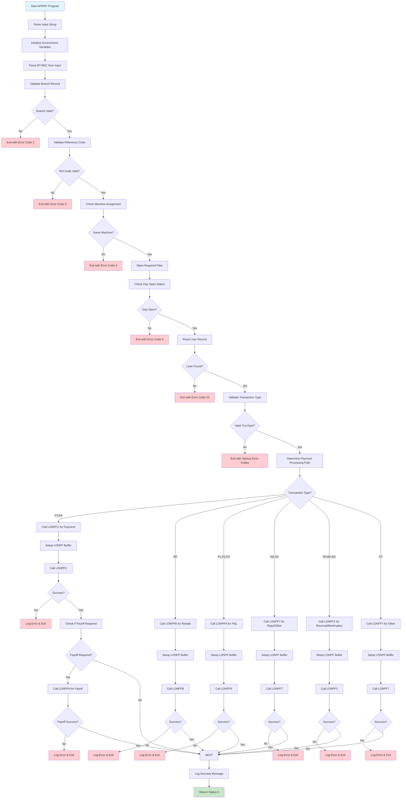

```mermaid
flowchart TD
    A[Start APIPAY Program] --> B[Parse Input String]
    B --> C[Initialize Environment Variables]
    C --> D[Parse BT-REC from Input]
    D --> E[Validate Branch Record]
    E --> F{Branch Valid?}
    F -->|No| Z1[Exit with Error Code 2]
    F -->|Yes| G[Validate Reference Code]
    G --> H{Ref Code Valid?}
    H -->|No| Z2[Exit with Error Code 3]
    H -->|Yes| I[Check Machine Assignment]
    I --> J{Same Machine?}
    J -->|No| Z3[Exit with Error Code 4]
    J -->|Yes| K[Open Required Files]
    K --> L[Check Day Open Status]
    L --> M{Day Open?}
    M -->|No| Z4[Exit with Error Code 6]
    M -->|Yes| N[Read Loan Record]
    N --> O{Loan Found?}
    O -->|No| Z5[Exit with Error Code 10]
    O -->|Yes| P[Validate Transaction Type]
    P --> Q{Valid TrxnType?}
    Q -->|No| Z6[Exit with Various Error Codes]
    Q -->|Yes| R[Determine Payment Processing Path]
    
    R --> S{Transaction Type?}
    
    S -->|PY,PA| T[Call LONPFC for Payment]
    S -->|RP| U[Call LONPFB for Rebate]
    S -->|PL,P2,P3| V[Call LONPF9 for P&L]
    S -->|RE,O2| W[Call LONPF7 for Repo/Other]
    S -->|RV,BK,BD| X[Call LONPF2 for Reversal/Bankruptcy]
    S -->|OT| Y[Call LONPF7 for Other]
    
    T --> T1[Setup LONPF Buffer]
    T1 --> T2[Call LONPFC]
    T2 --> T3{Success?}
    T3 -->|No| Z7[Log Error & Exit]
    T3 -->|Yes| PAYOFF[Check if Payoff Required]
    
    U --> U1[Setup LONPF Buffer]
    U1 --> U2[Call LONPFB]
    U2 --> U3{Success?}
    U3 -->|No| Z8[Log Error & Exit]
    U3 -->|Yes| NEXT
    
    V --> V1[Setup LONPF Buffer]
    V1 --> V2[Call LONPF9]
    V2 --> V3{Success?}
    V3 -->|No| Z9[Log Error & Exit]
    V3 -->|Yes| NEXT
    
    W --> W1[Setup LONPF Buffer]
    W1 --> W2[Call LONPF7]
    W2 --> W3{Success?}
    W3 -->|No| Z10[Log Error & Exit]
    W3 -->|Yes| NEXT
    
    X --> X1[Setup LONPF Buffer]
    X1 --> X2[Call LONPF2]
    X2 --> X3{Success?}
    X3 -->|No| Z11[Log Error & Exit]
    X3 -->|Yes| NEXT
    
    Y --> Y1[Setup LONPF Buffer]
    Y1 --> Y2[Call LONPF7]
    Y2 --> Y3{Success?}
    Y3 -->|No| Z12[Log Error & Exit]
    Y3 -->|Yes| NEXT
    
    PAYOFF --> PO1{Payoff Required?}
    PO1 -->|Yes| PO2[Call LONPFA for Payoff]
    PO1 -->|No| NEXT
    
    PO2 --> PO3{Payoff Success?}
    PO3 -->|No| Z13[Log Error & Exit]
    PO3 -->|Yes| NEXT
    
    NEXT --> SUCCESS[Log Success Message]
    SUCCESS --> EXIT[Return Status 0]
    
    style A fill:#e1f5fe
    style EXIT fill:#c8e6c9
    style Z1 fill:#ffcdd2
    style Z2 fill:#ffcdd2
    style Z3 fill:#ffcdd2
    style Z4 fill:#ffcdd2
    style Z5 fill:#ffcdd2
    style Z6 fill:#ffcdd2
    style Z7 fill:#ffcdd2
    style Z8 fill:#ffcdd2
    style Z9 fill:#ffcdd2
    style Z10 fill:#ffcdd2
    style Z11 fill:#ffcdd2
    style Z12 fill:#ffcdd2
    style Z13 fill:#ffcdd2
```
