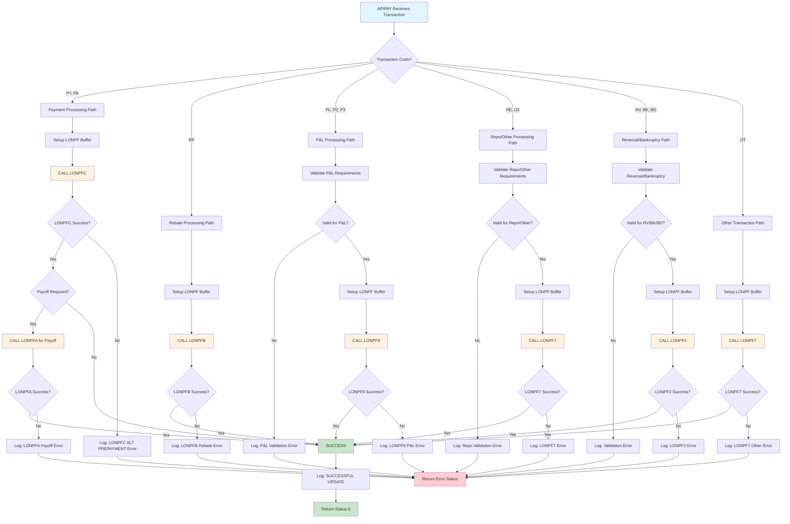

```mermaid
flowchart TD
    A[APIPAY Receives Transaction] --> B{Transaction Code?}
    
    B -->|PY, PA| C[Payment Processing Path]
    B -->|RP| D[Rebate Processing Path]
    B -->|PL, P2, P3| E[P&L Processing Path]
    B -->|RE, O2| F[Repo/Other Processing Path]
    B -->|RV, BK, BD| G[Reversal/Bankruptcy Path]
    B -->|OT| H[Other Transaction Path]
    
    C --> C1[Setup LONPF Buffer]
    C1 --> C2[CALL LONPFC]
    C2 --> C3{LONPFC Success?}
    C3 -->|Yes| C4{Payoff Required?}
    C3 -->|No| ER1[Log: LONPFC ALT PREPAYMENT Error]
    C4 -->|Yes| C5[CALL LONPFA for Payoff]
    C4 -->|No| SUCCESS
    C5 --> C6{LONPFA Success?}
    C6 -->|Yes| SUCCESS
    C6 -->|No| ER2[Log: LONPFA Payoff Error]
    
    D --> D1[Setup LONPF Buffer]
    D1 --> D2[CALL LONPFB]
    D2 --> D3{LONPFB Success?}
    D3 -->|Yes| SUCCESS
    D3 -->|No| ER3[Log: LONPFB Rebate Error]
    
    E --> E1[Validate P&L Requirements]
    E1 --> E2{Valid for P&L?}
    E2 -->|No| ER4[Log: P&L Validation Error]
    E2 -->|Yes| E3[Setup LONPF Buffer]
    E3 --> E4[CALL LONPF9]
    E4 --> E5{LONPF9 Success?}
    E5 -->|Yes| SUCCESS
    E5 -->|No| ER5[Log: LONPF9 P&L Error]
    
    F --> F1[Validate Repo/Other Requirements]
    F1 --> F2{Valid for Repo/Other?}
    F2 -->|No| ER6[Log: Repo Validation Error]
    F2 -->|Yes| F3[Setup LONPF Buffer]
    F3 --> F4[CALL LONPF7]
    F4 --> F5{LONPF7 Success?}
    F5 -->|Yes| SUCCESS
    F5 -->|No| ER7[Log: LONPF7 Error]
    
    G --> G1[Validate Reversal/Bankruptcy]
    G1 --> G2{Valid for RV/BK/BD?}
    G2 -->|No| ER8[Log: Validation Error]
    G2 -->|Yes| G3[Setup LONPF Buffer]
    G3 --> G4[CALL LONPF2]
    G4 --> G5{LONPF2 Success?}
    G5 -->|Yes| SUCCESS
    G5 -->|No| ER9[Log: LONPF2 Error]
    
    H --> H1[Setup LONPF Buffer]
    H1 --> H2[CALL LONPF7]
    H2 --> H3{LONPF7 Success?}
    H3 -->|Yes| SUCCESS
    H3 -->|No| ER10[Log: LONPF7 Other Error]
    
    SUCCESS --> LOG1[Log: SUCCESSFUL UPDATE]
    LOG1 --> EXIT1[Return Status 0]
    
    ER1 --> EXIT2[Return Error Status]
    ER2 --> EXIT2
    ER3 --> EXIT2
    ER4 --> EXIT2
    ER5 --> EXIT2
    ER6 --> EXIT2
    ER7 --> EXIT2
    ER8 --> EXIT2
    ER9 --> EXIT2
    ER10 --> EXIT2
    
    style A fill:#e1f5fe
    style SUCCESS fill:#c8e6c9
    style EXIT1 fill:#c8e6c9
    style EXIT2 fill:#ffcdd2
    style C2 fill:#fff3e0
    style D2 fill:#fff3e0
    style E4 fill:#fff3e0
    style F4 fill:#fff3e0
    style G4 fill:#fff3e0
    style H2 fill:#fff3e0
    style C5 fill:#fff3e0
```
