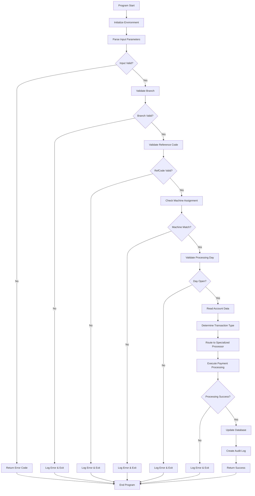
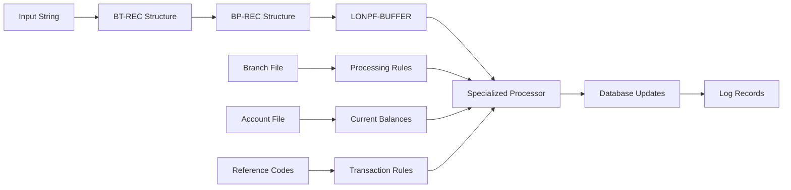
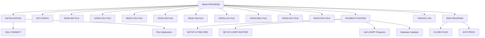

# APIPAY - Single Payment Reference Codes Processing

**Location:** .\APIPAY_Inlined.CBL  
**Generated on:** July 22, 2025  
**Program ID:** APIPAY  
**Date Written:** August 16, 2023

## Table of Contents

1. [Table of Contents](#table-of-contents)
2. [Program Overview](#program-overview)
3. [Transaction Types Supported](#transaction-types-supported)
4. [Input Parameters](#input-parameters)
5. [Output Fields](#output-fields)
6. [Program Flow Diagrams](#program-flow-diagrams)
7. [Batch Processing Timeline](#batch-processing-timeline)
8. [Paragraph-Level Flow Explanation](#paragraph-level-flow-explanation)
9. [Data Flow Mapping](#data-flow-mapping)
10. [Referenced Programs](#referenced-programs)
11. [Error Handling and Validation](#error-handling-and-validation)
12. [Technical Implementation](#technical-implementation)
13. [Integration Points](#integration-points)
14. [File Dependencies](#file-dependencies)
15. [Call Graph of PERFORMed Paragraphs](#call-graph-of-performed-paragraphs)

---

## Program Overview

**APIPAY** is a sophisticated COBOL batch processing program designed for **Single Payment Reference Codes Processing**. This program operates in a headless mode ($ sign run, no screens) and is specifically designed for automated batch payment processing in a loan management system.

### Key Characteristics

- **Execution Mode:** Command-line batch processing (no interactive screens)
- **Input Method:** Accepts payment data via input string parameters
- **Processing Type:** Single payment transaction processing per execution
- **Output:** Creates transaction logs and updates loan databases
- **Error Handling:** Comprehensive validation and error logging

### Business Purpose

APIPAY serves as a critical component in the loan servicing ecosystem by:

1. **Processing Payment Transactions:** Handles various types of loan payments including regular payments, payoffs, rebates, and special transaction codes
2. **Data Validation:** Performs extensive validation of input parameters, account status, and business rules
3. **Database Updates:** Updates multiple loan-related files and maintains transactional integrity
4. **Audit Trail:** Creates comprehensive logging for compliance and troubleshooting
5. **Integration:** Interfaces with multiple specialized loan processing programs (LONPF series)

### Historical Context

According to the program comments, APIPAY was created by combining logic from several existing programs:
- **REFUPD and LONPW9:** For general payment processing logic
- **OTHUPD and LONPWA:** For "OT" (Other) transaction processing

---

## Transaction Types Supported

APIPAY supports multiple transaction types through its integration with specialized processing programs:

| Transaction Code | Description | Processing Program | Purpose |
|-----------------|-------------|-------------------|---------|
| **RP** | Rebate Payment | LONPFB | Interest rebate processing and "IN" rebate fixes |
| **PL** | Principal Loan Payment | LONPF9 | Principal-only payments |
| **P2** | Payment Type 2 | LONPF9 | Special payment processing (requires BT-PL-REASON) |
| **P3** | Payment Type 3 | LONPF9 | Special payment processing (requires BT-PL-REASON) |
| **RE** | Repossession | LONPF7 | Repossession-related transactions |
| **O2** | Other Type 2 | LONPF7 | Secondary other transaction processing |
| **RV** | Reversal | LONPF2 | Transaction reversals |
| **BK** | Bank | LONPF2 | Bank-related transactions |
| **BD** | Bank Draft | LONPF2 | Bank draft processing |
| **PY** | Payment | LONPFC | Standard payment processing |
| **PA** | Payment Alternative | LONPFC | Alternative payment processing |
| **OT** | Other | LONPF7 | General other transaction processing |

### Payment Processing Flow by Transaction Type

Each transaction type follows a specific processing pattern:

1. **Input Validation:** Verify transaction code and associated parameters
2. **Specialized Processing:** Route to appropriate LONPF program
3. **Update Processing:** Execute LONPF2 for database updates
4. **Audit Logging:** Record transaction results

---

## Input Parameters

APIPAY receives input through two primary mechanisms:

### Command Line Parameters

The program is invoked with two parameters:
```
APIPAY.SH (DATA STRING OF BT-REC) (REPAY TRANS ID)
```

**Example:**
```
SH ./APIPAY.SH 00100786740000001000CUACH090123OT 1234567890
```

### Input String Structure (BT-REC)

The input string contains a packed data structure with the following components:

| Field | Position | Length | Type | Description | Example |
|-------|----------|--------|------|-------------|---------|
| **BT-BRANCH** | 1-4 | 4 | Numeric | Branch number | 0010 |
| **BT-ACCTNO** | 5-10 | 6 | Numeric | Account number | 078674 |
| **BT-AMT** | 11-20 | 10 | Packed Decimal (8.2) | Payment amount | 0000001000 |
| **BT-REFCD** | 21-25 | 5 | Alphanumeric | Reference code | CUACH |
| **BT-PAYDATE** | 26-31 | 6 | Numeric (MMDDYY) | Payment date | 090123 |
| **BT-TRCD** | 32-33 | 2 | Alphanumeric | Transaction code | OT |

### Input Validation Rules

1. **Branch Number:** Must exist in branch file (BR-FILE)
2. **Account Number:** Must be valid and exist in loan file (LN-FILE)
3. **Amount:** Must be greater than zero for most transaction types
4. **Reference Code:** Must exist in code file (CD-FILE) and be valid for branch
5. **Payment Date:** Must be valid date format and within business rules
6. **Transaction Code:** Must be one of the supported transaction types

---

## Output Fields

### Return Status Codes

APIPAY communicates processing results through return status codes:

| Return Code | Description | Meaning |
|-------------|-------------|---------|
| **0** | Successful Update | Transaction processed successfully |
| **2** | Branch Not Found | Specified branch number not on file |
| **3** | Reference Code Invalid | Reference code not found or invalid for branch |
| **4** | Machine Mismatch | Branch not assigned to current processing machine |
| **5** | Global Record Missing | Required global configuration record not found |
| **6** | Day Not Open | Processing day not open for transactions |
| **66** | Alt Prepayment Error | Alternative prepayment processing rejected |
| **67** | LONPFB Error | Rebate processing program rejected transaction |
| **68** | Payment Not Applied | General payment processing rejection |
| **69** | Update Rejected | LONPF2 update program rejected transaction |
| **99** | General Error | Unspecified error condition |

### Log File Output

**Log File Location:** `SC9990/EO/APIMMDDYY/0000LOG`

**Log Record Format:**
```
LOG-STATUS(4) RETURN-CODE(4) DATE(10) TIME(8) BRANCH(4) ACCOUNT(6) MESSAGE(38)
```

**Example Log Entries:**
```
PASS 2023/08/18 01:04 PM 0010 078674 SUCCESSFUL UPDATE
FAIL 2023/08/18 01:04 PM 0010 033333 ACCOUNT NOT ON FILE, ABORTED
```

### Database Updates

APIPAY updates multiple database files through the LONPF program series:

1. **Loan Master File (LN-FILE):** Account balances, payment history
2. **Payment History File (LP-FILE):** Transaction records
3. **General Ledger Files:** Accounting entries
4. **Audit Files:** Compliance and tracking records

---

## Program Flow Diagrams

### High-Level Processing Flow



### Detailed Transaction Processing Flow


### Error Handling Flow


### Database Update Flow


---

## Batch Processing Timeline

```mermaid
gantt
    title APIPAY Batch Processing Timeline
    dateFormat X
    axisFormat %s
    
    section Initialization
    Environment Setup    :milestone, env, 0, 0
    Parameter Parsing    :init, after env, 100ms
    
    section Validation
    Branch Validation    :val1, after init, 50ms
    RefCode Validation   :val2, after val1, 30ms
    Machine Check        :val3, after val2, 20ms
    Day Open Check       :val4, after val3, 40ms
    
    section Data Access
    Account Read         :data1, after val4, 80ms
    Supporting Data      :data2, after data1, 60ms
    
    section Processing
    Transaction Routing  :proc1, after data2, 20ms
    Specialized Process  :proc2, after proc1, 200ms
    Database Update      :proc3, after proc2, 150ms
    
    section Completion
    Audit Logging        :log, after proc3, 30ms
    Cleanup              :clean, after log, 20ms
    Program Exit         :milestone, exit, after clean, 0
```



---

## Paragraph-Level Flow Explanation

### Main Program Structure

The program follows a hierarchical structure with clearly defined functional areas:

#### MAIN-PROGRAM SECTION
**Purpose:** Primary control flow and orchestration
**Key Actions:**
- Environment initialization
- Parameter validation
- Branch and security validation  
- Transaction routing
- Error handling coordination

#### INITIALIZATION Section
**Purpose:** System setup and environment preparation
**Key Actions:**
- SQL connection establishment
- File path configuration
- Global environment setup
- Working storage initialization

#### VALIDATION Sections
**Purpose:** Comprehensive input and business rule validation

**BRANCH-VALIDATION:**
- Validates branch number existence
- Checks machine assignment
- Verifies processing authority

**ACCOUNT-VALIDATION:**
- Confirms account existence
- Validates account status
- Checks processing restrictions

**REFERENCE-CODE-VALIDATION:**
- Verifies reference code validity
- Checks branch-specific permissions
- Validates payoff flags and restrictions

#### PROCESSING Sections

**PAYMENT-POSTING:**
- Routes transactions to appropriate LONPF programs
- Manages specialized processing based on transaction type
- Handles payment application logic

**DATABASE-UPDATE:**
- Coordinates database updates through LONPF2
- Maintains transactional integrity
- Manages concurrent access controls

#### UTILITY Sections

**FILE-HANDLING:**
- File open/close operations
- Path management
- Error recovery for file operations

**ERROR-HANDLING:**
- Comprehensive error detection
- Error message formatting
- Audit trail creation

### Control Flow Patterns

The program uses several control flow patterns:

1. **Sequential Processing:** Linear execution for validation steps
2. **Conditional Branching:** Transaction type routing
3. **Subroutine Calls:** Specialized processing via PERFORM
4. **Error Handling:** GO TO statements for error conditions
5. **Program Calls:** External program invocation for specialized processing

---

## Data Flow Mapping

### Key Data Transformations



### Data Structure Relationships

| Source Structure | Target Structure | Transformation Purpose |
|------------------|------------------|------------------------|
| **INPUT-STRING** | **BT-REC** | Parse input parameters |
| **BT-REC** | **BP-REC** | Standardize payment data |
| **BP-REC** | **LONPF-BUFFER** | Prepare for processing |
| **BR-REC** | **Processing Flags** | Apply branch rules |
| **LN-REC** | **Account Context** | Current account state |
| **CD-REC** | **Transaction Rules** | Reference code validation |

### Field Mapping Examples

**Input to Payment Record:**
```cobol
MOVE BT-ACCTNO    TO BP-LNNO
MOVE BT-AMT       TO BP-TRAMT  
MOVE BT-REFCD     TO BP-REFCD
MOVE BT-PAYDATE   TO BP-PAYDATE (after date conversion)
MOVE BT-TRCD      TO BP-TRCD
```

**Date Conversion Logic:**
```cobol
MOVE BT-PAYDATE   TO DATE-MMDDYY
PERFORM CONVERT-MMDDYY-TO-YYYYMMDD
MOVE DATE-YYYYMMDD TO BP-PAYDATE
```

---

## Referenced Programs

APIPAY integrates with multiple external programs through CALL statements:

### Primary Payment Processors (LONPF Series)

#### [LONPFB - Rebate Payment Processor](LONPFB_Documentation.html)
**Purpose:** Interest rebate processing  
**Transaction Types:** RP  
**Key Functions:**
- Interest rebate calculations
- Regulatory compliance for rebates
- Early payoff processing

#### [LONPF7 - Repossession and Other Processor](LONPF7_Documentation.html)
**Purpose:** Repossession and secondary transaction processing  
**Transaction Types:** RE, O2, OT  
**Key Functions:**
- Repossession transaction handling
- Other/miscellaneous transaction processing

#### [LONPF9 - Principal Payment Processor](LONPF9_Documentation.html)
**Purpose:** Principal and special payment processing  
**Transaction Types:** PL, P2, P3  
**Key Functions:**
- Principal-only payments
- Special payment scenarios requiring additional reasoning codes

#### [LONPFC - Standard Payment Processor](LONPFC_Documentation.html)
**Purpose:** Standard payment processing  
**Transaction Types:** PY, PA  
**Key Functions:**
- Regular payment processing
- Alternative payment methods

#### [LONPF2 - Payment Update Processor](LONPF2_Documentation.html)
**Purpose:** Database update coordination  
**Used By:** All transaction types  
**Key Functions:**
- Final database updates
- Transaction posting
- Audit trail creation

### Utility Programs

#### Environment Configuration
- **[GET-GPENV](GET-GPENV_Documentation.md)** - Environment variable retrieval and configuration
- **[MAIN-PROGRAM](MAIN-PROGRAM_Documentation.html)** - Main program initialization with GB/SETENV calls

#### Date/Time Processing Utilities
- **[C-TIMALL](C-TIMALL_Documentation.html)** - Comprehensive timing and date calculation suite
- **[C-TIMBEG](C-TIMBEG_Documentation.html)** - Beginning date calculations and setup
- **[C-TIMEND](C-TIMEND_Documentation.html)** - Ending date calculations and finalization
- **[C-TIM-RESULTS](C-TIM-RESULTS_Documentation.html)** - Time calculation result processing
- **[C-TIM360-358](C-TIM360-358_Documentation.html)** - 360/358 day year calculations
- **[C-TIM361](C-TIM361_Documentation.html)** - 361 day year calculations
- **[C-TIM362](C-TIM362_Documentation.html)** - 362 day year calculations
- **[C-TIM365-367](C-TIM365-367_Documentation.html)** - 365/367 day year calculations (standard/leap)
- **[C-TIM999-998](C-TIM999-998_Documentation.html)** - Special timing calculations
- **[C-ELAPSED-TIME](C-ELAPSED-TIME_Documentation.html)** - Calculate elapsed time between dates
- **[C-INCREMENT-PERIODS](C-INCREMENT-PERIODS_Documentation.html)** - Increment date by specified periods
- **[C-INCR-DAYS](C-INCR-DAYS_Documentation.md)** - Day-based date arithmetic
- **[C-INCR-MONTHS](C-INCR-MONTHS_Documentation.md)** - Month-based date arithmetic with intelligent day adjustment
- **[C-INCR-HALF-MONTHS](C-INCR-HALF-MONTHS_Documentation.md)** - Half-month date arithmetic using 15-day periods
- **[C-DATE-COMPARE](C-DATE-COMPARE_Documentation.md)** - Compare dates for relative positioning
- **[C-DATE-TEST](C-DATE-TEST_Documentation.html)** - Date validation and testing
- **[C-LEAP-YEAR-TEST](C-LEAP-YEAR-TEST_Documentation.html)** - Leap year determination
- **[C-WEEKDAY](C-WEEKDAY_Documentation.html)** - Day of week calculations
- **[C-CALL-CJUL](C-CALL-CJUL_Documentation.html)** - Julian to Gregorian date conversion
- **[C-CALL-JUL](C-CALL-JUL_Documentation.html)** - Standard julian date processing
- **[C-CALL-NEWDATE](C-CALL-NEWDATE_Documentation.html)** - Multi-format date conversion and standardization
- **[CJUL](CJUL_Documentation.html)** - Julian date conversion utilities
- **[JUL](JUL_Documentation.html)** - Julian date processing
- **[WEEKDAY](WEEKDAY_Documentation.html)** - Weekday determination utilities
- **[TIM](TIM_Documentation.html)** - Basic timing utilities
- **[TIM360](TIM360_Documentation.html)** - 360-day year timing
- **[TIM365](TIM365_Documentation.html)** - 365-day year timing
- **[TIMALL](TIMALL_Documentation.html)** - All timing calculation methods
- **[TIMUPER](TIMUPER_Documentation.html)** - Unit period timing calculations
- **[GET-TIME](GET-TIME_Documentation.md)** - System time retrieval
- **[DATER-ROUTINE](DATER-ROUTINE_Documentation.md)** - Date processing routines

#### Date Format Conversion Utilities
 - **[CONVERT-00MMDDYY-TO-CCYYMMDD](CONVERT-00MMDDYY-TO-CCYYMMDD_Documentation.md)** - Convert 2-digit to 4-digit year format
 - **[CONVERT-CCYYMMDD-TO-00MMDDYY](CONVERT-CCYYMMDD-TO-00MMDDYY_Documentation.md)** - Convert 4-digit to 2-digit year format
 - **[CONVERT-MMDDYY-TO-YYYYMMDD](CONVERT-MMDDYY-TO-YYYYMMDD_Documentation.md)** - Convert MM/DD/YY to YYYY/MM/DD format
 - **[CONVERT-YYYYMMDD-TO-MMDDYY](CONVERT-YYYYMMDD-TO-MMDDYY_Documentation.md)** - Convert YYYY/MM/DD to MM/DD/YY format
 - **[CONVERT-SYS-NUM-NDTE-DATES-IN](CONVERT-SYS-NUM-NDTE-DATES-IN_Documentation.md)** - Convert system numeric dates to internal format
 - **[CONVERT-SYS-NUM-NDTE-DATES-OUT](CONVERT-SYS-NUM-NDTE-DATES-OUT_Documentation.md)** - Convert internal dates to system numeric format
 - **[NEW-DATE-CALCULATION](NEW-DATE-CALCULATION_Documentation.md)** - New date format calculations

#### File Management - Open Operations
- **[OPEN-BR-FILE](OPEN-BR-FILE_Documentation.md)** - Open branch file
- **[OPEN-BW1-FILE](OPEN-BW1-FILE_Documentation.md)** - Open BW1 work file
- **[OPEN-CD1-FILE](OPEN-CD1-FILE_Documentation.md)** - Open CD1 certificate file
- **[OPEN-GB-FILE](OPEN-GB-FILE_Documentation.md)** - Open general batch file
- **[OPEN-GI1-FILE](OPEN-GI1-FILE_Documentation.md)** - Open GI1 general inquiry file
- **[OPEN-IT](OPEN-IT_Documentation.md)** - Open internal transaction file
- **[OPEN-LN1-FILE](OPEN-LN1-FILE_Documentation.md)** - Open LN1 loan file
- **[OPEN-LOG-FILE](OPEN-LOG-FILE_Documentation.md)** - Open log file for processing
- **OPEN-LOG-FILE-EXTEND** - Open log file in extend mode
- **OPEN-LOG-FILE-OUTPUT** - Open log file for output
- **[OPEN-LP1-FILE](OPEN-LP1-FILE_Documentation.md)** - Open LP1 loan payment file
- **OPEN-LTI1-FILE** - Open LTI1 loan transaction inquiry file
- **OPEN-LTP1-FILE** - Open LTP1 loan transaction posting file
- **OPEN-LXE1-FILE** - Open LXE1 loan extension file
- **OPEN-LXG1-FILE** - Open LXG1 loan extended general file
- **OPEN-OP-FILE** - Open output processing file
- **OPEN-OP-FILE-OUTPUT** - Open output processing file for output
- **OPEN-RC2-FILE** - Open RC2 reference code file
- **OPEN-SP1-FILE** - Open SP1 special processing file
- **OPEN-SPA1-FILE** - Open SPA1 special processing A file
- **OPEN-SPB1-FILE** - Open SPB1 special processing B file
- **OPEN-SPC1-FILE** - Open SPC1 special processing C file
- **OPEN-WK-FILE** - Open work file
- **OPEN-WK-FILE-OUTPUT** - Open work file for output
- **OPEN-WK-OUTPUT** - Open work file output stream

#### File Management - Close Operations
- **CLOSE-BR-FILE** - Close branch file
- **CLOSE-BW1-FILE** - Close BW1 work file
- **CLOSE-CD1-FILE** - Close CD1 certificate file
- **CLOSE-FILES** - Close all open files
- **CLOSE-GB-FILE** - Close general batch file
- **CLOSE-GI1-FILE** - Close GI1 general inquiry file
- **CLOSE-IT** - Close internal transaction file
- **CLOSE-LN1-FILE** - Close LN1 loan file
- **CLOSE-LOG-FILE** - Close log file
- **CLOSE-LP1-FILE** - Close LP1 loan payment file
- **CLOSE-LTI1-FILE** - Close LTI1 loan transaction inquiry file
- **CLOSE-LTP1-FILE** - Close LTP1 loan transaction posting file
- **CLOSE-LXE1-FILE** - Close LXE1 loan extension file
- **CLOSE-LXG1-FILE** - Close LXG1 loan extended general file
- **CLOSE-OP-FILE** - Close output processing file
- **CLOSE-RC2-FILE** - Close RC2 reference code file
- **CLOSE-SP1-FILE** - Close SP1 special processing file
- **CLOSE-SPA1-FILE** - Close SPA1 special processing A file
- **CLOSE-SPB1-FILE** - Close SPB1 special processing B file
- **CLOSE-SPC1-FILE** - Close SPC1 special processing C file
- **CLOSE-WK-FILE** - Close work file

#### File Management - Clear Operations
- **CLEAR-LP-FILE** - Clear loan payment file
- **CLEAR-LXG-FILE** - Clear loan extended general file

#### File Management - Read Operations
- **READ-BR-FILE** / **READ-BR-FILE-NEXT** - Read branch file records
- **READ-BW1-FILE** / **READ-BW1-FILE-NEXT** - Read BW1 work file records
- **READ-CD1-FILE** / **READ-CD1-FILE-NEXT** / **READ-CD1-FILE-PREVIOUS** - Read CD1 certificate file records
- **READ-EARNINGS** - Read earnings data
- **READ-GB-FILE** / **READ-GB-FILE-NEXT** - Read general batch file records
- **READ-GI1-FILE** / **READ-GI1-FILE-NEXT** - Read GI1 general inquiry file records
- **READ-IT** - Read internal transaction file
- **READ-LN1-FILE** / **READ-LN1-FILE-NEXT** - Read LN1 loan file records
- **READ-LP1-FILE** / **READ-LP1-FILE-NEXT** / **READ-LP1-FILE-PREVIOUS** - Read LP1 loan payment file records
- **READ-LTI1-FILE** / **READ-LTI1-FILE-NEXT** - Read LTI1 loan transaction inquiry file records
- **READ-LTP1-FILE** / **READ-LTP1-FILE-NEXT** - Read LTP1 loan transaction posting file records
- **READ-LXE1-FILE** / **READ-LXE1-FILE-NEXT** - Read LXE1 loan extension file records
- **READ-LXG1-FILE** / **READ-LXG1-FILE-NEXT** - Read LXG1 loan extended general file records
- **READ-RC2-FILE** / **READ-RC2-FILE-NEXT** - Read RC2 reference code file records
- **READ-SP1-FILE** / **READ-SP1-FILE-NEXT** - Read SP1 special processing file records
- **READ-SPA1-FILE** / **READ-SPA1-FILE-NEXT** - Read SPA1 special processing A file records
- **READ-SPB1-FILE** - Read SPB1 special processing B file records
- **READ-SPC1-FILE** - Read SPC1 special processing C file records
- **READ-WK-FILE** - Read work file records

#### File Management - Write Operations
- **WRITE-IT** - Write internal transaction file
- **WRITE-LOG-FILE** - Write to log file
- **WRITE-WK-FILE** - Write to work file

#### File Management - Load/Count Operations
- **LOAD-BR-FILE** - Load branch file data
- **LOAD-BW1-FILE** - Load BW1 work file data
- **LOAD-CD1-FILE** - Load CD1 certificate file data
- **LOAD-GB-FILE** - Load general batch file data
- **LOAD-GI1-FILE** - Load GI1 general inquiry file data
- **LOAD-LN1-FILE** - Load LN1 loan file data
- **LOAD-LP1-FILE** - Load LP1 loan payment file data
- **LOAD-LTI1-FILE** - Load LTI1 loan transaction inquiry file data
- **LOAD-LTP1-FILE** - Load LTP1 loan transaction posting file data
- **LOAD-LXE1-FILE** - Load LXE1 loan extension file data
- **LOAD-LXG1-FILE** - Load LXG1 loan extended general file data
- **LOAD-OP-FILE** - Load output processing file data
- **LOAD-OPEN-FILE** - Load open file data
- **LOAD-RC2-FILE** - Load RC2 reference code file data
- **LOAD-SPA1-FILE** - Load SPA1 special processing A file data
- **LOAD-SPB1-FILE** - Load SPB1 special processing B file data
- **LOAD-SPC1-FILE** - Load SPC1 special processing C file data
- **COUNT-BR-FILE** - Count branch file records
- **COUNT-GI1-FILE** - Count GI1 general inquiry file records
- **COUNT-IT** - Count internal transaction file records

#### File Management - Start/Positioning Operations
- **START-IT** - Start/position internal transaction file
- **START-LP1-FILE-NOT-GREATER** - Start LP1 file positioning (not greater than)
- **START-LTI1-FILE** - Start/position LTI1 loan transaction inquiry file
- **START-SP1-FILE** - Start/position SP1 special processing file
- **START-SPA1-FILE** - Start/position SPA1 special processing A file

#### File Management - Work File Operations
- **CREATE-WK-FILE** - Create work file
- **DELETE-WK-FILE** - Delete work file
- **REWRITE-WK-FILE** - Rewrite work file records
- **REMOVE-WORKFILE** - Remove work file completely

#### File Management - Special Operations
- **REWRITE-IT** - Rewrite internal transaction file
- **DELETE-IT** - Delete internal transaction file records
- **PACK-LT** - Pack loan transaction data
- **UNPACK-LT** - Unpack loan transaction data
- **UNPACK-PAYMENT-SCHEDULE** - Unpack payment schedule data

#### Data Retrieval Utilities
- **GET-BR-FIELDS** - Get branch file field data
- **GET-BW-FIELDS** - Get BW work file field data
- **GET-CD-FIELDS** - Get CD certificate file field data
- **GET-GB-FIELDS** - Get general batch file field data
- **GET-GI-FIELDS** - Get general inquiry file field data
- **GET-LN-FIELDS** - Get loan file field data
- **GET-LP-FIELDS** - Get loan payment file field data
- **GET-LT-P-REC** - Get loan transaction payment record
- **GET-LTI-FIELDS** - Get loan transaction inquiry file field data
- **GET-LTP-FIELDS** - Get loan transaction posting file field data
- **GET-LXE-FIELDS** - Get loan extension file field data
- **GET-LXG-FIELDS** - Get loan extended general file field data
- **GET-RC-FIELDS** - Get reference code file field data
- **GET-SPA-FIELDS** - Get special processing A file field data
- **GET-SPB-FIELDS** - Get special processing B file field data
- **GET-SPC-FIELDS** - Get special processing C file field data
- **GET-SPR** - Get special processing records

#### APR (Annual Percentage Rate) Calculation Utilities
- **APR-REGZ** / **APR-REGZ-EXIT** - Regulation Z APR calculations
- **APRZ-APR-MAIN** - Main APR calculation routine
- **APRZ-APR-PROCESS** - APR calculation processing
- **APRZ-APR-GET-ARGS** - Get APR calculation arguments
- **APRZ-APR-FIN** - Finalize APR calculations
- **APRS-RATE** - APR rate calculations
- **APRS-GET-EFFRATE** - Get effective rate for APR
- **APRS-GET-RATE-TABLE** - Get rate table for APR calculations
- **APRS-GET-SIMPLE-RATE** - Get simple rate for APR
- **APRS-EFFRATE-ADDON** - Effective rate add-on calculations
- **APRS-EFFRATE-DISCOUNT** - Effective rate discount calculations

#### Interest Rate and Payment Calculation Utilities
- **LPRATE-ACCELERATION** - Loan payment rate acceleration calculations
- **LPRATE-CALC-BREAK-DATES** - Calculate rate break dates
- **LPRATE-CALC-IT** - Calculate loan payment rates
- **LPRATE-COMPARE-RATES** - Compare different loan rates
- **LPRATE-EXPIRED-INT** / **LPRATE-EXPIRED-INT-LOOP** - Handle expired interest
- **LPRATE-FIND-THRU-DATE** - Find rate through dates
- **LPRATE-JUDGEMENT** - Rate judgement calculations
- **LPRATE-PREPARE-PMT-1** / **LPRATE-PREPARE-PMT-2** - Prepare payment calculations
- **LPRATE-SET-INTPDTH-DATE** - Set interest paid through date
- **LPRATE-USE-EXPIRED-RATES** - Use expired rate calculations

#### Unit Period Calculation Utilities
- **UPER-CALCULATION** / **UPER-CALCULATE-EXIT** - Main unit period calculations
- **UPER-DAILY-UNIT-PERIODS** - Daily unit period calculations
- **UPER-MONTHLY-UNIT-PERIODS** / **UPER-MONTHLY-UNIT-PERIODS-EXIT** - Monthly unit period calculations
- **UPER-SEMI-MONTHLY-UNIT-PERIODS** - Semi-monthly unit period calculations
- **UPER-WEEKLY-UNIT-PERIODS** - Weekly unit period calculations
- **UPER-YEARLY-UNIT-PERIODS** / **UPER-YEARLY-UNIT-PERIODS-EXIT** - Yearly unit period calculations
- **UPER-SINGLE-PAYS** / **UPER-SINGLE-PAYS-EXIT** - Single payment unit period calculations

#### Unit Period Work File Utilities
- **UPWK-CALC-CONTR-WK** - Calculate contractual work periods
- **UPWK-CALC-DEF-WK** - Calculate deferment work periods
- **UPWK-CALC-LC-WK** - Calculate late charge work periods
- **UPWK-CONTR-CALC-EXIT** - Exit contractual work calculations
- **UPWK-DEF-CALC** / **UPWK-DEF-CALC-EXIT** - Deferment calculation work
- **UPWK-GET-UPER-INFO** / **UPWK-GET-UPER-INFO-EXIT** - Get unit period information
- **UPWK-LC-CALC** / **UPWK-LC-CALC-EXIT** - Late charge calculation work

#### Contractual Payment Calculation Utilities
- **COMPUTE-CONTRACTUAL** / **COMPUTE-CONTRACTUAL-EXIT** - Main contractual payment calculations
- **COMPUTE-CONTRACTUAL-D** / **COMPUTE-CONTRACTUAL-D-EXIT** - Contractual payment type D calculations
- **COMPUTE-CONTRACTUAL-F** / **COMPUTE-CONTRACTUAL-F-EXIT** - Contractual payment type F calculations
- **COMPUTE-CONTRACTUAL-GET-PDTH** - Get paid through date for contractual calculations
- **COMPUTE-CONTRACTUAL-PAYS-TODAY** - Calculate payments due today
- **COMPUTE-CONTRACTUAL-POT-CHGOFF** - Calculate 30-day potential amounts
- **COMPUTE-CONTRACTUAL-POT30** - Calculate 30-day potential amounts
- **COMPUTE-CONTR-UNITP-A-D** / **COMPUTE-CONTR-UNITP-A-D-EXIT** - Contractual unit period A-D calculations

#### Recency and Delinquency Calculation Utilities
- **COMPUTE-RECENCY** / **COMPUTE-RECENCY-EXIT** - Main recency calculations
- **COMPUTE-RECENCY-DELINQ** - Recency delinquency calculations
- **COMPUTE-RECENCY-DELINQ-D** / **COMPUTE-RECENCY-DELINQ-D-EXIT** - Recency delinquency type D calculations
- **COMPUTE-RECENCY-DELINQ-F** / **COMPUTE-RECENCY-DELINQ-F-EXIT** - Recency delinquency type F calculations
- **COMPUTE-RECENCY-SET-EXTERNAL** - Set external recency data
- **COMPUTE-TRUE-RECENCY** - Calculate true recency values
- **RECENCY-ROUTINE** / **RECENCY-ROUTINE-EXIT** - Recency calculation routines

#### Elapsed Time and Period Calculation Utilities
- **CONTRACTUAL-ELAPSED-PAYPER** - Calculate elapsed payment periods for contractual loans
- **CONTRAL-ELAPSED-PAYPER-EXIT** - Exit contractual elapsed payment period calculations
- **CALC-ELAPSED-REF-THRU-PODATE** - Calculate elapsed time from reference through payoff date
- **CALC-HOLD-LN-ACCERN** - Calculate hold loan accrued earnings
- **INCREMENT-COMMON** - Common increment calculations
- **INCREMENT-DAYS** - Increment by days
- **INCREMENT-MONTHS** - Increment by months
- **INCREMENT-UNITPER** - Increment by unit periods

#### Interest Due Calculation Utilities
- **INTEREST-DUE-CALCULATION** - Main interest due calculations
- **INTEREST-DUE-EXIT** - Exit interest due calculations
- **INTEREST-DUE-FINAL** - Final interest due calculations
- **INTEREST-DUE-LOOP** - Interest due calculation loop
- **INTEREST-DUE-MAXIMUM** - Maximum interest due calculations
- **INTEREST-DUE-MINIMUM** - Minimum interest due calculations
- **INTEREST-DUE-SPECIAL-OPTIONS** - Special options for interest due

#### Interest Due Penalty Utilities (State-Specific)
- **INTEREST-DUE-PENALTY** / **INTEREST-DUE-PENALTY-EXIT** - Main penalty calculations
- **INTEREST-DUE-PENALTY-21** - Interest penalty calculations for code 21
- **INTEREST-DUE-PENALTY-25** - Interest penalty calculations for code 25
- **INTEREST-DUE-PENALTY-GA** - Georgia-specific interest penalty calculations
- **INTEREST-DUE-PENALTY-MS** - Mississippi-specific interest penalty calculations
- **INTEREST-DUE-PENALTY-NC** - North Carolina-specific interest penalty calculations
- **INTEREST-DUE-PENALTY-NEWS** - News-specific interest penalty calculations
- **INTEREST-DUE-PENALTY-NV** - Nevada-specific interest penalty calculations
- **INTEREST-DUE-PENALTY-OH** - Ohio-specific interest penalty calculations
- **INTEREST-DUE-PENALTY-WI** - Wisconsin-specific interest penalty calculations
- **NO-PENALTY-21** - No penalty calculations for code 21
- **NO-PENALTY-25** - No penalty calculations for code 25
- **NO-PENALTY-GA** - Georgia no penalty calculations
- **NO-PENALTY-MS** - Mississippi no penalty calculations
- **NO-PENALTY-OH** - Ohio no penalty calculations

#### Late Charge Assessment Utilities
- **LATE-ASSESS-ROUTINE** / **LATE-ASSESS-EXIT** - Main late charge assessment
- **LATE-CHARGE-CALCULATION** - Late charge calculation routines
- **LATE-CHARGE-CALC-END** - End late charge calculations
- **LATE-CHARGE-CALC-EXIT** - Exit late charge calculations
- **LATE-CHARGE-CALC-NORMAL-END** - Normal end late charge calculations
- **LATE-CHARGE-APPLY** - Apply late charges
- **LATE-CHARGE-TEST-ELREAD** - Test and read late charge data

#### Late Charge Assessment Period Utilities (LCAP)
- **LCAP-A-ACCUM** - LCAP type A accumulation
- **LCAP-A-AL-OK-TEST** - LCAP type A Alabama OK test
- **LCAP-A-C-BEGIN** / **LCAP-A-C** / **LCAP-A-C-EXIT** / **LCAP-A-C-PMT** - LCAP type A-C processing
- **LCAP-APP-EXIT** - LCAP application exit
- **LCAP-ASSESS-CHK** - LCAP assessment check
- **LCAP-ASSURE-LCPDTH** - LCAP assure late charge paid through date
- **LCAP-B-J-DATE-CHK** / **LCAP-B-J** / **LCAP-B-J-EXIT** / **LCAP-B-J-PMT** / **LCAP-B-J-RETRY** - LCAP type B-J processing
- **LCAP-CALC-PDTH** / **LCAP-CALC-PDTH-EXIT** / **LCAP-CALC-PDTH-ADDON** - LCAP calculate paid through date
- **LCAP-CALC-TEST** - LCAP calculation test
- **LCAP-COMPUTE-PAYS** - LCAP compute payments
- **LCAP-D-BEGIN** / **LCAP-D** / **LCAP-D-EXIT** / **LCAP-D-ADVANCE** / **LCAP-D-NOASSESS** - LCAP type D processing
- **LCAP-E-X-DATE-CHK** / **LCAP-E-X** / **LCAP-E-X-EXIT** / **LCAP-E-X-PMT** / **LCAP-E-X-RETRY** - LCAP type E-X processing
- **LCAP-F-BEGIN** / **LCAP-F** / **LCAP-F-EXIT** / **LCAP-F-ADVANCE** / **LCAP-F-NOASSESS** - LCAP type F processing
- **LCAP-F-CURRENT-PERIOD** / **LCAP-F-CURRENT-PERIOD-EXIT** / **LCAP-F-CURRENT-PERIOD-NEWCUR** - LCAP type F current period
- **LCAP-G-K-BEGIN** / **LCAP-G-K** / **LCAP-G-K-EXIT** / **LCAP-G-K-ADVANCE** / **LCAP-G-K-NOASSESS** - LCAP type G-K processing
- **LCAP-H-BEGIN** / **LCAP-H** / **LCAP-H-EXIT** / **LCAP-H-ADVANCE** / **LCAP-H-NOASSESS** - LCAP type H processing
- **LCAP-H-CURRENT-PERIOD** / **LCAP-H-CURRENT-PERIOD-EXIT** / **LCAP-H-CURRENT-PERIOD-NEWCUR** - LCAP type H current period
- **LCAP-I-L-BEGIN** / **LCAP-I-L** / **LCAP-I-L-EXIT** / **LCAP-I-L-ADVANCE** / **LCAP-I-L-NOASSESS** - LCAP type I-L processing
- **LCAP-I-L-CURRENT-PERIOD** / **LCAP-I-L-CURRENT-PERIOD-EXIT** / **LCAP-I-L-CURRENT-PERIOD-NEWCUR** / **LCAP-I-L-CURRENT-PERIOD-SETDUE** - LCAP type I-L current period
- **LCAP-LCPDTH-DATE-TEST** - LCAP late charge paid through date test
- **LCAP-M-BEGIN** / **LCAP-M** / **LCAP-M-EXIT** / **LCAP-M-ADVANCE** / **LCAP-M-NOASSESS** - LCAP type M processing
- **LCAP-M-CURRENT-PERIOD** / **LCAP-M-CURRENT-PERIOD-EXIT** / **LCAP-M-CURRENT-PERIOD-NEWCUR** / **LCAP-M-CURRENT-PERIOD-SETDUE** - LCAP type M current period
- **LCAP-MDTE-CHK** - LCAP maturity date check
- **LCAP-N-DATE-CHK** / **LCAP-N** / **LCAP-N-EXIT** / **LCAP-N-PMT** / **LCAP-N-RETRY** - LCAP type N processing
- **LCAP-P-BEGIN** / **LCAP-P** / **LCAP-P-EXIT** / **LCAP-P-ADVANCE** / **LCAP-P-NOASSESS** - LCAP type P processing
- **LCAP-P-CURRENT-PERIOD** / **LCAP-P-CURRENT-PERIOD-EXIT** / **LCAP-P-CURRENT-PERIOD-NEWCUR** / **LCAP-P-CURRENT-PERIOD-SETDUE** - LCAP type P current period
- **LCAP-PAID-THRU-ADDON-NEXT** - LCAP paid through add-on next
- **LCAP-PAID-THRU-ADDON-SUM** / **LCAP-PAID-THRU-ADDON-SUM-EXIT** - LCAP paid through add-on sum
- **LCAP-PICK-PDTH-CALC** - LCAP pick paid through date calculation
- **LCAP-S-BEGIN** / **LCAP-S** / **LCAP-S-EXIT** / **LCAP-S-ADVANCE** / **LCAP-S-NOASSESS** - LCAP type S processing
- **LCAP-S-CURRENT-PERIOD** / **LCAP-S-CURRENT-PERIOD-EXIT** / **LCAP-S-CURRENT-PERIOD-NEWCUR** - LCAP type S current period
- **LCAP-UPD-LCPD** - LCAP update late charge paid date

#### Late Charge Assessment Schedule Utilities (LCAS)
- **LCAS-ADJUST-FOR-MONTH-END** - LCAS adjust for month end
- **LCAS-CHECK-DAY** - LCAS check day
- **LCAS-CHECK-EXTENDING-GRACE** - LCAS check extending grace period
- **LCAS-CHECK-HOLIDAY** - LCAS check holiday
- **LCAS-FIND-LAST-GRACE-DAY** - LCAS find last grace day
- **LCAS-GET-GRACE-DATE** - LCAS get grace date

#### Paid Through Date Calculation Utilities
- **PAID-THRU-CALCULATION** - Main paid through date calculations
- **PAID-THRU-CALC-ADDON** - Paid through calculations with add-ons
- **PAID-THRU-CALC-NORMAL** / **PAID-THRU-CALC-NORMAL-EXIT** - Normal paid through calculations
- **PAID-THRU-CALC-NORMAL-E** / **PAID-THRU-CALC-NORMAL-E-EXIT** - Normal paid through calculations type E
- **PAID-THRU-ADDON-NEXT** - Paid through add-on next calculations
- **PAID-THRU-ADDON-SUM** / **PAID-THRU-ADDON-SUM-EXIT** - Paid through add-on sum calculations
- **PAST-DUE-DAYS-CALCULATION** - Past due days calculations
- **PAST-DUE-DAYS-COMPUTE** - Past due days computation
- **PAST-DUE-DAYS-EXIT** - Past due days calculation exit

#### Maturity and Expiration Date Utilities
- **MATURITY-DATE-CALCULATION** - Maturity date calculations
- **EXPIRATION-DATE-CALCULATION** - Expiration date calculations
- **INS-TERM-CALCULATION** - Insurance term calculations

#### Rebate Calculation Utilities (Comprehensive Suite)
- **REBATE** - Main rebate calculation routine
- **REBATE-EXIT** - Rebate calculation exit
- **REBATE-78** - Rule of 78s rebate calculations
- **REBATE-78-EXIT** - Rule of 78s rebate exit
- **REBATE-78-DAYS-0D** / **REBATE-78-DAYS-0D-EXIT** - 78s rebate days type 0D
- **REBATE-78-NET-1** - 78s rebate net calculation type 1
- **REBATE-78-REBATE** - 78s rebate calculation
- **REBATE-78-ROUTINE** - 78s rebate routine
- **REBATE-78-SUMORG** - 78s rebate sum original
- **RULE-78THS-MEAN** - Rule of 78ths mean calculation

#### Actuarial Rebate Utilities
- **REBATE-ACTUARIAL-0E** - Actuarial rebate type 0E
- **REBATE-ACTUARIAL-2** / **REBATE-ACTUARIAL-2-EXIT** - Actuarial rebate type 2
- **REBATE-ACTUARIAL-7-B** - Actuarial rebate type 7-B
- **REBATE-ACTUARIAL-C** / **REBATE-ACTUARIAL-C-EXIT** - Actuarial rebate type C
- **REBATE-ACTUARIAL-D** / **REBATE-ACTUARIAL-D-EXIT** - Actuarial rebate type D
- **REBATE-ACTUARIAL-F-06** - Actuarial rebate type F-06
- **REBATE-ACTUARIAL-IB** - Actuarial rebate type IB
- **REBATE-ACTUARIAL-Q** - Actuarial rebate type Q
- **RBACT-ACTUARIAL** / **RBACT-ACTUARIAL-EXIT** - Actuarial rebate calculations
- **RBACT-ACTUARIAL-PV** - Actuarial rebate present value

#### Anticipated Rebate Utilities
- **REBATE-ANTICIPATED** - Anticipated rebate calculations
- **REBATE-ANTICIPATED-N-P** - Anticipated rebate types N-P
- **REBATE-ANTICIPATED-O** - Anticipated rebate type O

#### State-Specific Rebate Utilities
- **REBATE-CA-AH-ANTICIPATED** / **REBATE-CA-AH-ANTICIPATED-EXIT** - California AH anticipated rebate
- **REBATE-CA-ANTICIPATED** - California anticipated rebate
- **REBATE-CA-CL-ANTICIPATED** - California CL anticipated rebate
- **REBATE-GA-SC** - Georgia SC rebate
- **REBATE-MA-AH-ANTICIPATED** - Massachusetts AH anticipated rebate
- **REBATE-MX-CL-ANTICIPATED** - Mexico CL anticipated rebate
- **REBATE-TX-ANTICIPATED** - Texas anticipated rebate
- **REBATE-TX-INT-0H** / **REBATE-TX-INT-0H-END** / **REBATE-TX-INT-0H-EXIT** / **REBATE-TX-INT-0H-LOOP** - Texas interest type 0H rebate
- **REBATE-TX-INT-UNITED** / **REBATE-TX-INT-UNITED-END** / **REBATE-TX-INT-UNITED-EXIT** / **REBATE-TX-INT-UNITED-LOOP** - Texas United interest rebate
- **REBATE-TX-INTEREST** / **REBATE-TX-INTEREST-END** / **REBATE-TX-INTEREST-EXIT** / **REBATE-TX-INTEREST-LOOP** - Texas interest rebate
- **REBTX-CALC-INT-0H** / **REBTX-CALC-INT-0H-END** / **REBTX-CALC-INT-0H-LOOP** - Texas calculate interest type 0H rebate

#### Pro-Rata Rebate Utilities
- **REBATE-PRORATA** / **REBATE-PRORATA-EXIT** - Pro-rata rebate calculations
- **REBATE-PRORATA-EXACT** - Exact pro-rata rebate
- **REBATE-PRORATA-GA-NO-SWING** - Georgia pro-rata rebate no swing
- **REBATE-PRORATA-GA-SWING** - Georgia pro-rata rebate with swing
- **REBATE-PRORATA-ROUTINE** - Pro-rata rebate routine
- **REBATE-TRUE-PRORATA-0F** - True pro-rata rebate type 0F
- **REBATE-MEAN-OF-PRORATA-78** - Mean of pro-rata and 78s rebate

#### Specialized Rebate Utilities
- **REBATE-EARLY-97** / **REBATE-EARLY-97-EXIT** - Early rebate type 97
- **REBATE-EARLY-98** - Early rebate type 98
- **REBATE-EARLY-99** - Early rebate type 99
- **REBATE-RBEARLY-21** - Early rebate type 21
- **REBATE-RBEARLY-26** - Early rebate type 26
- **REBATE-RBEARLY-VYBA-28-EXIT** - Early rebate VYBA type 28
- **REBATE-SHORT-RATE-0C** - Short rate rebate type 0C
- **REBATE-WI-CPI** - Wisconsin CPI rebate
- **REBATE-TRIST-CPI-0I** / **REBATE-TRIST-CPI-0I-EXIT** - Trist CPI rebate type 0I

#### Rebate Reduction Utilities
- **REBATE-RBREDUC-NJ** / **REBATE-RBREDUC-NJ-EXIT** - New Jersey rebate reduction
- **REBATE-RBREDUC-NJ-21** / **REBATE-RBREDUC-NJ-21-EXIT** - New Jersey rebate reduction type 21
- **REBATE-RBREDUC-OH** - Ohio rebate reduction
- **REBATE-RBREDUC-OH-25** - Ohio rebate reduction type 25
- **REBATE-RBREDUC-VYBA-28** - VYBA rebate reduction type 28
- **REBATE-SPEC-RBREDUC** / **REBATE-SPEC-RBREDUC-EXIT** - Special rebate reduction
- **REBATE-SPEC-RBREDUC-NV** - Nevada special rebate reduction

#### Rebate Adjustment and Processing Utilities
- **REBATE-ADJUST-REB-REBATE** - Adjust rebate rebate
- **REBATE-ADJUST-REB-REBATE-FLOOR** - Adjust rebate rebate floor
- **REBATE-CHECK-ADDON-TRAILER** / **REBATE-CHECK-ADDON-TRAILER-EXIT** / **REBATE-CHECK-ADDON-TRAILER-NEXT** - Check add-on trailer for rebate
- **REBATE-DEDUCT-CHARGE** / **REBATE-DEDUCT-CHARGE-EXIT** - Deduct charge from rebate
- **REBATE-END-ADJ** - End rebate adjustments
- **REBATE-GET-EXTDAYS** - Get extension days for rebate
- **REBATE-NET-POFF-MULL** / **REBATE-NET-POFF-MULL-EXIT** - Net payoff Mullen rebate
- **REBATE-REFDATE** / **REBATE-REFDATE-EXIT** - Rebate reference date
- **REBATE-TEST-SWING** - Test rebate swing
- **REBATE-TRIGGER-DATE** - Rebate trigger date

#### Rebate Deferment and Early Payoff Utilities
- **REBATE-DEFERMENT-EOKMYZ05** / **REBATE-DEFERMENT-EOKMYZ05-EXIT** - Deferment rebate EOKMYZ05
- **REBATE-EP1** through **REBATE-EP54** (Multiple Early Payoff types) - Various early payoff rebate calculations
- **REBATE-EP2-REBATE-CHG** / **REBATE-EP2-REBATE-EXTCHG** - Early payoff type 2 rebate charges
- **REBATE-EP18-REBATE-CHG** - Early payoff type 18 rebate charges
- **REBATE-EP27-REBATE-CHG** - Early payoff type 27 rebate charges

#### Rebate Insurance Utilities
- **REBATE-INS-ANTICIPATED** - Insurance anticipated rebate
- **REBATE-FIND-INS-RATE** / **REBATE-FIND-INS-RATE-EXIT** - Find insurance rate for rebate
- **REBATE-FIND-INS-RATE-COMPUTE** - Compute insurance rate for rebate
- **REBATE-FIND-INS-RATE-INTERPO** - Interpolate insurance rate for rebate
- **REBATE-FIND-INS-TABLE** - Find insurance table for rebate

#### Rebate Specialized Company Utilities
- **REBATE-MERC-AH-ANTIC** - Mercantile AH anticipated rebate
- **REBATE-MERC-DAILY-PRORATA** - Mercantile daily pro-rata rebate
- **REBATE-MERC-TO-THE-DAY** - Mercantile to-the-day rebate
- **REBATE-MULLEN-AH-07** - Mullen AH type 07 rebate
- **REBATE-MULLEN-CL-07** / **REBATE-MULLEN-CL-07-EXIT** - Mullen CL type 07 rebate
- **REBATE-MULLEN-CL-AH-07** - Mullen CL AH type 07 rebate

#### Rebate Interest and Special Calculations
- **REBATE-SAME-PROP-INT-SC-0G** - Same proportion interest SC type 0G rebate
- **REBATE-TABLE-FORMULA** / **REBATE-TABLE-FORMULA-EXIT** - Table formula rebate
- **REBATE-CALL-SUBPROG** / **REBATE-CALL-SUBPROG-RETRY** - Call subprogram for rebate

#### Payment Processing Utilities
- **PAYMENT-POSTING** / **PAYMENT-POSTING-EXIT** - Main payment posting
- **MOVE-PAYMENT** - Move payment data
- **MOVE-TO-LT** - Move data to loan transaction

#### Payoff Processing Utilities
- **PAYOFF-LOAN-ROUTINE** - Main payoff loan routine
- **PAYOFF-EXIT** - Payoff processing exit
- **PAYOFF-GET-REBATE** - Get rebate for payoff
- **PAYOFF-POSTING** / **PAYOFF-POSTING-EXIT** - Payoff posting
- **PAYOFF-INT-ADDONS** / **PAYOFF-INT-ADDONS-NEXT** / **PAYOFF-INT-ADDONS-GET-LP-REC** - Payoff interest add-ons
- **END-PAYOFF-INT-ADDONS** - End payoff interest add-ons
- **PAYOFF-OTHER-INS** - Payoff other insurance
- **PAYOFF-SET-ADDON-INS** - Set add-on insurance for payoff
- **PAYOFF-SET-CL-REBSUB** - Set CL rebate sub for payoff
- **PAYOFF-SET-INT-CHARGES** - Set interest charges for payoff
- **PAYOFF-SET-LATE-CHARGES** - Set late charges for payoff
- **PAYOFF-SERCHG-REBATE** / **PAYOFF-SERCHG-REBATE-EXIT** - Payoff service charge rebate

#### Special Posting Utilities
- **POST-PO** / **POST-PO-EXIT** - Post payoff
- **POST-REFUNDS-PLUS-PY** / **POST-REFUNDS-PLUS-PY-EXIT** / **POST-REFUNDS-PLUS-PY-AGAIN** / **POST-REFUNDS-PLUS-PY-NOW** - Post refunds plus payment
- **POST-Z2** / **POST-Z2-EXIT** - Post Z2 transactions
- **OTHER-CHG-POSTING** / **OTHER-CHG-POSTING-EXIT** - Other charge posting
- **BANKRUPT-POSTING** - Bankruptcy posting
- **REVERSAL-POSTING** - Reversal posting

#### Loan Calculation Utilities
- **LOAN-CALCULATIONS** - Main loan calculations
- **SETUP-LP-RECORD** - Setup loan payment record
- **SETUP-LONPF-BUFFER** - Setup LONPF buffer

#### Data Movement and Transfer Utilities
- **SET-ALL-TO-SP1** - Set all data to SP1 format
- **SET-SP1-TO-ALL** - Set SP1 data to all formats
- **SET-PY-RATE** / **SET-PY-RATE-EXIT** - Set payment rate

#### Validation and Verification Utilities
- **CDV-VERIFY** / **CDV-VERIFY-EXIT** / **CDV-VERIFY-NEXT** - Certificate data verification
- **VALIDATE-DF-POLICY** - Validate deferment policy
- **VALIDATE-REVERSAL** - Validate reversal transactions
- **VALIDATE-SPR-TABLE** - Validate special processing table
- **CHECK-PREV-STATUS** - Check previous status

#### Rate and Table Processing Utilities
- **SELECT-SP-ELAPSED-TIMTBL** - Select special elapsed time table
- **SELECT-SPR-TABLE** - Select special processing table
- **SETCTBL** / **SETCTBL-EXIT** - Set calculation table
- **FIND-ADDON-SPR** / **FIND-ADDON-SPR-EXIT** / **FIND-ADDON-SPR-RESTORE** - Find add-on special processing

#### Insurance and Default Policy Utilities
- **INDU-GET-ALL-INSPREM** - Individual get all insurance premiums
- **DEFPOL-MINIMUM-MONTHS-BETWEEN** / **DEFPOL-MINIMUM-MONTHS-BETWEEN-EXIT** / **DEFPOL-MINIMUM-MONTHS-NEXT** - Default policy minimum months between

#### Special State and Regional Processing
- **CALIFORNIA-SPECIAL-OPTION** / **EXIT-CALIFORNIA-SPECIAL-OPTION** - California special processing options
- **BYPASS-SERVICE** - Bypass service processing
- **ADVANCE-SCHED** - Advance schedule processing
- **ACCEL-INT-LOOP** - Acceleration interest loop

#### Test and Validation Utilities
- **IBPC-TEST** / **IBPC-TEST-EXIT** - IBPC test processing
- **TEST-PAYOFF-ALLOWED** - Test if payoff is allowed
- **SKIP-EARLY-PAYOFF-TEST** - Skip early payoff test
- **SKIP-PAYOFF-CALC** - Skip payoff calculations

#### Utility and System Services
- **ACCESS-CALL** / **DIR-ACCESS-CALL** - Access call utilities
- **SYSTEM-CALL** - System call interface
- **MKTEMP-CALL** - Make temporary file call
- **ALARM** - Alarm processing
- **SUSPEND** - Suspend processing
- **SEND-MESS** - Send message
- **SAVE-SCREEN** - Save screen data
- **TRY-NEXT-STEP-NO** - Try next step number

#### Error Handling and Logging Utilities
- **FILE-ERRORS** / **FILE-ERRORS-TERMINATE** - File error handling
- **IO-ERROR** - Input/output error handling
- **SQL-ERROR** - SQL error handling
- **INVALID-REVERSAL** - Invalid reversal handling
- **CREATE-LOG** - Create log file
- **CREATE-SPOOL-DIR** / **EXIT-CREATE-SPOOL-DIR** - Create spool directory

#### SQL Database Utilities
- **SQL-CONNECT** / **SQL-CONNECT-MAKE** / **SQL-CONNECT-WHENEVER** / **SQL-CONNECT-ERROR** - SQL connection management
- **SQL-DISCONNECT** - SQL disconnection
- **SQL-GET-DATE** - Get date from SQL database
- **SQL-SET-DATE** - Set date in SQL database
- **SQL-IO-VALIDATION** - SQL input/output validation
- **SQL-TEXT-FIND-ASCII** - SQL text find ASCII

#### Program Flow Control Utilities
- **INITIALIZATION** - Program initialization
- **END-INIT** - End initialization
- **END-DECLARE** - End declarations
- **END-PROGRAM** - End program processing
- **END-ROUTINE** - End routine processing
- **EXIT-INITIALIZE** - Exit initialization
- **EXIT-PROG** - Exit program
- **EXIT-VALIDATE-REVERSAL** - Exit validate reversal
- **EXIT-TN-PP-SHORT-RATE** - Exit TN PP short rate
- **ITRM-EXIT** - Interest term exit
- **TN-PP-SHORT-RATE** - Tennessee PP short rate

---

## Error Handling and Validation

### Error Categories

#### 1. Input Validation Errors
**Scenarios:**
- Invalid branch number
- Account not found
- Invalid reference code
- Invalid date format
- Invalid transaction amount

**Handling:**
- Immediate termination with specific error code
- Detailed error logging
- No database modifications

#### 2. Business Rule Violations
**Scenarios:**
- Day not open for processing
- Machine assignment mismatch
- Account status restrictions
- Transaction type not permitted

**Handling:**
- Graceful termination with business error code
- Audit trail creation
- Manager notification where required

#### 3. System Errors
**Scenarios:**
- Database access failures
- File system errors
- Memory allocation issues
- Network connectivity problems

**Handling:**
- Comprehensive error logging
- Automatic retry mechanisms where appropriate
- Fallback procedures
- Administrative alerts

#### 4. Processing Errors
**Scenarios:**
- LONPF program rejections
- Calculation errors
- Concurrent update conflicts
- Insufficient funds

**Handling:**
- Transaction rollback
- Detailed error reporting
- Customer notification procedures

### Error Recovery Mechanisms

#### File Error Handling
```cobol
DECLARATIVES.
DECLARE-ERROR SECTION.
    USE AFTER ERROR PROCEDURE ON WK-FILE OP-FILE LOG-FILE.
```

**Features:**
- Automatic retry logic for locked records
- File recovery procedures
- Alternative path processing
- Error escalation protocols

#### Lock Contention Resolution
- Multiple retry attempts with delays
- Lock timeout handling
- Alternative processing windows
- User notification of conflicts

### Logging and Audit Trail

#### Log Entry Format
**Standard Format:**
```
STATUS(4) RETURN-CODE(4) DATE(10) TIME(8) BRANCH(4) ACCOUNT(6) MESSAGE(38)
```

**Log Categories:**
- **PASS:** Successful transactions
- **FAIL:** Failed transactions with reason codes
- **WARN:** Warning conditions
- **INFO:** Informational messages

#### Audit Requirements
- Complete transaction trail
- User identification
- Timestamp precision
- Error code documentation
- Recovery action logging

---

## Technical Implementation

### Data Structures

#### Working Storage Organization

**Primary Buffer (UPDATE-BUF):**
```cobol
01  UPDATE-BUF.
    03  ENTRY-FLAG                PIC 9.
    03  BYPASS-AMT-ENT-FG         PIC 9.
    03  FULL-DISPLAY              PIC X.
    03  REV-REBATE                PIC X.
    03  MAKER-CD                  PIC X.
    -- Additional control fields --
```

**Payment Buffer (BT-REC):**
```cobol
01  BT-REC.
    03  BT-BRANCH             PIC 9(04).
    03  BT-ACCTNO             PIC 9(06).
    03  BT-AMT                PIC 9(08)V9(02).
    03  BT-REFCD              PIC X(05).
    03  BT-PAYDATE            PIC 9(06).
    03  BT-TRCD               PIC X(2).
```

#### File Definitions

**Master Files:**
- **LN-FILE:** Loan master records
- **BR-FILE:** Branch configuration
- **CD-FILE:** Reference code definitions
- **GB-FILE:** Global system parameters

**Transaction Files:**
- **LP-FILE:** Payment history
- **WK-FILE:** Work file for processing
- **OP-FILE:** Output processing

**Audit Files:**
- **LOG-FILE:** Transaction logging
- **RC-FILE:** Day control records

### Key Algorithms

#### Date Conversion Algorithm
```cobol
CONVERT-MMDDYY-TO-YYYYMMDD.
    -- Convert 6-digit date to 8-digit format
    -- Handle century determination
    -- Validate date ranges
```

#### Amount Processing
```cobol
-- Signed amount handling
03  BT-SIGNED-AMT REDEFINES BT-AMT PIC S9(08)V9(02).
-- Amount validation and conversion
```

#### Transaction Routing Logic
```cobol
IF (HOLD-BP-TRCD = "RE" OR "O2")
   MOVE "LP/LONPF7" TO FORM-NAM
ELSE
IF HOLD-BP-TRCD = "RP"
   MOVE "LP/LONPFB" TO FORM-NAM
ELSE
IF (HOLD-BP-TRCD = "PL" OR "P2" OR "P3")
   MOVE "LP/LONPF9" TO FORM-NAM
ELSE
   MOVE "LP/LONPFC" TO FORM-NAM.
```

### Memory Management

#### Buffer Organization
- **PROG-BUF:** Program communication buffer (356 bytes)
- **UPDATE-BUF:** Processing control buffer (720 bytes)
- **Working Storage:** Approximately 50KB total
- **Copybook Integration:** Extensive use of embedded copybooks

#### Performance Optimizations
- **File Buffering:** Optimized I/O operations
- **Memory Pooling:** Efficient buffer reuse
- **Index Usage:** Strategic file access patterns
- **Caching:** Frequently accessed data retention

---

## Integration Points

### External System Interfaces

#### Database Systems
**Primary Database:** ISAM/VSAM file system
**Access Method:** COBOL file I/O with SQL integration
**Transaction Control:** Automatic rollback capabilities
**Concurrency:** Record-level locking with retry logic

#### Batch Processing Environment
**Scheduler Integration:** Compatible with enterprise job schedulers
**Parameter Passing:** Command-line argument processing
**Return Code Handling:** Standard return code conventions
**Log Integration:** Standard logging format for monitoring systems

#### Security Framework
**Authentication:** Environment-based user validation
**Authorization:** Branch-level security controls
**Audit Compliance:** Complete transaction logging
**Data Protection:** Sensitive data handling procedures

### Service Dependencies

#### Required Services
- **File System Access:** Read/write permissions to data directories
- **Database Connectivity:** ISAM/VSAM database access
- **System Environment:** COBOL runtime environment
- **Network Access:** For distributed file systems

#### Optional Services
- **SQL Database:** Enhanced reporting capabilities
- **Message Queuing:** Asynchronous processing notifications
- **Monitoring Tools:** Performance and error tracking
- **Backup Systems:** Data protection and recovery

### Configuration Management

#### Environment Variables
```bash
FIL - File path configuration
POSTNAME - User identification
```

#### Path Configuration
```cobol
FILPATH-BASE    - Base directory path
FILPATH-MACHINE - Machine identifier  
FILPATH-DATA    - Data directory path
```

#### Branch-Specific Settings
- Machine assignments
- Processing permissions
- Business rule variations
- Security configurations

---

## File Dependencies

### Input Files

| File | Purpose | Access | Key Structure |
|------|---------|--------|---------------|
| **BR-FILE** | Branch configuration | Random Read | BRNO |
| **CD-FILE** | Reference code definitions | Random Read | TYPE + CODE |
| **GB-FILE** | Global system parameters | Sequential Read | BRNO + RECORD-NO |
| **LN-FILE** | Loan master records | Random Read/Write | BRNO + ACCTNO |
| **RC-FILE** | Day control records | Random Read | STATUS + BRNO + DATE |

### Working Files

| File | Purpose | Access | Organization |
|------|---------|--------|-------------|
| **WK-FILE** | Processing workspace | Random Read/Write | Relative |
| **OP-FILE** | Output processing | Sequential Write | Sequential |

### Output Files

| File | Purpose | Access | Format |
|------|---------|--------|--------|
| **LOG-FILE** | Transaction logging | Sequential Write | Fixed Length |
| **LP-FILE** | Payment history | Sequential Write | ISAM |
| **GL-FILES** | General ledger entries | Sequential Write | Various |

### Copybook Dependencies

#### System Copybooks
- **LIBGB/GB01BR.CPY:** Branch record definition
- **LIBGB/FERRORS.CPY:** File error handling
- **LIBGB/DECLARE.CPY:** Standard error procedures

#### Application Copybooks  
- **LIBLP/LP01WK.CPY:** Work file record
- **LIBLP/LPLOANW.CPY:** Loan processing buffer
- **LIBLP/LPPFBUF.CPY:** Payment processing buffer

#### Database Interface Copybooks
- **Various SQL copybooks:** Database table definitions
- **File status copybooks:** I/O status handling

### File Access Patterns

#### Read-Only Access
- Branch configuration (BR-FILE)
- Reference codes (CD-FILE) 
- Global parameters (GB-FILE)
- Day control records (RC-FILE)

#### Read-Write Access
- Loan master (LN-FILE)
- Work files (WK-FILE)
- Payment history (LP-FILE)

#### Write-Only Access
- Log files (LOG-FILE)
- Output files (OP-FILE)
- Audit trails

---

## Call Graph of PERFORMed Paragraphs

### Main Program Call Hierarchy



### Complete Call Graph


### Paragraph Categories

#### File Operations (100+ procedures)
- **OPEN-xxx-FILE:** File opening procedures
- **CLOSE-xxx-FILE:** File closing procedures  
- **READ-xxx-FILE:** File reading procedures
- **CLEAR-xxx-FILE:** File clearing procedures

#### Date/Time Processing (50+ procedures)
- **[C-TIMALL](C-TIMALL_Documentation.html):** Complete time calculations router
- **[C-DATER-MAIN](C-DATER-MAIN_Documentation.html):** Date processing main routine (see [C-DATER-MAIN Documentation](./C-DATER-MAIN_Documentation.md) for full details)
- **CONVERT-xxx:** Date format conversions
- **C-INCREMENT-xxx:** Date arithmetic operations
- **[C-TIM365-367](C-TIM365-367_Documentation.html)** - Elapsed time calculation using 365/367-day year type
- **[C-TIM999-998](C-TIM999-998_Documentation.html)** - Truth in Lending and Elapsed Unit Period calculations
- **[C-TIMBEG and C-TIMEND](C-TIMBEG-TIMEND_Documentation.html)** - Date processing initialization and finalization

#### Business Logic Processing (200+ procedures)
- **PAYMENT-POSTING:** Payment processing coordination
- **SETUP-xxx:** Data preparation procedures
- **COMPUTE-xxx:** Calculation procedures
- **VALIDATE-xxx:** Validation procedures

#### Utility Procedures (300+ procedures)
- **Error handling routines**
- **Buffer management**
- **String manipulation**
- **Mathematical calculations**

---

*This documentation provides a comprehensive overview of the APIPAY program for technical staff unfamiliar with COBOL or the specific loan processing system. For detailed implementation information, refer to the source code and associated technical documentation.*
