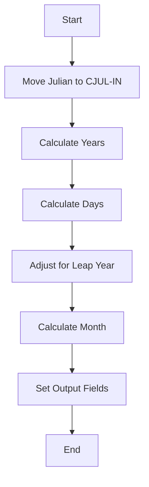
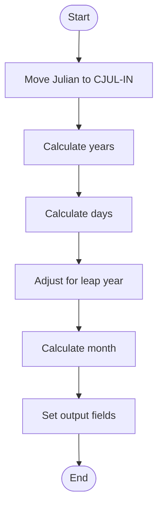
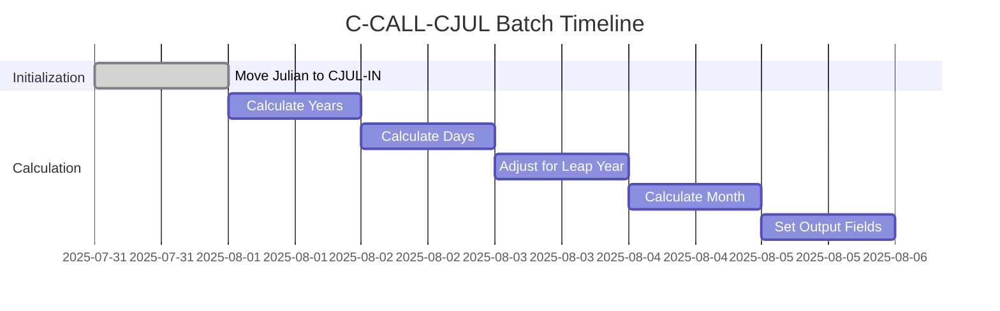
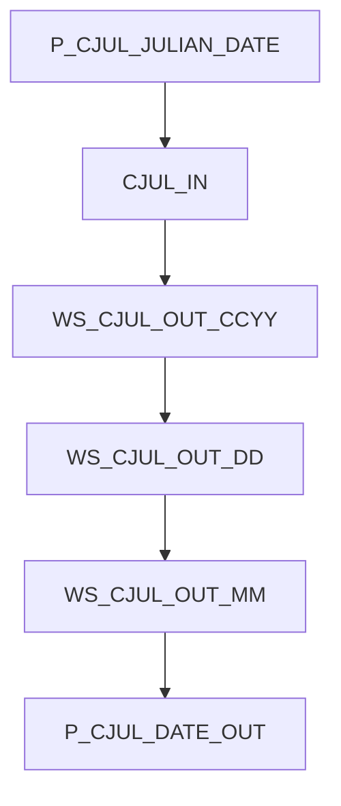

# C-CALL-CJUL Program Documentation

**Location:** APIPAY/APIPAY_Inlined.CBL  
**Generated on:** July 31, 2025  
**Program ID:** C-CALL-CJUL  
**Date Written:** See source comments

## Table of Contents
- [Program Overview](#program-overview)
- [Transaction Types Supported](#transaction-types-supported)
- [Input Parameters](#input-parameters)
- [Output Fields](#output-fields)
- [Program Flow Diagrams](#program-flow-diagrams)
- [Batch or Sequential Process Timeline](#batch-or-sequential-process-timeline)
- [Paragraph-Level Flow Explanation](#paragraph-level-flow-explanation)
- [Data Flow Mapping](#data-flow-mapping)
- [Referenced Programs](#referenced-programs)
- [Error Handling Flow](#error-handling-flow)
- [Error Handling and Validation](#error-handling-and-validation)
- [Common Error Conditions](#common-error-conditions)
- [Technical Implementation](#technical-implementation)
- [Integration Points](#integration-points)
- [File Dependencies](#file-dependencies)
- [Call Graph of PERFORMed Paragraphs](#call-graph-of-performed-paragraphs)

## Program Overview
C-CALL-CJUL converts a Julian date to a Gregorian calendar date (CCYYMMDD format). It handles leap years and month boundaries.

## Transaction Types Supported
- Julian to Gregorian date conversion

## Input Parameters
- `P-CJUL-JULIAN-DATE`: Julian date (number of days since 12/31/1899)

## Output Fields
- `P-CJUL-DATE-OUT`: Gregorian date (CCYYMMDD)

## Program Flow Diagrams
### High-Level Flow

### Detailed Flow

## Batch or Sequential Process Timeline

## Paragraph-Level Flow Explanation
- **C-CALL-CJUL**: Moves Julian date to input, calculates years, days, adjusts for leap year, calculates month, sets output fields.

## Data Flow Mapping

## Referenced Programs
- None (self-contained)

## Error Handling Flow
- Handles invalid Julian dates

## Error Handling and Validation
- Validates input range

## Common Error Conditions
- Julian date out of range

## Technical Implementation
- Uses working-storage fields
- No external file I/O

## Integration Points
- Used by routines requiring Julian to Gregorian conversion

## File Dependencies
- No external files; uses internal paragraphs

## Call Graph of PERFORMed Paragraphs

