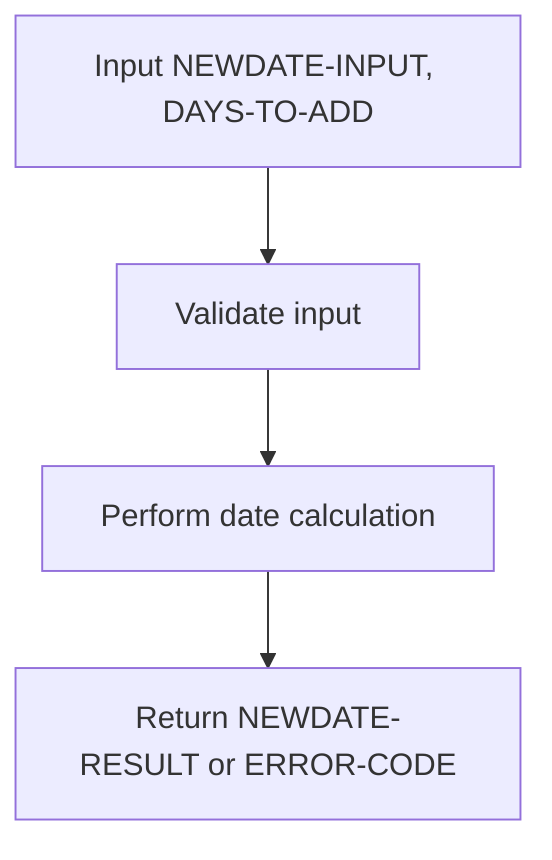
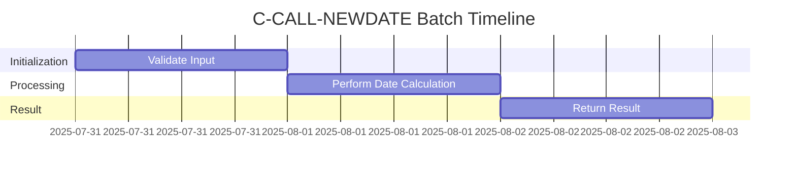
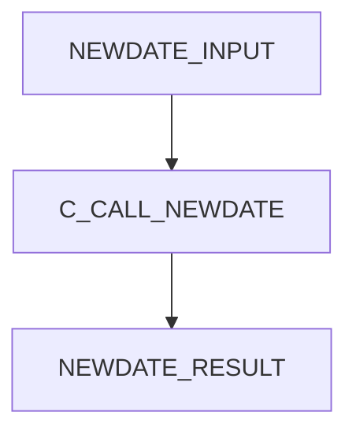
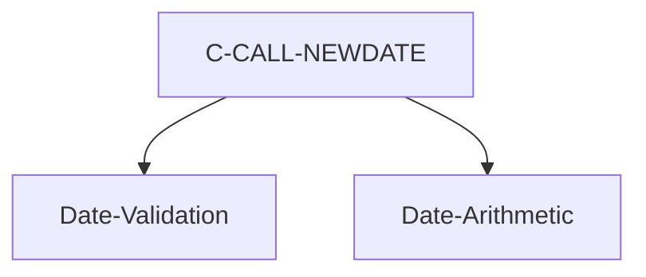

# C-CALL-NEWDATE COBOL Utility Documentation

**Location:** ./APIPAY_Inlined.CBL  
**Generated on:** July 31, 2025  
**Program ID:** C-CALL-NEWDATE  
**Date Written:** See Revision History

## Table of Contents
1. [Program Overview](#program-overview)
2. [Input Parameters](#input-parameters)
3. [Output Fields](#output-fields)
4. [Program Flow Diagram](#program-flow-diagram)
5. [Batch or Sequential Process Timeline](#batch-or-sequential-process-timeline)
6. [Paragraph-Level Flow Explanation](#paragraph-level-flow-explanation)
7. [Data Flow Mapping](#data-flow-mapping)
8. [Referenced Programs](#referenced-programs)
9. [Error Handling and Validation](#error-handling-and-validation)
10. [Common Error Conditions](#common-error-conditions)
11. [Technical Implementation](#technical-implementation)
12. [Integration Points](#integration-points)
13. [File Dependencies](#file-dependencies)
14. [Call Graph of PERFORMed Paragraphs](#call-graph-of-performed-paragraphs)
15. [Revision History](#revision-history)

## Program Overview

**C-CALL-NEWDATE** is a COBOL utility routine in `APIPAY_Inlined.CBL` for advanced date calculations, including date addition, subtraction, and validation. It supports business logic requiring manipulation of dates for payment schedules, due dates, and period calculations.

## Input Parameters
- **NEWDATE-INPUT**: Input date (CCYYMMDD) for calculation.
- **DAYS-TO-ADD**: Number of days to add or subtract.

## Output Fields
- **NEWDATE-RESULT**: Resulting date (CCYYMMDD) after calculation.
- **ERROR-CODE**: Error code if calculation fails.

## Program Flow Diagram

## Batch or Sequential Process Timeline

## Paragraph-Level Flow Explanation
- **C-CALL-NEWDATE**: Validates input, performs date arithmetic, returns result or error.

## Data Flow Mapping

## Referenced Programs
- None (internal logic)

## Error Handling and Validation
- Validates input date format and range
- Returns error code for invalid input or calculation overflow

## Common Error Conditions
- Invalid date input
- Date calculation out of range

## Technical Implementation
- Uses working-storage fields
- No external file I/O

## Integration Points
- Used by payment and scheduling routines

## File Dependencies
- No external files; uses internal paragraphs

## Call Graph of PERFORMed Paragraphs

## Revision History
- 2025-07-31: Initial documentation generated.
