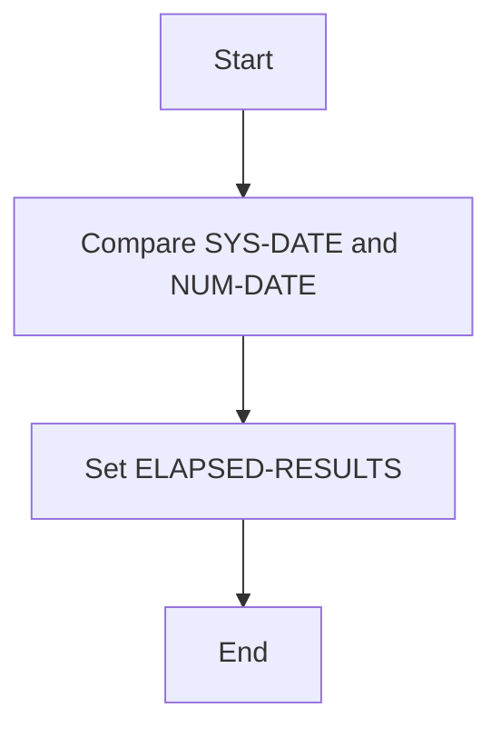
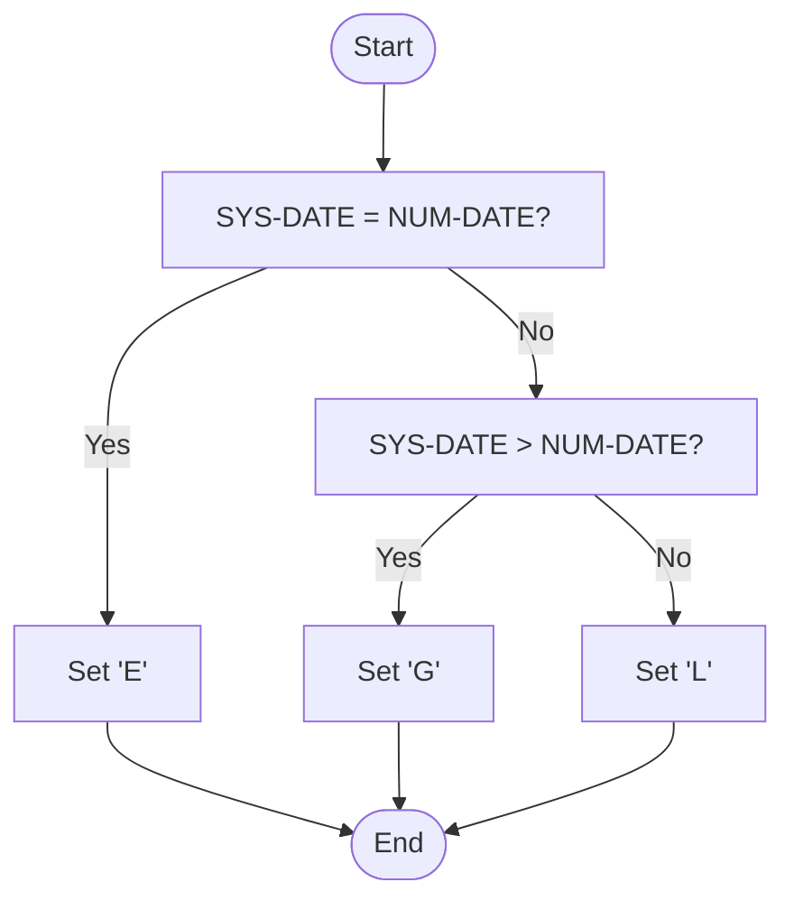
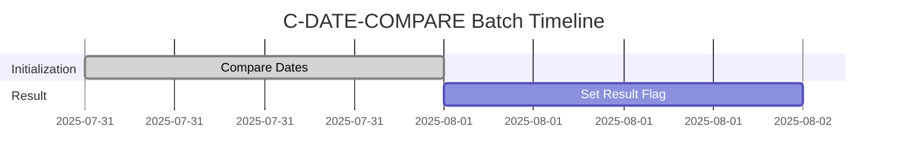
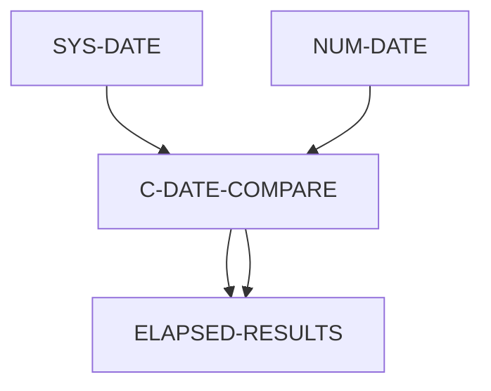
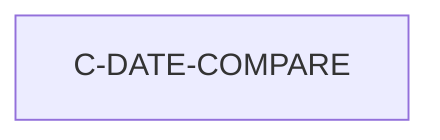

# C-DATE-COMPARE Program Documentation

**Location:** APIPAY/APIPAY_Inlined.CBL  
**Generated on:** July 31, 2025  
**Program ID:** C-DATE-COMPARE  
**Date Written:** See source comments

## Table of Contents
- [Program Overview](#program-overview)
- [Transaction Types Supported](#transaction-types-supported)
- [Input Parameters](#input-parameters)
- [Output Fields](#output-fields)
- [Program Flow Diagrams](#program-flow-diagrams)
- [Batch or Sequential Process Timeline](#batch-or-sequential-process-timeline)
- [Paragraph-Level Flow Explanation](#paragraph-level-flow-explanation)
- [Data Flow Mapping](#data-flow-mapping)
- [Referenced Programs](#referenced-programs)
- [Error Handling Flow](#error-handling-flow)
- [Error Handling and Validation](#error-handling-and-validation)
- [Common Error Conditions](#common-error-conditions)
- [Technical Implementation](#technical-implementation)
- [Integration Points](#integration-points)
- [File Dependencies](#file-dependencies)
- [Call Graph of PERFORMed Paragraphs](#call-graph-of-performed-paragraphs)

## Program Overview
C-DATE-COMPARE compares two dates and sets a result flag to indicate if the first date is less than, greater than, or equal to the second. It handles zero dates and special cases for legacy compatibility.

## Transaction Types Supported
- Date comparison

## Input Parameters
- `SYS-DATE`: System date (CCYYMMDD)
- `NUM-DATE`: Date to compare (CCYYMMDD)

## Output Fields
- `ELAPSED-RESULTS`: 'E' (equal), 'G' (greater), 'L' (less)

## Program Flow Diagrams
### High-Level Flow

### Detailed Flow

## Batch or Sequential Process Timeline

## Paragraph-Level Flow Explanation
- **C-DATE-COMPARE**: Compares SYS-DATE and NUM-DATE, sets ELAPSED-RESULTS to 'E', 'G', or 'L'.

## Data Flow Mapping

## Referenced Programs
- None (self-contained)

## Error Handling Flow
- Handles zero dates and legacy special cases

## Error Handling and Validation
- Validates input dates
- Ensures correct result for all cases

## Common Error Conditions
- Both dates zero
- Invalid date formats

## Technical Implementation
- Uses working-storage fields
- No external file I/O

## Integration Points
- Used by routines requiring date comparison

## File Dependencies
- No external files; uses internal paragraphs

## Call Graph of PERFORMed Paragraphs

