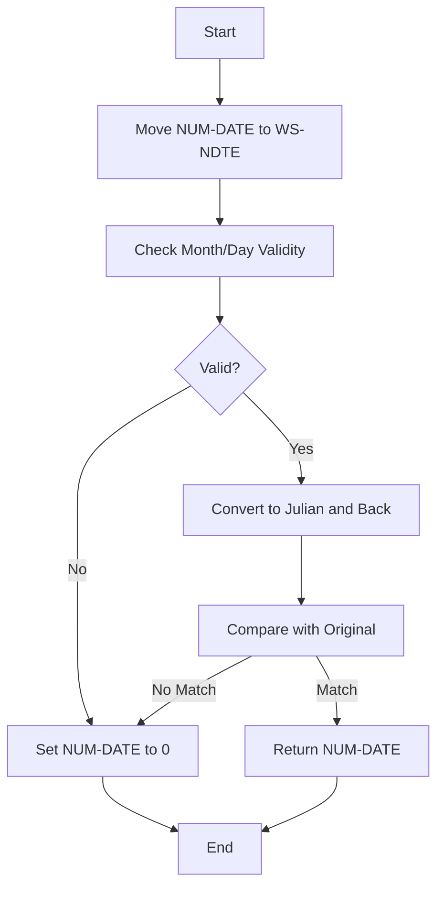
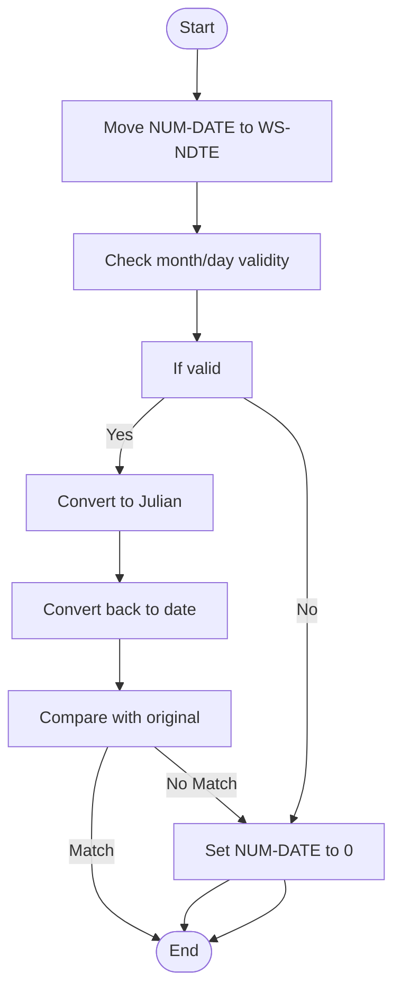
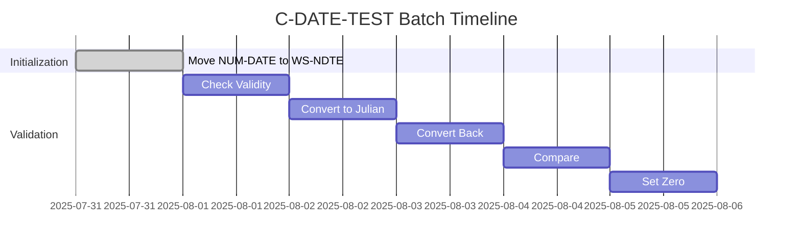
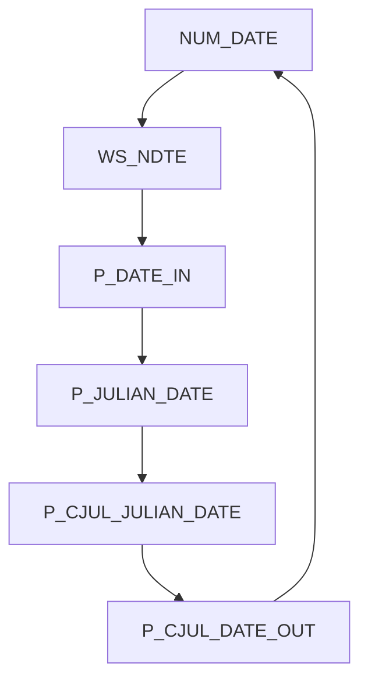
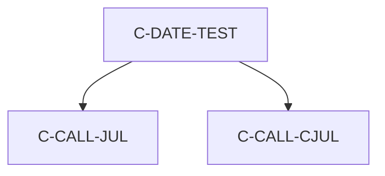

# C-DATE-TEST Program Documentation

**Location:** APIPAY/APIPAY_Inlined.CBL  
**Generated on:** July 31, 2025  
**Program ID:** C-DATE-TEST  
**Date Written:** See source comments

## Table of Contents
- [Program Overview](#program-overview)
- [Transaction Types Supported](#transaction-types-supported)
- [Input Parameters](#input-parameters)
- [Output Fields](#output-fields)
- [Program Flow Diagrams](#program-flow-diagrams)
- [Batch or Sequential Process Timeline](#batch-or-sequential-process-timeline)
- [Paragraph-Level Flow Explanation](#paragraph-level-flow-explanation)
- [Data Flow Mapping](#data-flow-mapping)
- [Referenced Programs](#referenced-programs)
- [Error Handling Flow](#error-handling-flow)
- [Error Handling and Validation](#error-handling-and-validation)
- [Common Error Conditions](#common-error-conditions)
- [Technical Implementation](#technical-implementation)
- [Integration Points](#integration-points)
- [File Dependencies](#file-dependencies)
- [Call Graph of PERFORMed Paragraphs](#call-graph-of-performed-paragraphs)

## Program Overview
C-DATE-TEST validates a date in CCYYMMDD format. If the date is valid, it returns the same date; otherwise, it returns 0. It uses Julian conversion to check validity.

## Transaction Types Supported
- Date validation

## Input Parameters
- `NUM-DATE`: Date to validate (CCYYMMDD)

## Output Fields
- `NUM-DATE`: Validated date (CCYYMMDD or 0)

## Program Flow Diagrams
### High-Level Flow

### Detailed Flow

## Batch or Sequential Process Timeline

## Paragraph-Level Flow Explanation
- **C-DATE-TEST**: Moves NUM-DATE to WS-NDTE, checks validity, converts to Julian and back, compares, and sets NUM-DATE to 0 if invalid.

## Data Flow Mapping

## Referenced Programs
- C-CALL-JUL (internal)
- C-CALL-CJUL (internal)

## Error Handling Flow
- Sets NUM-DATE to 0 if invalid

## Error Handling and Validation
- Checks month and day validity
- Ensures round-trip conversion matches

## Common Error Conditions
- Invalid month or day
- Non-matching conversion

## Technical Implementation
- Uses working-storage fields
- No external file I/O

## Integration Points
- Used by routines requiring date validation

## File Dependencies
- No external files; uses internal paragraphs

## Call Graph of PERFORMed Paragraphs

