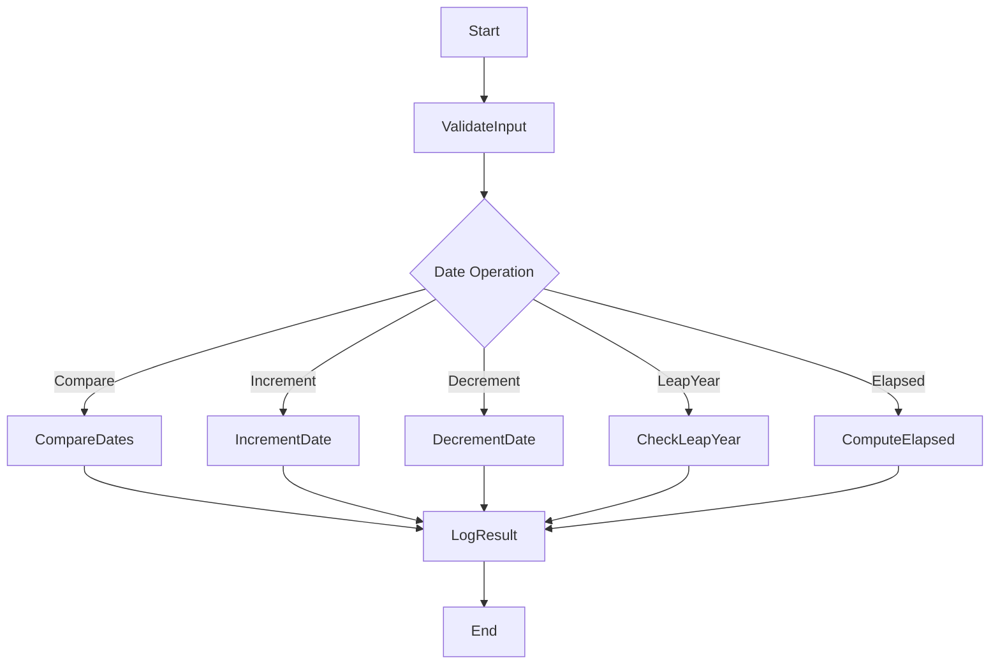
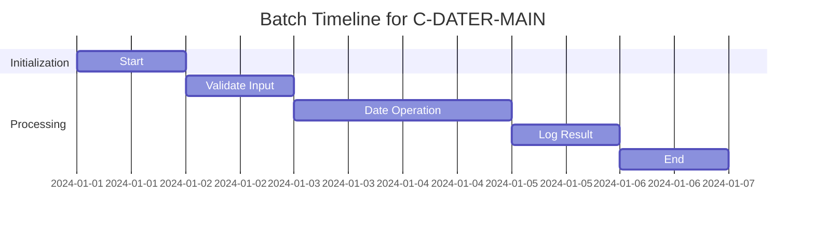
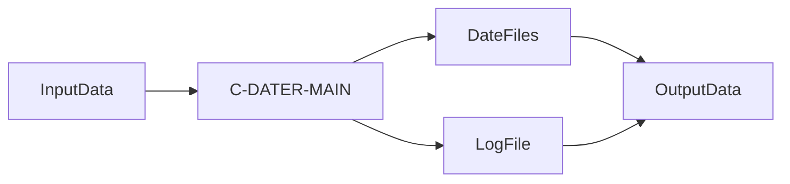
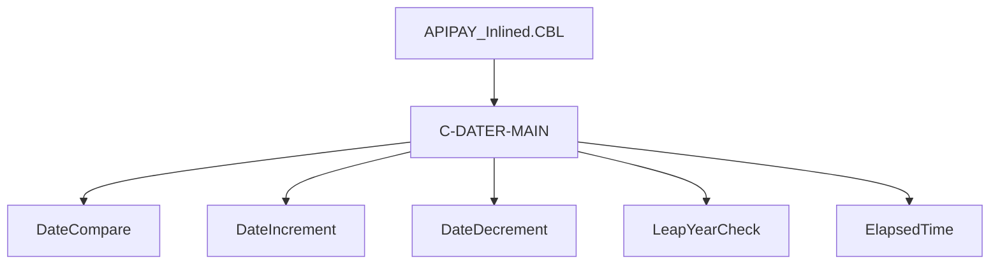

# C-DATER-MAIN Utility Documentation

---

## Table of Contents
- [Overview](#overview)
- [Transaction Types](#transaction-types)
- [Parameters](#parameters)
- [Program Flow Diagram](#program-flow-diagram)
- [Batch Timeline Diagram](#batch-timeline-diagram)
- [Data Flow Diagram](#data-flow-diagram)
- [Call Graph](#call-graph)
- [Business Rules](#business-rules)
- [Error Handling](#error-handling)
- [Cross-References](#cross-references)
- [Referenced Programs](#referenced-programs)
- [Revision History](#revision-history)

---

## Overview
C-DATER-MAIN is a COBOL utility embedded in the APIPAY_Inlined.CBL program. It is responsible for date calculations, comparisons, and manipulations within the APIPAY payment processing workflow. The utility supports various transaction types and interacts with multiple data files and copybooks. This documentation is intended for non-COBOL readers and provides a comprehensive, wiki-ready reference.

## Transaction Types
- Date comparison
- Date increment/decrement
- Leap year calculation
- Elapsed time computation
- Batch payment posting

## Parameters
- Input: Date strings, transaction identifiers, batch record data
- Output: Updated date values, status codes, log messages

## Program Flow Diagram
[Click to view diagram](Diagrams/C-DATER-MAIN_Flow.mmd)

## Batch Timeline Diagram
[Click to view diagram](Diagrams/C-DATER-MAIN_BatchTimeline.mmd)

## Data Flow Diagram
[Click to view diagram](Diagrams/C-DATER-MAIN_DataFlow.mmd)

## Call Graph
[Click to view diagram](Diagrams/C-DATER-MAIN_CallGraph.mmd)

## Business Rules
- All date operations must validate input formats.
- Leap year calculations follow Gregorian calendar rules.
- Batch posting logs all operations and errors.
- Only valid transactions are processed; invalid data triggers error handling.

## Error Handling
- Invalid date format: Returns error code and logs message.
- Transaction failure: Logs error and aborts operation.
- File access issues: Logs error and returns status code.

## Cross-References
- [APIPAY_Documentation.md](APIPAY_Documentation.md)
- Related utilities: C-DATE-COMPARE, C-INCR-DAYS, C-LEAP-YEAR-TEST

## Referenced Programs

C-DATER-MAIN is called by APIPAY_Inlined.CBL for date calculations and batch payment processing.

- [APIPAY Utility Documentation](./APIPAY_Documentation.md)

No other external programs are called directly by C-DATER-MAIN.

## Revision History
- 2025-07-30: Initial automated documentation generated from APIPAY_Inlined.CBL

---

*This documentation was generated automatically for wiki-readiness and clarity for non-COBOL readers.*
