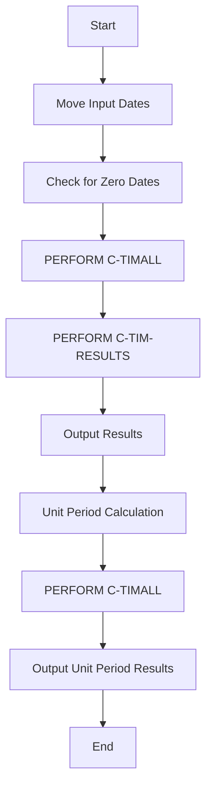
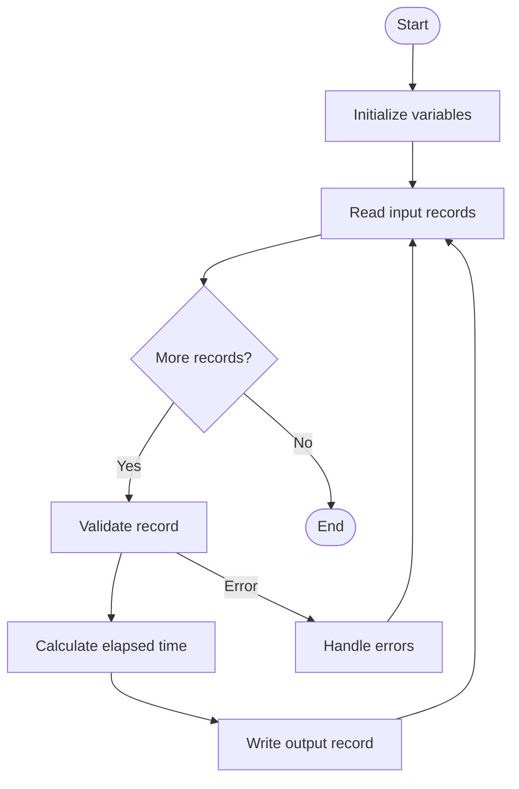
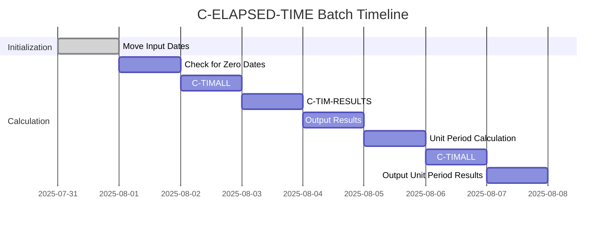
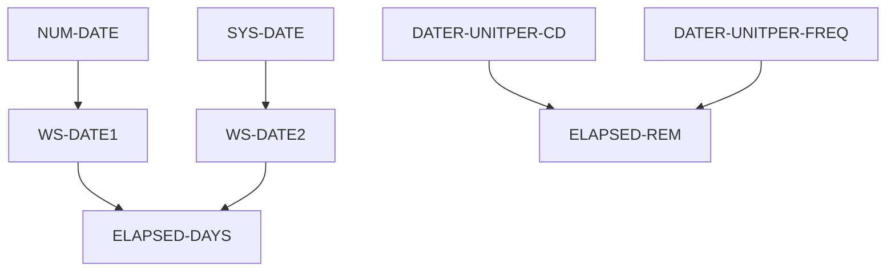
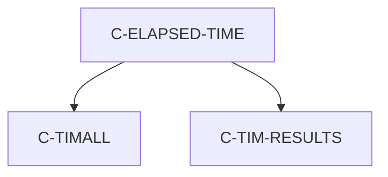

# C-ELAPSED-TIME Program Documentation

---
Location: APIPAY_Inlined.CBL
Generated on: 2025-07-31
Program ID: C-ELAPSED-TIME
Written: Extract the author and date from the source code comments if available. If not present, indicate "See source comments" or leave blank.
---

## Table of Contents
- [Program Overview](#program-overview)
- [Transaction Types Supported](#transaction-types-supported)
- [Input Parameters](#input-parameters)
- [Output Fields](#output-fields)
- [Program Flow Diagrams](#program-flow-diagrams)
- [Batch or Sequential Process Timeline](#batch-or-sequential-process-timeline)
- [Paragraph-Level Flow Explanation](#paragraph-level-flow-explanation)
- [Data Flow Mapping](#data-flow-mapping)
- [Referenced Programs](#referenced-programs)
- [Error Handling Flow](#error-handling-flow)
- [Error Handling and Validation](#error-handling-and-validation)
- [Common Error Conditions](#common-error-conditions)
- [Technical Implementation](#technical-implementation)
- [Integration Points](#integration-points)
- [File Dependencies](#file-dependencies)
- [Call Graph of PERFORMed Paragraphs](#call-graph-of-performed-paragraphs)

## Program Overview
C-ELAPSED-TIME computes elapsed time between two dates, supporting multiple year types and unit period codes. It handles leap years, zero dates, and outputs elapsed months, days, and results.

## Transaction Types Supported
- Elapsed time calculation (multiple year types)

## Input Parameters
- `NUM-DATE`, `SYS-DATE`: Input dates
- `DATER-UNITPER-CD`, `DATER-UNITPER-FREQ`: Unit period code and frequency

## Output Fields
- `ELAPSED-DAYS`, `ELAPSED-MONTHS`, `ELAPSED-REM`, `ELAPSED-RESULTS`: Elapsed values and result code

## Program Flow Diagrams
### High-Level Flow

### Detailed Flow

## Batch or Sequential Process Timeline

## Paragraph-Level Flow Explanation
- **Move Input Dates**: Loads input dates into working variables.
- **Check for Zero Dates**: Handles special case for zero dates.
- **PERFORM C-TIMALL**: Calculates elapsed time based on year type.
- **PERFORM C-TIM-RESULTS**: Computes result code.
- **Output Results**: Moves results to output fields.
- **Unit Period Calculation**: Handles unit period code/frequency logic.

## Data Flow Mapping

## Referenced Programs
- C-TIMALL (internal)
- C-TIM-RESULTS (internal)

## Error Handling Flow
- Handles zero dates
- Validates input fields

## Error Handling and Validation
- Validates input date fields
- Ensures correct year type logic

## Common Error Conditions
- Zero or invalid date
- Incorrect year type

## Technical Implementation
- Uses working-storage fields
- No external file I/O
- Key algorithms: elapsed time calculation, unit period logic

## Integration Points
- Used by other date calculation routines

## File Dependencies
- No external files; uses internal paragraphs

## Call Graph of PERFORMed Paragraphs

