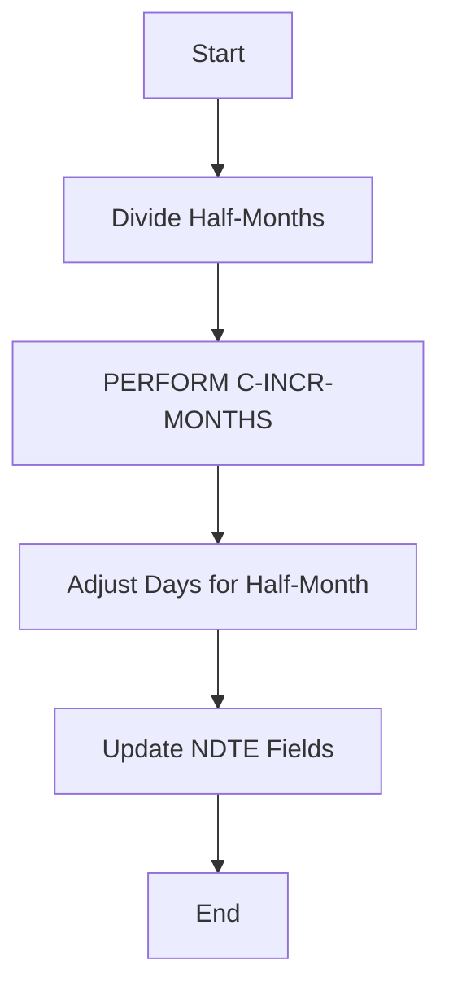
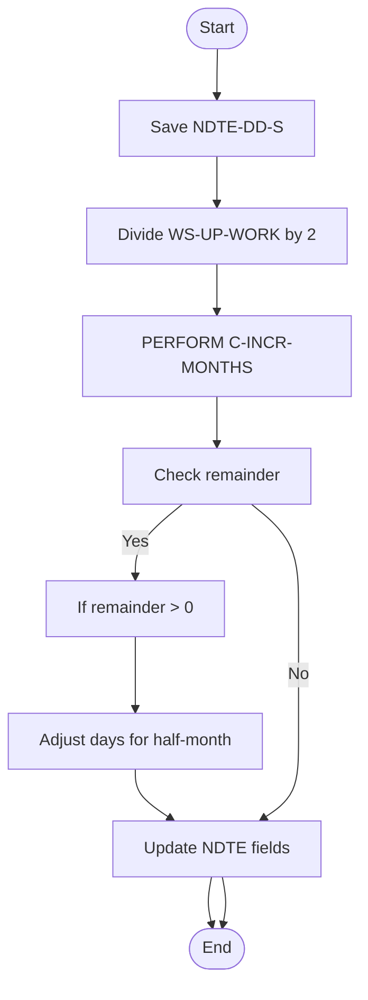
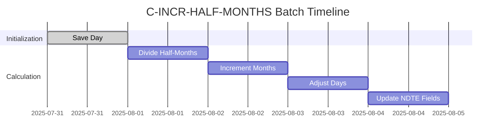
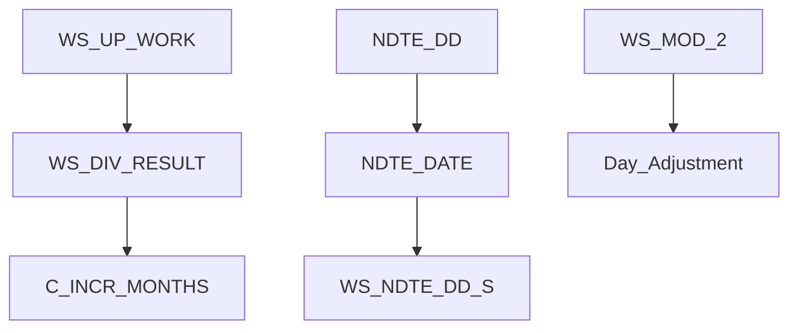
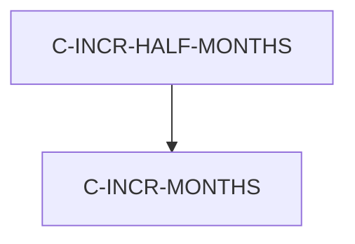

# C-INCR-HALF-MONTHS Program Documentation

**Location:** APIPAY/APIPAY_Inlined.CBL  
**Generated on:** July 31, 2025  
**Program ID:** C-INCR-HALF-MONTHS  
**Date Written:** See source comments

## Table of Contents
- [Program Overview](#program-overview)
- [Transaction Types Supported](#transaction-types-supported)
- [Input Parameters](#input-parameters)
- [Output Fields](#output-fields)
- [Program Flow Diagrams](#program-flow-diagrams)
- [Batch or Sequential Process Timeline](#batch-or-sequential-process-timeline)
- [Paragraph-Level Flow Explanation](#paragraph-level-flow-explanation)
- [Data Flow Mapping](#data-flow-mapping)
- [Referenced Programs](#referenced-programs)
- [Error Handling Flow](#error-handling-flow)
- [Error Handling and Validation](#error-handling-and-validation)
- [Common Error Conditions](#common-error-conditions)
- [Technical Implementation](#technical-implementation)
- [Integration Points](#integration-points)
- [File Dependencies](#file-dependencies)
- [Call Graph of PERFORMed Paragraphs](#call-graph-of-performed-paragraphs)

## Program Overview
C-INCR-HALF-MONTHS increments a date by a number of half-months. It uses C-INCR-MONTHS for full months and adjusts days for half-month increments, handling both positive and negative increments.

## Transaction Types Supported
- Date increment by half-months

## Input Parameters
- `NDTE-DATE`: Date to increment (CCYYMMDD)
- `WS-UP-WORK`: Number of half-months to increment

## Output Fields
- `NDTE-DATE`: Incremented date (CCYYMMDD)

## Program Flow Diagrams
### High-Level Flow

### Detailed Flow

## Batch or Sequential Process Timeline

## Paragraph-Level Flow Explanation
- **C-INCR-HALF-MONTHS**: Divides half-months, calls C-INCR-MONTHS, and adjusts days for half-month increments.
- **C-INCR-MONTHS**: Handles full month increments.

## Data Flow Mapping

## Referenced Programs
- C-INCR-MONTHS (internal)

## Error Handling Flow
- Handles positive and negative increments
- Adjusts for day overflow/underflow

## Error Handling and Validation
- Validates day fields after adjustment

## Common Error Conditions
- Invalid input date
- Day out of range after adjustment

## Technical Implementation
- Uses working-storage fields
- No external file I/O

## Integration Points
- Used by routines requiring half-month arithmetic

## File Dependencies
- No external files; uses internal paragraphs

## Call Graph of PERFORMed Paragraphs

