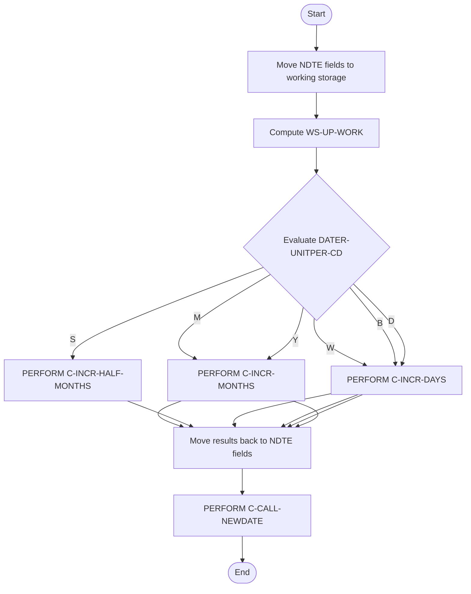

# C-INCREMENT-PERIODS Program Documentation

---
Location: APIPAY_Inlined.CBL
Generated on: 2025-07-31
Program ID: C-INCREMENT-PERIODS
Written: Extract the author and date from the source code comments if available. If not present, indicate "See source comments" or leave blank.
---

## Table of Contents
- [Program Overview](#program-overview)
- [Transaction Types Supported](#transaction-types-supported)
- [Input Parameters](#input-parameters)
- [Output Fields](#output-fields)
- [Program Flow Diagrams](#program-flow-diagrams)
- [Batch or Sequential Process Timeline](#batch-or-sequential-process-timeline)
- [Paragraph-Level Flow Explanation](#paragraph-level-flow-explanation)
- [Data Flow Mapping](#data-flow-mapping)
- [Referenced Programs](#referenced-programs)
- [Error Handling Flow](#error-handling-flow)
- [Error Handling and Validation](#error-handling-and-validation)
- [Common Error Conditions](#common-error-conditions)
- [Technical Implementation](#technical-implementation)
- [Integration Points](#integration-points)
- [File Dependencies](#file-dependencies)
- [Call Graph of PERFORMed Paragraphs](#call-graph-of-performed-paragraphs)

## Program Overview
C-INCREMENT-PERIODS increments a date by a specified number of periods (months, days, years, etc.) based on input codes and frequency. It supports multiple period types and calls the appropriate increment routine.

## Transaction Types Supported
- Date increment by period (month, day, year, week, half-month, bi-week)

## Input Parameters
- `DATER-UNITPER-CD`: Period code (M, D, Y, S, W, B)
- `DATER-UNITPER-FREQ`: Frequency
- `NDTE-DATE`: Date to increment
- `NDTE-HOLD`: Increment value

## Output Fields
- `NDTE-DATE`: Incremented date

## Program Flow Diagrams
### High-Level Flow

### Detailed Flow

## Batch or Sequential Process Timeline

## Paragraph-Level Flow Explanation
- **Move Input Fields**: Loads input fields into working variables.
- **Compute Increment Value**: Calculates increment value.
- **Evaluate Period Code**: Determines which increment routine to call.
- **PERFORM Appropriate Increment Routine**: Calls the correct routine (months, days, etc.).
- **Move Results to Output**: Moves incremented date to output.
- **PERFORM C-CALL-NEWDATE**: Finalizes the incremented date.

## Data Flow Mapping

## Referenced Programs
- C-INCR-MONTHS (internal)
- C-INCR-HALF-MONTHS (internal)
- C-INCR-DAYS (internal)
- C-CALL-NEWDATE (internal)

## Error Handling Flow
- Validates period code and frequency
- Handles invalid input

## Error Handling and Validation
- Validates input fields
- Ensures correct increment logic

## Common Error Conditions
- Invalid period code
- Incorrect increment value

## Technical Implementation
- Uses working-storage fields
- No external file I/O
- Key algorithms: period increment logic

## Integration Points
- Used by other date calculation routines

## File Dependencies
- No external files; uses internal paragraphs

## Call Graph of PERFORMed Paragraphs

