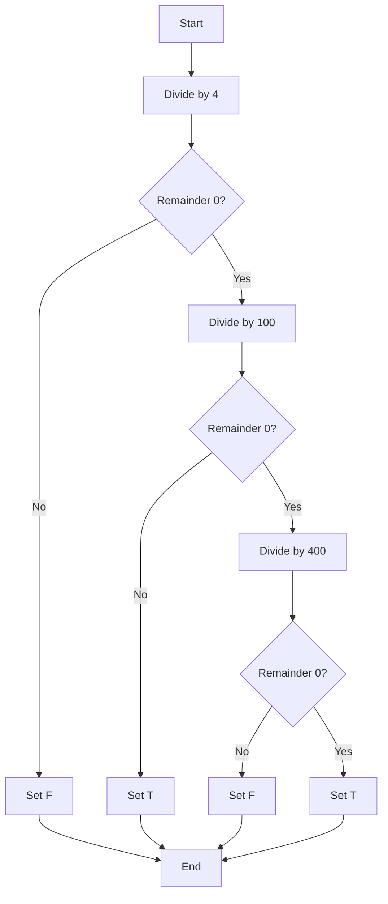
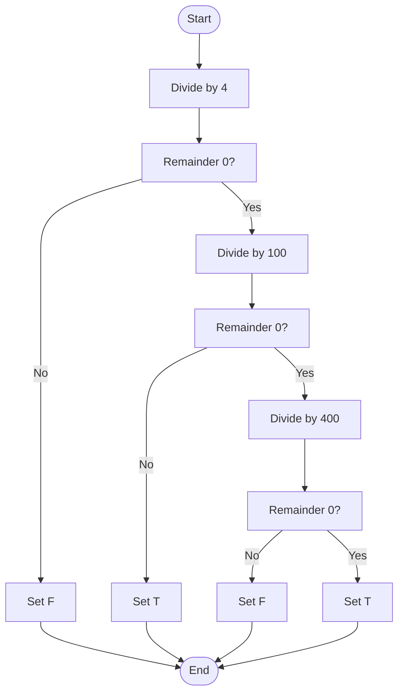
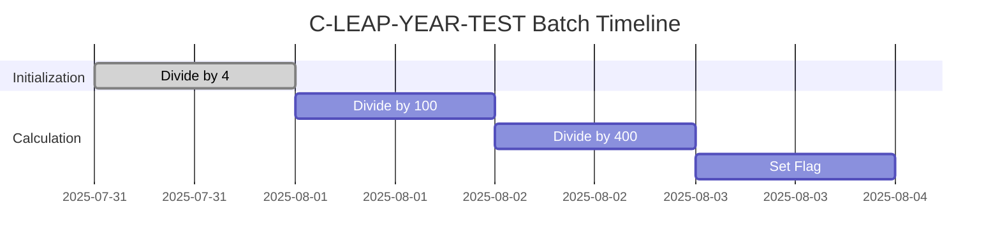
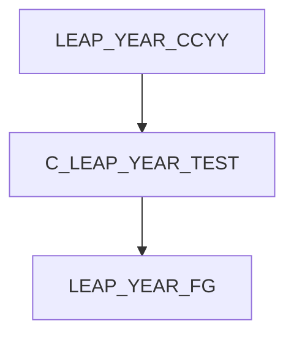

# C-LEAP-YEAR-TEST Program Documentation

**Location:** APIPAY/APIPAY_Inlined.CBL  
**Generated on:** July 31, 2025  
**Program ID:** C-LEAP-YEAR-TEST  
**Date Written:** See source comments

## Table of Contents
- [Program Overview](#program-overview)
- [Transaction Types Supported](#transaction-types-supported)
- [Input Parameters](#input-parameters)
- [Output Fields](#output-fields)
- [Program Flow Diagrams](#program-flow-diagrams)
- [Batch or Sequential Process Timeline](#batch-or-sequential-process-timeline)
- [Paragraph-Level Flow Explanation](#paragraph-level-flow-explanation)
- [Data Flow Mapping](#data-flow-mapping)
- [Referenced Programs](#referenced-programs)
- [Error Handling Flow](#error-handling-flow)
- [Error Handling and Validation](#error-handling-and-validation)
- [Common Error Conditions](#common-error-conditions)
- [Technical Implementation](#technical-implementation)
- [Integration Points](#integration-points)
- [File Dependencies](#file-dependencies)
- [Call Graph of PERFORMed Paragraphs](#call-graph-of-performed-paragraphs)

## Program Overview
C-LEAP-YEAR-TEST determines if a given year is a leap year. It sets a flag to indicate true or false, following standard leap year rules.

## Transaction Types Supported
- Leap year determination

## Input Parameters
- `LEAP-YEAR-CCYY`: Year to test (4 digits)

## Output Fields
- `LEAP-YEAR-FG`: 'T' (true) or 'F' (false)

## Program Flow Diagrams
### High-Level Flow

### Detailed Flow

## Batch or Sequential Process Timeline

## Paragraph-Level Flow Explanation
- **C-LEAP-YEAR-TEST**: Divides year by 4, 100, and 400, sets flag based on remainders.

## Data Flow Mapping

## Referenced Programs
- None (self-contained)

## Error Handling Flow
- Handles non-numeric or invalid years

## Error Handling and Validation
- Ensures year is 4 digits

## Common Error Conditions
- Year not divisible by 4
- Year not 4 digits

## Technical Implementation
- Uses working-storage fields
- No external file I/O

## Integration Points
- Used by routines requiring leap year logic

## File Dependencies
- No external files; uses internal paragraphs

## Call Graph of PERFORMed Paragraphs

