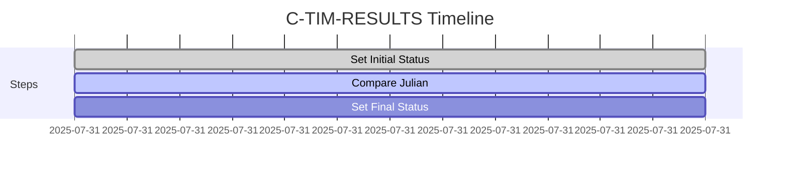
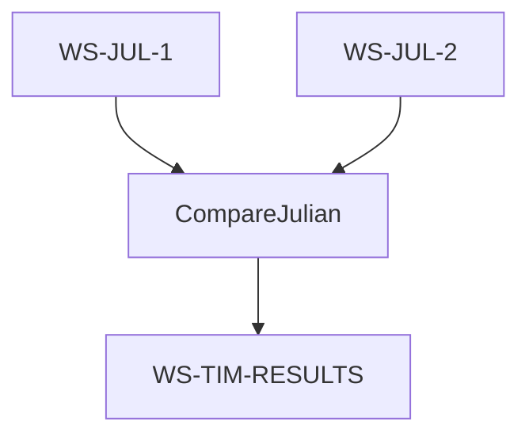
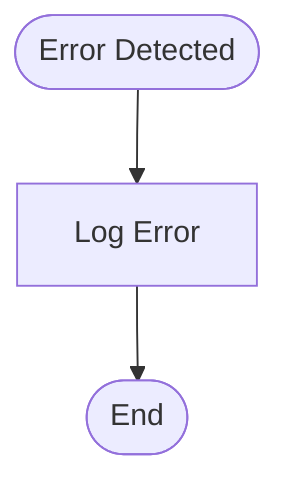
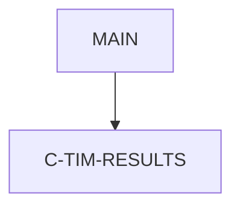

# C-TIM-RESULTS - COBOL Utility Documentation

**Location:** .\APIPAY\APIPAY_Inlined.CBL  
**Generated on:** July 31, 2025  
**Program ID:** C-TIM-RESULTS  
**Written:** [See source comments]

## Table of Contents
1. [Table of Contents](#table-of-contents)
2. [Program Overview](#program-overview)
3. [Transaction Types Supported](#transaction-types-supported)
4. [Input Parameters](#input-parameters)
5. [Output Fields](#output-fields)
6. [Program Flow Diagrams](#program-flow-diagrams)
7. [Batch or Sequential Process Timeline](#batch-or-sequential-process-timeline)
8. [Paragraph-Level Flow Explanation](#paragraph-level-flow-explanation)
9. [Data Flow Mapping](#data-flow-mapping)
10. [Referenced Programs](#referenced-programs)
11. [Error Handling Flow](#error-handling-flow)
12. [Error Handling and Validation](#error-handling-and-validation)
13. [Common Error Conditions](#common-error-conditions)
14. [Technical Implementation](#technical-implementation)
15. [Integration Points](#integration-points)
16. [File Dependencies](#file-dependencies)
17. [Call Graph of PERFORMed Paragraphs](#call-graph-of-performed-paragraphs)

---

## Program Overview
C-TIM-RESULTS is a COBOL utility section that sets the result status for time calculations. It compares Julian dates and sets WS-TIM-RESULTS to indicate whether the second date is greater, less, or equal to the first. This status is used for further processing in batch routines.

---

## Transaction Types Supported
- Time result status calculation

---

## Input Parameters
- WS-JUL-1
- WS-JUL-2

---

## Output Fields
- WS-TIM-RESULTS

---

## Program Flow Diagrams
### High-Level Flow
```mermaid
graph TD
    Start([Start]) --> SetL[Set WS-TIM-RESULTS to "L"]
    SetL --> CompareJulian[Compare WS-JUL-2 to WS-JUL-1]
    CompareJulian --> SetG[Set "G" if WS-JUL-2 > WS-JUL-1]
    CompareJulian --> SetE[Set "E" if WS-JUL-2 = WS-JUL-1]
    SetG --> End([End])
    SetE --> End([End])
```

---

## Batch or Sequential Process Timeline


---

## Paragraph-Level Flow Explanation
- **Set WS-TIM-RESULTS to "L":** Initializes result status.
- **Compare WS-JUL-2 to WS-JUL-1:** Compares Julian dates.
- **Set "G" or "E":** Updates status based on comparison.

---

## Data Flow Mapping


---

## Referenced Programs
- [APIPAY](APIPAY_Documentation.md): Main batch payment processor

---

## Error Handling Flow


---

## Error Handling and Validation
- Validates Julian date values
- Handles edge cases for equal dates

---

## Common Error Conditions
- Invalid Julian date values

---

## Technical Implementation
- **Data Structures:** WS-JUL-1, WS-JUL-2, WS-TIM-RESULTS
- **File Handling:** None
- **Key Algorithms:** Julian date comparison

---

## Integration Points
- Used by batch routines in APIPAY

---

## File Dependencies
- Input: WS-JUL-1, WS-JUL-2
- Output: WS-TIM-RESULTS
- Copybooks: None

---

## Call Graph of PERFORMed Paragraphs


---

*For further details, see the APIPAY documentation and embedded diagrams.*
