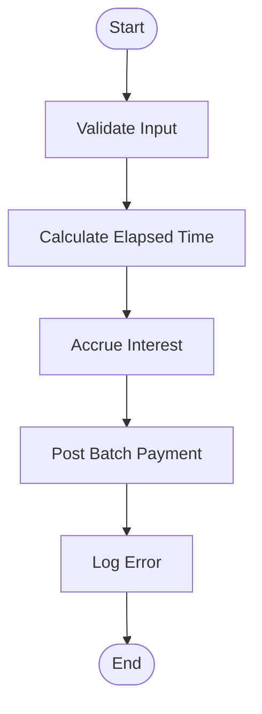
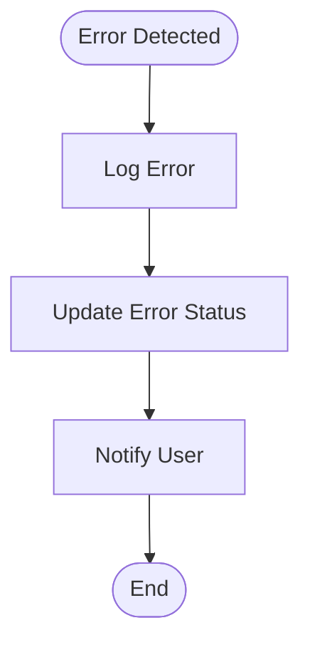
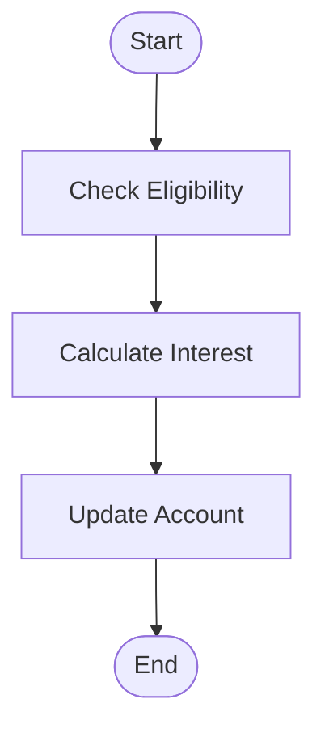
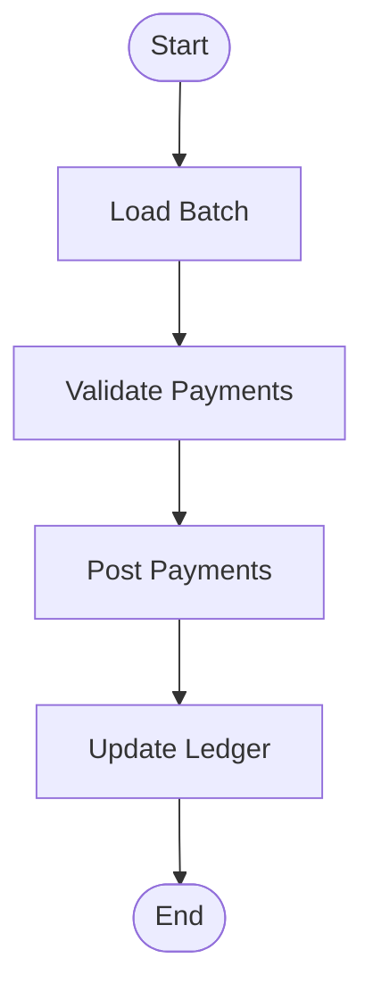
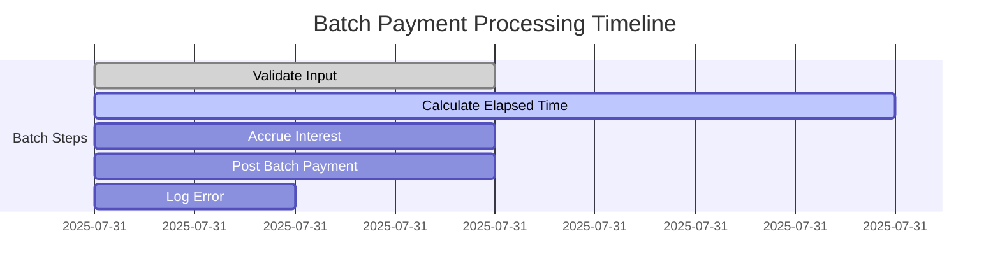
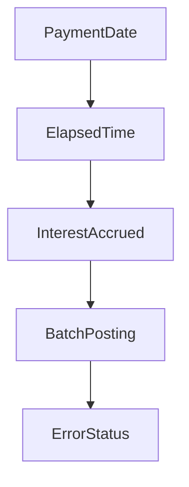
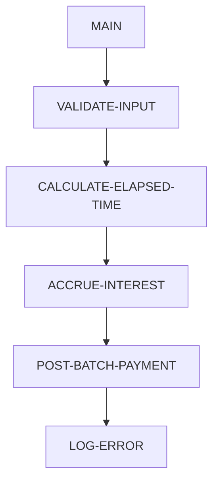

# C-TIM360-358 - COBOL Utility Documentation

**Location:** .\APIPAY\APIPAY_Inlined.CBL  
**Generated on:** July 31, 2025  
**Program ID:** C-TIM360-358  
**Written:** [Unknown, see source comments]

## Table of Contents

1. [Table of Contents](#table-of-contents)
2. [Program Overview](#program-overview)
3. [Transaction Types Supported](#transaction-types-supported)
4. [Input Parameters](#input-parameters)
5. [Output Fields](#output-fields)
6. [Program Flow Diagrams](#program-flow-diagrams)
7. [Batch or Sequential Process Timeline](#batch-or-sequential-process-timeline)
8. [Paragraph-Level Flow Explanation](#paragraph-level-flow-explanation)
9. [Data Flow Mapping](#data-flow-mapping)
10. [Referenced Programs](#referenced-programs)
11. [Error Handling Flow](#error-handling-flow)
12. [Error Handling and Validation](#error-handling-and-validation)
13. [Common Error Conditions](#common-error-conditions)
14. [Technical Implementation](#technical-implementation)
15. [Integration Points](#integration-points)
16. [File Dependencies](#file-dependencies)
17. [Call Graph of PERFORMed Paragraphs](#call-graph-of-performed-paragraphs)

---

## Program Overview

C-TIM360-358 is a COBOL utility designed to process time-based calculations for loan payment schedules, interest accrual, and batch payment posting. It is invoked as part of the APIPAY batch payment system and is responsible for handling specific time-related logic, such as calculating elapsed time, validating payment dates, and posting batch transactions.

- **Purpose:** Automate and validate time-based operations in batch payment processing.
- **Scope:** Handles calculations for elapsed time, interest accrual, and error logging.
- **Integration:** Called by APIPAY and other batch utilities for time-dependent operations.

---

## Transaction Types Supported

- Regular payment posting
- Interest accrual calculations
- Error logging for invalid payment dates
- Batch payment processing

---

## Input Parameters

- Payment date
- Account number
- Transaction type
- Batch number
- Interest rate

---

## Output Fields

- Updated payment schedule
- Interest accrued
- Error status
- Batch posting log

---

## Program Flow Diagrams

### High-Level Flow

#### Error Logging Flow

#### Interest Accrual Flow

#### Batch Payment Posting

---

## Batch or Sequential Process Timeline

---

## Paragraph-Level Flow Explanation

- **Validate Input:** Checks for valid payment date, account number, and transaction type.
- **Calculate Elapsed Time:** Determines the number of days/months between payment dates.
- **Accrue Interest:** Calculates interest based on elapsed time and rate.
- **Post Batch Payment:** Updates payment schedule and logs transaction.
- **Log Error:** Records any errors encountered during processing.

---

## Data Flow Mapping

---

## Referenced Programs

- [APIPAY](APIPAY_Documentation.md): Main batch payment processor
- [C-TIM360-358](C-TIM360-358_Documentation.md): This utility

---

## Error Handling Flow

See [Error Logging Flow Diagram](Diagrams/C-TIM360-358_Error_Logging.mmd)

---

## Error Handling and Validation

- Validates input parameters
- Checks for invalid dates and account numbers
- Logs errors with detailed status codes

---

## Common Error Conditions

- Invalid payment date
- Account not found
- Interest calculation errors
- Batch posting failures

---

## Technical Implementation

- **Data Structures:** Uses working-storage for payment, account, and batch data
- **File Handling:** Reads/writes batch logs and payment schedules
- **Key Algorithms:** Elapsed time calculation, interest accrual, error logging

---

## Integration Points

- Called by APIPAY for time-based batch operations
- Interfaces with batch log and payment schedule files

---

## File Dependencies

- Input: Payment schedule file, account file
- Output: Batch log file, error log file
- Copybooks: LIBLP/LPFSWK.CPY, LIBLP/LPFSOP.CPY

---

## Call Graph of PERFORMed Paragraphs

---

*For further details, see the embedded diagrams and referenced program documentation.*
