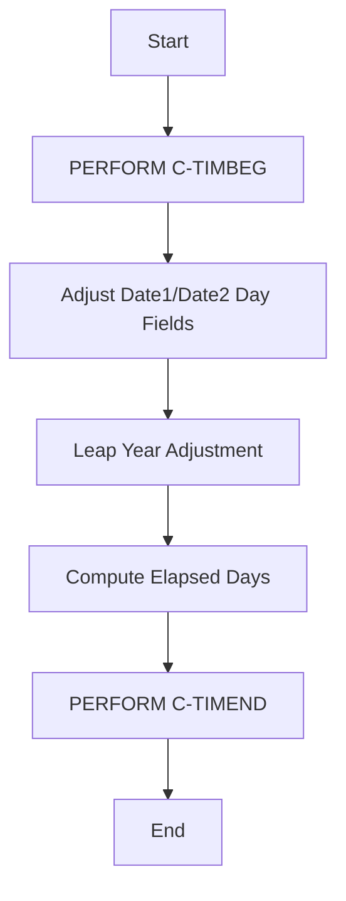
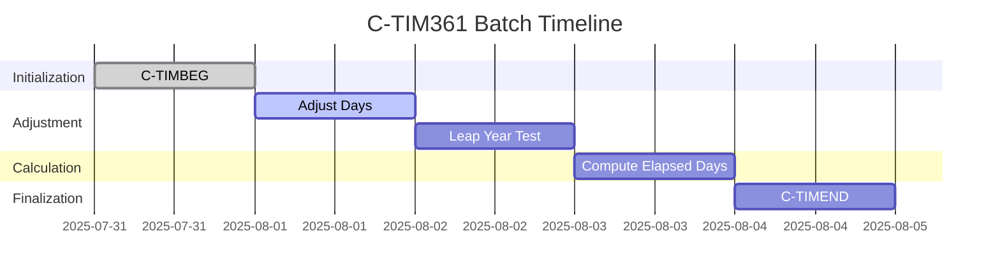
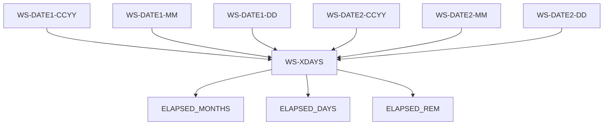
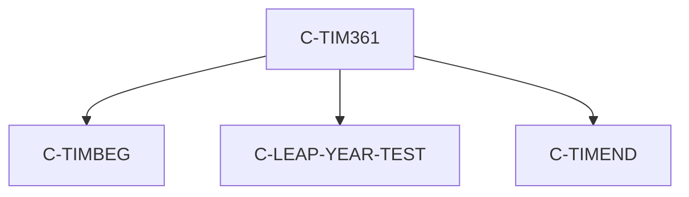

# C-TIM361 Program Documentation

---
**Location:** .\APIPAY_Inlined.CBL  
**Generated on:** July 31, 2025  
**Program ID:** C-TIM361  
**Date Written:** See Source Comments

## Table of Contents
- [Program Overview](#program-overview)
- [Transaction Types Supported](#transaction-types-supported)
- [Input Parameters](#input-parameters)
- [Output Fields](#output-fields)
- [Program Flow Diagrams](#program-flow-diagrams)
- [Batch or Sequential Process Timeline](#batch-or-sequential-process-timeline)
- [Paragraph-Level Flow Explanation](#paragraph-level-flow-explanation)
- [Data Flow Mapping](#data-flow-mapping)
- [Referenced Programs](#referenced-programs)
- [Error Handling Flow](#error-handling-flow)
- [Error Handling and Validation](#error-handling-and-validation)
- [Common Error Conditions](#common-error-conditions)
- [Technical Implementation](#technical-implementation)
- [Integration Points](#integration-points)
- [File Dependencies](#file-dependencies)
- [Call Graph of PERFORMed Paragraphs](#call-graph-of-performed-paragraphs)

## Program Overview
C-TIM361 computes the elapsed time between two dates using a 360-day year convention, adjusting for leap years and month boundaries. It is used in financial calculations where months are standardized to 30 days.

## Transaction Types Supported
- Elapsed time calculation between two dates (360-day year type)

## Input Parameters
- `WS-DATE1-CCYY`, `WS-DATE1-MM`, `WS-DATE1-DD`: Start date (year, month, day)
- `WS-DATE2-CCYY`, `WS-DATE2-MM`, `WS-DATE2-DD`: End date (year, month, day)

## Output Fields
- `WS-XDAYS`: Total elapsed days (360-day year basis)
- `ELAPSED_MONTHS`, `ELAPSED_DAYS`, `ELAPSED_REM`: Derived fields for reporting

## Program Flow Diagrams
### High-Level Flow

### Detailed Flow (see Diagrams/C-TIM361_Detailed.mmd)

## Batch or Sequential Process Timeline

## Paragraph-Level Flow Explanation
- **C-TIMBEG**: Initializes working variables.
- **Adjust Date1/Date2 Day Fields**: Ensures day fields do not exceed 30, handles February edge cases.
- **Leap Year Adjustment**: Calls C-LEAP-YEAR-TEST to adjust for leap years.
- **Compute Elapsed Days**: Calculates elapsed days using the 360-day year formula.
- **C-TIMEND**: Finalizes and outputs results.

## Data Flow Mapping

## Referenced Programs
- C-TIMBEG (internal)
- C-LEAP-YEAR-TEST (internal)
- C-TIMEND (internal)

## Error Handling Flow
- Checks for invalid day values (>30)
- Adjusts for leap year inconsistencies

## Error Handling and Validation
- Validates input date fields
- Ensures leap year logic is applied correctly

## Common Error Conditions
- Day field exceeds valid range
- Incorrect leap year adjustment

## Technical Implementation
- Uses working-storage fields for date manipulation
- No external file I/O
- Key algorithms: 360-day year calculation, leap year adjustment

## Integration Points
- Used by other date calculation routines in APIPAY_Inlined.CBL

## File Dependencies
- No external files; uses internal paragraphs and working-storage

## Call Graph of PERFORMed Paragraphs

