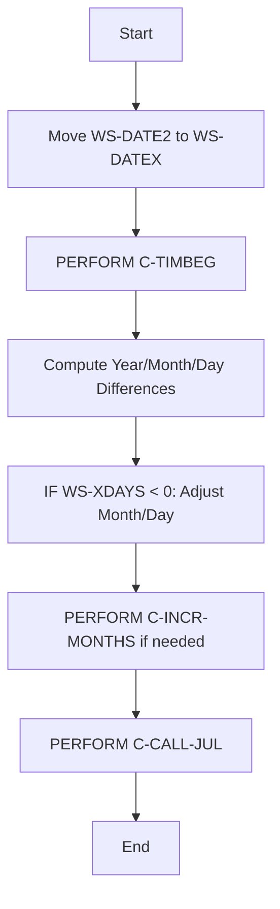
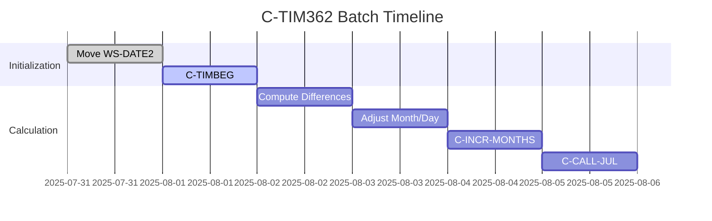
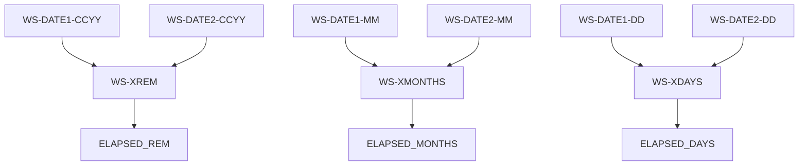
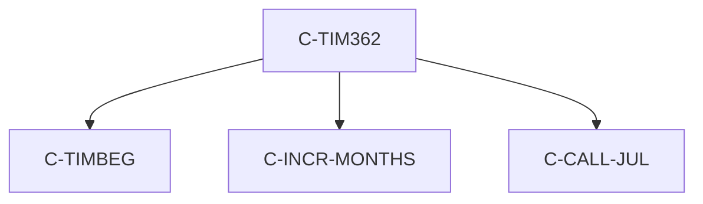

# C-TIM362 Program Documentation

**Location:** .\APIPAY_Inlined.CBL  
**Generated on:** July 31, 2025  
**Program ID:** C-TIM362  
**Date Written:** See Source Comments

## Table of Contents
- [Program Overview](#program-overview)
- [Transaction Types Supported](#transaction-types-supported)
- [Input Parameters](#input-parameters)
- [Output Fields](#output-fields)
- [Program Flow Diagrams](#program-flow-diagrams)
- [Batch or Sequential Process Timeline](#batch-or-sequential-process-timeline)
- [Paragraph-Level Flow Explanation](#paragraph-level-flow-explanation)
- [Data Flow Mapping](#data-flow-mapping)
- [Referenced Programs](#referenced-programs)
- [Error Handling Flow](#error-handling-flow)
- [Error Handling and Validation](#error-handling-and-validation)
- [Common Error Conditions](#common-error-conditions)
- [Technical Implementation](#technical-implementation)
- [Integration Points](#integration-points)
- [File Dependencies](#file-dependencies)
- [Call Graph of PERFORMed Paragraphs](#call-graph-of-performed-paragraphs)

## Program Overview
C-TIM362 computes the elapsed time between two dates using a 362-day year convention, with additional logic for negative day differences and leap year handling. It is used for specialized financial calculations.

## Transaction Types Supported
- Elapsed time calculation between two dates (362-day year type)

## Input Parameters
- `WS-DATE1-CCYY`, `WS-DATE1-MM`, `WS-DATE1-DD`: Start date (year, month, day)
- `WS-DATE2-CCYY`, `WS-DATE2-MM`, `WS-DATE2-DD`: End date (year, month, day)

## Output Fields
- `WS-XREM`: Year difference
- `WS-XMONTHS`: Month difference
- `WS-XDAYS`: Day difference (adjusted)
- `ELAPSED_MONTHS`, `ELAPSED_DAYS`, `ELAPSED_REM`: Derived fields for reporting

## Program Flow Diagrams
### High-Level Flow

### Detailed Flow (see Diagrams/C-TIM362_Detailed.mmd)

## Batch or Sequential Process Timeline

## Paragraph-Level Flow Explanation
- **Move WS-DATE2 to WS-DATEX**: Prepares working date variable.
- **C-TIMBEG**: Initializes working variables.
- **Compute Year/Month/Day Differences**: Calculates differences between input dates.
- **Adjust Month/Day**: Handles negative day differences, adjusts months and days accordingly.
- **PERFORM C-INCR-MONTHS**: Increments months if needed.
- **PERFORM C-CALL-JUL**: Converts date to Julian format for further processing.

## Data Flow Mapping

## Referenced Programs
- C-TIMBEG (internal)
- C-INCR-MONTHS (internal)
- C-CALL-JUL (internal)

## Error Handling Flow
- Handles negative day differences
- Adjusts for leap year inconsistencies

## Error Handling and Validation
- Validates input date fields
- Ensures leap year logic is applied correctly

## Common Error Conditions
- Negative day difference
- Incorrect leap year adjustment

## Technical Implementation
- Uses working-storage fields for date manipulation
- No external file I/O
- Key algorithms: 362-day year calculation, leap year adjustment, Julian date conversion

## Integration Points
- Used by other date calculation routines in APIPAY_Inlined.CBL

## File Dependencies
- No external files; uses internal paragraphs and working-storage

## Call Graph of PERFORMed Paragraphs

