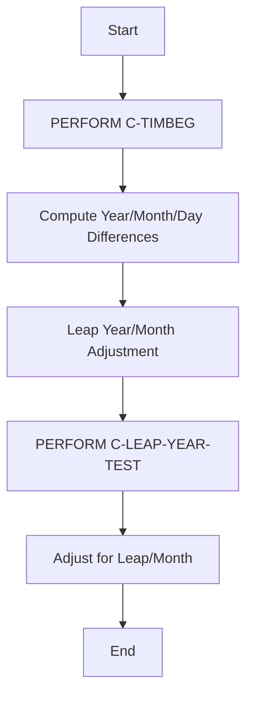
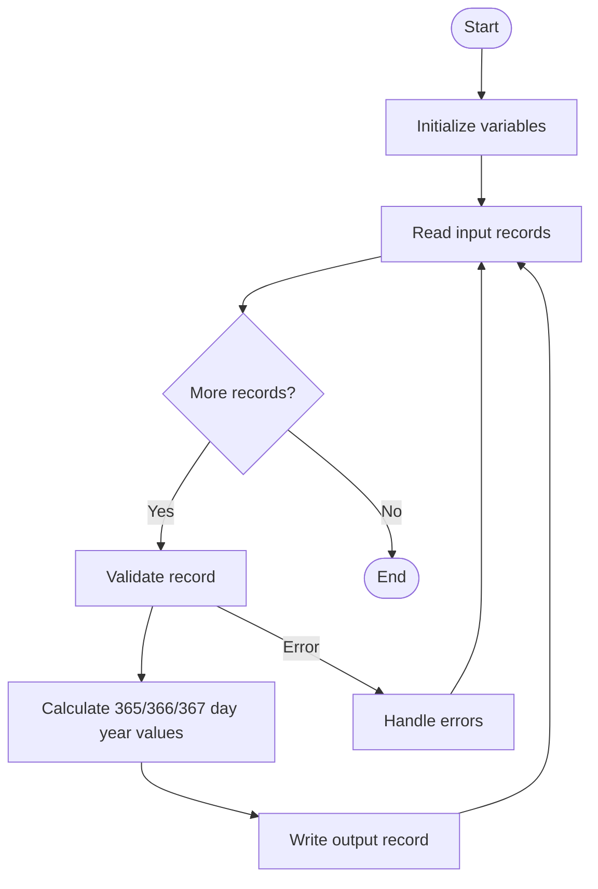
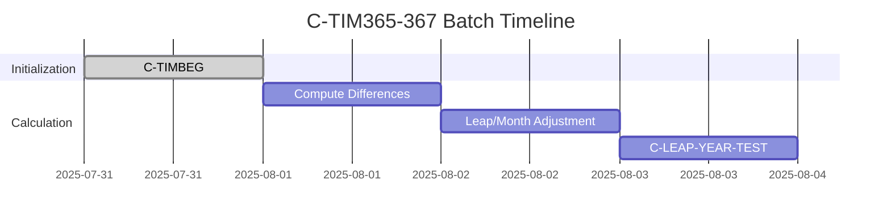
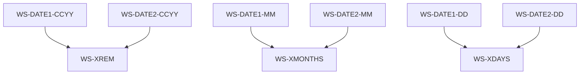
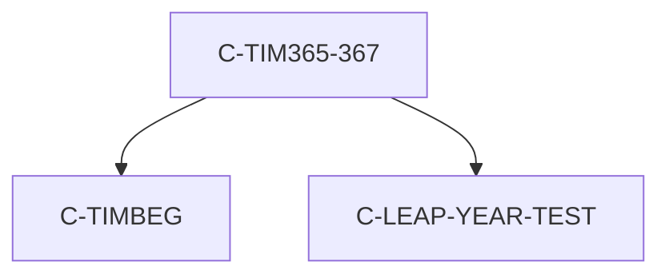

# C-TIM365-367 Program Documentation

**Location:** APIPAY_Inlined.CBL  
**Generated on:** July 31, 2025  
**Program ID:** C-TIM365-367  
**Date Written:** See source comments

## Table of Contents
- [Program Overview](#program-overview)
- [Transaction Types Supported](#transaction-types-supported)
- [Input Parameters](#input-parameters)
- [Output Fields](#output-fields)
- [Program Flow Diagrams](#program-flow-diagrams)
- [Batch or Sequential Process Timeline](#batch-or-sequential-process-timeline)
- [Paragraph-Level Flow Explanation](#paragraph-level-flow-explanation)
- [Data Flow Mapping](#data-flow-mapping)
- [Referenced Programs](#referenced-programs)
- [Error Handling Flow](#error-handling-flow)
- [Error Handling and Validation](#error-handling-and-validation)
- [Common Error Conditions](#common-error-conditions)
- [Technical Implementation](#technical-implementation)
- [Integration Points](#integration-points)
- [File Dependencies](#file-dependencies)
- [Call Graph of PERFORMed Paragraphs](#call-graph-of-performed-paragraphs)

## Program Overview
C-TIM365-367 computes elapsed time between two dates using 365- and 367-day year conventions, with leap year and month boundary adjustments. Used for financial and date calculations.

## Transaction Types Supported
- Elapsed time calculation (365/367-day year)

## Input Parameters
- `WS-DATE1-CCYY`, `WS-DATE1-MM`, `WS-DATE1-DD`: Start date
- `WS-DATE2-CCYY`, `WS-DATE2-MM`, `WS-DATE2-DD`: End date

## Output Fields
- `WS-XREM`, `WS-XMONTHS`, `WS-XDAYS`: Elapsed years, months, days

## Program Flow Diagrams
### High-Level Flow

### Detailed Flow

## Batch or Sequential Process Timeline

## Paragraph-Level Flow Explanation
- **C-TIMBEG**: Initializes date variables.
- **Compute Year/Month/Day Differences**: Calculates differences.
- **Leap/Month Adjustment**: Handles negative days, leap years, and month boundaries.
- **C-LEAP-YEAR-TEST**: Determines leap year status.

## Data Flow Mapping

## Referenced Programs
- C-TIMBEG (internal)
- C-LEAP-YEAR-TEST (internal)

## Error Handling Flow
- Handles negative day differences
- Adjusts for leap year and month boundaries

## Error Handling and Validation
- Validates input date fields
- Ensures leap year logic is correct

## Common Error Conditions
- Negative day difference
- Incorrect leap year adjustment

## Technical Implementation
- Uses working-storage fields
- No external file I/O
- Key algorithms: 365/367-day year calculation, leap year adjustment

## Integration Points
- Used by other date calculation routines

## File Dependencies
- No external files; uses internal paragraphs

## Call Graph of PERFORMed Paragraphs

