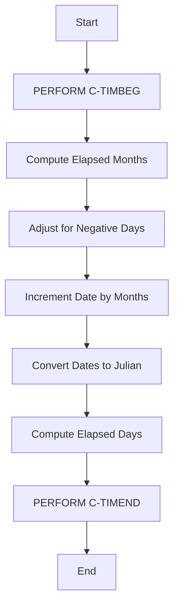
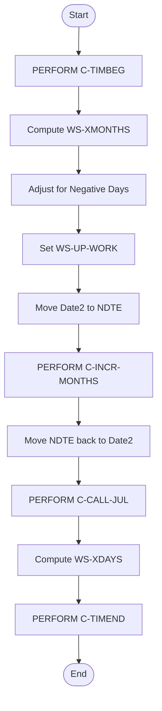
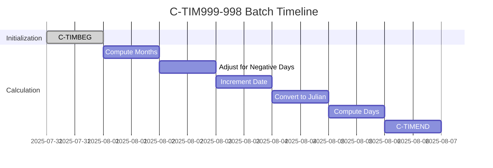
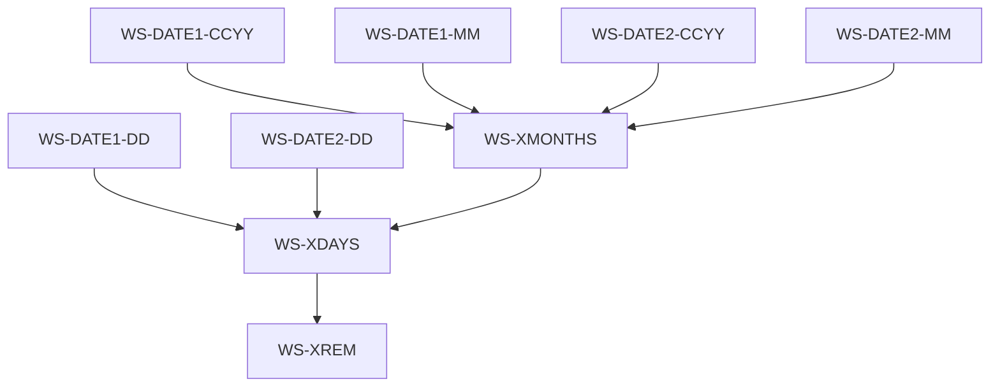
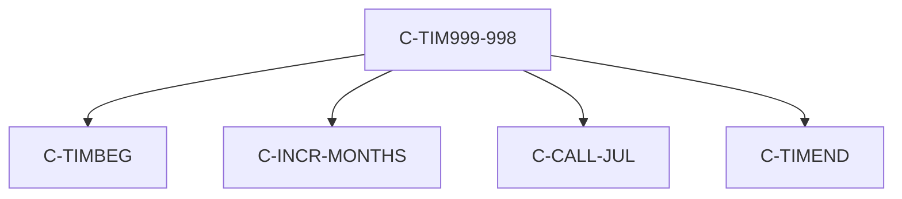

# C-TIM999-998 Program Documentation

**Location:** APIPAY/APIPAY_Inlined.CBL  
**Generated on:** July 31, 2025  
**Program ID:** C-TIM999-998  
**Date Written:** See source comments

## Table of Contents
- [Program Overview](#program-overview)
- [Transaction Types Supported](#transaction-types-supported)
- [Input Parameters](#input-parameters)
- [Output Fields](#output-fields)
- [Program Flow Diagrams](#program-flow-diagrams)
- [Batch or Sequential Process Timeline](#batch-or-sequential-process-timeline)
- [Paragraph-Level Flow Explanation](#paragraph-level-flow-explanation)
- [Data Flow Mapping](#data-flow-mapping)
- [Referenced Programs](#referenced-programs)
- [Error Handling Flow](#error-handling-flow)
- [Error Handling and Validation](#error-handling-and-validation)
- [Common Error Conditions](#common-error-conditions)
- [Technical Implementation](#technical-implementation)
- [Integration Points](#integration-points)
- [File Dependencies](#file-dependencies)
- [Call Graph of PERFORMed Paragraphs](#call-graph-of-performed-paragraphs)

## Program Overview
C-TIM999-998 computes elapsed time between two dates using a custom 998/999-day year convention. It is used for specialized financial calculations where standard 365/360/367-day logic does not apply. The routine adjusts months and days, handles negative differences, and normalizes date order for accurate results.

## Transaction Types Supported
- Elapsed time calculation (998/999-day year)

## Input Parameters
- `WS-DATE1-CCYY`, `WS-DATE1-MM`, `WS-DATE1-DD`: Start date
- `WS-DATE2-CCYY`, `WS-DATE2-MM`, `WS-DATE2-DD`: End date
- `TA-YRTYPE`: Year type (should be 998 or 999 for this routine)

## Output Fields
- `WS-XMONTHS`: Elapsed months
- `WS-XDAYS`: Elapsed days
- `WS-XREM`: Remainder days

## Program Flow Diagrams
### High-Level Flow

### Detailed Flow

## Batch or Sequential Process Timeline

## Paragraph-Level Flow Explanation
- **C-TIM999-998**: Main routine for 998/999-day elapsed time calculation. Calls C-TIMBEG, computes months, adjusts for negative days, increments date, converts to Julian, computes days, and calls C-TIMEND.
- **C-TIMBEG**: Initializes and normalizes date order, converts dates to Julian.
- **C-INCR-MONTHS**: Increments a date by a number of months, adjusting for month-end.
- **C-CALL-JUL**: Converts a date to Julian format.
- **C-TIMEND**: Finalizes elapsed time, sets correct sign, and computes remainders.

## Data Flow Mapping

## Referenced Programs
- C-TIMBEG (internal)
- C-INCR-MONTHS (internal)
- C-CALL-JUL (internal)
- C-TIMEND (internal)

## Error Handling Flow
- Handles negative day differences by adjusting months
- Normalizes date order if start date is after end date

## Error Handling and Validation
- Validates input date fields
- Ensures correct sign for elapsed time
- Handles edge cases for month and day boundaries

## Common Error Conditions
- Negative day difference
- Incorrect date order
- Invalid input fields

## Technical Implementation
- Uses working-storage fields for all calculations
- No external file I/O in this routine
- Relies on internal subroutines for date normalization and conversion

## Integration Points
- Used by batch and online processes requiring 998/999-day elapsed time calculations

## File Dependencies
- No external files; uses internal paragraphs and working-storage

## Call Graph of PERFORMed Paragraphs

