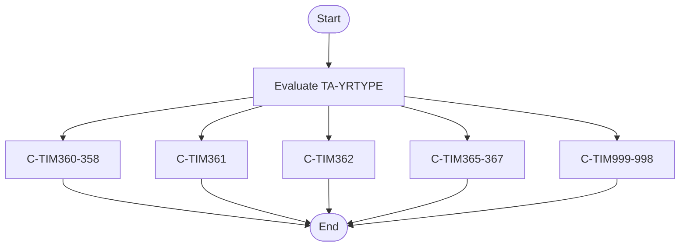
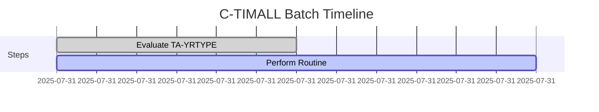
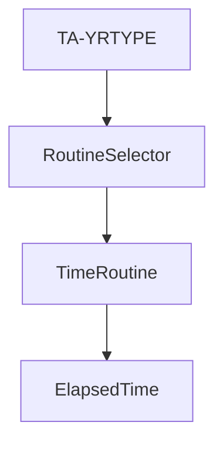
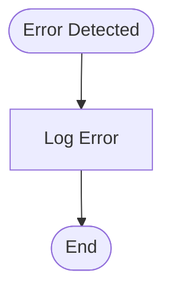
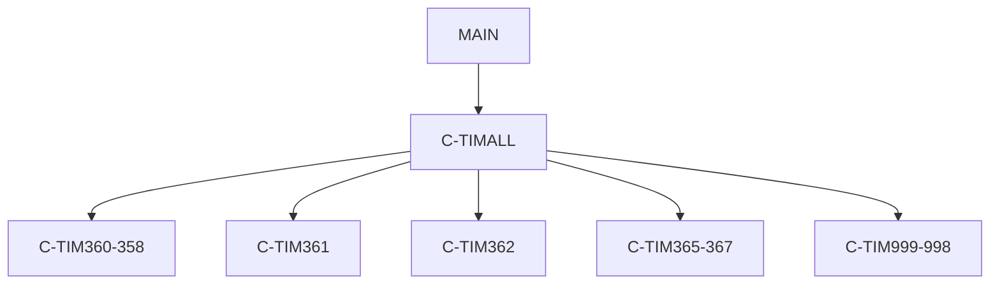

# C-TIMALL - COBOL Utility Documentation

**Location:** .\APIPAY\APIPAY_Inlined.CBL  
**Generated on:** July 31, 2025  
**Program ID:** C-TIMALL  
**Written:** [See source comments]

## Table of Contents
1. [Table of Contents](#table-of-contents)
2. [Program Overview](#program-overview)
3. [Transaction Types Supported](#transaction-types-supported)
4. [Input Parameters](#input-parameters)
5. [Output Fields](#output-fields)
6. [Program Flow Diagrams](#program-flow-diagrams)
7. [Batch or Sequential Process Timeline](#batch-or-sequential-process-timeline)
8. [Paragraph-Level Flow Explanation](#paragraph-level-flow-explanation)
9. [Data Flow Mapping](#data-flow-mapping)
10. [Referenced Programs](#referenced-programs)
11. [Error Handling Flow](#error-handling-flow)
12. [Error Handling and Validation](#error-handling-and-validation)
13. [Common Error Conditions](#common-error-conditions)
14. [Technical Implementation](#technical-implementation)
15. [Integration Points](#integration-points)
16. [File Dependencies](#file-dependencies)
17. [Call Graph of PERFORMed Paragraphs](#call-graph-of-performed-paragraphs)

---

## Program Overview
C-TIMALL is a COBOL utility section that performs selected time routines based on the value of TA-YRTYPE. It delegates to specific time calculation routines (such as C-TIM360-358, C-TIM361, C-TIM362, C-TIM365-367, C-TIM999-998) to compute elapsed time, months, and days between dates for various loan and batch processing scenarios.

---

## Transaction Types Supported
- Elapsed time calculation (various year types)
- Delegation to specific time routines

---

## Input Parameters
- TA-YRTYPE (year type selector)
- Date fields (WS-DATE1, WS-DATE2, etc.)

---

## Output Fields
- Elapsed months
- Elapsed days
- Elapsed remainder

---

## Program Flow Diagrams
### High-Level Flow

---

## Batch or Sequential Process Timeline

---

## Paragraph-Level Flow Explanation
- **Evaluate TA-YRTYPE:** Determines which time routine to perform based on TA-YRTYPE value.
- **Perform Routine:** Calls the appropriate section (C-TIM360-358, C-TIM361, etc.)

---

## Data Flow Mapping

---

## Referenced Programs
- [C-TIM360-358](C-TIM360-358_Documentation.md): Elapsed time calculation
- [C-TIM361](C-TIM361_Documentation.md): Time routine
- [C-TIM362](C-TIM362_Documentation.md): Time routine
- [C-TIM365-367](C-TIM365-367_Documentation.md): Time routine
- [C-TIM999-998](C-TIM999-998_Documentation.md): Time routine
- [APIPAY](APIPAY_Documentation.md): Main batch payment processor

---

## Error Handling Flow

---

## Error Handling and Validation
- Validates TA-YRTYPE value
- Handles errors in delegated routines

---

## Common Error Conditions
- Invalid TA-YRTYPE
- Errors in time routine sections

---

## Technical Implementation
- **Data Structures:** TA-YRTYPE, date fields
- **File Handling:** None (delegates to other routines)
- **Key Algorithms:** Delegation via EVALUATE and PERFORM

---

## Integration Points
- Used by APIPAY and other batch utilities for time-based calculations

---

## File Dependencies
- Input: TA-YRTYPE, date fields
- Output: Elapsed time fields
- Copybooks: LIBGB/DATER.CPY

---

## Call Graph of PERFORMed Paragraphs

---

*For further details, see the APIPAY documentation and embedded diagrams.*
