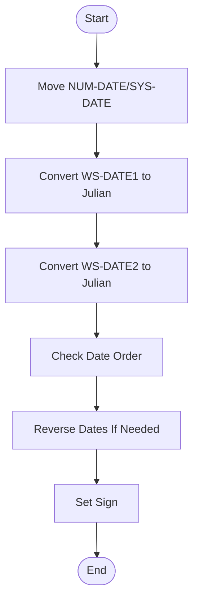
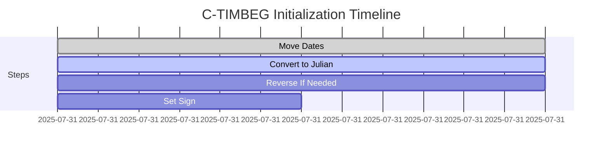
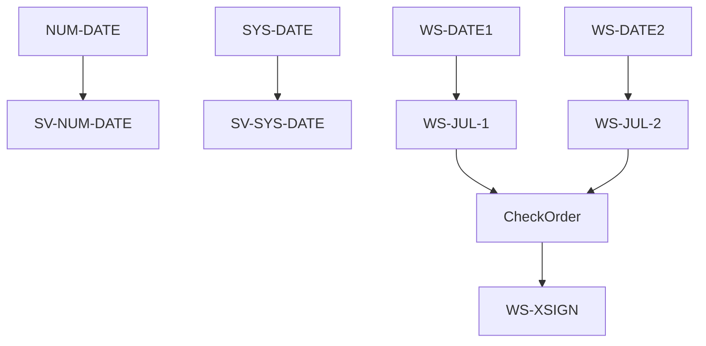
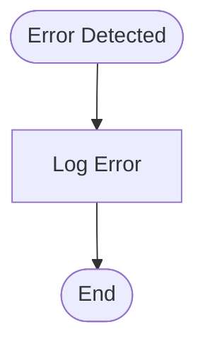
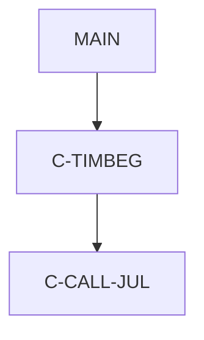

# C-TIMBEG - COBOL Utility Documentation

**Location:** .\APIPAY\APIPAY_Inlined.CBL  
**Generated on:** July 31, 2025  
**Program ID:** C-TIMBEG  
**Written:** [See source comments]

## Table of Contents
1. [Table of Contents](#table-of-contents)
2. [Program Overview](#program-overview)
3. [Transaction Types Supported](#transaction-types-supported)
4. [Input Parameters](#input-parameters)
5. [Output Fields](#output-fields)
6. [Program Flow Diagrams](#program-flow-diagrams)
7. [Batch or Sequential Process Timeline](#batch-or-sequential-process-timeline)
8. [Paragraph-Level Flow Explanation](#paragraph-level-flow-explanation)
9. [Data Flow Mapping](#data-flow-mapping)
10. [Referenced Programs](#referenced-programs)
11. [Error Handling Flow](#error-handling-flow)
12. [Error Handling and Validation](#error-handling-and-validation)
13. [Common Error Conditions](#common-error-conditions)
14. [Technical Implementation](#technical-implementation)
15. [Integration Points](#integration-points)
16. [File Dependencies](#file-dependencies)
17. [Call Graph of PERFORMed Paragraphs](#call-graph-of-performed-paragraphs)

---

## Program Overview
C-TIMBEG is a COBOL utility section that sets up date values for elapsed time calculations. It reverses date order if necessary, converts dates to Julian format, and prepares all required fields for subsequent time routines. This ensures accurate calculations for loan and batch processing.

---

## Transaction Types Supported
- Date initialization
- Julian date conversion
- Date order reversal

---

## Input Parameters
- NUM-DATE
- SYS-DATE
- WS-DATE1
- WS-DATE2

---

## Output Fields
- SV-NUM-DATE
- SV-SYS-DATE
- WS-JUL-1
- WS-JUL-2
- WS-XSIGN

---

## Program Flow Diagrams
### High-Level Flow

---

## Batch or Sequential Process Timeline

---

## Paragraph-Level Flow Explanation
- **Move NUM-DATE/SYS-DATE:** Copies input dates to working storage.
- **Convert WS-DATE1/WS-DATE2 to Julian:** Converts both dates to Julian format.
- **Check Date Order:** Compares Julian dates to determine order.
- **Reverse Dates If Needed:** Swaps dates if necessary.
- **Set Sign:** Sets sign for elapsed time calculations.

---

## Data Flow Mapping

---

## Referenced Programs
- [C-CALL-JUL](C-CALL-JUL_Documentation.md): Julian date conversion utility
- [APIPAY](APIPAY_Documentation.md): Main batch payment processor

---

## Error Handling Flow

---

## Error Handling and Validation
- Validates date formats
- Handles reversal logic
- Logs errors if dates are invalid

---

## Common Error Conditions
- Invalid date format
- NUM-DATE after SYS-DATE

---

## Technical Implementation
- **Data Structures:** NUM-DATE, SYS-DATE, WS-DATE1, WS-DATE2, SV-NUM-DATE, SV-SYS-DATE, WS-JUL-1, WS-JUL-2, WS-XSIGN
- **File Handling:** None
- **Key Algorithms:** Date reversal, Julian conversion

---

## Integration Points
- Used by elapsed time routines in APIPAY

---

## File Dependencies
- Input: NUM-DATE, SYS-DATE, WS-DATE1, WS-DATE2
- Output: SV-NUM-DATE, SV-SYS-DATE, WS-JUL-1, WS-JUL-2, WS-XSIGN
- Copybooks: None

---

## Call Graph of PERFORMed Paragraphs

---

*For further details, see the APIPAY documentation and embedded diagrams.*
