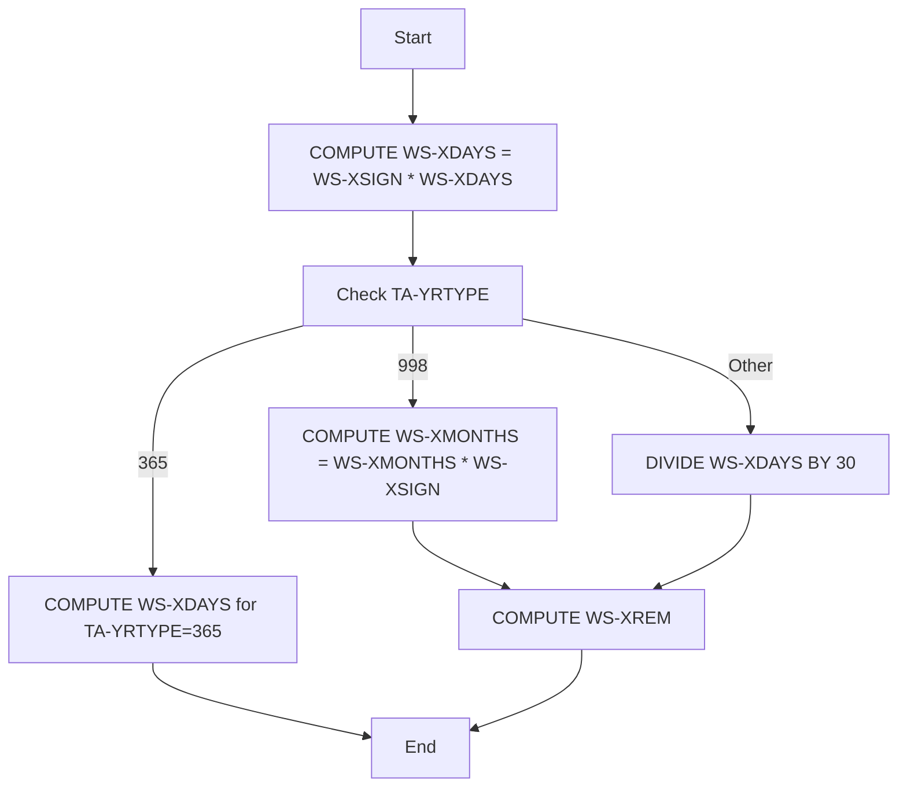
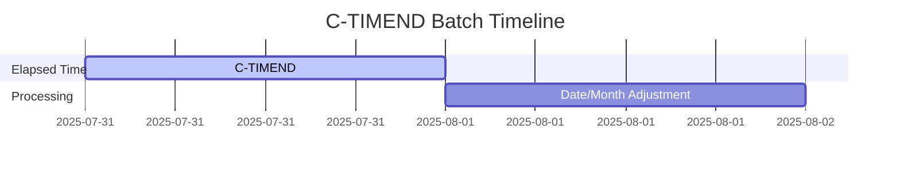
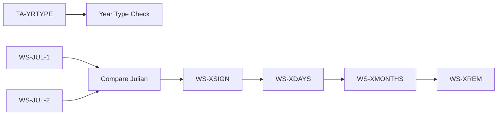
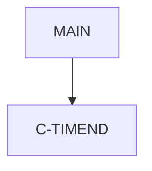

# C-TIMEND Documentation

**generated_on:** 2025-07-31
**Location:** .\APIPAY_Inlined.CBL

## Table of Contents
- [Program Overview](#program-overview)
- [Transaction Types Supported](#transaction-types-supported)
- [Input Parameters](#input-parameters)
- [Output Fields](#output-fields)
- [Program Flow Diagram](#program-flow-diagram)
- [Batch Timeline](#batch-timeline)
- [Paragraph-Level Flow Explanation](#paragraph-level-flow-explanation)
- [Data Flow Mapping](#data-flow-mapping)
- [Referenced Programs](#referenced-programs)
- [Error Handling Flow](#error-handling-flow)
- [Error Handling and Validation](#error-handling-and-validation)
- [Common Error Conditions](#common-error-conditions)
- [Technical Implementation](#technical-implementation)
- [Integration Points](#integration-points)
- [File Dependencies](#file-dependencies)
- [Call Graph of PERFORMed Paragraphs](#call-graph-of-performed-paragraphs)

## Program Overview
C-TIMEND is a COBOL routine that sets the correct sign on elapsed time calculations and adjusts date and month values based on business rules. It handles special cases for different year types and reverses dates if required.

## Transaction Types Supported
- Elapsed time calculation
- Date and month normalization

## Input Parameters
- WS-XSIGN
- WS-XDAYS
- WS-XMONTHS
- WS-XREM
- TA-YRTYPE
- WS-JUL-1
- WS-JUL-2
- WS-DATE1
- WS-DATE2

## Output Fields
- WS-XDAYS
- WS-XMONTHS
- WS-XREM
- WS-DATE1
- WS-DATE2
- WS-JUL-1
- WS-JUL-2

## Program Flow Diagram

## Batch Timeline

## Paragraph-Level Flow Explanation
- **C-TIMEND SECTION:**
    - Computes elapsed days with sign.
    - Handles special year types (998, 365) for business logic.
    - Adjusts months and remainder days.
    - Reverses dates and Julian values if sign is negative.

## Data Flow Mapping

## Referenced Programs
- None (internal logic only)

## Error Handling Flow
- Handles invalid year types and negative signs.
- Reverses dates if sign is negative.

## Error Handling and Validation
- No explicit error handling; relies on valid input data.

## Common Error Conditions
- Invalid year type
- Negative sign on elapsed days

## Technical Implementation
- Uses COMPUTE and DIVIDE for date math.
- Handles business rules for year types.

## Integration Points
- Used by elapsed time routines and batch processing.

## File Dependencies
- APIPAY_Inlined.CBL

## Call Graph of PERFORMed Paragraphs

---
### Diagrams
- [Program Flow Diagram](../Diagrams/C-TIMEND_Flow.mmd)
- [Batch Timeline Diagram](../Diagrams/C-TIMEND_Batch.mmd)
- [Data Flow Diagram](../Diagrams/C-TIMEND_DataFlow.mmd)
- [Call Graph Diagram](../Diagrams/C-TIMEND_CallGraph.mmd)

Click the links above to view the diagrams.
