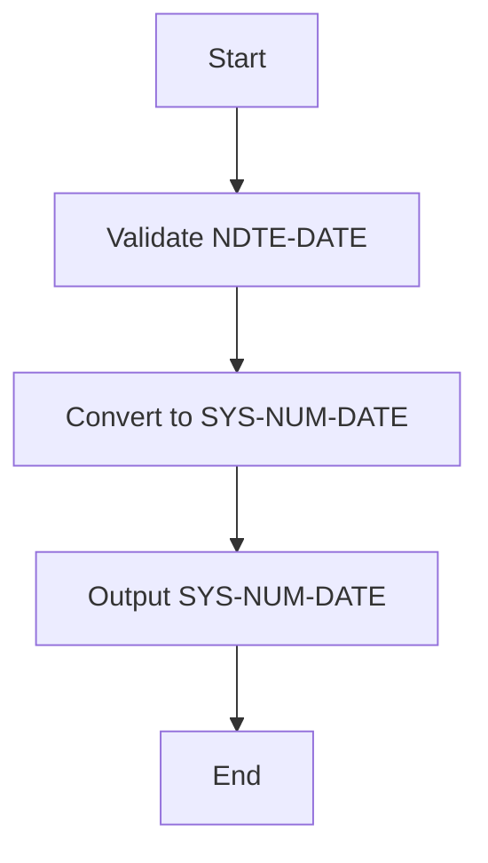
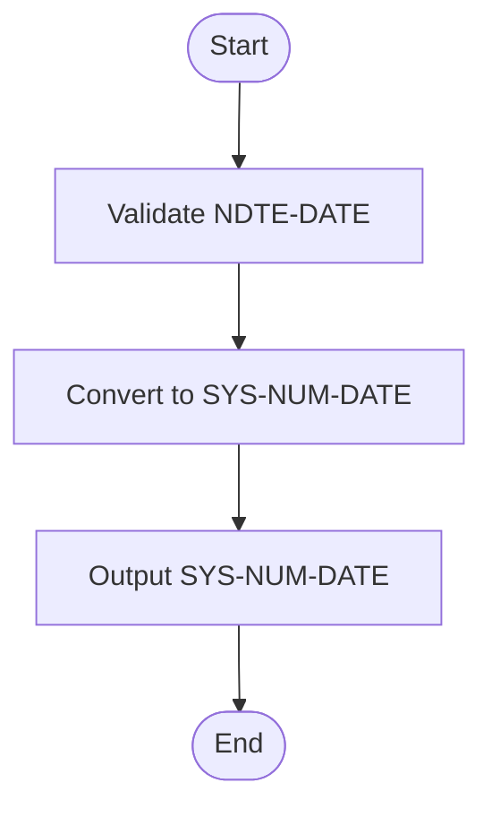
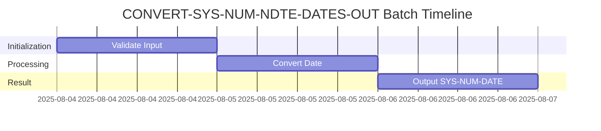
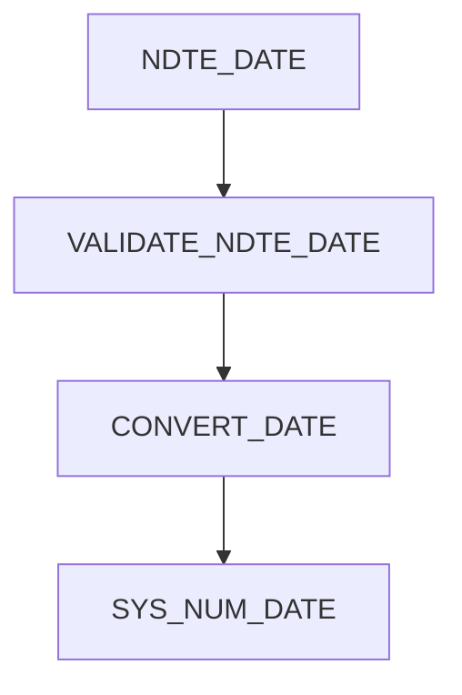
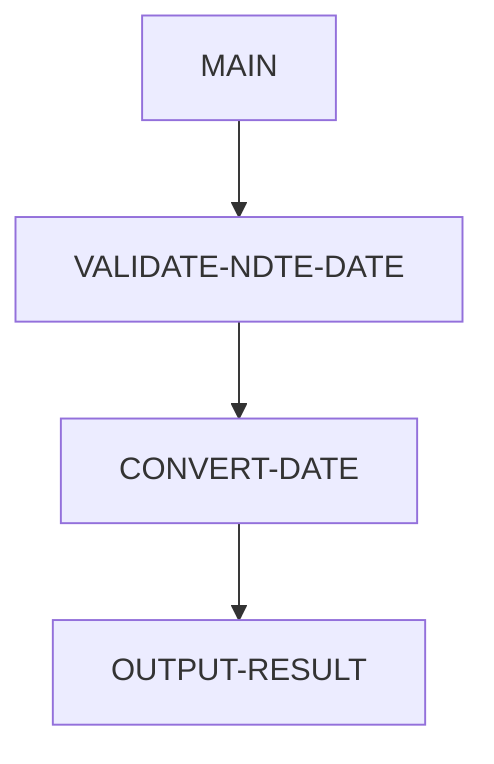

# CONVERT-SYS-NUM-NDTE-DATES-OUT Program Documentation

**Location:** APIPAY/APIPAY_Inlined.CBL  
**Generated on:** August 4, 2025  
**Program ID:** CONVERT-SYS-NUM-NDTE-DATES-OUT  
**Date Written:** See source comments

## Table of Contents
- [Program Overview](#program-overview)
- [Transaction Types Supported](#transaction-types-supported)
- [Input Parameters](#input-parameters)
- [Output Fields](#output-fields)
- [Program Flow Diagrams](#program-flow-diagrams)
- [Batch or Sequential Process Timeline](#batch-or-sequential-process-timeline)
- [Paragraph-Level Flow Explanation](#paragraph-level-flow-explanation)
- [Data Flow Mapping](#data-flow-mapping)
- [Referenced Programs](#referenced-programs)
- [Error Handling Flow](#error-handling-flow)
- [Error Handling and Validation](#error-handling-and-validation)
- [Common Error Conditions](#common-error-conditions)
- [Technical Implementation](#technical-implementation)
- [Integration Points](#integration-points)
- [File Dependencies](#file-dependencies)
- [Call Graph of PERFORMed Paragraphs](#call-graph-of-performed-paragraphs)

## Program Overview
This routine converts NDTE (normalized date) fields to system numeric date format for output or external system compatibility.

## Transaction Types Supported
- NDTE to system numeric date conversion

## Input Parameters
- `NDTE-DATE`: Normalized date input

## Output Fields
- `SYS-NUM-DATE`: System numeric date output

## Program Flow Diagrams
### High-Level Flow

### Detailed Flow

## Batch or Sequential Process Timeline

## Paragraph-Level Flow Explanation
- **VALIDATE-NDTE-DATE**: Checks input for correct format and range.
- **CONVERT-DATE**: Performs conversion logic.
- **OUTPUT-RESULT**: Returns system numeric date.

## Data Flow Mapping

## Referenced Programs
- None

## Error Handling Flow
- Returns error if input is invalid or out of range.

## Error Handling and Validation
- Validates input format and range.
- Handles non-numeric and out-of-bounds values.

## Common Error Conditions
- Invalid date input
- Out-of-range value

## Technical Implementation
- Uses working-storage fields for date manipulation.
- No external file I/O.

## Integration Points
- Used by routines requiring system numeric date output.

## File Dependencies
- No external files; uses internal paragraphs.

## Call Graph of PERFORMed Paragraphs

