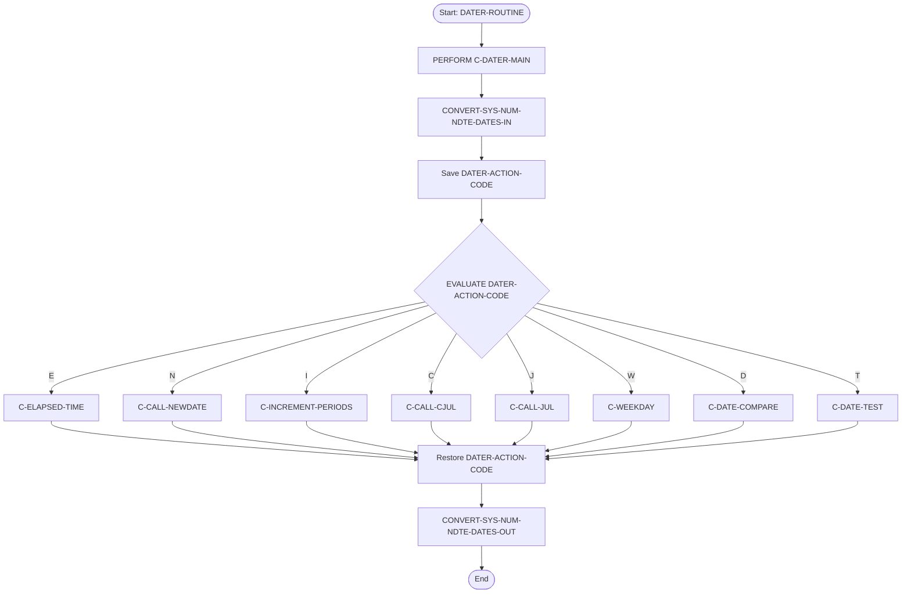
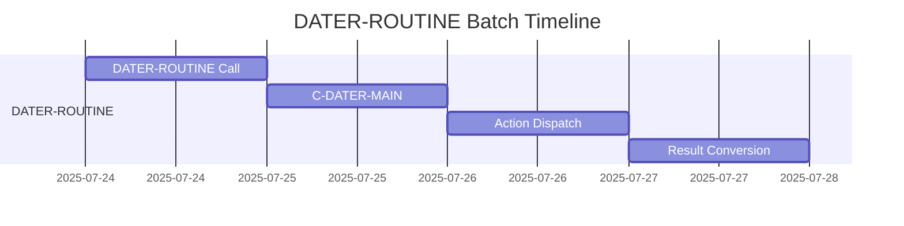
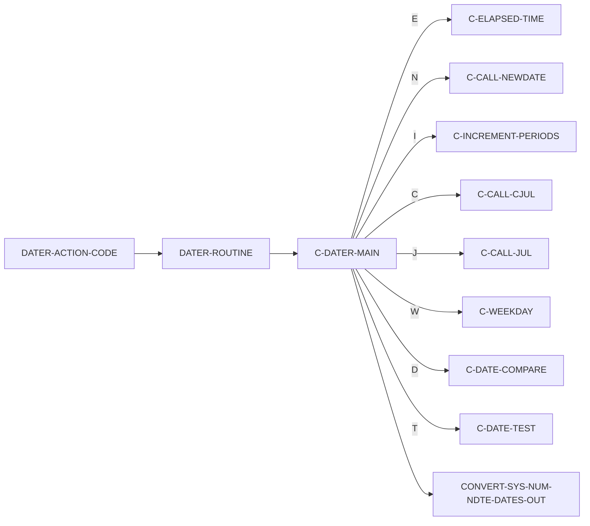
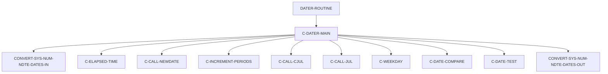

# DATER-ROUTINE COBOL Program Design Document

**Location:** .\APIPAY_Inlined.CBL  
**Generated on:** July 22, 2025  
**Program ID:** DATER-ROUTINE  
**Date Written:** Legacy system (pre-2000)

---

## Table of Contents
1. [Program Overview](#program-overview)
2. [Transaction Types Supported](#transaction-types-supported)
3. [Input Parameters](#input-parameters)
4. [Output Fields](#output-fields)
5. [Program Flow Diagrams](#program-flow-diagrams)
6. [Batch Processing Timeline](#batch-processing-timeline)
7. [Paragraph-Level Flow Explanation](#paragraph-level-flow-explanation)
8. [Data Flow Mapping](#data-flow-mapping)
9. [Referenced Programs](#referenced-programs)
10. [Error Handling and Validation](#error-handling-and-validation)
11. [Technical Implementation](#technical-implementation)
12. [Integration Points](#integration-points)
13. [File Dependencies](#file-dependencies)
14. [Call Graph of PERFORMed Paragraphs](#call-graph-of-performed-paragraphs)

---

## Program Overview
DATER-ROUTINE is a central COBOL section for date calculations and manipulations. It acts as a dispatcher, performing elapsed time, date increment, date comparison, Julian conversions, weekday determination, and date validation, based on the action code provided. It is widely used for all date-related logic in the system.

## Transaction Types Supported
- Elapsed time calculation (days, months, years)
- Date increment (by days, months, years, weeks, semimonths)
- Date comparison (less than, equal, greater than)
- Julian date conversion (calendar <-> Julian)
- Weekday determination
- Date validation

## Input Parameters
- `DATER-ACTION-CODE`: Operation selector (E, N, I, C, J, W, D, T)
- `NUM-DATE`: Main date (YYYYMMDD)
- `SYS-DATE`: Secondary date (YYYYMMDD)
- `NDTE-DATE`: Date to increment (YYYYMMDD)
- `NDTE-HOLD`: Increment value (unit periods)
- `DATER-UNITPER-CD`: Unit period code (M, D, Y, S, W, B)
- `DATER-UNITPER-FREQ`: Frequency of unit periods
- `JULIAN-DATE`: Julian date (for conversion)

## Output Fields
- `ELAPSED-DAYS`, `ELAPSED-MONTHS`, `ELAPSED-REM`, `ELAPSED-RESULTS`: Elapsed time results
- `NDTE-DATE`: Incremented date
- `JULIAN-DATE`: Julian date result
- `NUM-DATE`: Calendar date result (from Julian)
- `DAY-OF-WEEK`, `DAY-IS-SUN`, ...: Weekday flags
- `DATER-RESULTS`: General result field

## Program Flow Diagrams
### High-Level Flow

## Batch Processing Timeline

## Paragraph-Level Flow Explanation
- **DATER-ROUTINE SECTION**: Entry point. Calls C-DATER-MAIN.
- **C-DATER-MAIN SECTION**: Converts input dates, saves action code, dispatches to the correct routine based on action code, restores action code, converts output dates.
- **Action Codes:**
    - "E": Elapsed time calculation (PERFORM C-ELAPSED-TIME)
    - "N": New date calculation (PERFORM C-CALL-NEWDATE)
    - "I": Increment periods (PERFORM C-INCREMENT-PERIODS)
    - "C": Julian to calendar (PERFORM C-CALL-CJUL)
    - "J": Calendar to Julian (PERFORM C-CALL-JUL)
    - "W": Weekday determination (PERFORM C-WEEKDAY)
    - "D": Date comparison (PERFORM C-DATE-COMPARE)
    - "T": Date test/validation (PERFORM C-DATE-TEST)
- **CONVERT-SYS-NUM-NDTE-DATES-IN/OUT**: Handle input/output date normalization.

## Data Flow Mapping

## Referenced Programs
- `C-ELAPSED-TIME` (internal)
- `C-CALL-NEWDATE` (internal)
- `C-INCREMENT-PERIODS` (internal)
- `C-CALL-CJUL` (internal)
- `C-CALL-JUL` (internal)
- `C-WEEKDAY` (internal)
- `C-DATE-COMPARE` (internal)
- `C-DATE-TEST` (internal)
- `CONVERT-SYS-NUM-NDTE-DATES-IN/OUT` (internal)

## Error Handling and Validation
- Invalid or missing dates are handled by normalization routines.
- Action code not recognized: no action performed.
- Each subroutine (e.g., C-ELAPSED-TIME) has its own error handling for edge cases.

## Technical Implementation
- **Data Structures:** Uses working-storage for all date fields, action codes, and results.
- **Dispatch Logic:** EVALUATE statement for action code dispatch.
- **No direct file I/O:** All operations are in-memory.

## Integration Points
- Called by all routines needing date calculations, increments, or comparisons.
- Used by TIM360, TIM365, and other timing utilities.

## File Dependencies
- No external files; all logic is internal to APIPAY_Inlined.CBL
- Uses internal copybooks and working-storage

## Call Graph of PERFORMed Paragraphs

---

**See also:**
- [TIM360 Documentation](TIM360_Documentation.md)
- [APIPAY Main Documentation](APIPAY_Documentation.md)
