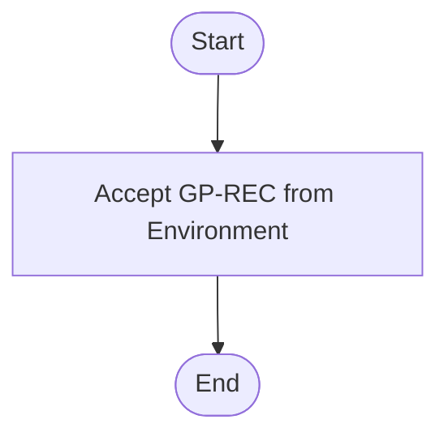
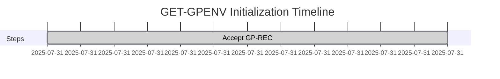
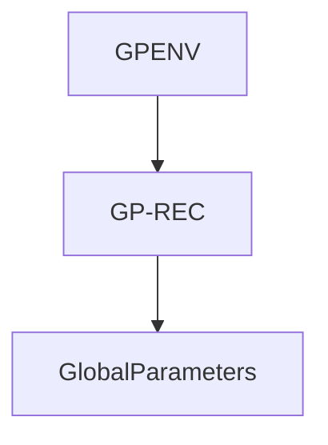
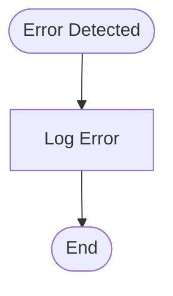
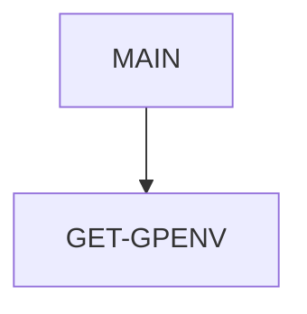

# GET-GPENV - COBOL Utility Documentation

**Location:** .\APIPAY\APIPAY_Inlined.CBL  
**Generated on:** July 31, 2025  
**Program ID:** GET-GPENV  
**Written:** [See source comments]

## Table of Contents
1. [Table of Contents](#table-of-contents)
2. [Program Overview](#program-overview)
3. [Transaction Types Supported](#transaction-types-supported)
4. [Input Parameters](#input-parameters)
5. [Output Fields](#output-fields)
6. [Program Flow Diagrams](#program-flow-diagrams)
7. [Batch or Sequential Process Timeline](#batch-or-sequential-process-timeline)
8. [Paragraph-Level Flow Explanation](#paragraph-level-flow-explanation)
9. [Data Flow Mapping](#data-flow-mapping)
10. [Referenced Programs](#referenced-programs)
11. [Error Handling Flow](#error-handling-flow)
12. [Error Handling and Validation](#error-handling-and-validation)
13. [Common Error Conditions](#common-error-conditions)
14. [Technical Implementation](#technical-implementation)
15. [Integration Points](#integration-points)
16. [File Dependencies](#file-dependencies)
17. [Call Graph of PERFORMed Paragraphs](#call-graph-of-performed-paragraphs)

---

## Program Overview
GET-GPENV is a COBOL utility section responsible for accepting and initializing the GP-REC record from the environment variable "GPENV". It is used to set up global parameters for batch processing and ensures that the environment is correctly configured before further operations.

---

## Transaction Types Supported
- Environment initialization
- Global parameter setup

---

## Input Parameters
- Environment variable: GPENV

---

## Output Fields
- GP-REC (global parameters record)

---

## Program Flow Diagrams
### High-Level Flow

---

## Batch or Sequential Process Timeline

---

## Paragraph-Level Flow Explanation
- **Accept GP-REC:** Reads the GP-REC record from the environment variable "GPENV" and initializes global parameters.

---

## Data Flow Mapping

---

## Referenced Programs
- [APIPAY](APIPAY_Documentation.md): Main batch payment processor

---

## Error Handling Flow

---

## Error Handling and Validation
- Validates presence of GPENV variable
- Logs errors if GP-REC cannot be accepted

---

## Common Error Conditions
- GPENV variable missing
- Invalid GP-REC format

---

## Technical Implementation
- **Data Structures:** GP-REC record
- **File Handling:** Accepts from environment
- **Key Algorithms:** None (direct accept)

---

## Integration Points
- Used by APIPAY for global environment setup

---

## File Dependencies
- Input: GPENV environment variable
- Output: GP-REC
- Copybooks: LIBGB/GPENV.CPY

---

## Call Graph of PERFORMed Paragraphs

---

*For further details, see the APIPAY documentation and embedded diagrams.*
