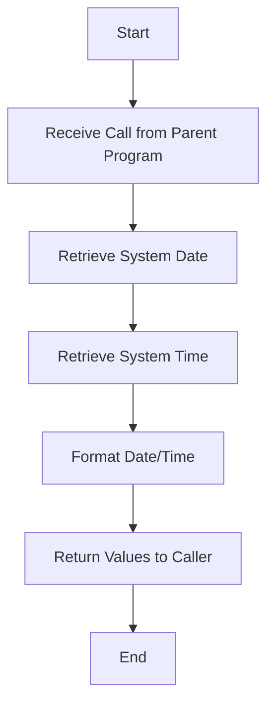
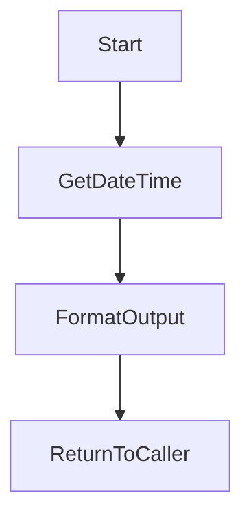
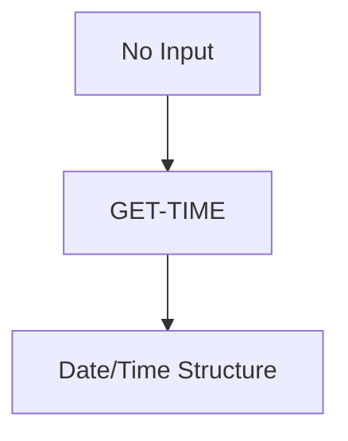

# GET-TIME Program Documentation

Location: .\APIPAY_Inlined.CBL  
Generated on: July 28, 2025  
Program ID: GET-TIME  
Date Written: Unknown  

---

## Table of Contents
1. [Program Overview](#program-overview)
2. [Transaction Types Supported](#transaction-types-supported)
3. [Input Parameters](#input-parameters)
4. [Output Fields](#output-fields)
5. [Program Flow Diagrams](#program-flow-diagrams)
6. [Batch or Sequential Process Timeline](#batch-or-sequential-process-timeline)
7. [Paragraph-Level Flow Explanation](#paragraph-level-flow-explanation)
8. [Data Flow Mapping](#data-flow-mapping)
9. [Referenced Programs](#referenced-programs)
10. [Error Handling Flow](#error-handling-flow)
11. [Error Handling and Validation](#error-handling-and-validation)
12. [Common Error Conditions](#common-error-conditions)
13. [Technical Implementation](#technical-implementation)
14. [Integration Points](#integration-points)
15. [File Dependencies](#file-dependencies)
16. [Call Graph of PERFORMed Paragraphs](#call-graph-of-performed-paragraphs)

---

## Program Overview
GET-TIME is a utility subprogram used within the APIPAY COBOL application to retrieve the current system date and time in a standardized format. It is typically called by other programs to obtain a timestamp for logging, audit trails, or transaction processing. The program is designed to be portable and to abstract away system-specific date/time retrieval logic.

## Transaction Types Supported
GET-TIME is a utility and does not process business transactions. It supports any context where a current date/time value is required by the calling program.

## Input Parameters
- **None required.**
- The program may accept a data structure (via linkage section) to return the date/time values, depending on the calling convention.

## Output Fields
- **Current Date** (format: YYYYMMDD or system-specific)
- **Current Time** (format: HHMMSS or system-specific)
- **Return Code** (optional, indicates success or failure)

## Program Flow Diagrams

### Main Program Flow

### Call Graph

## Batch or Sequential Process Timeline
GET-TIME is not a batch process but is called as needed. If used in a batch context, it is typically invoked at the start or end of a transaction or step.

## Paragraph-Level Flow Explanation
- **ENTRY Point:** The program begins execution when called by another COBOL program.
- **Retrieve Date/Time:** Uses system functions or intrinsic calls to get the current date and time.
- **Format Output:** Converts the raw system values into a standardized format for the calling program.
- **Return:** Passes the formatted date/time back to the caller via the linkage section.

## Data Flow Mapping

## Referenced Programs
- **None.** GET-TIME is a utility and does not call other programs.

## Error Handling Flow
- If the system date/time cannot be retrieved, a non-zero return code is set.
- The calling program is responsible for handling errors.

## Error Handling and Validation
- Validates that the system call to retrieve date/time is successful.
- Sets a return code or error flag if unsuccessful.

## Common Error Conditions
- System call failure (rare)
- Invalid linkage section (if not properly set up by caller)

## Technical Implementation
- **Language:** COBOL
- **Key Sections:**
    - Identification Division
    - Environment Division
    - Data Division (Linkage Section for output)
    - Procedure Division (main logic)
- **Key Algorithms:**
    - System date/time retrieval using intrinsic functions or system calls
    - Formatting logic for output

## Integration Points
- Called by APIPAY and other programs requiring a timestamp.
- Returns values via the linkage section.

## File Dependencies
- **None.** GET-TIME does not read or write files.

## Call Graph of PERFORMed Paragraphs

---

*This document was generated for wiki use and is intended for readers unfamiliar with COBOL or this system. For questions, contact the documentation team.*
