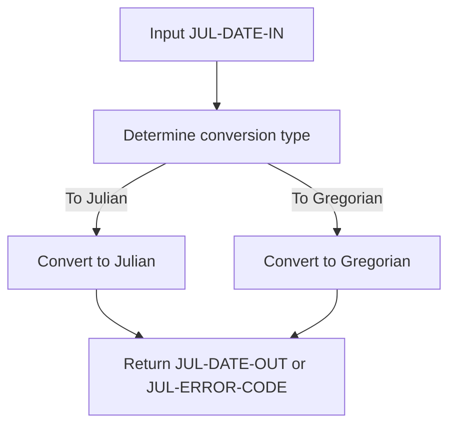
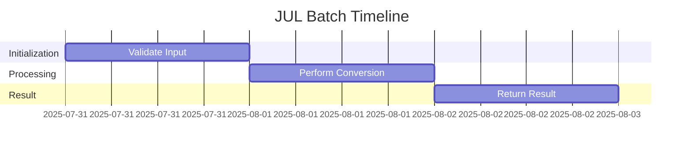
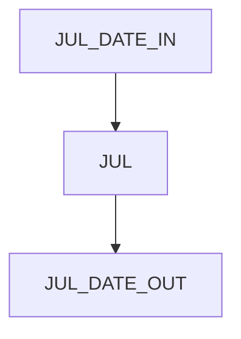
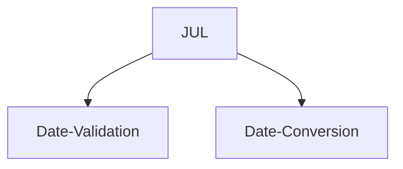

# JUL COBOL Utility Documentation

**Location:** ./APIPAY_Inlined.CBL  
**Generated on:** July 31, 2025  
**Program ID:** JUL  
**Date Written:** See Revision History

## Table of Contents
1. [Program Overview](#program-overview)
2. [Input Parameters](#input-parameters)
3. [Output Fields](#output-fields)
4. [Program Flow Diagram](#program-flow-diagram)
5. [Batch or Sequential Process Timeline](#batch-or-sequential-process-timeline)
6. [Paragraph-Level Flow Explanation](#paragraph-level-flow-explanation)
7. [Data Flow Mapping](#data-flow-mapping)
8. [Referenced Programs](#referenced-programs)
9. [Error Handling and Validation](#error-handling-and-validation)
10. [Common Error Conditions](#common-error-conditions)
11. [Technical Implementation](#technical-implementation)
12. [Integration Points](#integration-points)
13. [File Dependencies](#file-dependencies)
14. [Call Graph of PERFORMed Paragraphs](#call-graph-of-performed-paragraphs)
15. [Revision History](#revision-history)

## Program Overview

**JUL** is a COBOL utility routine for converting Gregorian dates (CCYYMMDD) to Julian day numbers and vice versa. It is used for date arithmetic, validation, and legacy system compatibility in payment processing and reporting.

## Input Parameters
- **JUL-DATE-IN**: Input date (CCYYMMDD) or Julian day number.

## Output Fields
- **JUL-DATE-OUT**: Output date (CCYYMMDD) or Julian day number.
- **JUL-ERROR-CODE**: Error code if conversion fails.

## Program Flow Diagram

## Batch or Sequential Process Timeline

## Paragraph-Level Flow Explanation
- **JUL**: Validates input, determines conversion direction, performs conversion, returns result or error.

## Data Flow Mapping

## Referenced Programs
- None (internal logic)

## Error Handling and Validation
- Validates input date format and range
- Returns error code for invalid input or conversion failure

## Common Error Conditions
- Invalid date input
- Conversion out of range

## Technical Implementation
- Uses working-storage fields
- No external file I/O

## Integration Points
- Used by reporting and legacy system interfaces

## File Dependencies
- No external files; uses internal paragraphs

## Call Graph of PERFORMed Paragraphs

## Revision History
- 2025-07-31: Initial documentation generated.
