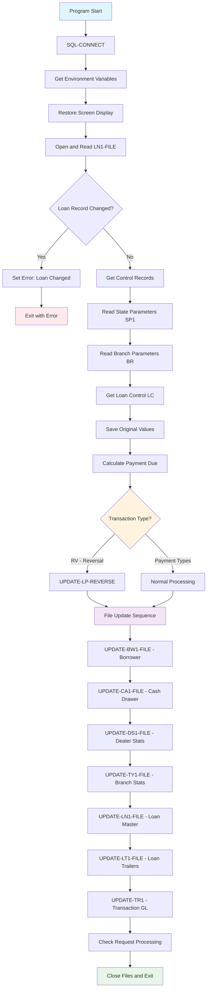
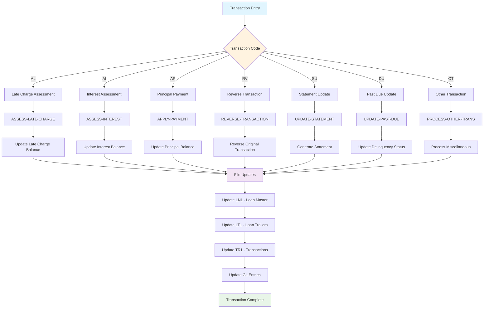
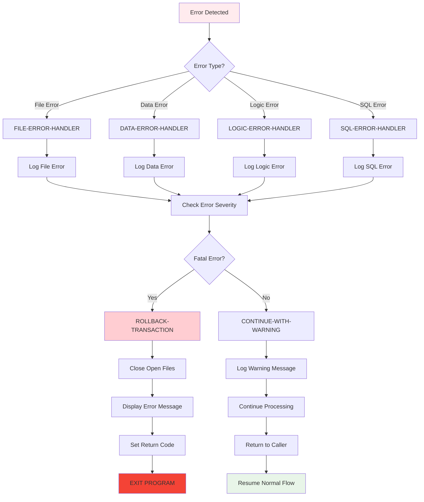
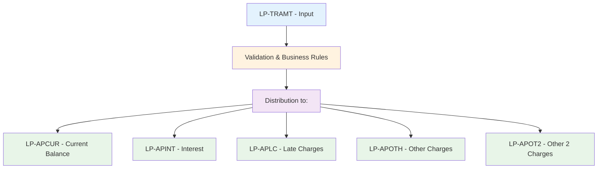
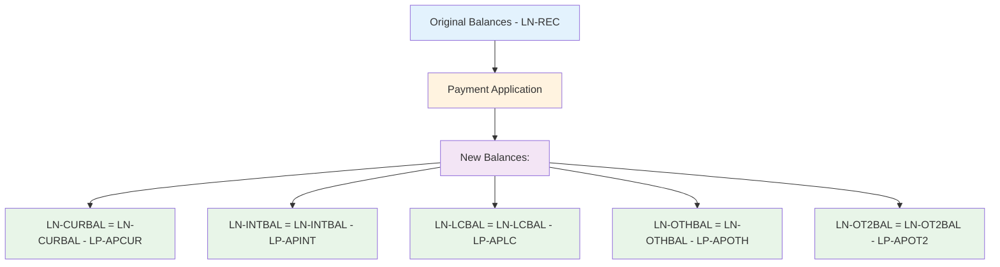
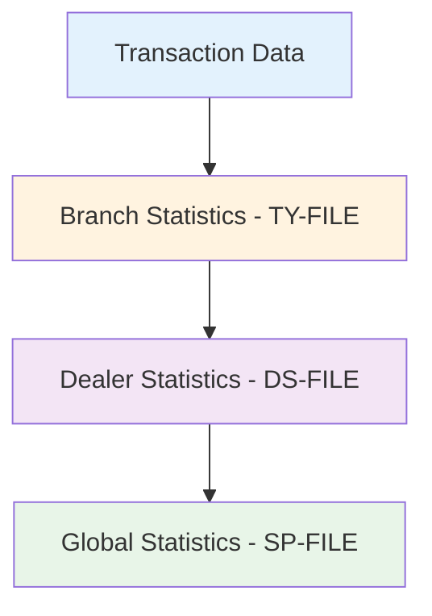
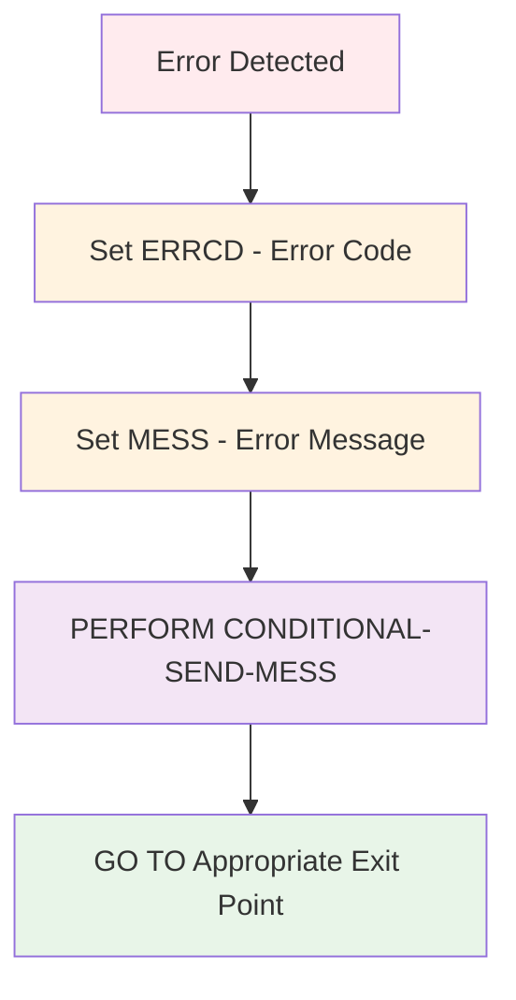

# LONPF2 - Loan Processing Transaction Update Program

**Location:** .\S35-Source\LP\LONPF2.CBL  
**Generated on:** July 22, 2025  
**Program ID:** LONPF2  
**Date Written:** 021784

## Table of Contents

1. [Program Overview](#program-overview)
2. [Transaction Types Supported](#transaction-types-supported)
3. [Input Parameters](#input-parameters)
4. [Output Fields](#output-fields)
5. [Program Flow Diagrams](#program-flow-diagrams)
6. [Batch Processing Timeline](#batch-processing-timeline)
7. [Paragraph-Level Flow Explanation](#paragraph-level-flow-explanation)
8. [Data Flow Mapping](#data-flow-mapping)
9. [Referenced Programs](#referenced-programs)
10. [Error Handling and Validation](#error-handling-and-validation)
11. [Technical Implementation](#technical-implementation)
12. [Integration Points](#integration-points)
13. [File Dependencies](#file-dependencies)
14. [Call Graph of PERFORMed Paragraphs](#call-graph-of-performed-paragraphs)

---

## Program Overview

LONPF2 is a comprehensive loan processing transaction update program that handles various types of financial transactions for loan accounts. This program is responsible for updating multiple file systems including loan records, payment records, transaction records, dealer statistics, and general ledger entries.

### Purpose and Scope

The program serves as the central transaction update engine for loan processing operations. It:

- Processes various payment and transaction types including regular payments, payoffs, rebates, and reversals
- Updates loan balances, payment histories, and account statuses
- Maintains dealer statistics and commission calculations
- Handles insurance and addon product transactions
- Processes repo (repossession) and bankruptcy transactions
- Updates general ledger entries for proper financial reporting

### Business Context

LONPF2 operates within a comprehensive loan management system and is typically called from:
- **APIPAY** - Main payment processing system
- **LONPW** - Manual batch payment entry system
- **LONPQ1** - Automatic renewal processing
- Various other loan processing programs

The program follows a strict file update order: BW, CA, LM, DS, TY, LN, LT, TR, DT, LP to ensure data consistency and proper transaction sequencing.

---

## Transaction Types Supported

LONPF2 supports a wide variety of transaction codes, each with specific processing logic:

### Payment Transactions
| Code | Description | Purpose |
|------|-------------|---------|
| **PY** | Regular Payment | Standard loan payment application |
| **PA** | Payment (Alternative) | Payment with special handling |
| **PO** | Payoff | Full loan payoff transaction |
| **EP** | Escrow Payment | Escrow account payment |
| **ED** | Escrow Disbursement | Payment from escrow account |
| **PE** | Payment Exception | Exception payment processing |
| **PN** | Non-Cash Payment | Payment without cash movement |
| **PZ** | Non-Cash Payment/No RecDel | Payment without recording delay |

### Repo and Recovery Transactions
| Code | Description | Purpose |
|------|-------------|---------|
| **SX** | Repo Expense | Repossession expense posting |
| **ZX** | Repo Expense (Alternative) | Similar to SX with different handling |
| **SV** | Repo Redeem | Account redemption from repo status |
| **SS** | Repo Sale | Sale of repossessed collateral |

### Rebate and Refund Transactions
| Code | Description | Purpose |
|------|-------------|---------|
| **RI** | Interest Rebate | Interest refund calculation |
| **RC** | Commission Rebate | Commission refund |
| **RA** | Addon Rebate | Addon product refund |
| **RP** | Premium Rebate | Insurance premium refund |
| **R1-R3** | Specific Rebates | Targeted rebate types |

### Special Transactions
| Code | Description | Purpose |
|------|-------------|---------|
| **RV** | Reversal | Reverse any previous transaction |
| **OV** | Overpayment | Handle excess payment amounts |
| **OP** | OT/AP Combination | Automatic other/additional principal |
| **RE** | Repo Expense Addon | Repossession expense addon |
| **BK** | Bankruptcy | Bankruptcy status posting |
| **BD** | Bankruptcy Dismissal | Bankruptcy dismissal |
| **PL** | Profit & Loss | Charge-off to P&L |
| **DC** | Disclosure | Disclosure transaction |

### Addon and Insurance Transactions
| Code | Description | Purpose |
|------|-------------|---------|
| **CC** | Credit Life Cancel | Credit life insurance cancellation |
| **CA** | Credit AH Cancel | Accident & health insurance cancellation |
| **CP** | Credit Property Cancel | Property insurance cancellation |
| **C1-C3** | Credit Insurance Types | Specific insurance cancellations |
| **IN** | Insurance Loss | Insurance loss posting |

### Deferment Transactions
| Code | Description | Purpose |
|------|-------------|---------|
| **DF** | Deferment | Payment deferment |
| **D2-D9** | Deferment Types | Specific deferment categories |

### Tax and Fee Transactions
| Code | Description | Purpose |
|------|-------------|---------|
| **CT** | County Tax | County tax processing |
| **CY** | City Tax | City tax processing |
| **OT** | Other Charges | Miscellaneous charges |
| **AP** | Additional Principal | Additional principal payment |

---

## Input Parameters

LONPF2 receives input through the USING clause in the PROCEDURE DIVISION:

```cobol
PROCEDURE DIVISION
    USING FORM-PATHNAME EXIT-PATHNAME PROG-BUF UPDATE-BUF.
```

### Parameter Details

| Parameter | Type | Description |
|-----------|------|-------------|
| **FORM-PATHNAME** | PIC X(n) | Path to form definition files |
| **EXIT-PATHNAME** | PIC X(n) | Path for exit processing |
| **PROG-BUF** | Group Item | Program buffer containing transaction data |
| **UPDATE-BUF** | Group Item | Update buffer for file modifications |

### Key Input Fields (via UPDATE-BUF)

| Field | Description | Format |
|-------|-------------|--------|
| **LP-TRCD** | Transaction Code | PIC XX |
| **LP-TRAMT** | Transaction Amount | PIC S9(7)V99 COMP-3 |
| **LP-REFNO** | Reference Number | PIC X(5) |
| **LP-PAYDATE** | Payment Date | PIC 9(6) |
| **LP-APCUR** | Applied to Current | PIC S9(7)V99 COMP-3 |
| **LP-APINT** | Applied to Interest | PIC S9(7)V99 COMP-3 |
| **LP-APLC** | Applied to Late Charges | PIC S9(7)V99 COMP-3 |
| **LP-APOTH** | Applied to Other | PIC S9(7)V99 COMP-3 |
| **LP-APOT2** | Applied to Other 2 | PIC S9(7)V99 COMP-3 |

### Environment Variables

| Variable | Purpose |
|----------|---------|
| **FIL** | Data file path |
| **GPENV** | Global parameters |

---

## Output Fields

LONPF2 updates numerous files and fields throughout the system:

### Primary Output Areas

| Field/File | Description | Updated When |
|------------|-------------|--------------|
| **ERRCD** | Error Code | Any validation failure |
| **MESS** | Message Text | Error or informational messages |
| **LP-REC** | Loan Payment Record | Every transaction |
| **LN-REC** | Loan Record | Balance and status updates |
| **TR-REC** | Transaction Record | GL and audit trail |

### Key Updated Files

| File | Purpose | Update Frequency |
|------|---------|------------------|
| **LP1-FILE** | Loan Payment Records | Every transaction |
| **LN1-FILE** | Loan Master Records | Balance changes |
| **TR1-FILE** | Transaction/GL Records | Financial entries |
| **TY1-FILE** | Type/Statistics Records | Statistical updates |
| **DS1-FILE** | Dealer Statistics | Dealer-related transactions |
| **BW1-FILE** | Borrower Records | Customer updates |
| **CA1-FILE** | Cash Drawer | Cash transactions |

### Balance Updates

| Balance Type | Field | Purpose |
|--------------|-------|---------|
| **Current Balance** | LN-CURBAL | Principal balance |
| **Interest Balance** | LN-INTBAL | Accrued interest |
| **Late Charge Balance** | LN-LCBAL | Late charges owed |
| **Other Balance** | LN-OTHBAL | Other charges |
| **Other 2 Balance** | LN-OT2BAL | Additional charges |

---

## Program Flow Diagrams

### Main Program Flow



### Transaction Processing Flow



### File Update Sequence

```mermaid
graph TD
    A[Start File Updates] --> B[File Update Order - CRITICAL SEQUENCE]
    
    B --> C[1. UPDATE-BW1-FILE]
    C --> D[Borrower Record Updates]
    D --> E[Update Customer Information]
    E --> F[2. UPDATE-CA1-FILE]
    
    F --> G{Cash Transaction?}
    G -->|Yes| H[Update Cash Drawer]
    G -->|No| I[3. UPDATE-LM1-FILE]
    H --> I
    
    I --> J{Memo Required?}
    J -->|Yes| K[Create Loan Memo]
    J -->|No| L[4. UPDATE-DS1-FILE]
    K --> L
    
    L --> M[Dealer Statistics Update]
    M --> N[Update Volume and Amounts]
    N --> O[Calculate Commissions]
    O --> P[5. UPDATE-TY1-FILE]
    
    P --> Q[Branch Statistics Update]
    Q --> R[Update Collection Stats]
    R --> S[Update Delinquency Stats]
    S --> T[6. UPDATE-LN1-FILE]
    
    T --> U[Loan Master Update - CRITICAL]
    U --> V[Calculate New Balances]
    V --> W[Update Payment History]
    W --> X[Set Account Status]
    X --> Y{Addon Products?}
    
    Y -->|Yes| Z[7. UPDATE-LT1-FILE]
    Y -->|No| AA[8. UPDATE-TR1]
    Z --> BB[Update Insurance/Addons]
    BB --> AA
    
    AA --> CC[Transaction GL Update]
    CC --> DD[Create GL Entries]
    DD --> EE[Set Account Distributions]
    EE --> FF[9. UPDATE-DT1-FILE]
    
    FF --> GG{Detail Required?}
    GG -->|Yes| HH[Create Detail Record]
    GG -->|No| II[10. UPDATE-LP1-FILE]
    HH --> II
    
    II --> JJ[Payment Record Creation]
    JJ --> KK[Update Transaction Log]
    KK --> LL[File Updates Complete]
    
    style A fill:#e1f5fe
    style LL fill:#e8f5e8
    style U fill:#ffecb3
    style CC fill:#f3e5f5
```



### Error Handling Flow



---

## Batch Processing Timeline

```mermaid
gantt
    title LONPF2 Batch Processing Timeline
    dateFormat  HH:mm
    axisFormat %H:%M
    
    section Initialization
    SQL Connect           :init1, 00:00, 00:02
    Environment Setup     :init2, after init1, 00:03
    File Opening          :init3, after init2, 00:05
    Parameter Reading     :init4, after init3, 00:02
    
    section Validation Phase  
    Input Validation      :val1, after init4, 00:03
    Loan Record Check     :val2, after val1, 00:02
    Business Rule Check   :val3, after val2, 00:05
    Transaction Validation:val4, after val3, 00:03
    
    section Transaction Processing
    Amount Distribution   :proc1, after val4, 00:04
    Balance Calculations  :proc2, after proc1, 00:03
    Status Determination  :proc3, after proc2, 00:02
    Special Processing    :proc4, after proc3, 00:06
    
    section File Updates
    BW1 Borrower Update   :file1, after proc4, 00:02
    CA1 Cash Update       :file2, after file1, 00:01
    DS1 Dealer Stats      :file3, after file2, 00:03
    TY1 Branch Stats      :file4, after file3, 00:02
    LN1 Loan Master       :crit, file5, after file4, 00:04
    LT1 Loan Trailers     :file6, after file5, 00:02
    TR1 Transaction GL    :crit, file7, after file6, 00:03
    LP1 Payment Record    :crit, file8, after file7, 00:02
    
    section Finalization
    Audit Trail Creation  :final1, after file8, 00:02
    Check Processing      :final2, after final1, 00:03
    File Closing          :final3, after final2, 00:02
    Return Code Setting   :final4, after final3, 00:01
    
    section Error Recovery
    Error Detection       :err1, 00:15, 00:16
    Rollback Processing   :err2, after err1, 00:03
    Error Logging         :err3, after err2, 00:01
    Recovery Procedures   :err4, after err3, 00:02
```



The batch processing follows this sequence:

1. **Initialization Phase** (0-5 minutes)
   - Open required files
   - Validate input parameters
   - Read control records

2. **Transaction Validation** (5-10 minutes)
   - Verify loan record integrity
   - Check transaction code validity
   - Validate business rules

3. **File Update Phase** (10-30 minutes)
   - Update files in prescribed order
   - Calculate balances and statistics
   - Generate audit records

4. **Completion Phase** (30-35 minutes)
   - Close files
   - Generate reports
   - Set return codes

---

## Paragraph-Level Flow Explanation

### Main Control Paragraphs

#### **MAIN-PROGRAM SECTION**
- **Purpose**: Primary control logic and initialization
- **Flow**: 
  1. Connect to SQL
  2. Restore screen and open initial files
  3. Validate loan record hasn't changed
  4. Call transaction processing routines
  5. Handle errors and exit processing

#### **UPDATE-TR1**
- **Purpose**: Update transaction file for GL entries
- **Flow**:
  1. Open transaction file
  2. Get next available sequence number
  3. Create transaction record
  4. Write GL distribution entries

#### **UPDATE-LP1-FILE**
- **Purpose**: Create loan payment record
- **Flow**:
  1. Move transaction data to LP record
  2. Set posting information (user, time, date)
  3. Handle special transaction processing
  4. Write payment record

#### **UPDATE-LN1-FILE**
- **Purpose**: Update loan master record
- **Flow**:
  1. Calculate new balances
  2. Update payment history
  3. Set account status flags
  4. Handle payoff processing

#### **UPDATE-DS1-FILE**
- **Purpose**: Update dealer statistics
- **Flow**:
  1. Read dealer statistics record
  2. Update volume and amount fields
  3. Handle commission calculations
  4. Write updated statistics

#### **UPDATE-TY1-FILE**
- **Purpose**: Update branch/type statistics
- **Flow**:
  1. Update branch-level statistics
  2. Handle volume counters
  3. Update collected amounts
  4. Process delinquency statistics

### Error Handling Paragraphs

#### **LOAN-CHANGED-EXIT**
- **Purpose**: Handle loan record change conflicts
- **Trigger**: When loan record modified by another process
- **Action**: Set error message and exit

#### **IO-ERROR**
- **Purpose**: Handle file I/O errors
- **Trigger**: Any file operation failure
- **Action**: Set error code and terminate

#### **END-ROUTINE**
- **Purpose**: Clean shutdown processing
- **Flow**: Close files, set return codes, exit

---

## Data Flow Mapping

### Key Data Movement Patterns

#### **Transaction Amount Distribution**


#### **Balance Update Flow**


#### **Statistical Update Flow**


### Critical Data Dependencies

| Source Field | Target Field(s) | Purpose |
|--------------|----------------|---------|
| LP-TRCD | Multiple validation flags | Transaction type processing |
| LP-TRAMT | Balance calculations | Amount distribution |
| LN-PLCD | PD-REC updates | Payment due updates |
| LN-OWNBR | Inter-branch processing | Branch-specific logic |
| SP-* fields | Business rule validation | Parameter-driven processing |

---

## Referenced Programs

LONPF2 integrates with numerous external programs and copy members:

### Direct CALL Statements

| Program | Purpose | Called When |
|---------|---------|-------------|
| **GETENV** | Environment variable retrieval | Initialization |
| **CL/LEDGER** | General ledger posting | Transaction recording |
| **LPSTAT-DISPLAY** | Status display | Screen updates |
| **LPCERN** | Interest calculation | Interest bearing accounts |
| **ADDONSPR** | Addon processing | Insurance/addon transactions |

### Copy Members (COPY Statements)

#### File Definitions
| Copy Member | Purpose |
|-------------|---------|
| LIBLP/LPFSWK.CPY | Work file control |
| LIBLP/LPFDWK.CPY | Work file data |
| LIBLP/LP01*.CPY | File record layouts |
| LIBLP/LPWS*.CPY | Working storage areas |

#### Business Logic
| Copy Member | Purpose |
|-------------|---------|
| LIBLP/POSTDATE.CPY | Date posting logic |
| LIBLP/POSTDATEW.CPY | Date posting work areas |
| LIBLP/LPSRCD.CPY | Source code handling |
| LIBLP/ADDONSPR.CPY | Addon processing |
| LIBLP/LPPDUE.CPY | Payment due logic |

#### Calculation Routines
| Copy Member | Purpose |
|-------------|---------|
| LIBLP/LONPF.REV | Reversal processing |
| LIBLP/LPPOF2.CPY | Payoff calculations |
| LIBLP/LPWKLXE.CPY | LXE work areas |

---

## Error Handling and Validation

### Validation Hierarchy

#### **Level 1: Input Validation**
- Parameter buffer validation
- Transaction code validation
- Amount field validation
- Date field validation

#### **Level 2: Business Rule Validation**
- Loan status validation
- Transaction type compatibility
- Branch authority validation
- Amount limit validation

#### **Level 3: Data Integrity Validation**
- Loan record consistency
- File lock validation
- Balance calculation validation
- Reference data validation

### Error Processing Flow



### Error Recovery Mechanisms

| Error Type | Recovery Action |
|------------|----------------|
| **File Lock** | Retry with delay |
| **Data Changed** | Return error to caller |
| **Invalid Input** | Set error message, exit |
| **I/O Error** | Close files, terminate |

---

## Common Error Conditions

### Transaction Validation Errors

| Error Code | Message | Cause | Resolution |
|------------|---------|-------|-----------|
| **M** | "LOAN HAS BEEN CHANGED, RE-INPUT CHANGES" | Concurrent update detected | Re-read loan and retry |
| **X** | "INVALID STATE PARAMETER RECORD" | SP record missing/corrupt | Check state parameter file |
| **E** | File operation error | I/O failure | Check file status, retry |

### Business Rule Violations

| Condition | Error Response | Business Rule |
|-----------|----------------|---------------|
| **Negative Balance** | Warning message | Depends on account type |
| **Payoff with Balance** | Adjustment required | Must zero all balances |
| **Invalid Transaction Type** | Reject transaction | Transaction code validation |
| **Insufficient Payment** | Accept with partial application | Based on BR settings |

### File Processing Errors

| File | Error Condition | Handling |
|------|----------------|----------|
| **LN1-FILE** | Record locked | Wait and retry |
| **TR1-FILE** | Sequence exhausted | Reset sequence |
| **LP1-FILE** | Duplicate key | Increment sequence |

---

## Technical Implementation

### Data Structures

#### **Working Storage Layout**
```cobol
WORKING-STORAGE SECTION.
01  HOLD-FIELDS.
    05  HOLD-LP-TRCD        PIC XX.
    05  HOLD-LP-APCUR       PIC S9(7)V99 COMP-3.
    05  HOLD-LP-APINT       PIC S9(7)V99 COMP-3.
    05  HOLD-DUEDATE        PIC 9(6).
    05  HOLD-PDTH-DATE      PIC 9(6).

01  CALCULATION-FIELDS.
    05  ONE                 PIC S9 VALUE 0.
    05  ONE-INS-RB-CAN      PIC S9.
    05  TOTAL-REB-AMOUNTS   PIC S9(7)V99 COMP-3.

01  FLAGS-AND-SWITCHES.
    05  PWA-POOL-CHANGE-SW  PIC X.
        88  PWA-POOL-HAS-BEEN-CHANGED  VALUE "C".
        88  PWA-POOL-PAYMENT-MADE      VALUE "P".
```

#### **File Processing Logic**

##### **File Update Order (Critical Sequence)**
1. **BW1-FILE** - Borrower records
2. **CA1-FILE** - Cash drawer
3. **LM1-FILE** - Loan memo (conditional)
4. **DS1-FILE** - Dealer statistics
5. **TY1-FILE** - Branch/type statistics
6. **LN1-FILE** - Loan master
7. **LT1-FILE** - Loan trailer (addons)
8. **TR1-FILE** - Transaction/GL
9. **DT1-FILE** - Detail transaction
10. **LP1-FILE** - Loan payment

##### **Key Algorithms**

###### **Payoff Detection Algorithm**
```cobol
IF LP-CURBAL = 0
   IF LP-OTHBAL = 0
      IF LP-OT2BAL = 0
         IF LP-INTBAL = 0
            IF LP-LCBAL = 0
               MOVE -1 TO ONE.  * Payoff indicator
```

###### **Reversal Processing Algorithm**
```cobol
IF LP-TRCD = "RV"
   MOVE +1 TO ONE-INS-RB-CAN
   PERFORM UPDATE-LP-REVERSE
   * Reverse all previous transaction effects
```

###### **Balance Calculation Algorithm**
```cobol
COMPUTE LN-CURBAL = LN-CURBAL - LP-APCUR
COMPUTE LN-INTBAL = LN-INTBAL - LP-APINT
COMPUTE LN-LCBAL = LN-LCBAL - LP-APLC
COMPUTE LN-OTHBAL = LN-OTHBAL - LP-APOTH
COMPUTE LN-OT2BAL = LN-OT2BAL - LP-APOT2
```

### File Handling

#### **Dynamic File Opening**
```cobol
PERFORM OPEN-LN1-FILE
PERFORM READ-LN1-FILE
IF IO-FG NOT = 0
   GO TO IO-ERROR
```

#### **Transaction Sequencing**
```cobol
PERFORM NEXT-AVAIL-SEQ
MOVE NEXT-SEQ TO LP-SEQNO
MOVE NEXT-SEQ TO TR-SEQNO
```

#### **Conditional Updates**
```cobol
IF NOT (LP-TRCD = "JD" OR "PL" OR "P2" OR "P3"
                       OR "P4" OR "P5" OR "PI"
                       OR "SP" OR "DC" OR "ED")
   PERFORM UPDATE-BW1-FILE
```

---

## Integration Points

### External System Interfaces

#### **APIPAY Integration**
- **Entry Point**: Called from APIPAY for transaction processing
- **Data Exchange**: Transaction parameters via UPDATE-BUF
- **Return Values**: ERRCD and MESS fields

#### **General Ledger Interface**
- **Program**: CL/LEDGER
- **Purpose**: Post GL entries for transactions
- **Data**: TR-REC with account distributions

#### **Batch Processing Interface**
- **Entry**: LONPW batch payment processing
- **Mode**: Batch update mode (HOLD-BP-TRCD)
- **Validation**: Reduced validation for batch efficiency

### Database Interactions

#### **SQL Connectivity**
```cobol
PERFORM SQL-CONNECT
```

#### **File Access Patterns**
- **Read-Modify-Write**: All master files
- **Write-Only**: Transaction audit files
- **Read-Only**: Parameter and control files

### Inter-Program Communication

#### **Parameter Passing**
```cobol
CALL "CL/LEDGER" USING LC-REC TR-REC GL-PARAMS
```

#### **Common Data Areas**
- Global parameters (GP-*)
- Branch parameters (BR-*)
- State parameters (SP-*)

---

## File Dependencies

### Primary Files (Must Exist)

| File | Purpose | Access Mode | Update Type |
|------|---------|-------------|-------------|
| **LN1-FILE** | Loan Master Records | I-O | Read-Modify-Write |
| **LP1-FILE** | Loan Payment Records | Output | Write-Only |
| **TR1-FILE** | Transaction/GL Records | Output | Write-Only |
| **SP1-FILE** | State Parameters | Input | Read-Only |
| **BR-FILE** | Branch Parameters | Input | Read-Only |

### Statistical Files

| File | Purpose | Access Mode | Update Frequency |
|------|---------|-------------|------------------|
| **TY1-FILE** | Branch Statistics | I-O | Every transaction |
| **DS1-FILE** | Dealer Statistics | I-O | Dealer transactions |
| **BW1-FILE** | Borrower Records | I-O | Customer updates |

### Supporting Files

| File | Purpose | Access Mode | Conditional |
|------|---------|-------------|-------------|
| **CA1-FILE** | Cash Drawer | I-O | Cash transactions |
| **LM1-FILE** | Loan Memos | Output | Memo generation |
| **PD1-FILE** | Payment Due | I-O | Payment due updates |
| **LT1-FILE** | Loan Trailers | I-O | Addon transactions |

### Copy Member Dependencies

#### **Critical Copy Members**
```cobol
COPY "LIBLP/LPFSWK.CPY"      * Work file control
COPY "LIBLP/LPFDWK.CPY"      * Work file data
COPY "LIBLP/LP01LN.CPY"      * Loan record layout
COPY "LIBLP/LP01LP.CPY"      * Payment record layout
COPY "LIBLP/LP01TR.CPY"      * Transaction record layout
```

#### **Parameter Copy Members**
```cobol
COPY "LIBLP/LP01SP.CPY"      * State parameters
COPY "LIBGB/GB01BR.CPY"      * Branch parameters
COPY "LIBGB/GB01GB.CPY"      * Global parameters
```

### Environment Dependencies

| Variable | Purpose | Required |
|----------|---------|----------|
| **FIL** | Data file path | Yes |
| **GPENV** | Global environment | Yes |
| **USER-PID** | User identification | Yes |

---

## Call Graph of PERFORMed Paragraphs

## Call Graph of PERFORMed Paragraphs



```mermaid
graph TD
    A[MAIN-PROGRAM SECTION] --> B[SQL-CONNECT]
    A --> C[GET-GPENV]
    A --> D[RESTORE-SCREEN]
    A --> E[OPEN-LN1-FILE]
    A --> F[READ-LN1-FILE]
    A --> G[GET-LC]
    A --> H[GET-CON-REC-PRIOR-LNUPD]
    A --> I[GET-UNEARN-STATS-PRIOR-LNUPD]
    A --> J[PAID-THRU-CALCULATION]
    A --> K{LP-TRCD = RV?}
    
    K -->|Yes| L[UPDATE-LP-REVERSE]
    K -->|No| M[Normal Processing]
    
    L --> N[LOCATE-ORIGINAL-TRANSACTION]
    L --> O[REVERSE-AMOUNTS]
    L --> P[UPDATE-REVERSE-FLAGS]
    
    M --> Q[UPDATE-BW1-FILE]
    P --> Q
    
    Q --> R[OPEN-BW1-FILE]
    Q --> S[READ-BW1-FILE]
    Q --> T[UPDATE-BW1-CONT]
    Q --> U[CLOSE-BW1-FILE]
    
    Q --> V[UPDATE-CA1-FILE]
    V --> W[OPEN-CA1-FILE]
    V --> X[READ-CA1-FILE]
    V --> Y[UPDATE-CA1-CONT]
    V --> Z[CLOSE-CA1-FILE]
    
    Q --> AA[UPDATE-DS1-FILE]
    AA --> BB[UPDATE-DS1-CHECK-EXISTS]
    AA --> CC[DS1-UPDATE-RESERVE-BAL]
    AA --> DD[DS1-COMPUTE-PART-RC-AMT]
    AA --> EE[UPDATE-DS1-SXSVSS]
    
    Q --> FF[UPDATE-TY1-FILE]
    FF --> GG[OPEN-TY1-FILE]
    FF --> HH[READ-TY1-FILE]
    FF --> II[UPDATE-TY1-FILE-DLR-RESV]
    FF --> JJ[UPDATE-TY1-POST-BR]
    FF --> KK[CLOSE-TY1-FILE]
    
    Q --> LL[UPDATE-LN1-FILE]
    LL --> MM[CALCULATE-NEW-BALANCES]
    LL --> NN[UPDATE-PAYMENT-HISTORY]
    LL --> OO[SET-ACCOUNT-FLAGS]
    LL --> PP[UPDATE-LN1-WRITE]
    
    Q --> QQ[UPDATE-LT1-FILE]
    QQ --> RR[UPDATE-INSURANCE-ADDONS]
    QQ --> SS[UPDATE-LT1-WRITE]
    
    Q --> TT[UPDATE-TR1]
    TT --> UU[CREATE-GL-ENTRIES]
    TT --> VV[SET-ACCOUNT-DISTRIBUTIONS]
    TT --> WW[UPDATE-TR1-WRITE]
    
    style A fill:#e1f5fe
    style Q fill:#f3e5f5
    style LL fill:#ffecb3
    style TT fill:#e8f5e8
```

### Primary Control Flow

```
MAIN-PROGRAM SECTION
├── SQL-CONNECT
├── GET-GPENV
├── RESTORE-SCREEN
├── OPEN-LN1-FILE
├── READ-LN1-FILE
├── GET-LC
├── GET-CON-REC-PRIOR-LNUPD
├── GET-UNEARN-STATS-PRIOR-LNUPD
├── PAID-THRU-CALCULATION
├── UPDATE-LP-REVERSE (if RV)
├── UPDATE-BW1-FILE
├── UPDATE-CA1-FILE
├── UPDATE-DS1-FILE
├── UPDATE-TY1-FILE
├── UPDATE-LN1-FILE
├── UPDATE-LT1-FILE
├── UPDATE-TR1
├── CHECK-UPDATE
└── END-ROUTINE
```

### File Update Hierarchy

```
UPDATE-BW1-FILE
├── OPEN-BW1-FILE
├── READ-BW1-FILE
├── UPDATE-BW1-CONT
└── CLOSE-BW1-FILE

UPDATE-DS1-FILE
├── UPDATE-DS1-CHECK-EXISTS
├── DS1-UPDATE-RESERVE-BAL
├── DS1-COMPUTE-PART-RC-AMT
└── UPDATE-DS1-SXSVSS

UPDATE-TY1-FILE
├── OPEN-TY1-FILE
├── READ-TY1-FILE
├── UPDATE-TY1-FILE-DLR-RESV
└── UPDATE-TY1-POST-BR

UPDATE-LN1-FILE
├── CALCULATE-NEW-BALANCES
├── UPDATE-PAYMENT-HISTORY
├── SET-ACCOUNT-FLAGS
└── HANDLE-PAYOFF-PROCESSING
```

### Transaction Processing Paragraphs

```
UPDATE-TR1
├── UPDATE-TR1-OPEN
├── NEXT-AVAIL-SEQ
├── CREATE-TR-RECORD
└── WRITE-TR1-FILE

UPDATE-LP1-FILE
├── UPDATE-LP1-REBATES
├── SET-POSTING-INFO
├── HANDLE-SPECIAL-PROCESSING
└── WRITE-LP1-FILE

CONDITIONAL-SEND-MESS
├── FORMAT-MESSAGE
├── DISPLAY-MESSAGE
└── LOG-MESSAGE
```

### Specialized Processing Paragraphs

```
UPDATE-LP-REVERSE
├── VALIDATE-REVERSAL
├── LOCATE-ORIGINAL-TRANSACTION
├── REVERSE-AMOUNTS
└── UPDATE-REVERSE-FLAGS

CHECK-UPDATE
├── VALIDATE-CHECK-REQUEST
├── CREATE-CHECK-RECORD
├── UPDATE-CHECK-SEQUENCE
└── GENERATE-CHECK-FORM

SETRP (Receipt Printing)
├── FORMAT-RECEIPT-DATA
├── QUEUE-PRINT-REQUEST
└── UPDATE-PRINT-FLAGS
```

---

*This documentation provides a comprehensive overview of the LONPF2 program for developers and system administrators unfamiliar with COBOL or the loan processing system. Each section can be expanded based on specific implementation needs and business requirements.*
