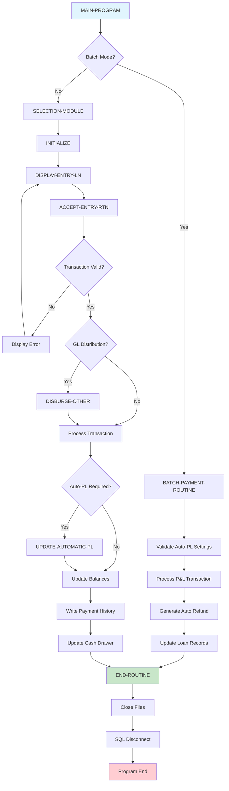
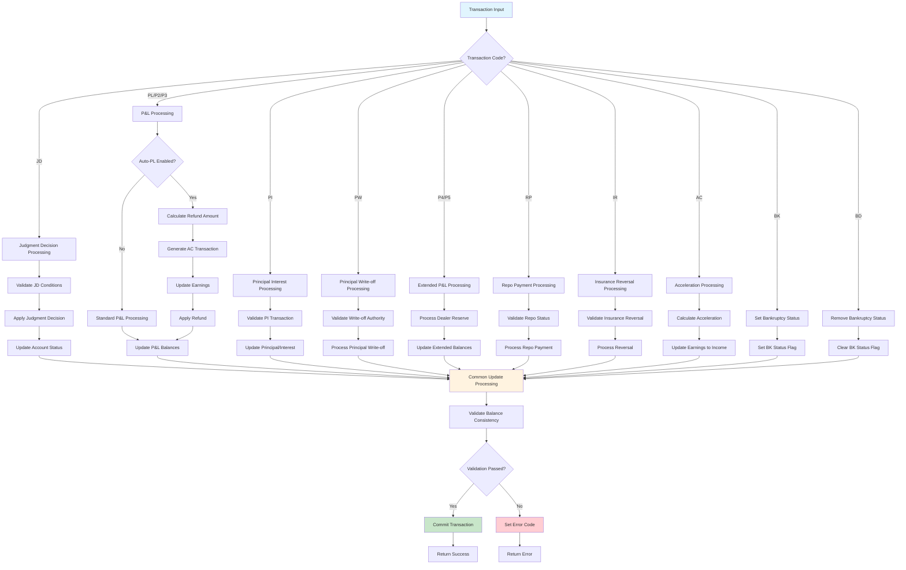
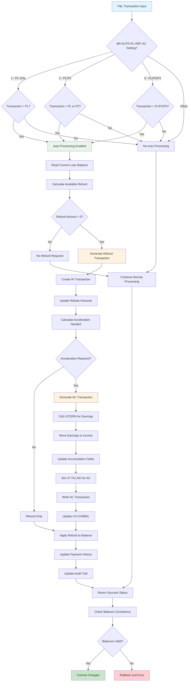
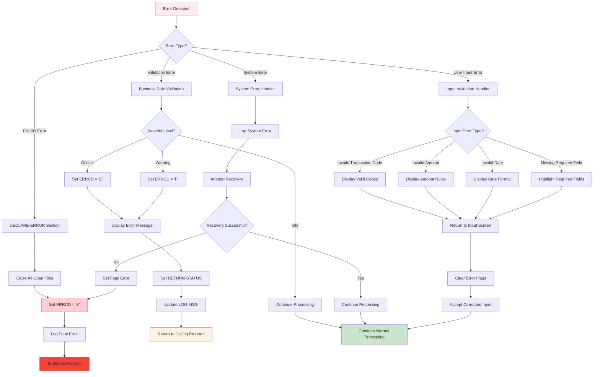
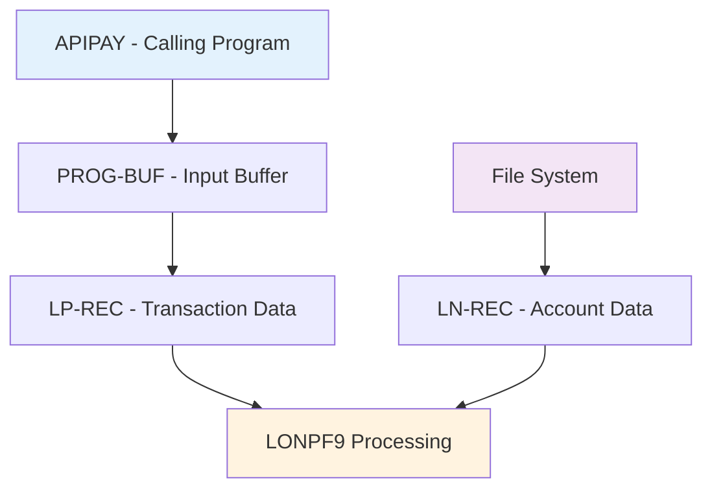
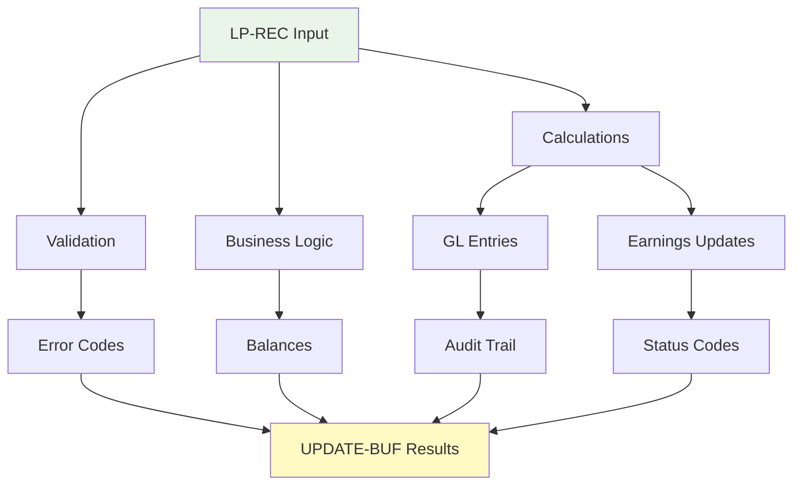
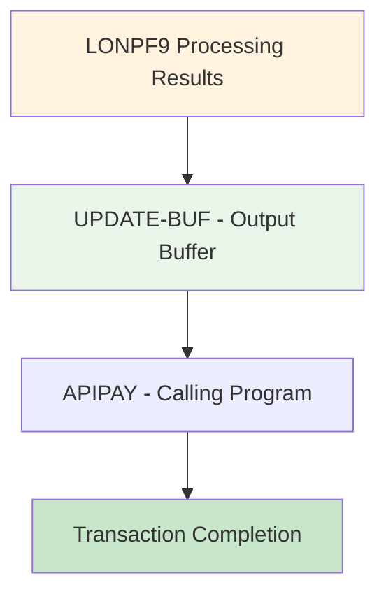
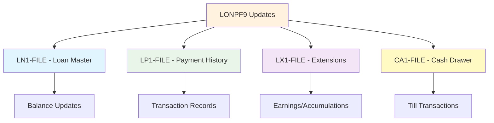
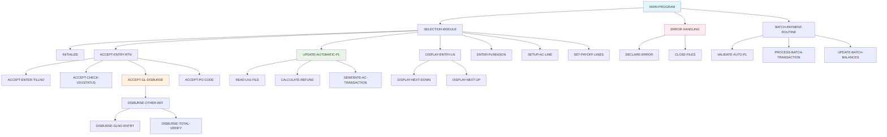

# LONPF9 - Loan Processing Transaction Posting System

**Location:** .\S35-Source\LP\LONPF9.CBL  
**Generated on:** July 22, 2025  
**Program ID:** LONPF9  
**Date Written:** March 13, 1986

## Table of Contents

1. [Program Overview](#program-overview)
2. [Transaction Types Supported](#transaction-types-supported)
3. [Input Parameters](#input-parameters)
4. [Output Fields](#output-fields)
5. [Program Flow Diagrams](#program-flow-diagrams)
6. [Batch Processing Timeline](#batch-processing-timeline)
7. [Paragraph-Level Flow Explanation](#paragraph-level-flow-explanation)
8. [Data Flow Mapping](#data-flow-mapping)
9. [Referenced Programs](#referenced-programs)
10. [Error Handling and Validation](#error-handling-and-validation)
11. [Technical Implementation](#technical-implementation)
12. [Integration Points](#integration-points)
13. [File Dependencies](#file-dependencies)
14. [Call Graph of PERFORMed Paragraphs](#call-graph-of-performed-paragraphs)

---

## Program Overview

**LONPF9** is a sophisticated COBOL loan processing program specifically designed for **Transaction Posting** in a loan servicing system. It serves as **Program 9** in the loan processing suite and handles specialized transaction types including partial payoffs, payoffs, insurance reversals, accelerations, and bankruptcy status management.

### Key Characteristics

- **Execution Mode:** Interactive screen-based processing with batch payment capabilities
- **Primary Function:** Transaction posting for specialized loan operations and payoff scenarios
- **Transaction Focus:** Handles "JD", "PL", "PI", "PW", "P2", "P3", "P4", "P5", "RP", "IR", "AC", "BK", "BD" transaction codes
- **Integration:** Part of the larger LONPF family of loan processing programs
- **Screen Interface:** Uses VDU (Video Display Unit) forms for user interaction with comprehensive validation

### Business Purpose

LONPF9 serves critical functions in loan servicing by:

1. **Payoff Management:** Processes various types of loan payoffs (full and partial)
2. **Judgment Decisions:** Handles judgment decision postings and accelerations
3. **Insurance Processing:** Manages insurance reversal transactions and adjustments
4. **Bankruptcy Management:** Sets and removes bankruptcy status codes
5. **Acceleration Processing:** Handles account acceleration scenarios
6. **Batch Payment Support:** Provides automated transaction posting for batch payment systems
7. **Dealer Reserve Management:** Processes dealer reserve adjustments and handling
8. **P&L Processing:** Manages profit and loss transactions with automatic refund capabilities

### Historical Context

Originally created in March 1986, LONPF9 has evolved through numerous enhancements:

- **Major Revisions:** Over 150+ documented changes since inception
- **Recent Additions:** Batch payment routines (2022), enhanced cash drawer support (2016-2017)
- **Compliance Updates:** 8-digit date support (2017), global file management improvements
- **Integration Enhancements:** Enhanced APIPAY integration, inter-branch payment support

---

## Transaction Types Supported

LONPF9 supports the following transaction codes:

### Primary Transaction Types

| Transaction Code | Description | Business Purpose |
|------------------|-------------|------------------|
| **JD** | Judgment Decision | Posts judgment decisions and account accelerations |
| **PL** | Partial Payoff/P&L | Handles partial loan payoffs and profit/loss adjustments |
| **PI** | Principal Interest | Processes principal and interest adjustments |
| **PW** | Principal Write-off | Manages principal write-off transactions |
| **P2** | P&L Type 2 | Secondary profit/loss transaction processing |
| **P3** | P&L Type 3 | Tertiary profit/loss transaction processing |
| **P4** | P&L Type 4 | Quaternary profit/loss transaction processing |
| **P5** | P&L Type 5 | Quinary profit/loss transaction processing |
| **RP** | Repo Payment | Processes repossession-related payments |
| **IR** | Insurance Reversal | Handles insurance reversal transactions |
| **AC** | Acceleration | Processes account acceleration scenarios |
| **BK** | Bankruptcy Status | Sets bankruptcy status on accounts |
| **BD** | Bankruptcy Discharge | Removes bankruptcy status from accounts |

### Automatic Processing Features

- **Auto-PL-REF-AC:** Automatic partial payoff refund and acceleration
- **Dealer Reserve Management:** Automatic handling of negative dealer reserves
- **Earnings Integration:** Real-time earnings calculation and updating
- **GL Distribution:** Automatic general ledger entry distribution

---

## Input Parameters

### Primary Input Structure (PROG-BUF)

#### Loan Processing Buffer (LP-REC)
```cobol
LP-BRNO              PIC 9(03)      - Branch Number
LP-ACCTNO            PIC 9(06)      - Account Number  
LP-TRCD              PIC X(02)      - Transaction Code
LP-TRAMT             PIC 9(07)V99   - Transaction Amount
LP-PAYDATE           PIC 9(08)      - Payment Date (CCYYMMDD)
LP-REFNO             PIC X(10)      - Reference Number
LP-TILLNO            PIC 9(02)      - Till Number
LP-IBPC              PIC X(01)      - Inter-branch/Principal Code
LP-PLREASON          PIC X(02)      - P&L Reason Code
LP-POCD              PIC X(02)      - Payoff Code
```

#### Transaction Processing Fields
```cobol
LP-APRIN             PIC 9(07)V99   - Applied to Principal
LP-APINT             PIC 9(07)V99   - Applied to Interest  
LP-APLC              PIC 9(07)V99   - Applied to Late Charges
LP-APOTH             PIC 9(07)V99   - Applied to Other
LP-APOT2             PIC 9(07)V99   - Applied to Other 2
LP-CURBAL            PIC S9(07)V99  - Current Balance
LP-INTDUE            PIC 9(07)V99   - Interest Due
LP-LCDUE             PIC 9(07)V99   - Late Charges Due
```

### Branch Processing Parameters

```cobol
BR-AUTO-PL-REF-AC    PIC X(01)      - Auto P&L Refund/Acceleration
BR-PASSWORD-DRAWER   PIC X(01)      - Password Required for Drawer
BR-GL-TYPE-ALLOWED   PIC X(20)      - Allowed GL Types
BR-GL-ENTRY-DEFAULT  PIC X(01)      - Default GL Entry Method
```

### State Processing Parameters

```cobol
SP-ERNFRMLA          PIC X(02)      - Earnings Formula Code
SP-ERNACCEL-CD       PIC X(01)      - Earnings Acceleration Code
SP-ERNJD-CD          PIC X(01)      - Earnings JD Code
SP-LCFRMLA           PIC X(02)      - Late Charge Formula
```

---

## Output Fields

### Transaction Results (UPDATE-BUF)

#### Updated Loan Record Fields
```cobol
LN-CURBAL            PIC S9(07)V99  - Updated Current Balance
LN-PRINBAL           PIC 9(07)V99   - Updated Principal Balance
LN-INTDUE            PIC 9(07)V99   - Updated Interest Due
LN-LCDUE             PIC 9(07)V99   - Updated Late Charges Due
LN-OTHDUE            PIC 9(07)V99   - Updated Other Due
LN-OT2DUE            PIC 9(07)V99   - Updated Other 2 Due
LN-TOTPAYMNTD        PIC 9(08)V99   - Total Payments Made
LN-TOTINT            PIC 9(08)V99   - Total Interest Collected
LN-TOTLCHG           PIC 9(08)V99   - Total Late Charges
```

#### Processing Status Fields
```cobol
ERRCD                PIC X(01)      - Error Code (Space=Success)
ROUTE-CD             PIC X(02)      - Routing Code
POSTING-ERRCD        PIC X(01)      - Posting Error Code
RETURN-STATUS        PIC 9(02)      - Return Status Code
```

#### Audit Trail Fields
```cobol
LP-SEQNO             PIC 9(04)      - Sequence Number
LP-USERID            PIC X(08)      - User ID
LP-TIMESTAMP         PIC X(14)      - Transaction Timestamp
LOG-MSG              PIC X(30)      - Log Message
```

---

## Program Flow Diagrams

### Main Program Flow



### Transaction Processing Flow



### Auto P&L Processing Flow  



### Error Handling Flow



---

## Batch Processing Timeline

```mermaid
gantt
    title LONPF9 Batch Processing Timeline
    dateFormat HH:mm
    axisFormat %H:%M
    
    section System Startup
    Initialize SQL Connection    :active, init, 00:00, 00:01
    Load Configuration Files     :config, after init, 00:02
    Validate Environment         :env, after config, 00:01
    
    section Batch Processing
    Read Batch Input File        :batch-read, after env, 00:05
    Validate Batch Transactions  :batch-val, after batch-read, 00:10
    Process P&L Transactions     :pl-proc, after batch-val, 00:15
    Generate Auto Refunds        :auto-ref, after pl-proc, 00:08
    Update Loan Balances         :balance-upd, after auto-ref, 00:12
    
    section Earnings Processing
    Calculate Earnings           :earn-calc, after balance-upd, 00:10
    Update Accumulations         :accum-upd, after earn-calc, 00:05
    Generate GL Entries          :gl-gen, after accum-upd, 00:08
    
    section Audit and Reporting
    Write Payment History        :pay-hist, after gl-gen, 00:06
    Update Cash Drawer           :cash-draw, after pay-hist, 00:03
    Generate Transaction Log     :trans-log, after cash-draw, 00:04
    Create Batch Report          :batch-rep, after trans-log, 00:05
    
    section System Cleanup
    Close Database Connections   :db-close, after batch-rep, 00:02
    Archive Processed Files      :archive, after db-close, 00:03
    System Shutdown              :shutdown, after archive, 00:01
```



---

## Paragraph-Level Flow Explanation

### 1. MAIN-PROGRAM Section

**Purpose:** Program initialization and control flow management

**Key Operations:**
- Establishes SQL connection for database operations
- Validates state parameters and branch records  
- Sets up control variables and screen forms
- Determines batch vs. interactive processing mode
- Performs environment variable setup

**Control Flow:**
```cobol
MAIN-PROGRAM → 
  BATCH-PAYMENT-ROUTINE (if batch mode) OR
  SELECTION-MODULE (if interactive mode) →
  END-ROUTINE
```

### 2. BATCH-PAYMENT-ROUTINE Section

**Purpose:** Handles automated batch payment processing

**Key Operations:**
- Validates automatic P&L refund configurations
- Processes P&L transactions with automatic refunds
- Handles dealer reserve acceptance/rejection
- Manages earnings calculations for batch transactions
- Updates loan records without user interaction

**Validation Logic:**
- Checks BR-AUTO-PL-REF-AC settings for automatic processing
- Validates transaction amounts against account balances
- Ensures proper earnings formula application

### 3. SELECTION-MODULE Section

**Purpose:** Interactive transaction processing and user interface management

**Key Operations:**
- Displays loan account information and current balances
- Handles user input for transaction details
- Validates transaction codes and amounts
- Processes GL (General Ledger) distribution entries
- Manages screen flow and user prompts

**Transaction Flow:**
```cobol
INITIALIZE → 
  DISPLAY-ENTRY-LN → 
  ACCEPT-ENTRY-RTN → 
  PROCESS-TRANSACTION → 
  UPDATE-RECORDS
```

### 4. INITIALIZE Section

**Purpose:** Sets up transaction-specific processing parameters

**Key Operations:**
- Initializes working storage areas
- Sets up earnings calculation parameters
- Configures account-specific settings
- Prepares GL distribution buffers
- Sets transaction validation flags

### 5. ACCEPT-ENTRY-RTN Section

**Purpose:** Handles user input validation and screen processing

**Key Operations:**
- Validates transaction codes against allowed types
- Checks transaction amounts for reasonableness
- Handles cash drawer number entry
- Manages payoff code entry and validation
- Processes GL distribution overrides

### 6. UPDATE-AUTOMATIC-PL Section

**Purpose:** Processes automatic P&L refund and acceleration

**Key Operations:**
- Calculates refund amounts based on configurations
- Generates automatic "AC" (acceleration) transactions
- Updates earnings and accumulation fields
- Maintains proper audit trail
- Ensures balance consistency

**Logic Flow:**
1. Determines if automatic processing applies
2. Calculates refund amounts
3. Posts refund transaction
4. Generates acceleration transaction if needed
5. Updates all related balances

### 7. Error Handling Paragraphs

**DECLARE-ERROR Section:** Manages file I/O errors and system failures
**Validation Routines:** Check transaction validity and business rules
**Status Management:** Updates return codes and error messages

---

## Data Flow Mapping

### Input Data Flow



### Processing Data Flow



### Output Data Flow



### File Update Flow



---

## Referenced Programs

### External Program Calls

| Program | Purpose | Called From |
|---------|---------|-------------|
| **LPEARN** | Earnings calculations | Multiple paragraphs |
| **LPCERN** | Earnings processing | Automatic PL routines |
| **LPREGZ** | Revolving account processing | Transaction validation |
| **ALLENT** | GL distribution entry | GL processing routines |
| **PAYOFX** | Payoff calculations | Payoff processing |
| **RBACT** | Balloon payment calculations | Actuarial method processing |

### Copy Members (Include Files)

| Copy Member | Purpose |
|-------------|---------|
| **LP01LP.CPY** | Loan payment record structure |
| **LP01LN.CPY** | Loan master record structure |
| **LP01LX.CPY** | Loan extension record structure |
| **LP01SP.CPY** | State parameter record structure |
| **LP01BR.CPY** | Branch parameter record structure |
| **LONPF_SCN.CPY** | Screen layout definitions |

---

## Error Handling and Validation

### Error Code Management

| Error Code | Description | Action Required |
|------------|-------------|-----------------|
| **X** | Fatal system error | Program termination |
| **E** | Business rule violation | Transaction rejected |
| **P** | Processing warning | Continue with caution |
| **Space** | Successful processing | Normal completion |

### Common Error Conditions

#### 1. Balance Validation Errors
- **Negative balance conditions:** Prevents accounts from going below allowable limits
- **Insufficient funds:** Validates payment amounts against available balances
- **Payoff amount validation:** Ensures payoff amounts are accurate

#### 2. Transaction Code Validation
- **Invalid transaction codes:** Rejects unsupported transaction types
- **Branch-specific restrictions:** Enforces branch-level transaction limits
- **Date validation:** Ensures transaction dates are reasonable

#### 3. Business Rule Validation
- **Earnings formula compliance:** Validates against state-specific earnings rules
- **GL distribution validation:** Ensures proper general ledger account usage
- **Automatic processing validation:** Validates auto-PL configurations

### Validation Routines

#### ACCEPT-CHECK-VDUSTATUS
- Validates screen input and user responses
- Handles function key processing (F1-Help, F4-Bypass, etc.)
- Manages screen flow control

#### Business Rule Validation
- Checks account status compatibility with transaction type
- Validates amount ranges and limits
- Ensures proper authorization levels

---

## Technical Implementation

### Data Structures

#### Working Storage Key Variables
```cobol
77  F4-FLAG              PIC 9(01)    - Bypass flag
77  DISP-REV-BAL         PIC X(01)    - Display reversal balances
77  DF-TEST              PIC X(01)    - Deferment test flag
77  INDU-INTEREST        PIC 9(07)V99 - Induced interest amount
```

#### Critical Copy Members
- **LPWSLP.CPY:** Loan processing working storage
- **LPWSLX.CPY:** Extension working storage  
- **LPWSLN.CPY:** Loan master working storage

### File Handling

#### Primary Files Used
- **LN1-FILE:** Loan master file (Input/Output)
- **LP1-FILE:** Payment history file (Output)
- **LX1-FILE:** Loan extension file (Input/Output)
- **SP1-FILE:** State parameters (Input)
- **BR-FILE:** Branch parameters (Input)
- **CA1-FILE:** Cash drawer file (Output)

### Key Algorithms

#### 1. Automatic P&L Processing Algorithm
```cobol
IF (LP-TRCD = "PL" AND BR-AUTO-PL-REF-AC = "1") OR
   (LP-TRCD = "P2" AND BR-AUTO-PL-REF-AC = "2" OR "3") OR  
   (LP-TRCD = "P3" AND BR-AUTO-PL-REF-AC = "3")
   PERFORM UPDATE-AUTOMATIC-PL
```

#### 2. Earnings Calculation Integration
- Real-time earnings computation using LPEARN/LPCERN
- Support for multiple earnings formulas (15, 16, 23)
- Integration with actuarial method calculations

#### 3. Balance Management Algorithm
- Maintains current balance consistency
- Updates principal, interest, and other balances
- Handles negative balance scenarios appropriately

---

## Integration Points

### APIPAY Integration

LONPF9 is called from APIPAY with the following transaction codes:
- **"PL", "P2", "P3"** transactions route to LONPF9
- Integrated through FORM-PROGX calling mechanism
- Uses standard PROG-BUF and UPDATE-BUF interfaces

### Inter-branch Processing

- **Password Protection:** Inter-branch transactions require special authorization
- **Branch Validation:** Validates source and target branch permissions
- **Cash Drawer Management:** Handles multi-branch cash drawer scenarios

### Real-time System Integration

- **SQL Database Connectivity:** Uses embedded SQL for real-time data access
- **Earnings System Integration:** Real-time earnings calculation and posting
- **GL System Integration:** Automatic general ledger entry creation

---

## File Dependencies

### Input Files

| File | Purpose | Access Mode |
|------|---------|-------------|
| **LN1-FILE** | Loan master records | Read/Write |
| **SP1-FILE** | State processing parameters | Read Only |
| **BR-FILE** | Branch configuration parameters | Read Only |
| **DL1-FILE** | Dealer information | Read Only |
| **CD1-FILE** | Code table definitions | Read Only |

### Output Files

| File | Purpose | Update Type |
|------|---------|-------------|
| **LP1-FILE** | Payment transaction history | Insert |
| **LX1-FILE** | Loan extensions/earnings | Update |
| **CA1-FILE** | Cash drawer transactions | Insert |
| **LXG1-FILE** | GL distribution records | Insert |

### Temporary Files

| File | Purpose | Scope |
|------|---------|-------|
| **WK-FILE** | Working file for calculations | Program execution |

---

## Call Graph of PERFORMed Paragraphs



### Key Performance Flow

1. **MAIN-PROGRAM** calls **BATCH-PAYMENT-ROUTINE** or **SELECTION-MODULE**
2. **SELECTION-MODULE** performs **INITIALIZE** → **DISPLAY-ENTRY-LN** → **ACCEPT-ENTRY-RTN**
3. **ACCEPT-ENTRY-RTN** performs validation and calls **UPDATE-AUTOMATIC-PL** if needed
4. Error handling performed through **DECLARE-ERROR** section
5. All paths converge at **END-ROUTINE** for cleanup and termination

### Critical Subroutine Dependencies

- **File Access Routines:** OPEN/READ/WRITE/CLOSE operations for all files
- **Screen Management:** VDU display and accept routines
- **Calculation Routines:** Earnings, balance, and GL distribution calculations
- **Validation Routines:** Business rule and data validation checks

---

## Performance Considerations

### Optimization Features

- **Batch Processing Mode:** Reduces overhead for multiple transactions
- **Efficient File Access:** Strategic file opening/closing to minimize I/O
- **Screen Caching:** Optimized screen display and refresh operations

### Resource Management

- **Memory Usage:** Optimized working storage allocation
- **SQL Connection Management:** Efficient database connection handling  
- **File Buffer Management:** Proper buffer allocation for high-volume processing

---

## Security and Compliance

### Access Control

- **Password Protection:** Required for sensitive operations
- **Branch Authorization:** Enforces branch-level security restrictions
- **User Audit Trail:** Comprehensive logging of all user actions

### Compliance Features

- **Regulatory Compliance:** Supports state-specific regulatory requirements
- **Audit Requirements:** Maintains detailed transaction logs
- **Data Integrity:** Comprehensive validation and consistency checks
