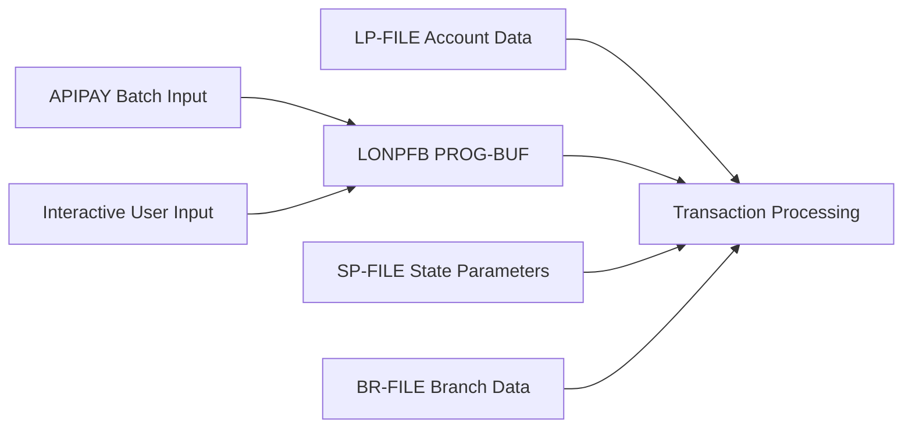
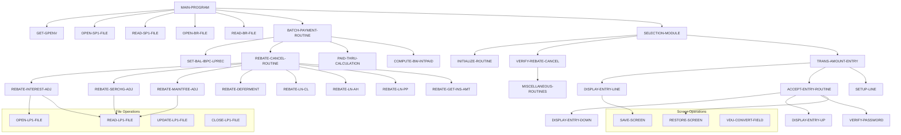

# LONPFB - Loan Processing Transaction Posting System

**Location:** .\S35-Source\LP\LONPFB.CBL  
**Generated on:** July 22, 2025  
**Program ID:** LONPFB  
**Date Written:** March 18, 1986

## Table of Contents

1. [Program Overview](#program-overview)
2. [Transaction Types Supported](#transaction-types-supported)
3. [Input Parameters](#input-parameters)
4. [Output Fields](#output-fields)
5. [Program Flow Diagrams](#program-flow-diagrams)
6. [Batch Processing Timeline](#batch-processing-timeline)
7. [Paragraph-Level Flow Explanation](#paragraph-level-flow-explanation)
8. [Data Flow Mapping](#data-flow-mapping)
9. [Referenced Programs](#referenced-programs)
10. [Error Handling and Validation](#error-handling-and-validation)
11. [Technical Implementation](#technical-implementation)
12. [Integration Points](#integration-points)
13. [File Dependencies](#file-dependencies)
14. [Call Graph of PERFORMed Paragraphs](#call-graph-of-performed-paragraphs)

---

## Program Overview

**LONPFB** is a sophisticated COBOL loan processing program specifically designed for **Transaction Posting** in a loan servicing system. It serves as **Program 11** in the loan processing suite and handles rebate calculations, cancellations, and various payment transaction types.

### Key Characteristics

- **Execution Mode:** Interactive screen-based processing with batch capabilities
- **Primary Function:** Transaction posting with rebate and cancellation processing
- **Transaction Focus:** Handles "R" and "C" series transaction codes for rebates and cancellations
- **Integration:** Part of the larger LONPF family of loan processing programs
- **Screen Interface:** Uses VDU (Video Display Unit) forms for user interaction

### Business Purpose

LONPFB serves critical functions in loan servicing by:

1. **Rebate Processing:** Calculates and applies insurance rebates, interest rebates, and fee rebates
2. **Transaction Cancellation:** Handles cancellation of various loan charges and fees
3. **Insurance Management:** Processes credit life, accident & health, and property protection insurance rebates
4. **Batch Payment Support:** Provides automated transaction posting for batch payment systems
5. **Audit Trail:** Maintains comprehensive transaction logs for compliance and tracking
6. **Integration Support:** Interfaces with multiple loan processing modules (LONPF series)

### Historical Context

The program has evolved significantly since 1986 with major enhancements including:
- Insurance rebate formula improvements (multiple revisions)
- Batch payment reference code support
- Cash drawer password integration
- Monthly insurance premium (MIP) handling
- Mexican formula support for international operations
- Enhanced error handling and validation

---

## Transaction Types Supported

LONPFB processes two main categories of transaction codes:

### R-Series Transactions (Rebates)
| Code | Description | Purpose |
|------|-------------|---------|
| **RC** | Rebate Credit Life | Processes credit life insurance rebates |
| **RA** | Rebate Accident & Health | Handles accident and health insurance rebates |
| **RP** | Rebate Property Protection | Manages property protection insurance rebates |
| **R1** | Rebate Insurance Type 1 | Custom insurance rebate type 1 |
| **R2** | Rebate Insurance Type 2 | Custom insurance rebate type 2 |
| **R3** | Rebate Insurance Type 3 | Custom insurance rebate type 3 |
| **RI** | Rebate Interest | Interest rebate calculations |
| **RS** | Rebate Service Charge | Service charge rebate processing |
| **RM** | Rebate Maintenance Fee | Maintenance fee rebate calculations |
| **RD** | Rebate Deferment | Deferment fee rebate processing |

### C-Series Transactions (Cancellations)
| Code | Description | Purpose |
|------|-------------|---------|
| **CC** | Cancel Credit Life | Cancels credit life insurance charges |
| **CA** | Cancel Accident & Health | Cancels accident and health insurance |
| **CP** | Cancel Property Protection | Cancels property protection insurance |
| **C1** | Cancel Insurance Type 1 | Custom insurance cancellation type 1 |
| **C2** | Cancel Insurance Type 2 | Custom insurance cancellation type 2 |
| **C3** | Cancel Insurance Type 3 | Custom insurance cancellation type 3 |
| **CD** | Cancel Deferment | Cancels deferment charges |

### Special Transaction Codes
| Code | Description | Purpose |
|------|-------------|---------|
| **F9** | Automatic Payoff Rebate | Triggers automatic rebate calculations for payoffs |
| **PO** | Payoff Processing | Handles loan payoff with associated rebates |

---

## Input Parameters

### Primary Input Structure
The program receives input through the `PROG-BUF` parameter which contains:

```cobol
FORM-PATHNAME     - VDU form path for screen display
EXIT-PATHNAME     - Return path after processing
PROG-BUF          - Program control buffer
UPDATE-BUF        - Transaction update buffer
```

### Transaction Input Fields
| Field | Type | Description |
|-------|------|-------------|
| **LP-TRCD** | PIC XX | Transaction code (RC, RA, RP, etc.) |
| **LP-TRAMT** | PIC S9(7)V99 | Transaction amount |
| **LP-ACNO** | PIC 9(6) | Account number |
| **LP-PDTH-DATE** | PIC 9(8) | Paid through date |
| **LP-INTPAID** | PIC S9(7)V99 | Interest paid amount |
| **LP-APCUR** | PIC S9(7)V99 | Applied current amount |

### Batch Payment Input
For batch processing via APIPAY:
```cobol
HOLD-BP-TRCD      - Batch payment transaction code
HOLD-LN-*         - Various loan field holders
```

### Screen Input Fields
| Field | Format | Description |
|-------|--------|-------------|
| **Account Number** | 9(6) | Target loan account |
| **Transaction Code** | XX | R or C series code |
| **Amount** | Z(5).99- | Transaction amount |
| **Rate** | ZZZZ.999- | Interest rate (when applicable) |
| **Date Fields** | MM/DD/YY | Various date inputs |

---

## Output Fields

### Transaction Output Structure
| Field | Type | Description |
|-------|------|-------------|
| **LP-CURBAL** | PIC S9(7)V99 | Updated current balance |
| **LP-INTPAID** | PIC S9(7)V99 | Computed interest paid |
| **LP-PDTH-DATE** | PIC 9(8) | Updated paid through date |
| **LP-APCUR** | PIC S9(7)V99 | Applied current amount |

### Rebate Calculation Results
| Field | Type | Description |
|-------|------|-------------|
| **REB-AMOUNT(1-16)** | PIC S9(7)V99 | Calculated rebate amounts by type |
| **REB-LN-INTREBATE** | PIC S9(7)V99 | Interest rebate amount |
| **REB-LN-SC-REBATE** | PIC S9(7)V99 | Service charge rebate |
| **REB-LN-MF-REBATE** | PIC S9(7)V99 | Maintenance fee rebate |
| **REB-LN-DF-REBATE** | PIC S9(7)V99 | Deferment fee rebate |

### Screen Display Output
The program displays a formatted transaction entry screen showing:
- Account information and balances
- Transaction details and amounts
- Calculated rebates and adjustments
- Error messages and validation results

### File Updates
| File | Purpose |
|------|---------|
| **LP-FILE** | Primary loan record updates |
| **LX-FILE** | Transaction history updates |
| **LXE-FILE** | Earnings record updates |
| **LTI-FILE** | Transaction index updates |
| **LTP-FILE** | Transaction posting file |

---

## Program Flow Diagrams

### [High-Level Processing Flow](Diagrams/LONPFB_Main_Flow.mmd)

### [Transaction Processing Flow](Diagrams/LONPFB_Transaction_Processing.mmd)

### [Rebate Calculation Flow](Diagrams/LONPFB_Rebate_Calculation.mmd)

### [Error Handling Flow](Diagrams/LONPFB_Error_Handling.mmd)

---

## Batch Processing Timeline

```mermaid
gantt
    title LONPFB Batch Processing Timeline
    dateFormat X
    axisFormat %s
    
    section Initialization
    Program Start          :0, 1
    Parameter Validation   :1, 2
    File Opening          :2, 3
    Environment Setup     :3, 4
    
    section Main Processing
    Account Validation    :4, 6
    Transaction Setup     :6, 8
    Rebate Calculations   :8, 12
    Amount Validations    :12, 14
    
    section Transaction Posting
    Balance Updates       :14, 16
    File Updates         :16, 18
    Audit Trail Creation :18, 19
    
    section Completion
    Screen Updates       :19, 20
    File Cleanup        :20, 21
    Program Exit        :21, 22
```



---

## Paragraph-Level Flow Explanation

### Main Program Control Flow

**MAIN-PROGRAM SECTION**
- **Purpose:** Primary program controller and initialization
- **Flow:** Calls initialization → batch/interactive processing → cleanup
- **Key Actions:** SQL connection, environment setup, file opening

**BATCH-PAYMENT-ROUTINE SECTION**
- **Purpose:** Handles automated batch payments from APIPAY
- **Flow:** Balance setup → rebate processing → amount calculations → file updates
- **Key Actions:** Sets LP-TRAMT to LP-APCUR, updates LP-CURBAL, computes paid-through dates

**SELECTION-MODULE SECTION**
- **Purpose:** Interactive user interface for transaction selection
- **Flow:** Screen display → user input → validation → processing dispatch
- **Key Actions:** VDU form management, user interaction, transaction routing

### Transaction Processing Flow

**VERIFY-REBATE-CANCEL SECTION**
- **Purpose:** Validates rebate and cancellation transactions
- **Flow:** Account validation → transaction type validation → amount validation
- **Key Actions:** Checks account status, validates transaction codes, verifies amounts

**REBATE-CANCEL-ROUTINE SECTION**
- **Purpose:** Core rebate and cancellation processing logic
- **Flow:** Setup rebate parameters → calculate amounts → apply adjustments
- **Key Actions:** Rebate calculations, balance adjustments, earning computations

**TRANS-AMOUNT-ENTRY SECTION**
- **Purpose:** Interactive transaction amount entry and validation
- **Flow:** Display entry screen → accept user input → validate amounts
- **Key Actions:** Amount formatting, user validation, error handling

### Display and Interface Management

**DISPLAY-ENTRY-LINE SECTION**
- **Purpose:** Formats and displays transaction entry lines
- **Flow:** Setup display buffer → format amounts → display screen
- **Key Actions:** Screen formatting, amount display, field positioning

**ACCEPT-ENTRY-ROUTINE SECTION**
- **Purpose:** Handles user input and keyboard interactions
- **Flow:** Accept user input → process function keys → validate entries
- **Key Actions:** User input processing, function key handling, validation

### Rebate Calculation Sections

**REBATE-INTEREST-ADJ SECTION**
- **Purpose:** Calculates interest rebate adjustments
- **Flow:** Load interest parameters → calculate rebate → apply adjustments
- **Key Actions:** Interest calculations, rebate formulas, balance updates

**REBATE-SERCHG-ADJ SECTION**
- **Purpose:** Processes service charge rebate calculations
- **Flow:** Retrieve service charges → apply rebate formulas → update balances
- **Key Actions:** Service charge rebates, formula applications

**REBATE-MAINTFEE-ADJ SECTION**
- **Purpose:** Handles maintenance fee rebate processing
- **Flow:** Load maintenance fee data → calculate rebates → apply adjustments
- **Key Actions:** Maintenance fee rebates, pro-rated calculations

### Insurance Rebate Processing

**REBATE-LN-CL SECTION**
- **Purpose:** Credit life insurance rebate calculations
- **Flow:** Load insurance data → apply rebate formulas → update amounts
- **Key Actions:** Credit life rebates, insurance validations

**REBATE-LN-AH SECTION**
- **Purpose:** Accident & health insurance rebate processing
- **Flow:** Retrieve A&H data → calculate rebates → apply adjustments
- **Key Actions:** A&H rebate calculations, insurance amount updates

**REBATE-GET-INS-AMT SECTION**
- **Purpose:** Retrieves and calculates insurance amounts for rebates
- **Flow:** Load addon data → calculate insurance portions → set rebate amounts
- **Key Actions:** Insurance amount calculations, addon processing

---

## Data Flow Mapping

### Input Data Sources


### Key Data Transformations

| Source Field | Transformation | Target Field | Purpose |
|-------------|----------------|--------------|---------|
| HOLD-BP-TRCD | Direct assignment | LP-TRCD | Set transaction code for batch |
| LP-TRAMT | Copy to LP-APCUR | LP-APCUR | Apply transaction amount |
| LP-APCUR | Subtract from LP-CURBAL | LP-CURBAL | Update account balance |
| LN-1STPYDATE | Paid-through calculation | LP-PDTH-DATE | Update paid through date |
| Rebate calculations | Formula application | REB-AMOUNT(1-16) | Store calculated rebates |

### Data Flow Through Processing Steps

**Step 1: Input Validation**
- PROG-BUF → Field validation → Working storage
- Account number → LP-FILE read → LN-record validation

**Step 2: Transaction Setup**
- Transaction code → Transaction type determination
- Amount validation → LP-TRAMT field setup
- Date calculations → LP-PDTH-DATE computation

**Step 3: Rebate Calculations**
- Insurance data → Rebate formula application → REB-AMOUNT fields
- Interest data → Interest rebate calculation → REB-LN-INTREBATE
- Service charges → Service charge rebates → REB-LN-SC-REBATE

**Step 4: Balance Updates**
- Current balance calculations → LP-CURBAL updates
- Applied amounts → LP-APCUR adjustments
- Interest paid → LP-INTPAID calculations

**Step 5: File Updates**
- LP-record updates → LP-FILE write
- Transaction history → LX-FILE write
- Earnings updates → LXE-FILE write

---

## Referenced Programs

### Called Programs
| Program | Purpose | Integration Point |
|---------|---------|------------------|
| **LIBGB/REBATE** | Rebate calculation engine | Called for complex rebate formulas |
| **LIBLP/ADDONRB** | Addon rebate processing | Insurance addon rebate calculations |
| **LIBLP/ADDONSPR** | Addon insurance parameters | Insurance rate and term calculations |
| **LIBGB/GLENT** | General ledger entry | Financial posting and GL distribution |

### Calling Programs
| Program | Purpose | Relationship |
|---------|---------|-------------|
| **APIPAY** | Batch payment processing | Calls LONPFB for "RP" rebate transactions |
| **LONPF9** | Insurance payment processor | Calls LONPFB for automatic "PL" rebates |
| **Interactive Menu** | User interface | Direct user access to LONPFB |

### Copybooks and Libraries
| Copybook | Purpose |
|----------|---------|
| **LIBLP/LP01DL.CPY** | Direct loan record layout |
| **LIBLP/LP01LP.CPY** | Loan processing record layout |
| **LIBLP/LP01LX.CPY** | Transaction history layout |
| **LIBLP/LP01SP.CPY** | State parameter layout |
| **LIBGB/GB01BR.CPY** | Branch record layout |

---

## Error Handling and Validation

### Input Validation
| Validation Type | Error Condition | Error Message | Recovery Action |
|----------------|-----------------|---------------|----------------|
| **Account Validation** | Account not found | "INVALID ACCOUNT NUMBER" | Return to input |
| **Transaction Code** | Invalid code | "INVALID TRANSACTION CODE" | Prompt for valid code |
| **Amount Validation** | Negative or zero amount | "INVALID AMOUNT ENTERED" | Re-enter amount |
| **Date Validation** | Invalid date format | "INVALID DATE FORMAT" | Re-enter date |

### Business Rule Validation
| Rule | Condition | Action |
|------|-----------|--------|
| **Rebate Limit** | Rebate exceeds original charge | Display warning, require confirmation |
| **Account Status** | Account closed or charged off | Prevent transaction, display error |
| **Insurance Status** | Insurance not active | Skip insurance rebate calculation |
| **Batch vs Interactive** | Conflicting operation modes | Set appropriate processing flags |

### Error Recovery Mechanisms
1. **Screen Redisplay:** Invalid inputs redisplay entry screen with error message
2. **Transaction Rollback:** Failed transactions rollback file changes
3. **Audit Logging:** All errors logged for troubleshooting
4. **User Confirmation:** Critical operations require user confirmation

### Common Error Conditions
| Error | Cause | Resolution |
|-------|-------|------------|
| **File Not Found** | Missing data files | Check file availability, retry |
| **Record Lock** | Concurrent access | Wait and retry, or abort |
| **Calculation Error** | Invalid data for formulas | Validate input data, recalculate |
| **Permission Denied** | Insufficient user rights | Verify user permissions |

---

## Technical Implementation

### Data Structures

**Primary Working Storage Fields**
```cobol
01  REBATE-OVERRIDE-FG     PIC X              VALUE " ".
01  IO-TYPE                PIC X(3)           VALUE " ".
01  ELE                    PIC 99             VALUE 0.
01  FIRST-ELE              PIC 99             VALUE 0.
01  DISP-REV-BAL           PIC X              VALUE "Y".
01  LN-WK                  PIC 9(6)     COMP  VALUE 0.
01  SUB                    PIC 9(6)     COMP  VALUE 0.
01  WORKER                 PIC S9(7)V99 COMP.
01  ADDON-INT-WORKER       PIC S9(6)V99 COMP.
01  TOTEARN                PIC S9(6)V99 COMP.
01  EARNINGS-WORKER        PIC S9(6)V99 COMP.
```

**Transaction Buffer Structure**
```cobol
01  LN-BUF              VALUE SPACES.
    03  L-010           PIC 9(6).          /* Account Number */
    03  L-020           PIC XX.            /* Transaction Code */
    03  L-030           PIC X(5).          /* Date Field */
    03  L-040           PIC Z(5).99-.      /* Amount Field */
    03  L-050           PIC Z(4).99-.      /* Rate Field */
    03  L-060           PIC Z(4).99-.      /* Secondary Amount */
    03  L-070           PIC Z(5).99-.      /* Balance Field */
    03  L-080           PIC 9(4).          /* Term Field */
    03  L-090           PIC Z(5).99-.      /* Other Balance */
    03  L-100           PIC Z(4).99-.      /* Applied Amount */
    03  L-110           PIC Z(5)9.99-.     /* Total Field */
```

### File Handling

**File Access Patterns**
- **LP-FILE:** Random access by account number for loan records
- **LX-FILE:** Sequential append for transaction history
- **LXE-FILE:** Direct access for earnings updates
- **SP-FILE:** Read-only access for state parameters
- **WK-FILE:** Temporary work file for complex calculations

**Database Operations**
```cobol
PERFORM SQL-CONNECT.              /* Database connection */
PERFORM OPEN-LP1-FILE.           /* Open loan file */
PERFORM READ-LP1-FILE.           /* Read loan record */
PERFORM UPDATE-LP1-FILE.         /* Update loan record */
PERFORM CLOSE-LP1-FILE.          /* Close loan file */
```

### Key Algorithms

**Rebate Calculation Algorithm**
1. Retrieve original charge amount
2. Calculate elapsed term vs. original term
3. Apply appropriate rebate formula (Rule of 78, Actuarial, etc.)
4. Validate rebate amount against business rules
5. Update account balances and transaction history

**Paid-Through Date Calculation**
1. Load first payment date from LN-1STPYDATE
2. Apply payment frequency and term calculations
3. Compute new paid-through date based on payment amount
4. Validate date against account parameters
5. Update LP-PDTH-DATE field

---

## Integration Points

### APIPAY Integration
- **Trigger:** APIPAY calls LONPFB for "RP" transaction codes
- **Data Exchange:** Transaction data passed via HOLD-BP-TRCD variables
- **Processing Mode:** Batch mode with no user interaction
- **Return Values:** Success/failure status in ERRCD field

### LONPF9 Integration
- **Purpose:** Insurance payment processing calls LONPFB for rebates
- **Trigger:** Automatic "PL" (payoff) processing
- **Data Flow:** Insurance data and rebate calculations
- **Coordination:** Prevents duplicate rebate calculations

### Screen Interface Integration
- **VDU Forms:** Uses "LONPF" form family for user interface
- **Menu System:** Integrated with loan processing menu structure
- **Help System:** Context-sensitive help via LPSMNU
- **Navigation:** Standard function key navigation (F1-F12)

### Database Integration
- **SQL Connectivity:** Uses embedded SQL for database operations
- **Transaction Management:** Coordinated database commits/rollbacks
- **File Locking:** Automatic record locking for concurrent access
- **Backup/Recovery:** Participates in database backup procedures

---

## File Dependencies

### Input Files
| File | Purpose | Access Mode | Key Field |
|------|---------|-------------|-----------|
| **LP-FILE** | Loan master records | Random | LN-ACNO |
| **SP-FILE** | State parameters | Random | SP-STATE |
| **BR-FILE** | Branch configuration | Random | BR-NO |
| **DL-FILE** | Direct loan details | Random | DL-ACNO |
| **CA-FILE** | Cash advance records | Random | CA-ACNO |

### Output Files
| File | Purpose | Access Mode | Update Type |
|------|---------|-------------|-------------|
| **LP-FILE** | Updated loan records | Random | In-place update |
| **LX-FILE** | Transaction history | Sequential | Append |
| **LXE-FILE** | Earnings records | Random | Update/Add |
| **LTI-FILE** | Transaction index | Sequential | Append |
| **LTP-FILE** | Transaction posting | Sequential | Append |

### Temporary Files
| File | Purpose | Scope |
|------|---------|-------|
| **WK-FILE** | Working calculations | Program execution |
| **LOG-FILE** | Error and audit logging | Session |

### External Datasets
- **GL Interface:** General ledger posting files
- **Report Files:** Transaction reports and audit trails
- **Backup Files:** Automated backup datasets
- **Configuration:** Environment and parameter files

---

## Call Graph of PERFORMed Paragraphs



---

This comprehensive documentation provides a complete technical reference for the LONPFB program, suitable for developers, analysts, and system administrators who need to understand, maintain, or integrate with this loan processing system. The documentation covers all aspects from high-level business purpose to detailed technical implementation, making it accessible to readers with varying levels of COBOL and system knowledge.
