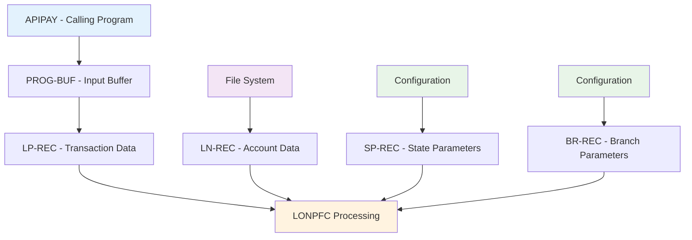
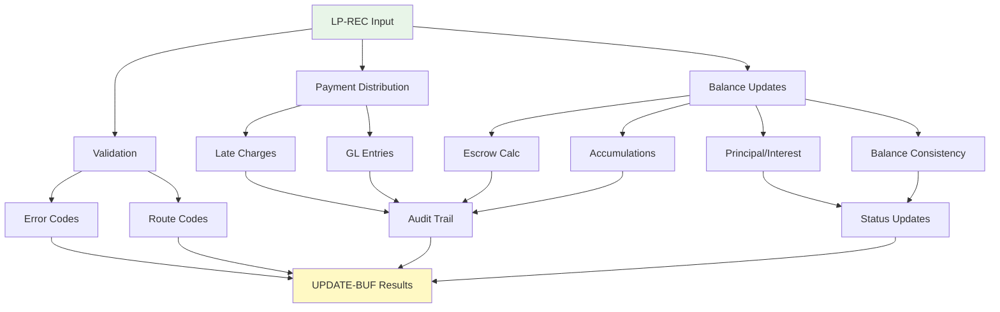
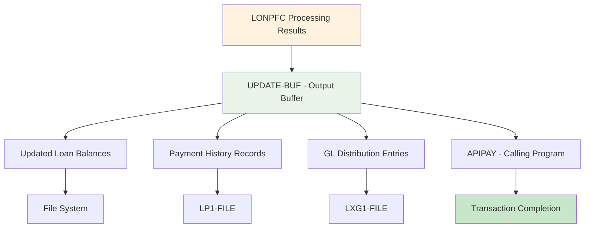
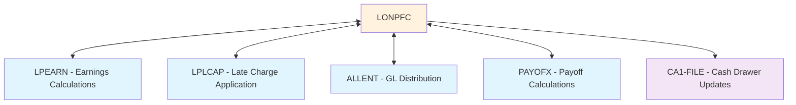
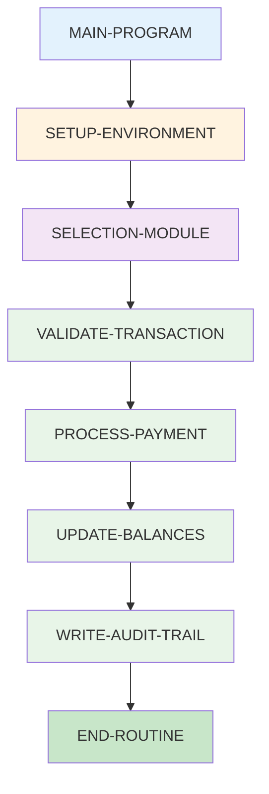
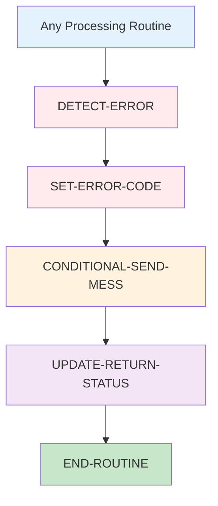
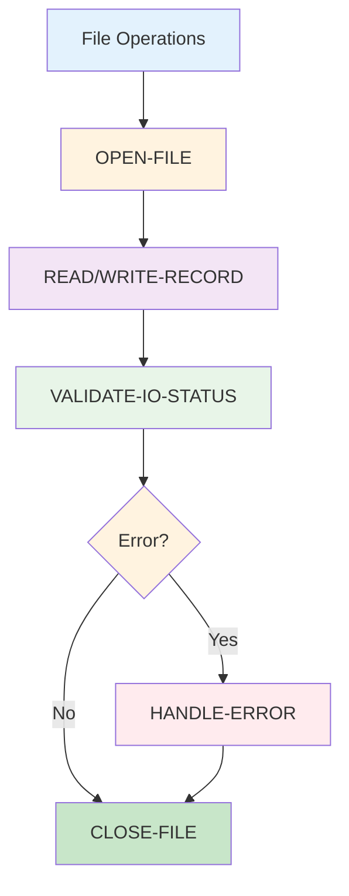

# LONPFC - Loan Processing Payment Transaction System

**Location:** .\S35-Source\LP\LONPFC.CBL  
**Generated on:** July 22, 2025  
**Program ID:** LONPFC  
**Date Written:** March 24, 1986

## Table of Contents

1. [Table of Contents](#table-of-contents)
2. [Program Overview](#program-overview)
3. [Transaction Types Supported](#transaction-types-supported)
4. [Input Parameters](#input-parameters)
5. [Output Fields](#output-fields)
6. [Program Flow Diagrams](#program-flow-diagrams)
7. [Batch Processing Timeline](#batch-processing-timeline)
8. [Paragraph-Level Flow Explanation](#paragraph-level-flow-explanation)
9. [Data Flow Mapping](#data-flow-mapping)
10. [Referenced Programs](#referenced-programs)
11. [Error Handling and Validation](#error-handling-and-validation)
12. [Technical Implementation](#technical-implementation)
13. [Integration Points](#integration-points)
14. [File Dependencies](#file-dependencies)
15. [Call Graph of PERFORMed Paragraphs](#call-graph-of-performed-paragraphs)

---

## Program Overview

**LONPFC** is a comprehensive COBOL loan processing program specifically designed for **Payment Transaction Processing** in a loan servicing system. It serves as **Program 12** in the loan processing suite and handles the core payment processing functions including regular payments, deferments, partial charge-offs, and various specialized payment types.

### Key Characteristics

- **Execution Mode:** Interactive screen-based processing with real-time validation
- **Primary Function:** Core payment transaction processing and balance management
- **Transaction Focus:** Handles "PY", "PA", "PE", "DF", "D2-D9", "PR", "PC", "PP", "Z2", "SS", "AH", "PX", "PN", "PZ", "IN" transaction codes
- **Integration:** Central payment processor in the LONPF family with extensive external integrations
- **Screen Interface:** Advanced VDU (Video Display Unit) forms with comprehensive validation and user guidance

### Business Purpose

LONPFC serves as the primary payment processing engine by:

1. **Regular Payment Processing:** Handles standard customer payments with automatic distribution
2. **Deferment Management:** Processes all types of payment deferments (DF, D2-D9)
3. **Payment Exceptions:** Manages payment exception scenarios and adjustments
4. **Escrow Processing:** Handles escrow account management and distributions
5. **Charge-off Processing:** Processes partial and full charge-off transactions
6. **Non-cash Payments:** Manages non-cash payment types with GL integration
7. **Revolving Account Support:** Specialized processing for revolving credit accounts
8. **Late Charge Management:** Automatic late charge application and management
9. **Inter-branch Payments:** Handles cross-branch payment processing with proper authorization

### Historical Context

Originally created in March 1986, LONPFC has undergone extensive evolution:

- **Major Revisions:** Over 200+ documented changes since inception
- **Core Enhancements:** Revolving account support (1998), real-time earnings integration (1996)
- **Compliance Updates:** 8-digit date support (2017), enhanced escrow processing
- **Security Enhancements:** Password protection for sensitive operations, audit trail improvements
- **Integration Improvements:** Enhanced GL integration, real-time balance management

---

## Transaction Types Supported

LONPFC supports the following comprehensive set of transaction codes:

### Primary Payment Transaction Types

| Transaction Code | Description | Business Purpose |
|------------------|-------------|------------------|
| **PY** | Regular Payment | Standard customer payment processing |
| **PA** | Payment Allocation | Manual payment allocation and distribution |
| **PE** | Payment Exception | Payment exception handling and adjustments |

### Deferment Transaction Types

| Transaction Code | Description | Business Purpose |
|------------------|-------------|------------------|
| **DF** | Deferment | Primary deferment transaction |
| **D2** | Deferment Type 2 | Secondary deferment processing |
| **D3** | Deferment Type 3 | Tertiary deferment processing |
| **D4** | Deferment Type 4 | Quaternary deferment processing |
| **D5** | Deferment Type 5 | Quinary deferment processing |
| **D6** | Deferment Type 6 | Specialized deferment type 6 |
| **D7** | Deferment Type 7 | Specialized deferment type 7 |
| **D8** | Deferment Type 8 | Specialized deferment type 8 |
| **D9** | Deferment Type 9 | Specialized deferment type 9 |

### Specialized Transaction Types

| Transaction Code | Description | Business Purpose |
|------------------|-------------|------------------|
| **PR** | Principal Reduction | Direct principal balance reduction |
| **PC** | Principal Credit | Principal credit adjustment |
| **PP** | Principal Payment | Specialized principal payment |
| **Z2** | Pay Down OT2 | Other 2 balance paydown processing |
| **SS** | Sale/Settlement | Asset sale and settlement processing |
| **AH** | Account Hold | Account hold status management |
| **PX** | Partial Charge-off | Partial charge-off processing |
| **PN** | Non-cash Payment (GL) | Non-cash payment with GL entry |
| **PZ** | Non-cash Payment (No Recdel) | Non-cash payment without record deletion |
| **IN** | Insurance Loss | Insurance loss payment processing |

### Advanced Processing Features

- **Automatic Late Charge Application:** Real-time late charge calculation and application
- **Escrow Management:** Automated escrow collection and distribution
- **Balance Protection:** Prevents negative balance scenarios with validation
- **Payment Distribution:** Intelligent payment distribution across loan components
- **Revolving Account Support:** Specialized processing for revolving credit products

---

## Input Parameters

### Primary Input Structure (PROG-BUF)

#### Loan Processing Buffer (LP-REC)
```cobol
LP-BRNO              PIC 9(03)      - Branch Number
LP-ACCTNO            PIC 9(06)      - Account Number  
LP-TRCD              PIC X(02)      - Transaction Code
LP-TRAMT             PIC 9(07)V99   - Transaction Amount
LP-PAYDATE           PIC 9(08)      - Payment Date (CCYYMMDD)
LP-REFNO             PIC X(10)      - Reference Number
LP-TILLNO            PIC 9(02)      - Till Number
LP-IBPC              PIC X(01)      - Inter-branch/Principal Code
LP-POCD              PIC X(02)      - Payoff Code
LP-EFFDATE           PIC 9(08)      - Effective Date
```

#### Payment Distribution Fields
```cobol
LP-APRIN             PIC 9(07)V99   - Applied to Principal
LP-APINT             PIC 9(07)V99   - Applied to Interest  
LP-APLC              PIC 9(07)V99   - Applied to Late Charges
LP-APOTH             PIC 9(07)V99   - Applied to Other
LP-APOT2             PIC 9(07)V99   - Applied to Other 2
LP-APESC             PIC 9(07)V99   - Applied to Escrow
LP-CURBAL            PIC S9(07)V99  - Current Balance
LP-INTDUE            PIC 9(07)V99   - Interest Due
LP-LCDUE             PIC 9(07)V99   - Late Charges Due
```

#### Deferment-Specific Fields
```cobol
LP-DEFPERIODS        PIC 9(02)      - Number of Periods to Defer
LP-DEFAMT            PIC 9(07)V99   - Deferment Amount
LP-LCPDTH-DATE       PIC 9(08)      - Late Charge Paid Through Date
```

### Branch Configuration Parameters

```cobol
BR-NODEF-IF-ZERO-AMT PIC X(01)      - No Deferment if Zero Amount
BR-PASSWORD-DRAWER   PIC X(01)      - Password Required for Drawer
BR-GL-TYPE-ALLOWED   PIC X(20)      - Allowed GL Types
BR-GL-ENTRY-DEFAULT  PIC X(01)      - Default GL Entry Method
BR-AUTO-REPO-WINDOW  PIC X(01)      - Auto Repo Window Display
```

### State Processing Parameters

```cobol
SP-ERNFRMLA          PIC X(02)      - Earnings Formula Code
SP-LCFRMLA           PIC X(02)      - Late Charge Formula
SP-LCTYPE            PIC X(01)      - Late Charge Type
SP-ALT-PREPAY-MONTHS PIC 9(02)      - Alternative Prepay Months
```

### Global Configuration Parameters

```cobol
GP-AUTO-REPO-WINDOW  PIC X(01)      - Auto Repo Window Flag
GP-ALLOW-SET-FOR-NONCASH PIC X(01)  - Allow Set for Non-cash
GP-INCL-OTH-IN-EARNED PIC X(01)     - Include Other in Earned
GP-DONT-COLL-INT-ON-SS PIC X(01)    - Don't Collect Interest on SS
GP-PDTH-GT-SCHED-PAY PIC X(01)      - Paid Through Greater Than Schedule Pay
```

---

## Output Fields

### Transaction Results (UPDATE-BUF)

#### Updated Loan Record Fields
```cobol
LN-CURBAL            PIC S9(07)V99  - Updated Current Balance
LN-PRINBAL           PIC 9(07)V99   - Updated Principal Balance
LN-INTDUE            PIC 9(07)V99   - Updated Interest Due
LN-LCDUE             PIC 9(07)V99   - Updated Late Charges Due
LN-OTHDUE            PIC 9(07)V99   - Updated Other Due
LN-OT2DUE            PIC 9(07)V99   - Updated Other 2 Due
LN-ESCDUE            PIC 9(07)V99   - Updated Escrow Due
LN-TOTPAYMNTD        PIC 9(08)V99   - Total Payments Made
LN-TOTEXCPAYMNTD     PIC 9(08)V99   - Total Exception Payments
LN-TOTINT            PIC 9(08)V99   - Total Interest Collected
LN-TOTLCHG           PIC 9(08)V99   - Total Late Charges
LN-TOTNODEFACT       PIC 9(08)V99   - Total No-def Activity
LN-YTDNODEFACT       PIC 9(08)V99   - YTD No-def Activity
```

#### Processing Status Fields
```cobol
ERRCD                PIC X(01)      - Error Code (Space=Success)
ROUTE-CD             PIC X(02)      - Routing Code
POSTING-ERRCD        PIC X(01)      - Posting Error Code
RETURN-STATUS        PIC 9(02)      - Return Status Code
```

#### Payment Distribution Results
```cobol
LP-APRIN-FINAL       PIC 9(07)V99   - Final Applied to Principal
LP-APINT-FINAL       PIC 9(07)V99   - Final Applied to Interest
LP-APLC-FINAL        PIC 9(07)V99   - Final Applied to Late Charges
LP-APOTH-FINAL       PIC 9(07)V99   - Final Applied to Other
LP-APOT2-FINAL       PIC 9(07)V99   - Final Applied to Other 2
LP-APESC-FINAL       PIC 9(07)V99   - Final Applied to Escrow
```

#### Deferment Results
```cobol
LP-PERIODS-DEFERRED  PIC 9(02)      - Actual Periods Deferred
LP-DEFERRED-AMOUNT   PIC 9(07)V99   - Actual Deferred Amount
LP-NEW-LCPDTH-DATE   PIC 9(08)      - New Late Charge Paid Through Date
```

---

## Program Flow Diagrams

### Main Program Flow

[LONPFC Main Flow](Diagrams/LONPFC_Main_Flow.mmd)

### Payment Processing Flow

[LONPFC Payment Processing](Diagrams/LONPFC_Payment_Processing.mmd)

### Deferment Processing Flow

[LONPFC Deferment Processing](Diagrams/LONPFC_Deferment_Processing.mmd)

### Late Charge Processing Flow

[LONPFC Late Charge Processing](Diagrams/LONPFC_Late_Charge_Processing.mmd)

### Error Handling Flow

[LONPFC Error Handling](Diagrams/LONPFC_Error_Handling.mmd)

---

## Batch Processing Timeline

[LONPFC Batch Timeline](Diagrams/LONPFC_Batch_Timeline.mmd)

---

## Paragraph-Level Flow Explanation

### 1. MAIN-PROGRAM Section

**Purpose:** Program initialization and environment setup

**Key Operations:**
- Establishes SQL database connection
- Validates state parameters and branch configuration
- Sets up control variables and processing flags
- Initializes working storage areas and counters
- Configures environment variables and system parameters

**Initialization Sequence:**
```cobol
MAIN-PROGRAM → 
  SQL-CONNECT → 
  GET-GPENV → 
  VALIDATE-BRANCH → 
  SETUP-PROCESSING-FLAGS → 
  SELECTION-MODULE
```

### 2. SELECTION-MODULE Section

**Purpose:** Main transaction processing control and user interface management

**Key Operations:**
- Determines transaction type and routing
- Manages screen display and user interaction
- Validates transaction codes and parameters
- Routes to appropriate processing routines
- Handles user input and function key processing

**Processing Flow:**
```cobol
SELECTION-MODULE → 
  VALIDATE-TRANSACTION-TYPE → 
  DISPLAY-ACCOUNT-INFO → 
  ACCEPT-TRANSACTION-DATA → 
  PROCESS-PAYMENT → 
  UPDATE-LOAN-RECORDS
```

### 3. Payment Processing Routines

#### PROCESS-REGULAR-PAYMENT
**Purpose:** Handles standard payment processing (PY, PA)

**Key Operations:**
- Validates payment amount against account balances
- Calculates payment distribution across loan components
- Applies late charges if applicable
- Updates payment history and accumulation fields
- Manages escrow collection and distribution

#### PROCESS-DEFERMENT (DF, D2-D9)
**Purpose:** Handles deferment transaction processing

**Key Operations:**
- Validates deferment eligibility and amount
- Calculates interest-bearing vs. non-interest bearing deferments
- Updates paid-through dates and payment schedules
- Handles special deferment formulas (97, 98, 99)
- Manages deferment charge application

#### PROCESS-PAYMENT-EXCEPTION (PE)
**Purpose:** Handles payment exception scenarios

**Key Operations:**
- Processes overpayment scenarios
- Handles payment reversal situations
- Manages payment reallocation requests
- Validates exception processing rules
- Updates exception payment accumulations

### 4. Balance Management Routines

#### CALCULATE-PAYMENT-DISTRIBUTION
**Purpose:** Intelligently distributes payment amounts across loan components

**Key Operations:**
- Applies FIFO (First In, First Out) payment distribution rules
- Handles interest, late charges, other charges, and principal
- Manages OT2 balance paydown scenarios
- Ensures proper balance consistency
- Handles revolving account special processing

#### VALIDATE-BALANCE-CONSISTENCY
**Purpose:** Ensures all balance calculations are mathematically correct

**Key Operations:**
- Validates that applied amounts equal transaction amount
- Prevents negative balance scenarios (with exceptions for revolving)
- Ensures principal doesn't exceed net payoff amount
- Validates escrow calculations and limits
- Maintains audit trail consistency

### 5. Late Charge Processing

#### APPLY-LATE-CHARGES
**Purpose:** Handles automatic late charge calculation and application

**Key Operations:**
- Calculates late charges based on SP-LCFRMLA settings
- Applies late charges using LPLCAP routine
- Handles various late charge formulas (B, G, J, K, etc.)
- Manages late charge paid-through date updates
- Processes late charge reversals and adjustments

### 6. Escrow Management

#### PROCESS-ESCROW-COLLECTION
**Purpose:** Manages escrow account collection and validation

**Key Operations:**
- Calculates escrow amount based on payment and configuration
- Validates escrow amount against payment limits
- Handles escrow shortage and overage scenarios
- Manages escrow distribution to appropriate accounts
- Provides escrow calculation overrides with proper authorization

### 7. Specialized Transaction Processing

#### PROCESS-CHARGE-OFF (PX)
**Purpose:** Handles partial charge-off transactions

**Key Operations:**
- Validates charge-off eligibility and amounts
- Updates loan status and balance information
- Manages GL distribution for charge-off amounts
- Handles recovery scenarios and adjustments
- Maintains proper audit trail and documentation

#### PROCESS-NON-CASH-PAYMENTS (PN, PZ)
**Purpose:** Handles non-cash payment processing

**Key Operations:**
- Processes insurance payments and settlements
- Handles third-party payments and allotments
- Manages GL entry creation and distribution
- Validates non-cash payment sources
- Handles special processing for LBOX, TCOLL, ALLOT, etc.

---

## Data Flow Mapping

### Input Data Flow



### Core Processing Data Flow



### Output Data Flow



### Real-time Integration Flow



---

## Referenced Programs

### External Program Calls

| Program | Purpose | Called From | Frequency |
|---------|---------|-------------|-----------|
| **LPEARN** | Earnings calculations | Payment processing | Every transaction |
| **LPCERN** | Earnings processing | Revolving accounts | As needed |
| **LPLCAP** | Late charge application | Late charge processing | When applicable |
| **ALLENT** | GL distribution entry | GL processing | When GL required |
| **PAYOFX** | Payoff calculations | Payoff scenarios | When requested |
| **LPREGZ** | Revolving account processing | Revolving accounts | As needed |
| **LPREGZW** | Revolving account processing | Revolving accounts | As needed |
| **CHREPO** | Repo processing | SS transactions | When configured |

### Specialized Processing Modules

| Module | Purpose | Integration Point |
|--------|---------|------------------|
| **ESAPPL** | Escrow application processing | Escrow collection |
| **PAID-THRU** | Paid through date calculations | Date management |
| **ACTUARIAL-METHOD** | Actuarial calculations | Complex interest scenarios |
| **SETUP-PRIN-PAYMNTD** | Principal payment setup | Balance calculations |

### Copy Members (Include Files)

| Copy Member | Purpose |
|-------------|---------|
| **LP01LP.CPY** | Loan payment record structure |
| **LP01LN.CPY** | Loan master record structure |
| **LP01LX.CPY** | Loan extension record structure |
| **LP01LXE.CPY** | Loan extension earnings structure |
| **LP01SP.CPY** | State parameter record structure |
| **LP01BR.CPY** | Branch parameter record structure |
| **LP01ES.CPY** | Escrow record structure |
| **LP01CA.CPY** | Cash drawer record structure |
| **LONPF_SCN.CPY** | Screen layout definitions |
| **ESAPPL_SCN.CPY** | Escrow application screen |

---

## Error Handling and Validation

### Error Code Management

| Error Code | Description | Action Required |
|------------|-------------|-----------------|
| **X** | Fatal system error | Program termination |
| **E** | Business rule violation | Transaction rejected |
| **P** | Processing warning | Continue with caution |
| **M** | Manual intervention required | User decision needed |
| **Space** | Successful processing | Normal completion |

### Common Error Conditions

#### 1. Payment Validation Errors

**Insufficient Payment Amount**
- **Condition:** Payment amount less than minimum required
- **Validation:** Checks against late charges and minimum payment rules
- **Resolution:** User must enter adequate payment amount

**Excessive Payment Amount**  
- **Condition:** Payment exceeds net payoff amount
- **Validation:** Prevents overpayment beyond payoff
- **Resolution:** User confirmation or amount adjustment required

**Balance Consistency Errors**
- **Condition:** Applied amounts don't equal transaction amount
- **Validation:** Mathematical consistency checks
- **Resolution:** System recalculation or user correction

#### 2. Deferment Validation Errors

**Invalid Deferment Amount**
- **Condition:** Deferment amount exceeds calculated maximum
- **Validation:** Checks against calculated deferment limits
- **Resolution:** Amount adjustment or password override

**Deferment Formula Conflicts**
- **Condition:** State formula doesn't support requested deferment type
- **Validation:** Cross-references SP-LCFRMLA settings
- **Resolution:** Transaction type change or configuration update

#### 3. Late Charge Processing Errors

**Late Charge Calculation Errors**
- **Condition:** Late charge formulas produce inconsistent results
- **Validation:** Validates against LPLCAP calculations
- **Resolution:** Formula review and correction

**Late Charge Application Conflicts**
- **Condition:** Late charges conflict with payment distribution
- **Validation:** Ensures late charges don't exceed payment capacity
- **Resolution:** Payment redistribution or late charge adjustment

#### 4. Escrow Processing Errors

**Escrow Amount Exceeded**
- **Condition:** Calculated escrow exceeds payment amount minus other obligations
- **Validation:** Validates escrow against available payment funds
- **Resolution:** Escrow amount reduction or payment increase

**Escrow Configuration Conflicts**
- **Condition:** Branch escrow settings conflict with account configuration
- **Validation:** Cross-references BR and account-level escrow settings
- **Resolution:** Configuration alignment or override authorization

### Validation Routines

#### CONDITIONAL-SEND-MESS
- Validates route-based message display requirements
- Handles conditional error message presentation
- Manages user notification protocols

#### ACCEPT-F4-BYPASS
- Handles bypass authorization for exceptional processing
- Validates user authority for override operations
- Manages bypass audit trail requirements

#### TEST-FOR-PE-AL
- Validates payment exception processing eligibility
- Checks account status and transaction compatibility
- Ensures proper exception handling protocols

---

## Technical Implementation

### Data Structures

#### Working Storage Critical Variables
```cobol
77  F4-FLAG              PIC 9(01)    - Function key bypass flag
77  DF-TEST              PIC X(01)    - Deferment processing test
77  INDU-INTEREST        PIC 9(07)V99 - Induced interest calculations
77  LCAP-APP             PIC 9(07)V99 - Late charge applied amount
77  LCAP-OWE             PIC 9(07)V99 - Late charge owed amount
77  ESCROW-AMT           PIC 9(07)V99 - Calculated escrow amount
77  MAX-ESCROW-ALLOWED   PIC 9(07)V99 - Maximum allowable escrow
```

#### Processing Control Structures
```cobol
01  PAYMENT-DISTRIBUTION-CONTROL.
    05  APPLY-TO-INTEREST     PIC 9(07)V99.
    05  APPLY-TO-PRINCIPAL    PIC 9(07)V99.
    05  APPLY-TO-LATE-CHARGE  PIC 9(07)V99.
    05  APPLY-TO-OTHER        PIC 9(07)V99.
    05  APPLY-TO-ESCROW       PIC 9(07)V99.

01  DEFERMENT-CONTROL.
    05  DEF-TOTAL-INTDUE      PIC 9(07)V99.
    05  DEF-NODEF             PIC 9(02).
    05  DEF-PERIODS           PIC 9(02).
    05  DEF-FORMULA-TYPE      PIC X(02).
```

### File Handling Architecture

#### Primary File Access Patterns

**Read-Write Files:**
- **LN1-FILE:** High-frequency balance updates with optimistic locking
- **LX1-FILE:** Extension data updates for earnings and accumulations
- **ES1-FILE:** Escrow account management with transaction consistency

**Write-Only Files:**
- **LP1-FILE:** Payment history with sequential record insertion
- **CA1-FILE:** Cash drawer updates with till reconciliation
- **LXG1-FILE:** GL distribution records with audit trail

**Read-Only Files:**
- **SP1-FILE:** State parameter lookup with caching
- **BR-FILE:** Branch configuration with session-level caching
- **CD1-FILE:** Code table lookups with efficient indexing

### Advanced Processing Algorithms

#### 1. Payment Distribution Algorithm
```cobol
PAYMENT-DISTRIBUTION-LOGIC:
    1. Calculate total obligations (INT + LC + OTH + OT2)
    2. Apply payment in priority order:
       a. Late charges (if applicable)
       b. Interest due
       c. Other charges
       d. Other 2 charges  
       e. Principal (remainder)
    3. Validate balance consistency
    4. Handle special cases (revolving, escrow)
```

#### 2. Late Charge Application Algorithm
```cobol
LATE-CHARGE-PROCESSING:
    1. Determine late charge formula from SP-LCFRMLA
    2. Calculate late charge amount using LPLCAP
    3. Apply late charge based on formula type:
       - Type B/G/J/K: Principal-only formulas
       - Type P: Percentage-based formulas
       - Type F/I/L/M: Fixed amount formulas
    4. Update late charge paid-through date
    5. Integrate with payment distribution
```

#### 3. Deferment Calculation Algorithm
```cobol
DEFERMENT-PROCESSING:
    1. Validate deferment eligibility
    2. Calculate maximum deferment based on formula:
       - Formula 97: 1/3 of regular payment or interest due
       - Formula 98/99: Interest-bearing deferment variations
       - Standard: Based on payment amount and configuration
    3. Apply deferment charges (if applicable)
    4. Update paid-through dates and schedules
    5. Maintain deferment history and accumulations
```

#### 4. Revolving Account Processing
```cobol
REVOLVING-ACCOUNT-LOGIC:
    1. Allow negative balances (controlled by REVOL_NEG_BAL)
    2. Special payment distribution rules
    3. Enhanced payment exception handling
    4. Modified late charge application
    5. Specialized earnings calculations
```

---

## Integration Points

### APIPAY Integration

LONPFC serves as the primary payment processor for APIPAY:
- **Transaction Routing:** "PY", "PA", "PE", and all deferment codes route to LONPFC
- **Interface Protocol:** Standard PROG-BUF/UPDATE-BUF calling convention
- **Error Handling:** Comprehensive error code management with detailed messaging
- **Return Status:** Rich status information for calling program decision-making

### Real-time System Integration

#### Database Integration
- **SQL Connectivity:** Embedded SQL for real-time database access
- **Transaction Management:** Proper commit/rollback handling
- **Connection Pooling:** Efficient database connection management
- **Performance Optimization:** Strategic SQL statement preparation and execution

#### Earnings System Integration
- **LPEARN Integration:** Real-time earnings calculation and posting
- **Multiple Formula Support:** Handles earnings formulas 6, 15, 16, 23
- **Accumulation Management:** Maintains earnings accumulations and totals
- **Regulatory Compliance:** Ensures earnings calculations meet regulatory requirements

#### General Ledger Integration
- **ALLENT Integration:** Automatic GL entry creation and distribution
- **Multi-branch Support:** Handles inter-branch GL distribution
- **Account Validation:** Validates GL account numbers and types
- **Audit Trail:** Maintains comprehensive GL audit trails

### Third-party System Integration

#### Payment Processing Systems
- **Allotment Processing:** Handles payroll deduction payments (ALLOT)
- **Collection Agency Integration:** Processes TCOLL payments
- **Western Union Integration:** Manages WESTU payment processing
- **Lock Box Processing:** Handles LBOX payment integration

#### Insurance System Integration
- **Insurance Loss Processing:** Handles IN transaction type
- **Insurance Rebate Processing:** Manages insurance-related adjustments
- **Premium Processing:** Handles insurance premium collections

---

## File Dependencies

### Input Files

| File | Purpose | Access Pattern | Critical Data |
|------|---------|----------------|---------------|
| **LN1-FILE** | Loan master records | Read/Write - High frequency | Account balances, dates, status |
| **SP1-FILE** | State processing parameters | Read Only - Cached | Processing rules, formulas |
| **BR-FILE** | Branch configuration | Read Only - Cached | Branch-specific settings |
| **DL1-FILE** | Dealer information | Read Only - As needed | Dealer reserve information |
| **CD1-FILE** | Code table definitions | Read Only - Cached | Transaction codes, validation |
| **LX1-FILE** | Loan extensions | Read/Write - Moderate | Earnings, accumulations |
| **ES1-FILE** | Escrow accounts | Read/Write - As needed | Escrow balances, settings |

### Output Files

| File | Purpose | Update Pattern | Data Volume |
|------|---------|----------------|-------------|
| **LP1-FILE** | Payment transaction history | Insert - Every transaction | High volume - All payments |
| **CA1-FILE** | Cash drawer transactions | Insert - Till transactions | Moderate volume - By till |
| **LXG1-FILE** | GL distribution records | Insert - When GL required | Variable - By configuration |
| **LXE1-FILE** | Extension earnings | Update - When applicable | Low volume - Earnings updates |

### Temporary Files

| File | Purpose | Scope | Usage Pattern |
|------|---------|-------|---------------|
| **WK-FILE** | Working calculations | Program execution | High frequency - Calculations |

### Configuration Dependencies

#### Environment Variables
- **REVOL_NEG_BAL:** Controls negative balance allowance for revolving accounts
- **RVLINES:** Controls reversal balance display behavior
- **Various GP flags:** Control global processing behavior

#### State-Level Configuration
- **SP-ERNFRMLA:** Determines earnings calculation method
- **SP-LCFRMLA:** Controls late charge calculation and application
- **SP-ALT-PREPAY-MONTHS:** Sets prepayment threshold for rebate processing

---

## Call Graph of PERFORMed Paragraphs

[LONPFC Call Graph](Diagrams/LONPFC_Call_Graph.mmd)

### Primary Execution Flow

1. **MAIN-PROGRAM** → **SELECTION-MODULE**
2. **SELECTION-MODULE** → Transaction-specific processing routines
3. **Payment Processing** → Balance update and validation routines
4. **Validation Routines** → Error handling or success processing
5. **Update Routines** → File updates and audit trail maintenance

### Critical Processing Dependencies

#### Core Processing Chain


#### Error Handling Chain


#### File Processing Chain


---

## Performance Considerations

### Optimization Strategies

#### File Access Optimization
- **Strategic File Opening:** Files opened only when needed, closed immediately after use
- **Efficient Indexing:** Uses optimized file access patterns for high-volume operations
- **Buffer Management:** Proper buffer allocation for file I/O operations
- **Caching Strategy:** Caches frequently accessed configuration data

#### Processing Optimization
- **Calculation Efficiency:** Optimized mathematical calculations and formula processing
- **Screen Refresh:** Minimized screen updates and optimized display operations
- **Memory Management:** Efficient working storage allocation and management
- **SQL Optimization:** Strategic SQL statement preparation and execution

#### User Experience Optimization
- **Response Time:** Optimized user interaction response times
- **Validation Speed:** Rapid input validation and error detection
- **Screen Flow:** Efficient screen transition and navigation
- **Help System:** Quick access to context-sensitive help

### Resource Management

#### Memory Usage
- **Working Storage:** Optimized allocation of working storage areas
- **Buffer Management:** Efficient buffer allocation for file operations
- **Variable Scoping:** Proper variable scoping and initialization

#### Database Resources
- **Connection Management:** Efficient SQL connection handling
- **Transaction Scope:** Appropriate transaction boundaries for data integrity
- **Lock Management:** Optimized record locking strategies

---

## Security and Compliance

### Access Control Mechanisms

#### Password Protection
- **Sensitive Operations:** Password required for override operations
- **Cash Drawer Access:** Password protection for cash drawer operations
- **Inter-branch Transactions:** Enhanced security for cross-branch operations
- **Administrative Functions:** Password protection for system administration

#### Authorization Levels
- **Branch Authorization:** Branch-specific transaction limits and permissions
- **User Authorization:** User-level access control and audit trail
- **Transaction Authorization:** Transaction-specific authorization requirements
- **Override Authorization:** Special authorization for exception processing

### Compliance Features

#### Regulatory Compliance
- **State Regulations:** Compliance with state-specific lending regulations
- **Federal Requirements:** Compliance with federal lending and banking regulations
- **Audit Requirements:** Comprehensive audit trail and documentation
- **Record Retention:** Proper record retention and archival procedures

#### Data Integrity
- **Transaction Consistency:** Ensures all transaction updates are consistent
- **Balance Validation:** Comprehensive balance validation and reconciliation
- **Audit Trail:** Complete audit trail for all transactions and changes
- **Error Recovery:** Proper error recovery and data restoration procedures

### Risk Management

#### Business Risk Controls
- **Balance Protection:** Prevents unauthorized negative balances
- **Amount Validation:** Validates transaction amounts against business rules
- **Date Validation:** Ensures transaction dates are reasonable and valid
- **Status Validation:** Validates account status for transaction eligibility

#### Technical Risk Controls
- **Error Handling:** Comprehensive error detection and handling
- **Recovery Procedures:** Proper error recovery and restart procedures
- **Data Validation:** Extensive data validation and consistency checks
- **System Monitoring:** Built-in monitoring and alerting capabilities
