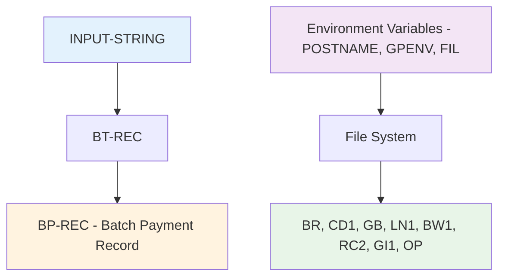
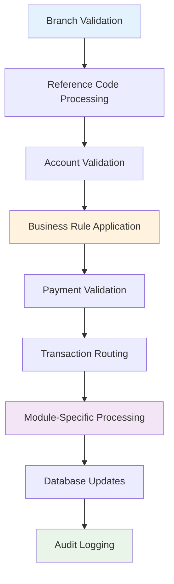
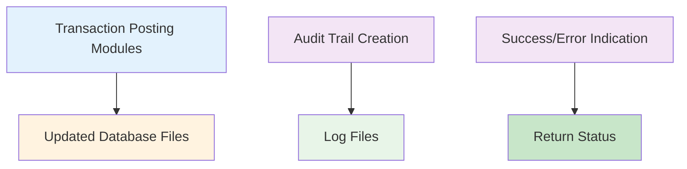

# MAIN-PROGRAM - APIPAY Payment Processing Main Control

**Location:** .\APIPAY_Inlined.CBL  
**Generated on:** July 22, 2025  
**Program ID:** MAIN-PROGRAM  
**Date Written:** Legacy system (pre-2000)

## Table of Contents

1. [Program Overview](#program-overview)
2. [Transaction Types Supported](#transaction-types-supported)
3. [Input Parameters](#input-parameters)
4. [Output Fields](#output-fields)
5. [Program Flow Diagrams](#program-flow-diagrams)
6. [Batch Processing Timeline](#batch-processing-timeline)
7. [Paragraph-Level Flow Explanation](#paragraph-level-flow-explanation)
8. [Data Flow Mapping](#data-flow-mapping)
9. [Referenced Programs](#referenced-programs)
10. [Error Handling and Validation](#error-handling-and-validation)
11. [Technical Implementation](#technical-implementation)
12. [Integration Points](#integration-points)
13. [File Dependencies](#file-dependencies)
14. [Call Graph of PERFORMed Paragraphs](#call-graph-of-performed-paragraphs)

---

## Program Overview

**MAIN-PROGRAM** is the primary control section of the APIPAY single payment reference codes processing system. This section orchestrates the entire payment processing workflow, from initial environment setup through final transaction posting and cleanup.

### Key Characteristics

- **Execution Mode:** Entry point for APIPAY batch payment processing
- **Input Method:** Processes command-line input string parameters for single payment transactions
- **Processing Type:** Comprehensive payment validation, processing, and posting
- **Output:** Updates multiple loan databases and creates transaction logs
- **Error Handling:** Extensive validation with specific error codes and logging

### Business Purpose

MAIN-PROGRAM serves as the central coordinator by:

1. **System Initialization:** Sets up environment variables and establishes database connections
2. **Input Validation:** Processes and validates payment input parameters
3. **Business Rule Enforcement:** Applies complex business logic for payment processing
4. **Database Operations:** Manages file operations and database updates
5. **Transaction Processing:** Routes payments to appropriate processing modules
6. **Audit and Logging:** Maintains comprehensive transaction logs and error reporting
7. **Resource Management:** Handles file opening/closing and system cleanup

### Processing Scope

MAIN-PROGRAM handles various payment types including:
- Regular loan payments
- Payoff transactions
- Reversal transactions (RV)
- Other charges (OT)
- Repossession transactions (RE)
- Bankruptcy posting

---

## Transaction Types Supported

### Primary Transaction Codes

| Transaction Code | Description | Processing Module | Validation Requirements |
|------------------|-------------|-------------------|------------------------|
| Standard Payment | Regular loan payment | PAYMENT-POSTING | Amount validation, account status |
| 99 (Payoff) | Loan payoff transaction | PAYOFF-POSTING | Balance verification, rebate calculation |
| RV | Reversal transaction | REVERSAL-POSTING | Original transaction verification |
| OT | Other charges | OTHER-CHG-POSTING | Charge type validation |
| RE | Repossession | Special validation | Repo status verification, interest bearing check |

### Reference Code Processing

The system processes various reference codes through the CD1 file:
- **BR Reference Codes:** Branch-specific payment types
- **Payoff Indicators:** CD-BR-PAYOFF-FG = "Y" for payoff transactions
- **Special Options:** Late charge flags, allowance settings

---

## Input Parameters

### Command Line Input (INPUT-STRING → BT-REC)

| Field | Type | Description | Required | Validation |
|-------|------|-------------|----------|------------|
| BT-ACCTNO | Account Number | Loan account number | Yes | Must exist in LN1 file |
| BT-AMT | Payment Amount | Transaction amount | Yes | Must be positive |
| BT-REFCD | Reference Code | Payment type code | Yes | Must exist in CD1 file |
| BT-PAYDATE | Payment Date | Date of payment (MMDDYY) | Yes | Converted to YYYYMMDD |
| BT-TRCD | Transaction Code | Type of transaction | Yes | See transaction types |
| BT-BRANCH | Branch Number | Processing branch | Yes | Must exist in BR file |

### Environment Variables

| Variable | Purpose | Required |
|----------|---------|----------|
| POSTNAME | Original user posting name | Yes |
| GPENV | Global parameter environment | Yes |
| FIL | File path configuration | Yes |

---

## Output Fields

### Return Status Codes

| Status Code | Description | Action Taken |
|-------------|-------------|--------------|
| 0 | Successful update | Transaction posted successfully |
| 2 | Branch not on file | Invalid branch number |
| 3 | Reference code not on file | Invalid reference code |
| 4 | Branch not on this machine | Cross-machine validation failed |
| 5 | Global record missing | Required global data not found |
| 6 | Day not open | Business day not open for posting |
| 7 | Could not open day | File access error |
| 15 | Repo options not enabled | Repository processing not allowed |
| 16 | Account not repo status | Invalid repo status for RE transaction |
| 17 | Account not interest bearing | Required for RE transactions |
| 18-19 | Repo batch validation | Repository batch record validation |
| 46 | Already zero balance | Cannot post to zero balance loan |
| 55-57 | Payment amount validation | Various overpayment scenarios |
| 58 | Missing G/L interface | General ledger interface record missing |
| 59 | Generic posting error | General transaction posting failure |

### Log Messages

Comprehensive logging with specific error messages for troubleshooting and audit trails.

---

## Program Flow Diagrams

### [Main Program Flow](Diagrams/MAIN-PROGRAM_Main_Flow.mmd)

### [Environment Setup Flow](Diagrams/MAIN-PROGRAM_Environment_Setup.mmd)

### [Validation Processing](Diagrams/MAIN-PROGRAM_Validation_Processing.mmd)

### [Transaction Routing](Diagrams/MAIN-PROGRAM_Transaction_Routing.mmd)

---

## Batch Processing Timeline

### [MAIN-PROGRAM Processing Timeline](Diagrams/MAIN-PROGRAM_Batch_Timeline.mmd)

---

## Paragraph-Level Flow Explanation

### 1. Environment and System Setup (Lines 13847-13870)
**Purpose:** Initialize system environment and establish database connections

**Processing Logic:**
1. **Stop Message Display:** `STOP MESS` (debug mode only)
2. **Environment Setup:** Call GB/SETENV for external variables
3. **SQL Connection:** Establish database connection
4. **GP Environment:** Retrieve global parameters via GET-GPENV
5. **Input Processing:** Parse INPUT-STRING into BT-REC structure

### 2. Input Data Transformation (Lines 13870-13885)
**Purpose:** Convert input data into internal processing format

**Processing Logic:**
1. **Data Movement:** Move BT fields to BP (Batch Payment) structure
2. **Date Conversion:** Convert MMDDYY to YYYYMMDD format
3. **Account Setup:** Prepare account number for processing

### 3. Core System Initialization (Lines 13885-13895)
**Purpose:** Initialize core processing components

**Processing Logic:**
1. **Program Initialization:** PERFORM INITIALIZATION
2. **Error Check:** Validate initialization success
3. **Early Exit:** GO TO END-PROGRAM if errors detected

### 4. Branch Validation (Lines 13895-13905)
**Purpose:** Validate branch information and access

**Processing Logic:**
1. **Branch File Read:** Locate and validate branch record
2. **Branch Validation:** Ensure branch exists and is accessible
3. **Error Logging:** Create specific error messages for missing branches

### 5. Reference Code Processing (Lines 13905-13930)
**Purpose:** Validate and process payment reference codes

**Processing Logic:**
1. **CD1 File Access:** Open certificate/code file
2. **Reference Code Lookup:** Find and validate reference code
3. **Payoff Detection:** Check for payoff transaction indicators
4. **Permission Setting:** Set payment and payoff permissions based on code

### 6. Machine and Path Configuration (Lines 13930-13950)
**Purpose:** Ensure transaction is processed on correct machine

**Processing Logic:**
1. **Machine Validation:** Verify branch is assigned to current machine
2. **Path Configuration:** Set up file paths for branch-specific data
3. **Override Settings:** Configure path overrides for file access

### 7. Global Configuration Setup (Lines 13950-13975)
**Purpose:** Load global configuration data

**Processing Logic:**
1. **Global File Access:** Read GB file for global parameters
2. **Global Validation:** Ensure required global data exists
3. **Configuration Loading:** Load system-wide settings

### 8. File System Preparation (Lines 13975-14000)
**Purpose:** Open required data files and prepare file system

**Processing Logic:**
1. **Core File Opening:** Open LN1 (loan) and BW1 (work) files
2. **Environment Update:** Update environment variables for branch
3. **User Context:** Set user and branch context for processing

### 9. Business Day Validation (Lines 14000-14030)
**Purpose:** Ensure business day is open for processing

**Processing Logic:**
1. **Day Status Check:** Verify business day is open
2. **Access Control:** Reserve processing files to prevent day closure
3. **File Locking:** Implement file locking for concurrent access control

### 10. Account and Loan Validation (Lines 14030-14200)
**Purpose:** Comprehensive validation of loan account and payment parameters

**Processing Logic:**
1. **Account Lookup:** Find and validate loan account
2. **Account Status:** Check account status and availability
3. **Payment Date Processing:** Handle payment date defaulting
4. **Balance Validation:** Verify account balances and payment amounts

### 11. Transaction-Specific Validation (Lines 14200-14600)
**Purpose:** Apply transaction-specific business rules

**Processing Logic:**
1. **Transaction Code Validation:** Validate specific transaction types
2. **Repository Processing:** Special validation for repo transactions
3. **Interest Bearing Check:** Verify account characteristics
4. **Business Rule Application:** Apply complex payment validation rules

### 12. Payment Amount Validation (Lines 14600-14750)
**Purpose:** Comprehensive payment amount validation and payoff detection

**Processing Logic:**
1. **Overpayment Detection:** Check for payments exceeding balances
2. **Payoff Calculation:** Determine if payment constitutes a payoff
3. **Other Balance Handling:** Manage Other 2 (O2) balance considerations
4. **Manual Processing Triggers:** Identify transactions requiring manual review

### 13. General Ledger Interface (Lines 14750-14770)
**Purpose:** Validate general ledger interface requirements

**Processing Logic:**
1. **G/L Interface Lookup:** Verify general ledger interface record
2. **Class Validation:** Ensure proper loan classification

### 14. Transaction Routing (Lines 14770-14800)
**Purpose:** Route transactions to appropriate processing modules

**Processing Logic:**
1. **Transaction Type Determination:** Identify processing module needed
2. **Module Dispatch:** Call appropriate posting routine:
   - BANKRUPT-POSTING for bankruptcy files
   - REVERSAL-POSTING for reversals
   - OTHER-CHG-POSTING for other charges
   - PAYOFF-POSTING for payoffs
   - PAYMENT-POSTING for regular payments

### 15. Completion and Cleanup (Lines 14800-14811)
**Purpose:** Complete processing and clean up resources

**Processing Logic:**
1. **Success Verification:** Check posting results
2. **Success Logging:** Log successful completion
3. **File Cleanup:** Close files and release resources
4. **Resource Management:** Clean up temporary files and locks

---

## Data Flow Mapping

### Input Data Flow


### Processing Data Flow


### Output Data Flow


---

## Referenced Programs

### External Program Calls

#### GB/SETENV
**Purpose:** Environment configuration setup
**Location:** External system utility
**Parameters:** FORM-PATHNAME, EXIT-PATHNAME

#### Payment Processing Modules
- **PAYMENT-POSTING:** Regular payment processing
- **PAYOFF-POSTING:** Payoff transaction processing
- **REVERSAL-POSTING:** Payment reversal processing
- **OTHER-CHG-POSTING:** Other charge processing
- **BANKRUPT-POSTING:** Bankruptcy transaction processing

### Internal Section Calls

#### GET-GPENV
**Purpose:** Global parameter environment retrieval
**Location:** Lines 16237+ in same program
**Function:** Retrieves system configuration from environment

#### INITIALIZATION
**Purpose:** System initialization and setup
**Location:** Lines 15902+ in same program
**Function:** Initializes working storage and system components

#### Utility Sections
- **CREATE-LOG:** Error and audit logging
- **CONVERT-MMDDYY-TO-YYYYMMDD:** Date format conversion
- **SQL-CONNECT:** Database connection establishment
- **File Management Routines:** Various OPEN/READ/CLOSE operations

---

## Error Handling and Validation

### Error Categories

#### 1. System Configuration Errors (Status 2-7)
**Scenarios:**
- Missing or invalid branch
- Invalid reference codes
- Machine/system configuration issues
- File access problems

**Handling:**
- Immediate termination with specific error code
- Detailed error logging with context
- Resource cleanup before exit

#### 2. Business Rule Violations (Status 15-19)
**Scenarios:**
- Repository processing not enabled
- Invalid account status for transaction type
- Business day not open

**Handling:**
- Business rule validation
- Specific error messages
- Transaction rejection

#### 3. Payment Validation Errors (Status 46, 55-57)
**Scenarios:**
- Zero balance accounts
- Overpayment situations
- Complex balance scenarios

**Handling:**
- Mathematical validation
- Balance verification
- Special case handling for payoffs

#### 4. System Interface Errors (Status 58-59)
**Scenarios:**
- Missing general ledger interface
- Generic posting failures

**Handling:**
- Interface validation
- Fallback error handling
- System administration notification

### Validation Sequence
1. **Environmental Validation:** System setup and configuration
2. **Data Validation:** Input parameter verification
3. **Business Rule Validation:** Complex business logic application
4. **Transaction Validation:** Transaction-specific requirements
5. **Posting Validation:** Final verification before database updates

---

## Technical Implementation

### Data Structures

#### Primary Working Storage
- **BT-REC:** Batch transaction input record
- **BP-REC:** Batch payment processing record
- **LN-REC:** Loan record from LN1 file
- **BR-REC:** Branch record from BR file
- **CD-REC:** Code/certificate record from CD1 file
- **GP-REC:** Global parameter record

#### File Structures
- **LN1-FILE:** Loan master file
- **BR-FILE:** Branch master file
- **CD1-FILE:** Certificate/code file
- **GB-FILE:** Global batch file
- **RC2-FILE:** Reference code status file
- **GI1-FILE:** General ledger interface file
- **OP-FILE:** Output processing file

### Key Algorithms

#### Payment Amount Validation
```cobol
COMPUTE TEST-AMT = BP-TRAMT - POFF-INTDUE - POFF-LCDUE
IF TEST-AMT >= (LN-CURBAL - TOT-POFF-REBATES)
   * Payoff logic
ELSE
   * Regular payment logic
```

#### Date Processing
```cobol
MOVE BT-PAYDATE TO DATE-MMDDYY
PERFORM CONVERT-MMDDYY-TO-YYYYMMDD
MOVE DATE-YYYYMMDD TO BP-PAYDATE
```

#### Machine Validation
```cobol
IF BR-MACHINE NOT = EXT-FILPATH-MACHINE
   MOVE 4 TO RETURN-STATUS
   * Error handling
```

### Performance Characteristics
- **File I/O:** Multiple file reads and updates
- **Validation Overhead:** Extensive business rule checking
- **Error Handling:** Comprehensive validation with early termination
- **Resource Management:** Proper file opening/closing sequences

---

## Integration Points

### Database Integration
- **Loan Master (LN1):** Primary account data
- **Branch Master (BR):** Branch configuration and validation
- **Code Master (CD1):** Reference code definitions
- **Global Batch (GB):** System-wide parameters

### System Integration
- **Environment Variables:** POSTNAME, GPENV, FIL
- **SQL Database:** Connection and transaction management
- **File Locking:** Concurrent access control
- **Audit System:** Comprehensive logging and error reporting

### Module Integration
- **Payment Processing Modules:** LONPF series programs
- **Utility Modules:** Date conversion, file management
- **Logging System:** Error and audit trail creation

---

## File Dependencies

### Input Files
| File | Purpose | Access Type | Critical |
|------|---------|-------------|----------|
| BR-FILE | Branch master data | Read | Yes |
| CD1-FILE | Reference code definitions | Read | Yes |
| GB-FILE | Global batch parameters | Read | Yes |
| LN1-FILE | Loan master data | Read/Update | Yes |
| RC2-FILE | Reference code status | Read | Yes |
| GI1-FILE | General ledger interface | Read | Yes |
| BW1-FILE | Work file | Read/Write | Yes |

### Output Files
| File | Purpose | Access Type | Updates |
|------|---------|-------------|---------|
| LN1-FILE | Updated loan data | Write | Account balances, status |
| BW1-FILE | Work transactions | Write | Processing records |
| OP-FILE | Output processing | Write | Transaction log |
| LOG-FILE | Audit trail | Write | Error and success messages |

### Copybooks
| Copybook | Library | Purpose |
|----------|---------|---------|
| LIBGB/GPENVW.CPY | LIBGB | Global parameter working storage |
| LIBGB/GB01GP.CPY | LIBGB | Global parameter record structure |
| LIBLP/LPEDPATH.CPY | LIBLP | Path definitions |

---

## Call Graph of PERFORMed Paragraphs

### [MAIN-PROGRAM Call Graph](Diagrams/MAIN-PROGRAM_Call_Graph.mmd)

### Primary Call Sequence
```
MAIN-PROGRAM SECTION
├── GET-GPENV
├── INITIALIZATION
├── READ-BR-FILE
├── OPEN-CD1-FILE / READ-CD1-FILE
├── OPEN-GB-FILE / READ-GB-FILE / CLOSE-GB-FILE
├── OPEN-LN1-FILE / OPEN-BW1-FILE
├── OPEN-RC2-FILE / READ-RC2-FILE / CLOSE-RC2-FILE
├── LOAD-OPEN-FILE / ACCESS-CALL / OPEN-OP-FILE
├── READ-LN1-FILE
├── CONVERT-MMDDYY-TO-YYYYMMDD
├── READ-GI1-FILE
├── Transaction-Specific Processing:
│   ├── BANKRUPT-POSTING
│   ├── REVERSAL-POSTING
│   ├── OTHER-CHG-POSTING
│   ├── PAYOFF-POSTING
│   └── PAYMENT-POSTING
├── CREATE-LOG
├── CLOSE-OP-FILE
└── REMOVE-WORKFILE
```

### Conditional Execution Paths
- **Error Paths:** Early termination with specific error codes
- **Transaction Routing:** Based on transaction type and validation results
- **File Management:** Conditional file operations based on processing needs
