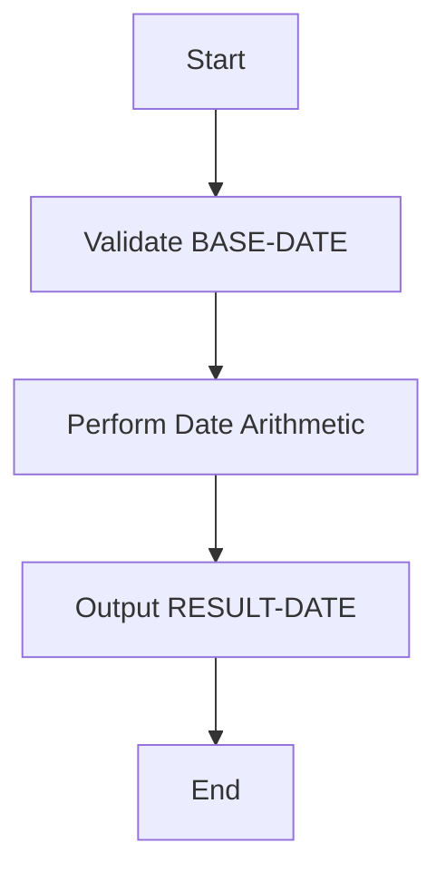
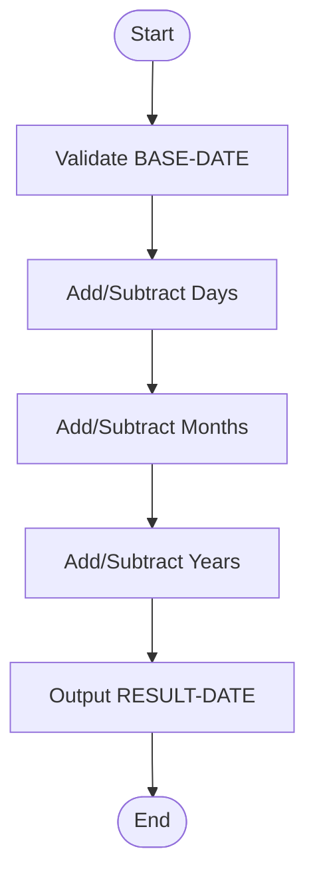
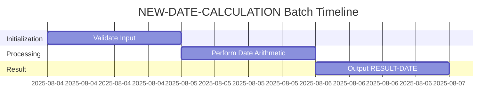
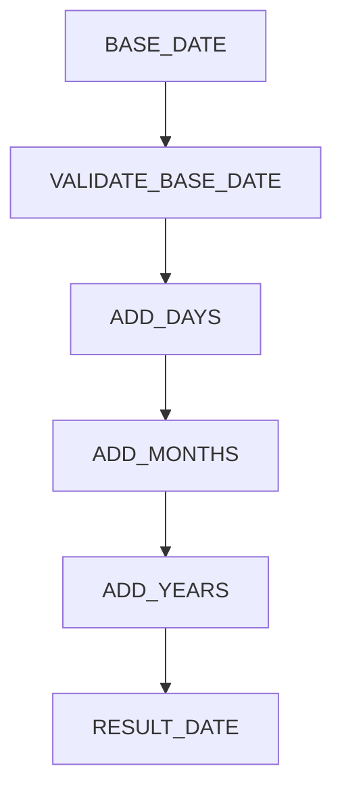
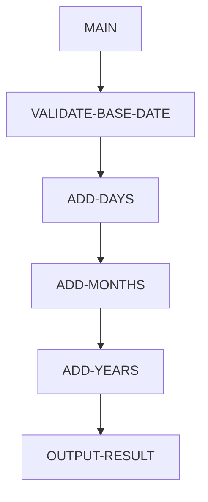

# NEW-DATE-CALCULATION Program Documentation

**Location:** APIPAY/APIPAY_Inlined.CBL  
**Generated on:** August 4, 2025  
**Program ID:** NEW-DATE-CALCULATION  
**Date Written:** See source comments

## Table of Contents
- [Program Overview](#program-overview)
- [Transaction Types Supported](#transaction-types-supported)
- [Input Parameters](#input-parameters)
- [Output Fields](#output-fields)
- [Program Flow Diagrams](#program-flow-diagrams)
- [Batch or Sequential Process Timeline](#batch-or-sequential-process-timeline)
- [Paragraph-Level Flow Explanation](#paragraph-level-flow-explanation)
- [Data Flow Mapping](#data-flow-mapping)
- [Referenced Programs](#referenced-programs)
- [Error Handling Flow](#error-handling-flow)
- [Error Handling and Validation](#error-handling-and-validation)
- [Common Error Conditions](#common-error-conditions)
- [Technical Implementation](#technical-implementation)
- [Integration Points](#integration-points)
- [File Dependencies](#file-dependencies)
- [Call Graph of PERFORMed Paragraphs](#call-graph-of-performed-paragraphs)

## Program Overview
This routine performs advanced date calculations, such as adding or subtracting days, months, or years to a given date, supporting business logic for payment schedules and due dates.

## Transaction Types Supported
- Date arithmetic (add/subtract days, months, years)

## Input Parameters
- `BASE-DATE`: The starting date (CCYYMMDD)
- `DAYS-TO-ADD`: Number of days to add (can be negative)
- `MONTHS-TO-ADD`: Number of months to add (optional)
- `YEARS-TO-ADD`: Number of years to add (optional)

## Output Fields
- `RESULT-DATE`: The calculated date (CCYYMMDD)
- `ERROR-CODE`: Error code if calculation fails

## Program Flow Diagrams
### High-Level Flow

### Detailed Flow

## Batch or Sequential Process Timeline

## Paragraph-Level Flow Explanation
- **VALIDATE-BASE-DATE**: Checks input for correct format and range.
- **ADD-DAYS**: Adds or subtracts days from the base date.
- **ADD-MONTHS**: Adds or subtracts months from the intermediate date.
- **ADD-YEARS**: Adds or subtracts years from the intermediate date.
- **OUTPUT-RESULT**: Returns the calculated date or error code.

## Data Flow Mapping

## Referenced Programs
- None

## Error Handling Flow
- Returns error if input is invalid or calculation overflows.

## Error Handling and Validation
- Validates input format and range.
- Handles non-numeric and out-of-bounds values.
- Checks for date overflows and underflows.

## Common Error Conditions
- Invalid date input
- Calculation out of range

## Technical Implementation
- Uses working-storage fields for date manipulation.
- No external file I/O.
- Handles leap years and month-end logic.

## Integration Points
- Used by payment and scheduling routines.

## File Dependencies
- No external files; uses internal paragraphs.

## Call Graph of PERFORMed Paragraphs

