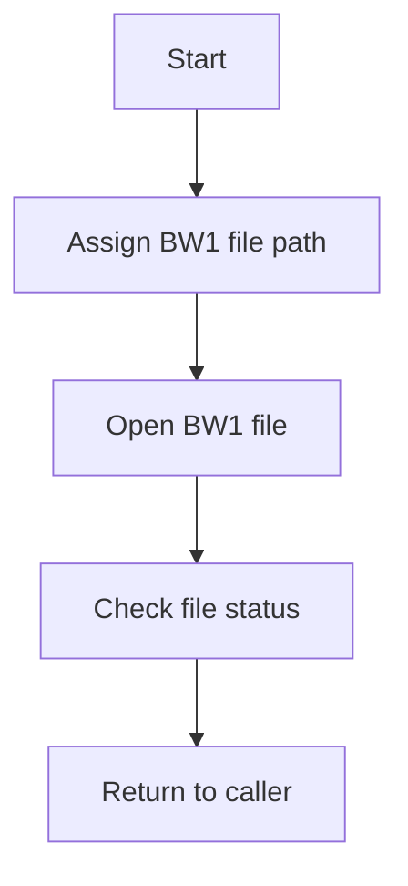
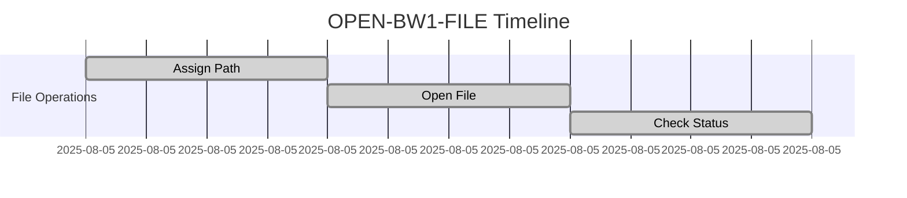
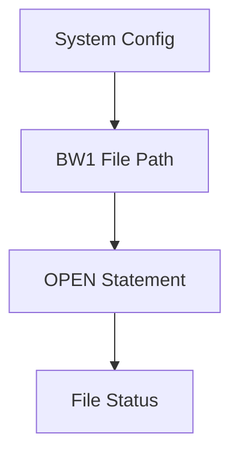

# OPEN-BW1-FILE

**Location:** APIPAY/APIPAY_Inlined.CBL  
**Generated on:** August 5, 2025  
**Program ID:** OPEN-BW1-FILE  
**Date Written:** See source comments

## Table of Contents
1. [Program Overview](#program-overview)
2. [Transaction Types Supported](#transaction-types-supported)
3. [Input Parameters](#input-parameters)
4. [Output Fields](#output-fields)
5. [Program Flow Diagrams](#program-flow-diagrams)
6. [Batch or Sequential Process Timeline](#batch-or-sequential-process-timeline)
7. [Paragraph-Level Flow Explanation](#paragraph-level-flow-explanation)
8. [Data Flow Mapping](#data-flow-mapping)
9. [Referenced Programs](#referenced-programs)
10. [Error Handling Flow](#error-handling-flow)
11. [Error Handling and Validation](#error-handling-and-validation)
12. [Common Error Conditions](#common-error-conditions)
13. [Technical Implementation](#technical-implementation)
14. [Integration Points](#integration-points)
15. [File Dependencies](#file-dependencies)
16. [Call Graph of PERFORMed Paragraphs](#call-graph-of-performed-paragraphs)

---

## Program Overview
`OPEN-BW1-FILE` opens the BW1 work file, which is used for temporary or intermediate data storage during batch processing. This file is essential for managing work-in-progress records.

## Transaction Types Supported
- Not transaction-based; supports all batch operations requiring BW1 work file access.

## Input Parameters
- None directly; uses system configuration for file path.

## Output Fields
- None directly; makes the BW1 file available for batch operations.

## Program Flow Diagrams
### High-Level Flow


## Batch or Sequential Process Timeline


## Paragraph-Level Flow Explanation
- Assigns the file path for the BW1 work file.
- Opens the file using COBOL's SELECT/ASSIGN and OPEN statements.
- Checks the file status code to ensure the file is available.
- Returns control to the calling routine.

## Data Flow Mapping


## Referenced Programs
- None

## Error Handling Flow
- If the file cannot be opened, sets a file status code and returns an error to the caller.

## Error Handling and Validation
- Validates file status after OPEN.
- Handles file not found or access denied errors.

## Common Error Conditions
- File not found
- Access denied
- File already open

## Technical Implementation
- Uses COBOL SELECT/ASSIGN and OPEN statements.
- File status checked after OPEN.

## Integration Points
- Used by APIPAY and other routines requiring temporary work file storage.

## File Dependencies
- BW1 work file (see source for path)

## Call Graph of PERFORMed Paragraphs
```mermaid
graph TD
    OPEN-BW1-FILE --> [Return to caller]
```
