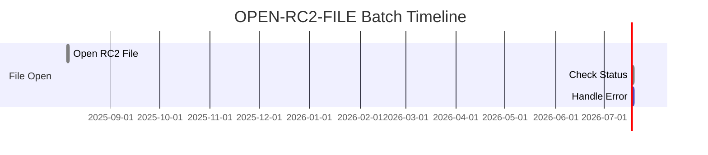
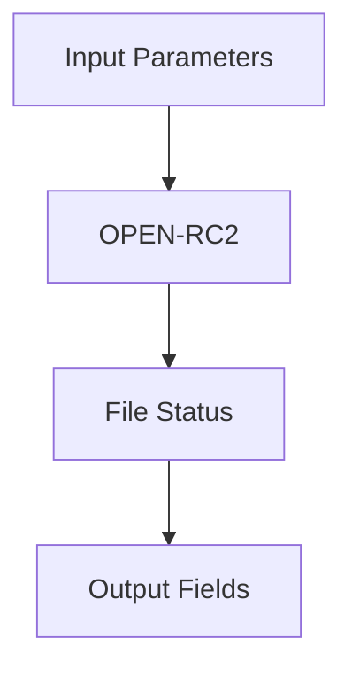
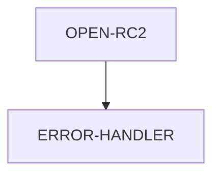

# OPEN-RC2-FILE Documentation

**Location:** APIPAY/OPEN-RC2-FILE.cpy  
**Generated on:** 2025-08-05  
**Program ID:** OPEN-RC2-FILE  
**Date Written:** See source comments

## Table of Contents
- [Program Overview](#program-overview)
- [Transaction Types Supported](#transaction-types-supported)
- [Input Parameters](#input-parameters)
- [Output Fields](#output-fields)
- [Program Flow Diagrams](#program-flow-diagrams)
- [Batch or Sequential Process Timeline](#batch-or-sequential-process-timeline)
- [Paragraph-Level Flow Explanation](#paragraph-level-flow-explanation)
- [Data Flow Mapping](#data-flow-mapping)
- [Referenced Programs](#referenced-programs)
- [Error Handling Flow](#error-handling-flow)
- [Common Error Conditions](#common-error-conditions)
- [Technical Implementation](#technical-implementation)
- [Integration Points](#integration-points)
- [File Dependencies](#file-dependencies)
- [Call Graph of PERFORMed Paragraphs](#call-graph-of-performed-paragraphs)

## Program Overview
This routine opens the RC2 file for processing. It is used in batch or sequential jobs to ensure the RC2 file is available for reading or writing.

## Transaction Types Supported
- File open (sequential or indexed, as defined in the copybook)

## Input Parameters
- File assignment and status fields as defined in the copybook.

## Output Fields
- File status code after open attempt.

## Program Flow Diagrams
```mermaid
graph TD;
    Start --> Open_RC2_File;
    Open_RC2_File --> Check_Status;
    Check_Status --> [Success] Success;
    Check_Status --> [Failure] Error_Handler;
    Error_Handler --> End;
    Success --> End;
```

## Batch or Sequential Process Timeline


## Paragraph-Level Flow Explanation
- OPEN-RC2: Attempts to open the RC2 file.
- ERROR-HANDLER: Handles any errors encountered during the open operation.

## Data Flow Mapping


## Referenced Programs
- None (standalone file open routine)

## Error Handling Flow
- If the file open fails, the error handler is invoked and the status code is set accordingly.

## Common Error Conditions
- File not found
- Permission denied
- File already open

## Technical Implementation
- Uses COBOL OPEN statement for the RC2 file.
- File status is checked after the open operation.

## Integration Points
- Called by batch jobs or other programs requiring access to the RC2 file.

## File Dependencies
- APIPAY/OPEN-RC2-FILE.cpy (copybook)

## Call Graph of PERFORMed Paragraphs

