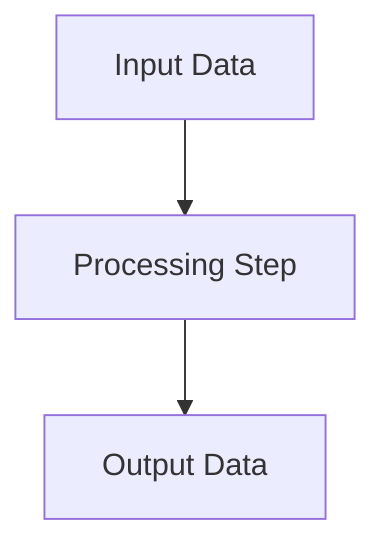

# COBOL Documentation - Static HTML Version

A complete static HTML documentation system for COBOL payment processing programs. No server required!

## 🚀 Quick Start

### **Easy Start (Recommended)**
1. Double-click `view_documentation.bat`
2. The documentation will open in your default browser
3. Browse through all programs and diagrams

### **Manual Start**
1. Open `index.html` in any web browser
2. Navigate through the documentation using the cards

## 📁 Generated Files

The static HTML system creates the following files:

```
Documents/
├── index.html                      # Main documentation homepage
├── diagrams.html                   # Interactive diagrams viewer
├── APIPAY_Documentation.html       # APIPAY program documentation
├── LONPFB_Documentation.html       # LONPFB program documentation
├── LONPFC_Documentation.html       # LONPFC program documentation
├── LONPF2_Documentation.html       # LONPF2 program documentation
├── LONPF7_Documentation.html       # LONPF7 program documentation
├── LONPF9_Documentation.html       # LONPF9 program documentation
├── generate_static_html.py         # Generator script
└── view_documentation.bat          # Easy launcher
```

## ✨ Features

### 🎨 **Modern Design**
- **Glassmorphism effects** with beautiful gradients
- **Responsive layout** that works on all devices
- **Print-friendly** styling for documentation export
- **Smooth animations** and hover effects

### 📚 **Content Features**
- **Complete Markdown rendering** with syntax highlighting
- **Interactive Mermaid diagrams** with zoom and pan
- **Table of contents** with anchor links
- **Cross-references** between programs
- **Code syntax highlighting** for COBOL examples

### 🔧 **Technical Benefits**
- **No server required** - works directly from file system
- **Completely offline** - no internet needed after generation
- **Fast loading** - all content is pre-rendered
- **Portable** - share the entire folder to share documentation

## 📋 Available Documentation

### **Main Programs**
- 💳 **APIPAY** - Payment Processor (Core System)
- 🏦 **LONPFB** - Bill Pay System
- 💰 **LONPFC** - Check Processing
- 🌐 **LONPF2** - Wire Transfer Processor
- 🚗 **LONPF7** - Repossession Processor
- 🛡️ **LONPF9** - Insurance Processor

### **Interactive Diagrams**
- APIPAY Transaction Processing Flow
- APIPAY Complete Call Graph
- APIPAY Database Updates
- APIPAY Error Handling
- LONPFC Main Flow
- LONPFC Transaction Processing
- LONPFC Error Handling
- LONPFC Payment Distribution
- LONPFC Deferment Processing

## 🛠️ Regenerating Documentation

If you need to update the documentation after changes to the Markdown files:

### **Requirements**
- Python 3.x
- `markdown` module: `pip install markdown`

### **Generate HTML**
```bash
python generate_static_html.py
```

This will:
1. Convert all `.md` files to HTML
2. Process Mermaid diagrams
3. Create navigation and cross-links
4. Generate the main index and diagrams pages

## 📊 Diagram System

The static HTML includes a complete interactive diagram system:

- **Mermaid.js integration** for dynamic diagrams
- **Zoom and pan** capabilities
- **Hover effects** on diagram elements
- **Responsive scaling** for different screen sizes
- **Print-friendly** diagram rendering

## 🔍 Content Structure

### **Program Documentation**
Each program documentation includes:
- **Program Overview** with business purpose
- **Technical Implementation** details
- **Input/Output specifications**
- **Error handling** and validation
- **Integration points** with other systems
- **File dependencies** and data flows

### **Navigation Features**
- **Breadcrumb navigation** with quick links
- **Program cards** with icons and descriptions
- **Cross-reference links** between related programs
- **Back-to-top buttons** for easy navigation
- **Responsive sidebar** for mobile devices

## 💡 Usage Tips

### **For Developers**
- Use the **Table of Contents** to jump to specific sections
- **Cross-reference links** help understand program relationships
- **Code examples** show exact COBOL syntax and usage
- **Diagrams** provide visual understanding of complex flows

### **For Documentation**
- **Print-friendly** CSS for creating hard copies
- **Portable format** - copy entire folder to share
- **No dependencies** - works in any modern browser
- **Offline capability** - no internet required

### **For System Administration**
- **Self-contained** - no server setup required
- **Fast deployment** - just copy files
- **Version control friendly** - all content is in HTML
- **Backup simple** - include in regular file backups

## 🔧 Customization

The generator script can be customized to:

## Data Flow Mapping

This section describes the movement and transformation of data throughout the program. Please add a Mermaid diagram below to visually represent the data flow.



<!-- Replace the diagram above with a program-specific data flow if available. -->

## 📝 Source Files

The HTML is generated from these source files:

## 🎯 Integration

This static documentation system is perfect for:
- **Development teams** needing offline access
- **Documentation portals** requiring fast loading
- **Training environments** with limited connectivity
- **Archive purposes** with long-term accessibility
- **Client deliverables** requiring self-contained documentation

---

*Generated: July 22, 2025 | COBOL Documentation System - Static HTML Version*
