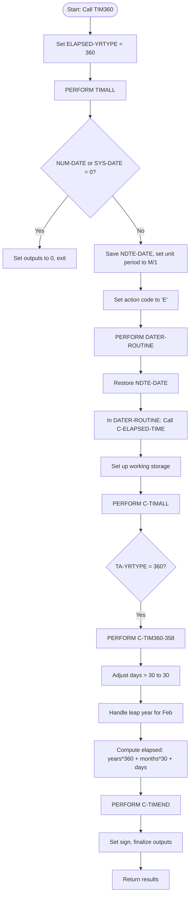
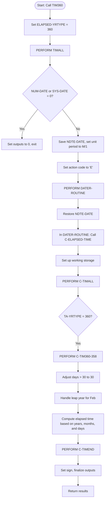
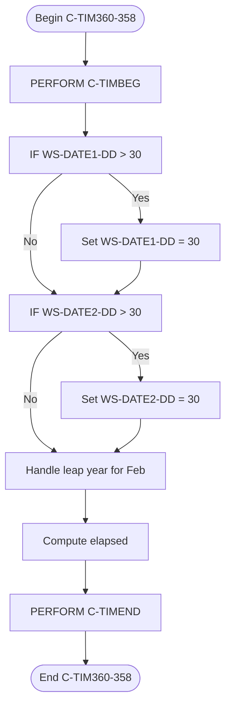
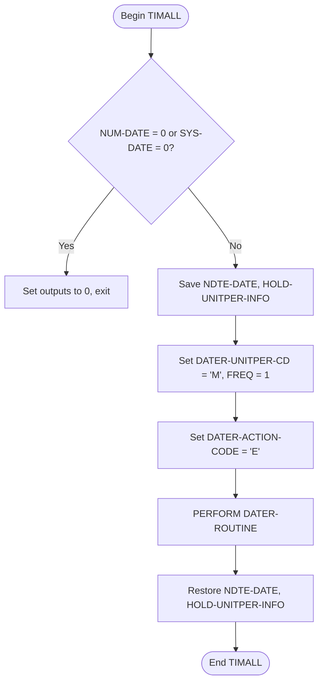
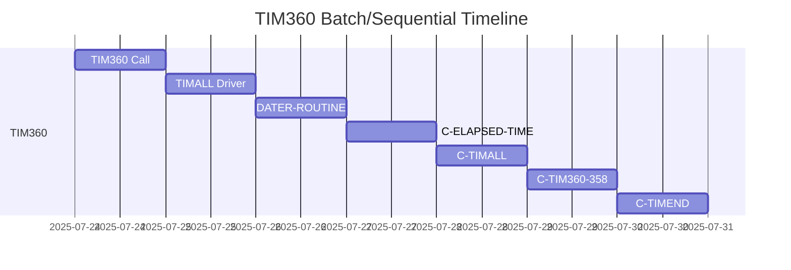
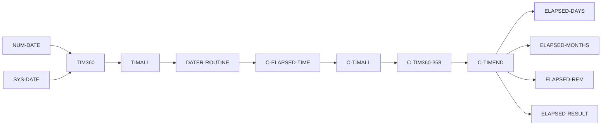
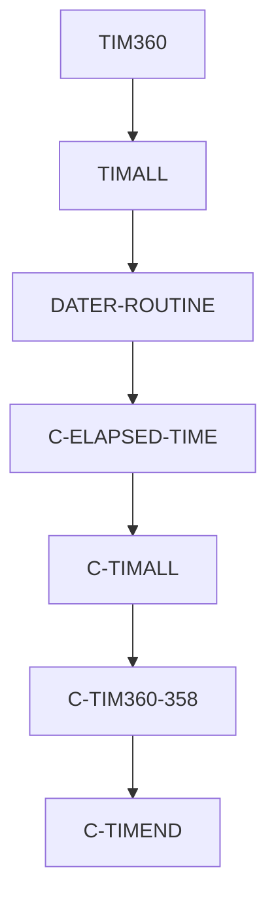

# TIM360 COBOL Program Design Document

**Location:** `./APIPAY_Inlined.CBL`
**Generated on:** 2025-07-24

---

## Table of Contents
1. [Program Overview](#program-overview)
2. [Transaction Types Supported](#transaction-types-supported)
3. [Input Parameters](#input-parameters)
4. [Output Fields](#output-fields)
5. [Program Flow Diagrams](#program-flow-diagrams)
    - [High-Level Flow](#high-level-flow)
    - [Detailed Flows](#detailed-flows)
6. [Batch or Sequential Process Timeline](#batch-or-sequential-process-timeline)
7. [Paragraph-Level Flow Explanation](#paragraph-level-flow-explanation)
8. [Data Flow Mapping](#data-flow-mapping)
9. [Referenced Programs](#referenced-programs)
10. [Error Handling Flow](#error-handling-flow)
11. [Error Handling and Validation](#error-handling-and-validation)
12. [Common Error Conditions](#common-error-conditions)
13. [Technical Implementation](#technical-implementation)
14. [Integration Points](#integration-points)
15. [File Dependencies](#file-dependencies)
16. [Call Graph of PERFORMed Paragraphs](#call-graph-of-performed-paragraphs)

---

## Program Overview
TIM360 is a COBOL routine for calculating elapsed time between two dates using the 30/360 day-count convention. It is used in financial, actuarial, and loan calculations where a 360-day year (12 months of 30 days) is required. TIM360 is implemented as a section in `APIPAY_Inlined.CBL` and delegates most logic to shared routines.

## Transaction Types Supported
- Elapsed time calculation between two dates using the 30/360 convention
- Used for interest, loan, and actuarial computations
- Supports negative elapsed time (start date after end date)

## Input Parameters
- `NUM-DATE` (Start date, format: YYYYMMDD)
- `SYS-DATE` (End date, format: YYYYMMDD)
- (Internally set) `ELAPSED-YRTYPE` = 360

## Output Fields
- `ELAPSED-DAYS`: Total days elapsed (30/360 logic)
- `ELAPSED-MONTHS`: Number of full months elapsed
- `ELAPSED-REM`: Remaining days after full months
- `ELAPSED-RESULT`: Comparison result (e.g., LT, GT, EQ)

## Program Flow Diagrams
### High-Level Flow

#### Detailed Mermaid Diagrams

**TIM360 Detailed Flow**  
Shows the full step-by-step logic for the TIM360 routine, including all major decision points and calls.

**C-TIM360-358 Logic**  
Details the 30/360 calculation logic, including day/month adjustments and leap year handling.

**TIMALL Driver Flow**  
Illustrates the driver logic for all time calculations, including input validation and routine setup.

## Batch or Sequential Process Timeline

## Paragraph-Level Flow Explanation
- **TIM360 SECTION**: Entry point. Sets year type to 360 and delegates to TIMALL.
- **TIMALL SECTION**: Driver for all time calculations. Handles input validation, sets up unit period, and calls DATER-ROUTINE.
- **DATER-ROUTINE**: Core date calculation logic. Calls C-ELAPSED-TIME.
- **C-ELAPSED-TIME**: Sets up working storage, delegates to C-TIMALL.
- **C-TIMALL**: Dispatches to the correct year-type routine (C-TIM360-358 for 360).
- **C-TIM360-358**: Implements 30/360 logic. Adjusts days, handles leap years, computes elapsed time.
- **C-TIMEND**: Finalizes sign and output fields.

## Data Flow Mapping

## Referenced Programs
- `DATER-ROUTINE` (internal, not a separate program)
- `C-ELAPSED-TIME` (internal)
- `C-TIMALL` (internal)
- `C-TIM360-358` (internal)
- `C-TIMEND` (internal)
- `C-LEAP-YEAR-TEST` (internal)
- `C-CALL-JUL` (internal)

## Error Handling Flow
- If either input date is zero, all outputs are set to zero and the routine exits.
- If invalid date formats are detected, the routine defaults to safe values.

## Error Handling and Validation
- Input validation for zero or invalid dates
- Leap year logic for February
- Negative elapsed time supported

## Common Error Conditions
- Input date is zero or invalid
- February 29th on non-leap years
- Start date after end date (results are negative)

## Technical Implementation
- **Data Structures:** Uses working-storage fields for dates, elapsed values, and temporary variables.
- **File Handling:** No direct file I/O in TIM360; relies on in-memory data.
- **Key Algorithms:** 30/360 day-count, leap year detection, sign handling for negative intervals.

## Integration Points
- Used by other routines in APIPAY_Inlined.CBL for timing calculations
- Can be called by external programs for 30/360 logic

## File Dependencies
- No external files; all logic is internal to APIPAY_Inlined.CBL
- Uses internal copybooks and working-storage

## Call Graph of PERFORMed Paragraphs

---

**See also:**
- [DATER-ROUTINE Documentation](DATER-ROUTINE_Documentation.md)
- [C-TIM360-358 Detailed Flow](Diagrams/C-TIM360-358_flow.mmd)
- [TIMALL Driver Flow](Diagrams/TIMALL_flow.mmd)
- [Main APIPAY Documentation](APIPAY_Documentation.md)
