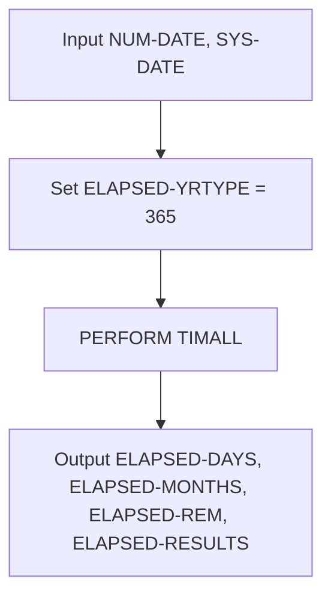
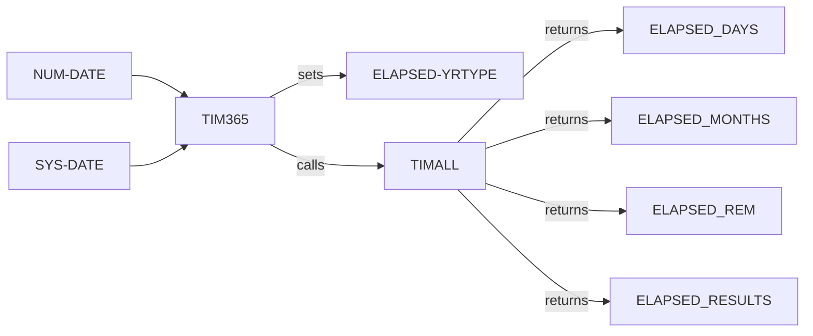
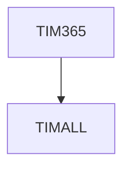

# TIM365 COBOL Utility Documentation

---

**Location:** .\APIPAY_Inlined.CBL  
**Generated on:** 2025-07-28  
**Program ID:** TIM365  
**Date Written:** See Revision History

---

## Table of Contents
1. [Program Overview](#program-overview)
2. [Input Parameters](#input-parameters)
3. [Output Fields](#output-fields)
4. [Program Flow Diagram](#program-flow-diagram)
5. [Batch or Sequential Process Timeline](#batch-or-sequential-process-timeline)
6. [Paragraph-Level Flow Explanation](#paragraph-level-flow-explanation)
7. [Data Flow Mapping](#data-flow-mapping)
8. [Referenced Programs](#referenced-programs)
9. [Error Handling and Validation](#error-handling-and-validation)
10. [Common Error Conditions](#common-error-conditions)
11. [Technical Implementation](#technical-implementation)
12. [Integration Points](#integration-points)
13. [File Dependencies](#file-dependencies)
14. [Call Graph of PERFORMed Paragraphs](#call-graph-of-performed-paragraphs)
15. [Revision History](#revision-history)

---

## Program Overview

**TIM365** is a COBOL utility routine within `APIPAY_Inlined.CBL` that calculates the elapsed time between two dates using a 365-day year basis. It is used for financial calculations where interest or periods are computed assuming each year has exactly 365 days. TIM365 is a wrapper that sets the calculation mode and delegates the actual computation to the shared TIMALL routine, ensuring consistent date difference logic across the system.

---

## Input Parameters
- **NUM-DATE**: Start date (YYYYMMDD)
- **SYS-DATE**: End date (YYYYMMDD)
- **DATER-UNITPER-INFO**: Unit period calculation context (saved/restored)
- **NDTE-DATE**: Internal date field (saved/restored)

---

## Output Fields
- **ELAPSED-DAYS**: Total elapsed days (365-day year basis)
- **ELAPSED-MONTHS**: Total elapsed months
- **ELAPSED-REM**: Remaining days after full months
- **ELAPSED-RESULTS**: Comparison result (e.g., LT, GT, EQ, LE, GE, GR)

---

## Program Flow Diagram

---

## Batch or Sequential Process Timeline

TIM365 is called as a subroutine within batch or sequential processes. Its execution is atomic and does not span multiple steps, so a Gantt chart is not required. For batch context, see the parent program (e.g., APIPAY).

---

## Paragraph-Level Flow Explanation
- **TIM365 SECTION**: Main entry point. Sets ELAPSED-YRTYPE to 365, then PERFORMs TIMALL to compute the date difference. All input and output fields are managed by TIMALL.
- **TIMALL**: Shared date calculation logic (see TIMALL documentation for details).

---

## Data Flow Mapping

---

## Referenced Programs
- **TIMALL**: Shared date calculation logic (internal to APIPAY_Inlined.CBL)

---

## Error Handling and Validation
- If either NUM-DATE or SYS-DATE is zero, all outputs are set to zero or spaces (handled by TIMALL).
- The routine is designed to avoid side effects by saving and restoring NDTE-DATE and DATER-UNITPER-INFO (handled by TIMALL).
- Any errors in TIMALL propagate to the outputs.

---

## Common Error Conditions
- Invalid or zero dates: Outputs set to zero/spaces.
- Unexpected changes to NDTE-DATE or DATER-UNITPER-INFO: Prevented by save/restore logic in TIMALL.

---

## Technical Implementation
- **Data Structures**: Uses working-storage fields for dates, unit period codes, and results.
- **File Handling**: None (pure calculation routine).
- **Key Algorithms**: Date difference calculation via TIMALL, with context setup for 365-day year calculations.

---

## Integration Points
- Used by APIPAY and other routines for date calculations on a 365-day year basis.
- Can be called wherever elapsed days/months are needed for financial calculations.

---

## File Dependencies
- No external files. Relies on internal data structures and TIMALL.

---

## Call Graph of PERFORMed Paragraphs

---

## Revision History
- 1987-03-24: Initial logic for TIM365
- 2013-02-13: Added logic to preserve NDTE-DATE and DATER-UNITPER-INFO (via TIMALL)
- 2013-02-18: Added test for zero dates to mimic legacy behavior (via TIMALL)

---

## See Also
- [TIMALL_Documentation.md](TIMALL_Documentation.md): Foundational date calculation routine
- [APIPAY_Documentation.md](APIPAY_Documentation.md): Main program using TIM365

---
*This documentation was generated for wiki use and non-COBOL readers. For questions, see the APIPAY documentation or contact the system maintainer.*
