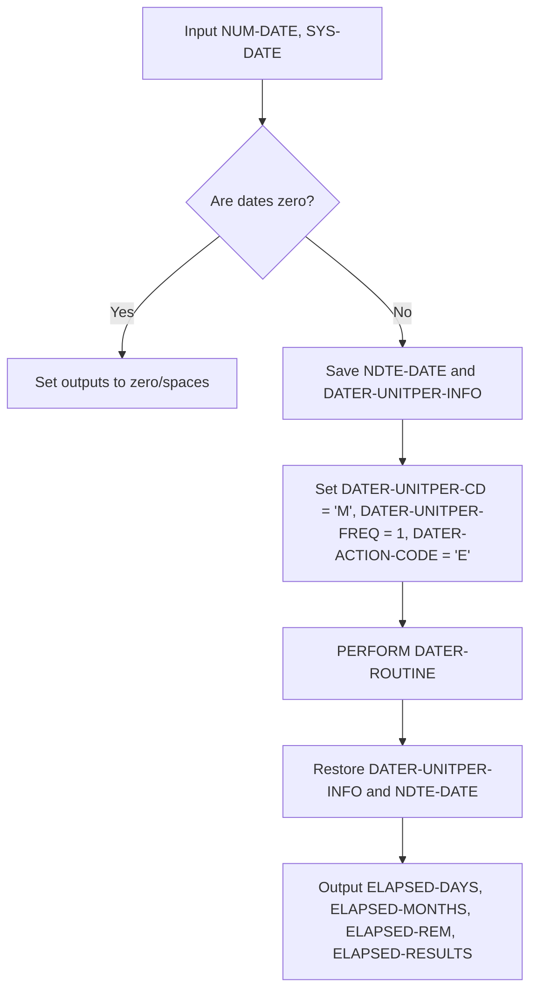
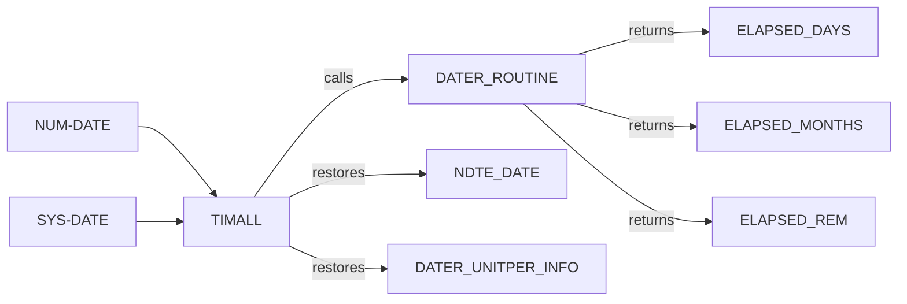
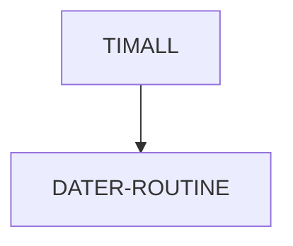

# TIMALL COBOL Utility Documentation

---

**Location:** .\APIPAY_Inlined.CBL  
**Generated on:** 2025-07-28  
**Program ID:** TIMALL  
**Date Written:** See Revision History

---

## Table of Contents
1. [Program Overview](#program-overview)
2. [Input Parameters](#input-parameters)
3. [Output Fields](#output-fields)
4. [Program Flow Diagram](#program-flow-diagram)
5. [Batch or Sequential Process Timeline](#batch-or-sequential-process-timeline)
6. [Paragraph-Level Flow Explanation](#paragraph-level-flow-explanation)
7. [Data Flow Mapping](#data-flow-mapping)
8. [Referenced Programs](#referenced-programs)
9. [Error Handling and Validation](#error-handling-and-validation)
10. [Common Error Conditions](#common-error-conditions)
11. [Technical Implementation](#technical-implementation)
12. [Integration Points](#integration-points)
13. [File Dependencies](#file-dependencies)
14. [Call Graph of PERFORMed Paragraphs](#call-graph-of-performed-paragraphs)
15. [Revision History](#revision-history)

---

## Program Overview

**TIMALL** is a COBOL routine in `APIPAY_Inlined.CBL` that calculates the elapsed time between two dates, returning the result in days, months, and remaining days. It is a foundational date-difference utility used by other routines (such as TIMUPER, TIM999, TIM360, etc.) to provide consistent date calculations for business logic, including loan processing, payment schedules, and interest calculations. TIMALL is designed to be robust, handling invalid or zero dates gracefully and preserving input data integrity.

---

## Input Parameters
- **NUM-DATE**: Start date (YYYYMMDD)
- **SYS-DATE**: End date (YYYYMMDD)
- **DATER-UNITPER-INFO**: Unit period calculation context (saved/restored)
- **NDTE-DATE**: Internal date field (saved/restored)

---

## Output Fields
- **ELAPSED-DAYS**: Total elapsed days
- **ELAPSED-MONTHS**: Total elapsed months
- **ELAPSED-REM**: Remaining days after full months
- **ELAPSED-RESULTS**: Comparison result (e.g., LT, GT, EQ, LE, GE, GR)

---

## Program Flow Diagram

---

## Batch or Sequential Process Timeline

TIMALL is called as a subroutine within batch or sequential processes. Its execution is atomic and does not span multiple steps, so a Gantt chart is not required. For batch context, see the parent program (e.g., APIPAY).

---

## Paragraph-Level Flow Explanation
- **TIMALL SECTION**: Main entry point. Checks for zero dates, sets outputs to zero if so. Otherwise, saves NDTE-DATE and DATER-UNITPER-INFO, sets up calculation context, calls DATER-ROUTINE, restores saved values.
- **DATER-ROUTINE**: Shared date calculation logic (not detailed here; see referenced programs).

---

## Data Flow Mapping

---

## Referenced Programs
- **DATER-ROUTINE**: Shared date calculation logic (internal to APIPAY_Inlined.CBL)
- **TIMUPER, TIM999, TIM360, TIM365, etc.**: Other date calculation routines in the same file that use TIMALL

---

## Error Handling and Validation
- If either NUM-DATE or SYS-DATE is zero, all outputs are set to zero or spaces.
- The routine is designed to avoid side effects by saving and restoring NDTE-DATE and DATER-UNITPER-INFO.
- Any errors in DATER-ROUTINE propagate to the outputs.

---

## Common Error Conditions
- Invalid or zero dates: Outputs set to zero/spaces.
- Unexpected changes to NDTE-DATE or DATER-UNITPER-INFO: Prevented by save/restore logic.

---

## Technical Implementation
- **Data Structures**: Uses working-storage fields for dates, unit period codes, and results.
- **File Handling**: None (pure calculation routine).
- **Key Algorithms**: Date difference calculation via DATER-ROUTINE, with context setup for month-based calculations.

---

## Integration Points
- Used by TIMUPER, TIM999, TIM360, TIM365, and other routines for date calculations.
- Can be called wherever elapsed days/months are needed.

---

## File Dependencies
- No external files. Relies on internal data structures and DATER-ROUTINE.

---

## Call Graph of PERFORMed Paragraphs

---

## Revision History
- 1987-03-24: Initial logic for TIM999
- 1995-10-17: Added TIM362 (Alabama), TIM361 (NJ)
- 2013-02-13: Added logic to preserve NDTE-DATE and DATER-UNITPER-INFO
- 2013-02-18: Added test for zero dates to mimic legacy behavior

---

## See Also
- [TIMUPER_Documentation.md](TIMUPER_Documentation.md): Unit period calculation routine
- [APIPAY_Documentation.md](APIPAY_Documentation.md): Main program using TIMALL

---
*This documentation was generated for wiki use and non-COBOL readers. For questions, see the APIPAY documentation or contact the system maintainer.*
