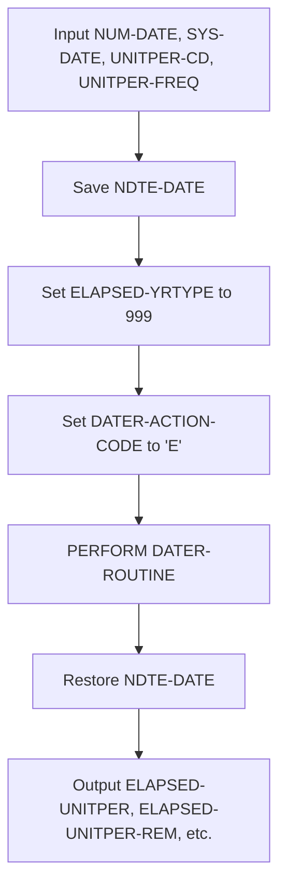
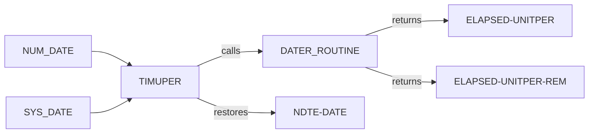
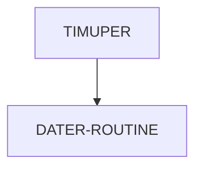

# TIMUPER COBOL Utility Documentation

---

**Location:** .\APIPAY_Inlined.CBL  
**Generated on:** 2025-07-28  
**Program ID:** TIMUPER  
**Date Written:** See Revision History

---

## Table of Contents
1. [Program Overview](#program-overview)
2. [Input Parameters](#input-parameters)
3. [Output Fields](#output-fields)
4. [Program Flow Diagram](#program-flow-diagram)
5. [Batch or Sequential Process Timeline](#batch-or-sequential-process-timeline)
6. [Paragraph-Level Flow Explanation](#paragraph-level-flow-explanation)
7. [Data Flow Mapping](#data-flow-mapping)
8. [Referenced Programs](#referenced-programs)
9. [Error Handling and Validation](#error-handling-and-validation)
10. [Common Error Conditions](#common-error-conditions)
11. [Technical Implementation](#technical-implementation)
12. [Integration Points](#integration-points)
13. [File Dependencies](#file-dependencies)
14. [Call Graph of PERFORMed Paragraphs](#call-graph-of-performed-paragraphs)
15. [Revision History](#revision-history)

---

## Program Overview

**TIMUPER** is a COBOL routine in `APIPAY_Inlined.CBL` that calculates the elapsed time between two dates in terms of unit periods (months, days, years, weeks, semi-months, or bi-weekly periods). It is used to standardize date difference calculations for business logic, such as loan processing, payment schedules, and interest calculations. TIMUPER is designed to be side-effect free, preserving input dates and restoring any temporary values after computation.

---

## Input Parameters
- **NUM-DATE**: Start date (YYYYMMDD)
- **SYS-DATE**: End date (YYYYMMDD)
- **DATER-UNITPER-CD**: Unit period code (M=Month, D=Day, Y=Year, S=Semi-month, W=Week, B=Bi-weekly)
- **DATER-UNITPER-FREQ**: Frequency of unit periods (integer)

---

## Output Fields
- **ELAPSED-UNITPER**: Elapsed unit periods (integer)
- **ELAPSED-UNITPER-REM**: Remaining days (integer)
- **ELAPSED-RESULT**: Comparison result (e.g., LT, GT, EQ, LE, GE, GR)
- **ELAPSED-DAYS**: Total elapsed days
- **ELAPSED-MONTHS**: Total elapsed months
- **ELAPSED-REM**: Remaining days after full unit periods

---

## Program Flow Diagram

---

## Batch or Sequential Process Timeline

TIMUPER is typically called as a subroutine within batch or sequential processes. Its execution is atomic and does not span multiple steps, so a Gantt chart is not required. For batch context, see the parent program (e.g., APIPAY).

---

## Paragraph-Level Flow Explanation
- **TIMUPER SECTION**: Main entry point. Saves NDTE-DATE, sets up calculation context, calls DATER-ROUTINE, restores NDTE-DATE.
- **DATER-ROUTINE**: Shared date calculation logic (not detailed here; see referenced programs).

---

## Data Flow Mapping

---

## Referenced Programs
- **DATER-ROUTINE**: Shared date calculation logic (internal to APIPAY_Inlined.CBL)
- **TIMALL, TIM999, TIM360, TIM365, etc.**: Other date calculation routines in the same file

---

## Error Handling and Validation
- If either NUM-DATE or SYS-DATE is zero, all outputs are set to zero or spaces.
- The routine is designed to avoid side effects by saving and restoring NDTE-DATE.
- Any errors in DATER-ROUTINE propagate to the outputs.

---

## Common Error Conditions
- Invalid or zero dates: Outputs set to zero/spaces.
- Unexpected changes to NDTE-DATE: Prevented by save/restore logic.

---

## Technical Implementation
- **Data Structures**: Uses working-storage fields for dates, unit period codes, and results.
- **File Handling**: None (pure calculation routine).
- **Key Algorithms**: Date difference calculation via DATER-ROUTINE, with context setup for unit period calculations.

---

## Integration Points
- Used by APIPAY and other batch programs for date calculations.
- Can be called wherever elapsed unit periods are needed.

---

## File Dependencies
- No external files. Relies on internal data structures and DATER-ROUTINE.

---

## Call Graph of PERFORMed Paragraphs

---

## Revision History
- 1993-09-16: Changed to set YRTYPE = 360 for some calculations
- 1997-03-17: Changed back to YRTYPE = 999 for monthly calculations
- 2017-02-27: Added logic to preserve NDTE-DATE to avoid side effects

---

## See Also
- [GET-TIME_Documentation.md](GET-TIME_Documentation.md): For retrieving current system date/time
- [APIPAY_Documentation.md](APIPAY_Documentation.md): Main program using TIMUPER

---
*This documentation was generated for wiki use and non-COBOL readers. For questions, see the APIPAY documentation or contact the system maintainer.*
