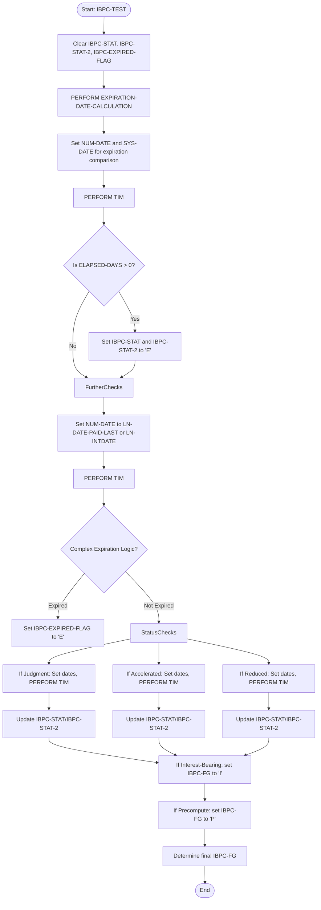
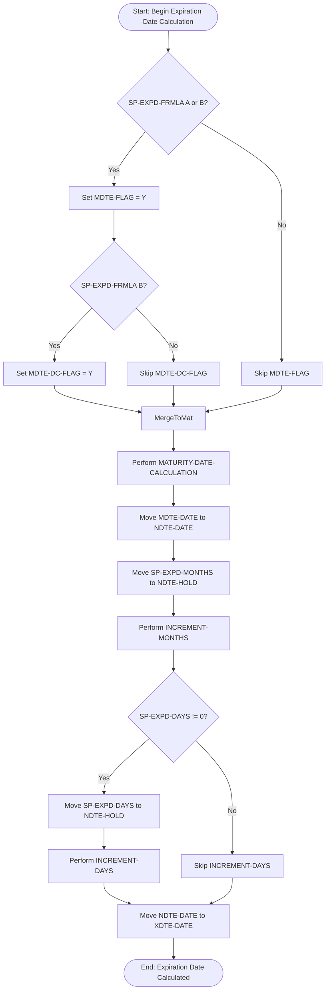
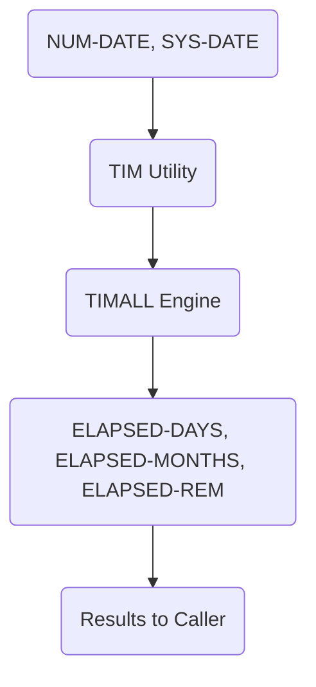
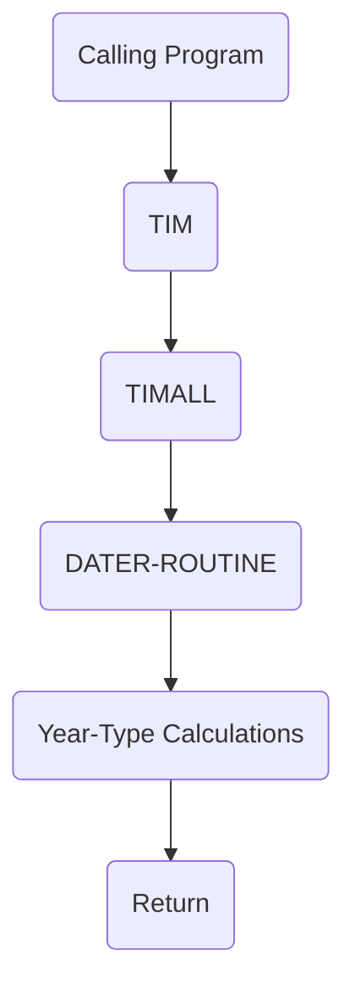

# TIM - 365-Day Year Timing Calculations

**Location:** .\APIPAY_Inlined.CBL  
**Generated on:** July 22, 2025  
**Program ID:** TIM  
**Date Written:** Legacy system (pre-2000)

## Table of Contents

1. [Program Overview](#program-overview)
2. [Transaction Types Supported](#transaction-types-supported)
3. [Input Parameters](#input-parameters)
4. [Output Fields](#output-fields)
5. [Program Flow Diagrams](#program-flow-diagrams)
6. [Data Flow Mapping](#data-flow-mapping)
7. [Batch Processing Timeline](#batch-processing-timeline)
8. [Paragraph-Level Flow Explanation](#paragraph-level-flow-explanation)
9. [Referenced Programs](#referenced-programs)
10. [Error Handling and Validation](#error-handling-and-validation)
11. [File Dependencies](#file-dependencies)
12. [Call Graph of PERFORMed Paragraphs](#call-graph-of-performed-paragraphs)

## Program Overview

TIM is a COBOL-based utility for standard 365-day year timing calculations. It is used to calculate elapsed time between dates using a standard year model, typically for financial and business applications. TIM is a wrapper for the comprehensive TIMALL routine, providing a simple interface for the most common timing calculation method.

**Key Features:**
- Standard 365-day year calculations
- Delegates to TIMALL for core logic
- Simple interface for business/financial use
- Robust error handling

---

## Transaction Types Supported

- **Elapsed Time Calculation**: Computes days, months, and remaining days between two dates using a 365-day year.

---

## Input Parameters

| Parameter   | Type    | Description                        |
|-------------|---------|------------------------------------|
| NUM-DATE    | Numeric | From date in YYYYMMDD format       |
| SYS-DATE    | Numeric | To date in YYYYMMDD format         |
| (others)    | Various | Inherited from TIMALL interface    |

---

## Output Fields

| Field            | Type    | Description                                 |
|------------------|---------|---------------------------------------------|
| ELAPSED-DAYS     | Numeric | Number of days between dates                |
| ELAPSED-MONTHS   | Numeric | Number of months between dates              |
| ELAPSED-REM      | Numeric | Remaining days after month calculation      |
| ELAPSED-RESULTS  | Char    | Comparison result indicators                |
| (others)         | Various | Provided by TIMALL                         |

---


## Program Flow Diagrams

### Business Analyst Flow for TIM Usage in IBPC-TEST

The `TIM` utility is used in a multi-step business process to determine account and payment status—such as expiration, acceleration, reduction, and special flags. The logic involves multiple date comparisons and status evaluations, with `TIM` called at each decision point.

---

### Step-by-Step Business Flow:

1. **Initialize Status Flags** – Clear `IBPC-STAT`, `IBPC-STAT-2`, and `IBPC-EXPIRED-FLAG`.
2. **Calculate Expiration Date** – Call `EXPIRATION-DATE-CALCULATION`.
3. **Compare Dates** – Set `NUM-DATE` and `SYS-DATE`, then call `TIM` to compute `ELAPSED-DAYS`.
4. **Set Expired Status** – If payment is past expiration, set `IBPC-STAT` and `IBPC-STAT-2` to `'E'`.
5. **Complex Expiration Logic** – If expired and formulas/flags apply, set `IBPC-EXPIRED-FLAG` to `'E'`.
6. **Status-Specific Checks** – For `Judgment`, `Accelerated`, or `Reduced` statuses, update fields based on `ELAPSED-DAYS`.
7. **Interest-Bearing / Precompute** – Set `IBPC-FG` to `'I'` or `'P'` depending on business rules.
8. **Finalize Status** – Use all calculated flags and logic to determine final `IBPC-FG`.

---



**Detailed Step-by-Step Flow:**

1. **Set Inputs:** The calling program assigns values to `NUM-DATE` and `SYS-DATE` (e.g., payment date, expiration date).
2. **Enter TIM SECTION:** Control passes to the TIM SECTION.
3. **Set Year Type:** TIM sets `ELAPSED-YRTYPE` to 365 for standard calculations.
4. **Call TIMALL:** TIM calls the TIMALL routine for all timing calculations.
5. **DATER-ROUTINE:** TIMALL invokes DATER-ROUTINE for core date arithmetic.
6. **Populate Results:** TIMALL updates `ELAPSED-DAYS`, `ELAPSED-MONTHS`, and related fields.
7. **Business Logic:** The calling program uses these results to set flags, make decisions, or perform further checks (possibly looping back to set new dates and call TIM again).
8. **End:** Results are available for downstream processing.

---

### Complex Expiration Logic


The following diagram and explanation describe the business logic for calculating the expiration date of a loan or account, as implemented in the COBOL system. This logic is invoked as part of the broader timing and status determination process.

**Expiration Date Calculation Flow:**




**Explanation:**
- Checks if a special expiration formula applies (SP-EXPD-FRMLA).
- Sets flags to control how the maturity date is calculated.
- Performs the maturity date calculation, then adds any extra months and days as specified.
- The final expiration date is output as XDTE-DATE.

---

## Data Flow Mapping



---

## Batch Processing Timeline

1. Load input records with date fields
2. PERFORM TIM for each record
3. Use ELAPSED-DAYS, ELAPSED-MONTHS, etc. for downstream processing
4. Optionally use other timing utilities for special year types

---

## Paragraph-Level Flow Explanation

- **TIM SECTION**: Entry point, sets ELAPSED-YRTYPE to 365
- **PERFORM TIMALL**: Delegates to comprehensive timing engine
- **Result Propagation**: All results from TIMALL are available to the caller
- **Return**: Passes results back to caller

---

## Referenced Programs

- **TIMALL**: Comprehensive timing calculation engine
- **DATER-ROUTINE**: Core date processing (via TIMALL)

---

## Error Handling and Validation

- **Input Validation**: NUM-DATE and SYS-DATE must be valid YYYYMMDD dates
- **Year Type**: ELAPSED-YRTYPE must be set to 365
- **Error Flags**: Set if invalid input or calculation error
- **Leap Year Handling**: Typically ignored or handled separately

---

## File Dependencies

- **APIPAY_Inlined.CBL**: Main source file containing TIM logic
- **TIMALL.cpy**: Copybook for timing calculation logic
- **DATER-ROUTINE.cpy**: Copybook for date processing

---

## Call Graph of PERFORMed Paragraphs



---

<!-- Additional original sections preserved below for reference and completeness -->

## Purpose and Description

TIM is a simple wrapper utility that provides standard 365-day year calculations by configuring and calling the comprehensive TIMALL routine. It represents the most common timing calculation method used in financial and business applications.

### Key Responsibilities

1. **Year Type Configuration** - Set elapsed year type to 365 days
2. **TIMALL Integration** - Delegate processing to comprehensive timing engine
3. **Standard Calendar** - Provide standard Gregorian calendar calculations
4. **Simple Interface** - Offer streamlined access to common timing functionality

### 365-Day Year Model

The TIM utility uses a standard 365-day year calculation method:
- **Year Length**: 365 days (standard non-leap year)
- **Month Handling**: Standard calendar months with actual day counts
- **Leap Year Treatment**: Typically ignored or handled separately
- **Calculation Basis**: Most common financial calculation method

## Technical Implementation

### Input Parameters
- **NUM-DATE** - From date in YYYYMMDD format
- **SYS-DATE** - To date in YYYYMMDD format
- All other parameters inherited from TIMALL interface

### Output Parameters
- **ELAPSED-DAYS** - Number of days between dates
- **ELAPSED-MONTHS** - Number of months between dates
- **ELAPSED-REM** - Remaining days after month calculation
- **ELAPSED-RESULTS** - Comparison result indicators
- All other outputs provided by TIMALL

### Processing Logic


#### Core Implementation
```cobol
TIM SECTION.
    MOVE 365 TO ELAPSED-YRTYPE.
    PERFORM TIMALL.
```

### Algorithm Steps

1. **Year Type Setup**
   - Sets ELAPSED-YRTYPE to 365 to specify standard year calculations

2. **Delegate Processing**
   - Calls TIMALL which performs all actual timing calculations
   - TIMALL uses the 365-day year type for its internal algorithms

3. **Result Propagation**
   - All results generated by TIMALL are available to caller
   - No additional processing or result modification

## Integration Points

### Called By
- **Payment calculations** - Standard monthly payment computations
- **Interest calculations** - Standard interest accrual periods
- **Aging analysis** - Account aging using standard calendar
- **Report generation** - Standard time period reporting
- **General date arithmetic** - Common business date calculations

### Calls To
- **TIMALL** - Comprehensive timing calculation engine
- **DATER-ROUTINE** - Core date processing (through TIMALL)

### Usage Context
TIM is used when standard calendar calculations are needed without special year-type considerations:
- Most common business calculations
- Standard financial reporting
- General-purpose date arithmetic
- Non-specialized timing requirements

## Usage Examples

### Basic Elapsed Time Calculation
```cobol
MOVE 20240101 TO NUM-DATE     * January 1, 2024
MOVE 20240401 TO SYS-DATE     * April 1, 2024  
PERFORM TIM
* Results available in ELAPSED-DAYS, ELAPSED-MONTHS, etc.
DISPLAY "Days elapsed: " ELAPSED-DAYS
DISPLAY "Months elapsed: " ELAPSED-MONTHS
```

### Payment Period Calculation
```cobol
MOVE LOAN-START-DATE TO NUM-DATE
MOVE CURRENT-DATE TO SYS-DATE
PERFORM TIM
IF ELAPSED-MONTHS >= PAYMENT-GRACE-PERIOD
    * ...
```
