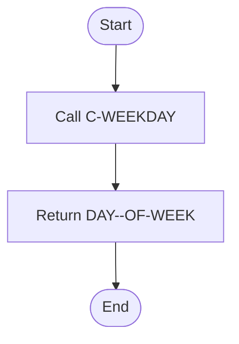

# WEEKDAY Program Documentation

**Location:** APIPAY/APIPAY_Inlined.CBL  
**Generated on:** July 31, 2025  
**Program ID:** WEEKDAY  
**Date Written:** See source comments

## Table of Contents
- [Program Overview](#program-overview)
- [Transaction Types Supported](#transaction-types-supported)
- [Input Parameters](#input-parameters)
- [Output Fields](#output-fields)
- [Program Flow Diagrams](#program-flow-diagrams)
- [Batch or Sequential Process Timeline](#batch-or-sequential-process-timeline)
- [Paragraph-Level Flow Explanation](#paragraph-level-flow-explanation)
- [Data Flow Mapping](#data-flow-mapping)
- [Referenced Programs](#referenced-programs)
- [Error Handling Flow](#error-handling-flow)
- [Error Handling and Validation](#error-handling-and-validation)
- [Common Error Conditions](#common-error-conditions)
- [Technical Implementation](#technical-implementation)
- [Integration Points](#integration-points)
- [File Dependencies](#file-dependencies)
- [Call Graph of PERFORMed Paragraphs](#call-graph-of-performed-paragraphs)

## Program Overview
WEEKDAY computes the day of the week for a given date, returning a value from 1 (Sunday) to 7 (Saturday). It is a utility wrapper for C-WEEKDAY.

## Transaction Types Supported
- Day of week calculation

## Input Parameters
- `NUM-DATE`: Date to evaluate (CCYYMMDD)

## Output Fields
- `DAY--OF-WEEK`: 1 (Sunday) to 7 (Saturday)

## Program Flow Diagrams
### High-Level Flow

### Detailed Flow

## Batch or Sequential Process Timeline

## Paragraph-Level Flow Explanation
- **WEEKDAY**: Calls C-WEEKDAY and returns the result.
- **C-WEEKDAY**: Computes the day of the week.

## Data Flow Mapping

## Referenced Programs
- C-WEEKDAY (internal)

## Error Handling Flow
- Handles invalid dates by returning error value

## Error Handling and Validation
- Validates input date

## Common Error Conditions
- Invalid input date

## Technical Implementation
- Uses working-storage fields
- No external file I/O

## Integration Points
- Used by routines requiring day of week

## File Dependencies
- No external files; uses internal paragraphs

## Call Graph of PERFORMed Paragraphs

