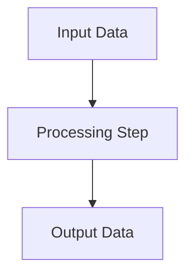

## Data Flow Mapping

This section describes the movement and transformation of data throughout the program. Please add a Mermaid diagram below to visually represent the data flow.

<!-- Replace the diagram above with a program-specific data flow if available. -->
