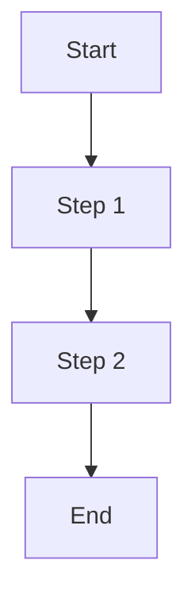

## Program Flow Diagrams

This section provides a visual overview of the program's main logic and control flow. Please add a Mermaid diagram below to illustrate the program flow.

<!-- Replace the diagram above with a program-specific flow if available. -->
